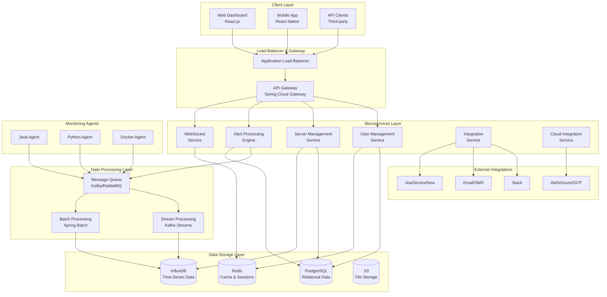
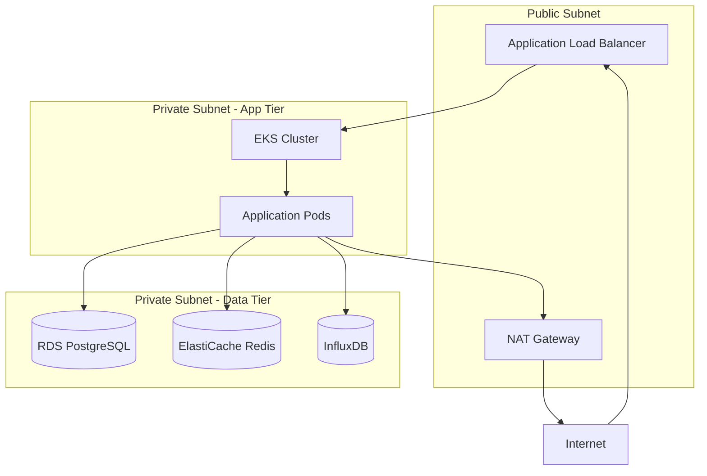
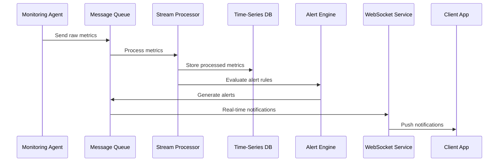
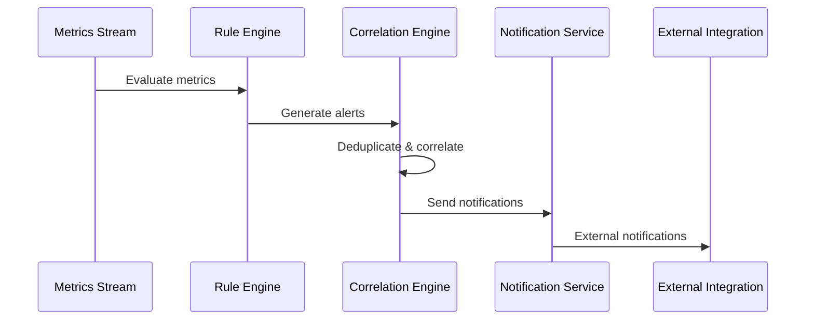

# SAMS System Architecture
## Server and Application Monitoring System

### 🏗️ High-Level Architecture Overview

SAMS is built using a microservices architecture designed for scalability, reliability, and maintainability. The system consists of multiple independent services that communicate through well-defined APIs and message queues.

---

## 🔧 Component Architecture

### **Frontend Layer**

#### **Web Dashboard (React.js)**
- **Technology**: React 18 with TypeScript
- **State Management**: Redux Toolkit with RTK Query
- **UI Framework**: Material-UI with custom theming
- **Real-time Updates**: WebSocket integration
- **Features**:
  - Real-time dashboards with customizable widgets
  - Alert management and correlation
  - Server monitoring and configuration
  - User management and RBAC
  - Responsive design for all screen sizes

#### **Mobile App (React Native)**
- **Technology**: React Native with TypeScript
- **Navigation**: React Navigation v6
- **State Management**: Redux Toolkit
- **Authentication**: Biometric + PIN authentication
- **Features**:
  - Push notifications for critical alerts
  - Offline functionality with local storage
  - Background processing for monitoring
  - Voice-to-text for quick responses
  - Platform-specific optimizations

### **Backend Services**

#### **API Gateway (Spring Cloud Gateway)**
- **Purpose**: Single entry point for all client requests
- **Features**:
  - Request routing and load balancing
  - Authentication and authorization
  - Rate limiting and throttling
  - Request/response transformation
  - Circuit breaker pattern
  - API versioning support

#### **User Management Service**
- **Technology**: Spring Boot with Spring Security
- **Database**: PostgreSQL
- **Features**:
  - JWT-based authentication with refresh tokens
  - Role-based access control (RBAC)
  - LDAP/Active Directory integration
  - Multi-factor authentication (MFA)
  - Password policies and security measures
  - User profile management

#### **Server Management Service**
- **Technology**: Spring Boot with JPA
- **Database**: PostgreSQL + InfluxDB
- **Features**:
  - Server registration and discovery
  - Health check management
  - Server grouping and tagging
  - Metrics collection and storage
  - Configuration management
  - Auto-scaling integration

#### **Alert Processing Engine**
- **Technology**: Spring Boot with Kafka Streams
- **Database**: PostgreSQL + Kafka
- **Features**:
  - Rule-based alert generation
  - Alert correlation and deduplication
  - Severity classification
  - Escalation policies
  - Maintenance windows
  - Alert lifecycle management

#### **WebSocket Service**
- **Technology**: Spring Boot with WebSocket
- **Cache**: Redis
- **Features**:
  - Real-time communication
  - Connection state management
  - User subscription management
  - Message queuing for offline users
  - Heartbeat and reconnection logic
  - Horizontal scaling support

#### **Integration Service**
- **Technology**: Spring Boot with async processing
- **Features**:
  - Slack/Teams webhook integration
  - Email notifications (SendGrid/AWS SES)
  - SMS notifications (Twilio/AWS SNS)
  - Ticketing system integration
  - Custom webhook framework
  - Retry and error handling

#### **Cloud Integration Service**
- **Technology**: Spring Boot with cloud SDKs
- **Features**:
  - AWS CloudWatch integration
  - Azure Monitor integration
  - Google Cloud Monitoring integration
  - Multi-cloud resource discovery
  - Cloud-specific dashboards
  - Cost optimization insights

### **Data Processing Layer**

#### **Message Queue (Apache Kafka)**
- **Purpose**: Asynchronous communication and event streaming
- **Topics**:
  - `metrics.raw` - Raw metrics from agents
  - `metrics.processed` - Processed and aggregated metrics
  - `alerts.generated` - Generated alerts
  - `alerts.notifications` - Alert notifications
  - `system.events` - System events and audit logs

#### **Stream Processing (Kafka Streams)**
- **Purpose**: Real-time data processing and aggregation
- **Features**:
  - Real-time metrics aggregation
  - Alert rule evaluation
  - Data enrichment and transformation
  - Windowed computations
  - Fault tolerance and exactly-once processing

#### **Batch Processing (Spring Batch)**
- **Purpose**: Scheduled data processing and maintenance
- **Jobs**:
  - Historical data aggregation
  - Data retention and cleanup
  - Report generation
  - Backup and archival
  - Performance optimization

### **Data Storage Layer**

#### **PostgreSQL (Relational Data)**
- **Purpose**: Transactional data and metadata
- **Schemas**:
  - User management and authentication
  - Server configuration and metadata
  - Alert rules and policies
  - System configuration
  - Audit logs and compliance

#### **InfluxDB (Time-Series Data)**
- **Purpose**: Metrics and time-series data
- **Measurements**:
  - System metrics (CPU, memory, disk, network)
  - Application metrics (response time, throughput)
  - Custom business metrics
  - Alert history and trends
  - Performance baselines

#### **Redis (Cache and Sessions)**
- **Purpose**: Caching and session management
- **Usage**:
  - User session storage
  - API response caching
  - Real-time data caching
  - WebSocket connection state
  - Rate limiting counters

#### **S3 (File Storage)**
- **Purpose**: File storage and backups
- **Buckets**:
  - Application logs and archives
  - Database backups
  - Configuration backups
  - Report files and exports
  - Static assets and resources

### **Monitoring Agents**

#### **Java Agent**
- **Technology**: Java with Spring Boot
- **Features**:
  - JVM metrics collection
  - Application performance monitoring
  - Custom metrics support
  - Auto-discovery and registration
  - Secure communication with backend

#### **Python Agent**
- **Technology**: Python with asyncio
- **Features**:
  - System metrics collection
  - Process monitoring
  - Log file monitoring
  - Custom script execution
  - Lightweight and efficient

#### **Docker Agent**
- **Technology**: Go with Docker API
- **Features**:
  - Container metrics collection
  - Docker daemon monitoring
  - Image and volume monitoring
  - Kubernetes integration
  - Multi-platform support

---

## 🔒 Security Architecture

### **Authentication & Authorization**
- **JWT Tokens**: Stateless authentication with refresh tokens
- **RBAC**: Role-based access control with fine-grained permissions
- **MFA**: Multi-factor authentication support
- **SSO**: Single sign-on with LDAP/SAML integration

### **Data Protection**
- **Encryption at Rest**: AES-256 encryption for all stored data
- **Encryption in Transit**: TLS 1.3 for all communications
- **API Security**: Rate limiting, input validation, OWASP compliance
- **Network Security**: VPC isolation, security groups, WAF

### **Compliance & Auditing**
- **Audit Logging**: Comprehensive audit trail for all actions
- **Compliance**: GDPR, SOC2, HIPAA compliance features
- **Data Retention**: Configurable data retention policies
- **Privacy**: Data anonymization and pseudonymization

---

## 📈 Scalability & Performance

### **Horizontal Scaling**
- **Microservices**: Independent scaling of each service
- **Load Balancing**: Application load balancer with health checks
- **Auto-scaling**: Kubernetes HPA and VPA
- **Database Scaling**: Read replicas and connection pooling

### **Performance Optimization**
- **Caching**: Multi-level caching strategy with Redis
- **CDN**: Content delivery network for static assets
- **Database Optimization**: Query optimization and indexing
- **Async Processing**: Non-blocking I/O and async operations

### **Monitoring & Observability**
- **Metrics**: Prometheus metrics collection
- **Logging**: Centralized logging with ELK stack
- **Tracing**: Distributed tracing with Jaeger
- **Alerting**: Real-time alerting with AlertManager

---

## 🔄 Deployment Architecture

### **Infrastructure as Code**
- **Terraform**: Infrastructure provisioning and management
- **Kubernetes**: Container orchestration and management
- **Helm**: Application packaging and deployment
- **GitOps**: Git-based deployment workflows

### **CI/CD Pipeline**
- **GitHub Actions**: Automated testing and deployment
- **Docker**: Containerization and image management
- **Blue-Green Deployment**: Zero-downtime deployments
- **Rollback**: Automated rollback mechanisms

### **Environment Management**
- **Development**: Local development with Docker Compose
- **Staging**: Pre-production testing environment
- **Production**: High-availability production environment
- **Disaster Recovery**: Multi-region backup and recovery

---

## 🌐 Network Architecture

### **Network Topology**

### **Security Groups**
- **ALB Security Group**: HTTP/HTTPS from internet
- **EKS Security Group**: Internal communication only
- **Database Security Group**: Database ports from app tier only
- **Agent Security Group**: Outbound HTTPS only

---

## 📊 Data Flow Architecture

### **Metrics Collection Flow**

### **Alert Processing Flow**

---

This architecture provides a robust, scalable, and maintainable foundation for the SAMS infrastructure monitoring system, supporting enterprise-grade requirements for performance, security, and reliability.
