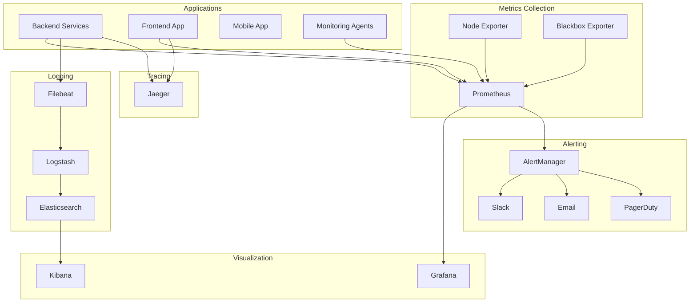

# SAMS Monitoring Guide
## Server and Application Monitoring System - Monitoring & Observability

### 📊 Monitoring Overview

SAMS implements comprehensive monitoring and observability using industry-standard tools and practices. This guide covers monitoring setup, configuration, and best practices for maintaining system health and performance.

---

## 🔧 Monitoring Stack

### **Core Components**
- **Prometheus**: Metrics collection and storage
- **Grafana**: Visualization and dashboards
- **AlertManager**: Alert routing and management
- **Jaeger**: Distributed tracing
- **ELK Stack**: Centralized logging (Elasticsearch, Logstash, Kibana)
- **Node Exporter**: System metrics collection
- **Application Metrics**: Custom application metrics

### **Architecture Overview**


---

## 📈 Metrics Collection

### **Application Metrics**

#### **Backend Service Metrics**
```java
@RestController
public class MetricsController {
    
    private final MeterRegistry meterRegistry;
    private final Counter requestCounter;
    private final Timer responseTimer;
    private final Gauge activeConnections;
    
    public MetricsController(MeterRegistry meterRegistry) {
        this.meterRegistry = meterRegistry;
        this.requestCounter = Counter.builder("http_requests_total")
            .description("Total HTTP requests")
            .tag("application", "sams-backend")
            .register(meterRegistry);
            
        this.responseTimer = Timer.builder("http_request_duration_seconds")
            .description("HTTP request duration")
            .register(meterRegistry);
            
        this.activeConnections = Gauge.builder("websocket_connections_active")
            .description("Active WebSocket connections")
            .register(meterRegistry, this, MetricsController::getActiveConnections);
    }
    
    @GetMapping("/api/servers")
    @Timed(value = "api_servers_duration", description = "Time taken to fetch servers")
    public ResponseEntity<List<Server>> getServers() {
        requestCounter.increment(Tags.of("endpoint", "/api/servers", "method", "GET"));
        return Timer.Sample.start(meterRegistry)
            .stop(responseTimer.tag("endpoint", "/api/servers"))
            .recordCallable(() -> {
                // Business logic
                return ResponseEntity.ok(serverService.getAllServers());
            });
    }
}
```

#### **Custom Business Metrics**
```java
@Component
public class BusinessMetrics {
    
    private final Counter alertsGenerated;
    private final Counter serversRegistered;
    private final Gauge systemHealth;
    
    public BusinessMetrics(MeterRegistry meterRegistry) {
        this.alertsGenerated = Counter.builder("sams_alerts_generated_total")
            .description("Total alerts generated")
            .tag("application", "sams")
            .register(meterRegistry);
            
        this.serversRegistered = Counter.builder("sams_servers_registered_total")
            .description("Total servers registered")
            .register(meterRegistry);
            
        this.systemHealth = Gauge.builder("sams_system_health_score")
            .description("Overall system health score")
            .register(meterRegistry, this, BusinessMetrics::calculateHealthScore);
    }
    
    public void recordAlert(String severity, String type) {
        alertsGenerated.increment(Tags.of("severity", severity, "type", type));
    }
    
    public void recordServerRegistration(String serverType) {
        serversRegistered.increment(Tags.of("type", serverType));
    }
}
```

### **Infrastructure Metrics**

#### **System Metrics (Node Exporter)**
```yaml
# prometheus.yml
scrape_configs:
  - job_name: 'node-exporter'
    static_configs:
      - targets: ['localhost:9100']
    scrape_interval: 15s
    metrics_path: /metrics
    
  - job_name: 'sams-backend'
    static_configs:
      - targets: ['sams-backend:8080']
    scrape_interval: 15s
    metrics_path: /actuator/prometheus
```

#### **Database Metrics**
```yaml
# PostgreSQL Exporter
- job_name: 'postgres-exporter'
  static_configs:
    - targets: ['postgres-exporter:9187']
  scrape_interval: 30s

# Redis Exporter  
- job_name: 'redis-exporter'
  static_configs:
    - targets: ['redis-exporter:9121']
  scrape_interval: 30s
```

---

## 📊 Grafana Dashboards

### **System Overview Dashboard**
```json
{
  "dashboard": {
    "title": "SAMS System Overview",
    "panels": [
      {
        "title": "System Health Score",
        "type": "stat",
        "targets": [
          {
            "expr": "sams_system_health_score",
            "legendFormat": "Health Score"
          }
        ],
        "fieldConfig": {
          "defaults": {
            "min": 0,
            "max": 100,
            "unit": "percent",
            "thresholds": {
              "steps": [
                {"color": "red", "value": 0},
                {"color": "yellow", "value": 70},
                {"color": "green", "value": 90}
              ]
            }
          }
        }
      },
      {
        "title": "Active Servers",
        "type": "stat",
        "targets": [
          {
            "expr": "count(up{job=\"node-exporter\"} == 1)",
            "legendFormat": "Online Servers"
          }
        ]
      },
      {
        "title": "Alert Summary",
        "type": "piechart",
        "targets": [
          {
            "expr": "sum by (severity) (sams_alerts_active)",
            "legendFormat": "{{severity}}"
          }
        ]
      }
    ]
  }
}
```

### **Application Performance Dashboard**
```json
{
  "dashboard": {
    "title": "SAMS Application Performance",
    "panels": [
      {
        "title": "Request Rate",
        "type": "graph",
        "targets": [
          {
            "expr": "rate(http_requests_total[5m])",
            "legendFormat": "{{method}} {{endpoint}}"
          }
        ]
      },
      {
        "title": "Response Time",
        "type": "graph",
        "targets": [
          {
            "expr": "histogram_quantile(0.95, rate(http_request_duration_seconds_bucket[5m]))",
            "legendFormat": "95th percentile"
          },
          {
            "expr": "histogram_quantile(0.50, rate(http_request_duration_seconds_bucket[5m]))",
            "legendFormat": "50th percentile"
          }
        ]
      },
      {
        "title": "Error Rate",
        "type": "graph",
        "targets": [
          {
            "expr": "rate(http_requests_total{status=~\"5..\"}[5m]) / rate(http_requests_total[5m])",
            "legendFormat": "Error Rate"
          }
        ]
      }
    ]
  }
}
```

### **Infrastructure Dashboard**
```json
{
  "dashboard": {
    "title": "SAMS Infrastructure",
    "panels": [
      {
        "title": "CPU Usage",
        "type": "graph",
        "targets": [
          {
            "expr": "100 - (avg by (instance) (rate(node_cpu_seconds_total{mode=\"idle\"}[5m])) * 100)",
            "legendFormat": "{{instance}}"
          }
        ]
      },
      {
        "title": "Memory Usage",
        "type": "graph",
        "targets": [
          {
            "expr": "(1 - (node_memory_MemAvailable_bytes / node_memory_MemTotal_bytes)) * 100",
            "legendFormat": "{{instance}}"
          }
        ]
      },
      {
        "title": "Disk Usage",
        "type": "graph",
        "targets": [
          {
            "expr": "100 - ((node_filesystem_avail_bytes{mountpoint=\"/\"} / node_filesystem_size_bytes{mountpoint=\"/\"}) * 100)",
            "legendFormat": "{{instance}}"
          }
        ]
      }
    ]
  }
}
```

---

## 🚨 Alerting Configuration

### **AlertManager Configuration**
```yaml
# alertmanager.yml
global:
  smtp_smarthost: 'smtp.gmail.com:587'
  smtp_from: 'alerts@sams.com'
  slack_api_url: 'https://hooks.slack.com/services/YOUR/SLACK/WEBHOOK'

route:
  group_by: ['alertname', 'cluster', 'service']
  group_wait: 10s
  group_interval: 10s
  repeat_interval: 1h
  receiver: 'default'
  routes:
  - match:
      severity: critical
    receiver: 'critical-alerts'
  - match:
      severity: warning
    receiver: 'warning-alerts'

receivers:
- name: 'default'
  slack_configs:
  - channel: '#alerts'
    title: 'SAMS Alert'
    text: '{{ range .Alerts }}{{ .Annotations.summary }}{{ end }}'

- name: 'critical-alerts'
  slack_configs:
  - channel: '#critical-alerts'
    title: 'CRITICAL: SAMS Alert'
    text: '{{ range .Alerts }}{{ .Annotations.summary }}{{ end }}'
  email_configs:
  - to: 'oncall@sams.com'
    subject: 'CRITICAL: SAMS Alert'
    body: '{{ range .Alerts }}{{ .Annotations.description }}{{ end }}'
  pagerduty_configs:
  - routing_key: 'YOUR_PAGERDUTY_KEY'
    description: '{{ range .Alerts }}{{ .Annotations.summary }}{{ end }}'

- name: 'warning-alerts'
  slack_configs:
  - channel: '#warnings'
    title: 'WARNING: SAMS Alert'
    text: '{{ range .Alerts }}{{ .Annotations.summary }}{{ end }}'
```

### **Prometheus Alert Rules**
```yaml
# alert-rules.yml
groups:
- name: sams.rules
  rules:
  - alert: HighCPUUsage
    expr: 100 - (avg by (instance) (rate(node_cpu_seconds_total{mode="idle"}[5m])) * 100) > 80
    for: 5m
    labels:
      severity: warning
    annotations:
      summary: "High CPU usage on {{ $labels.instance }}"
      description: "CPU usage is above 80% for more than 5 minutes on {{ $labels.instance }}"

  - alert: HighMemoryUsage
    expr: (1 - (node_memory_MemAvailable_bytes / node_memory_MemTotal_bytes)) * 100 > 85
    for: 5m
    labels:
      severity: warning
    annotations:
      summary: "High memory usage on {{ $labels.instance }}"
      description: "Memory usage is above 85% for more than 5 minutes on {{ $labels.instance }}"

  - alert: ServiceDown
    expr: up == 0
    for: 1m
    labels:
      severity: critical
    annotations:
      summary: "Service {{ $labels.job }} is down"
      description: "Service {{ $labels.job }} on {{ $labels.instance }} has been down for more than 1 minute"

  - alert: HighErrorRate
    expr: rate(http_requests_total{status=~"5.."}[5m]) / rate(http_requests_total[5m]) > 0.05
    for: 5m
    labels:
      severity: critical
    annotations:
      summary: "High error rate in {{ $labels.job }}"
      description: "Error rate is above 5% for more than 5 minutes in {{ $labels.job }}"

  - alert: SlowResponseTime
    expr: histogram_quantile(0.95, rate(http_request_duration_seconds_bucket[5m])) > 2
    for: 5m
    labels:
      severity: warning
    annotations:
      summary: "Slow response time in {{ $labels.job }}"
      description: "95th percentile response time is above 2 seconds for more than 5 minutes in {{ $labels.job }}"
```

---

## 📝 Logging Configuration

### **Application Logging**
```yaml
# logback-spring.xml
<configuration>
    <springProfile name="production">
        <appender name="STDOUT" class="ch.qos.logback.core.ConsoleAppender">
            <encoder class="net.logstash.logback.encoder.LoggingEventCompositeJsonEncoder">
                <providers>
                    <timestamp/>
                    <logLevel/>
                    <loggerName/>
                    <message/>
                    <mdc/>
                    <arguments/>
                    <stackTrace/>
                </providers>
            </encoder>
        </appender>
        
        <appender name="FILE" class="ch.qos.logback.core.rolling.RollingFileAppender">
            <file>/var/log/sams/application.log</file>
            <rollingPolicy class="ch.qos.logback.core.rolling.TimeBasedRollingPolicy">
                <fileNamePattern>/var/log/sams/application.%d{yyyy-MM-dd}.%i.gz</fileNamePattern>
                <maxFileSize>100MB</maxFileSize>
                <maxHistory>30</maxHistory>
                <totalSizeCap>10GB</totalSizeCap>
            </rollingPolicy>
            <encoder class="net.logstash.logback.encoder.LoggingEventCompositeJsonEncoder">
                <providers>
                    <timestamp/>
                    <logLevel/>
                    <loggerName/>
                    <message/>
                    <mdc/>
                    <arguments/>
                    <stackTrace/>
                </providers>
            </encoder>
        </appender>
        
        <root level="INFO">
            <appender-ref ref="STDOUT"/>
            <appender-ref ref="FILE"/>
        </root>
    </springProfile>
</configuration>
```

### **ELK Stack Configuration**
```yaml
# filebeat.yml
filebeat.inputs:
- type: log
  enabled: true
  paths:
    - /var/log/sams/*.log
  fields:
    service: sams-backend
    environment: production
  fields_under_root: true
  json.keys_under_root: true
  json.add_error_key: true

output.logstash:
  hosts: ["logstash:5044"]

processors:
- add_host_metadata:
    when.not.contains.tags: forwarded
```

```ruby
# logstash.conf
input {
  beats {
    port => 5044
  }
}

filter {
  if [service] == "sams-backend" {
    json {
      source => "message"
    }
    
    date {
      match => [ "timestamp", "ISO8601" ]
    }
    
    mutate {
      remove_field => [ "message", "host", "agent", "ecs", "input" ]
    }
  }
}

output {
  elasticsearch {
    hosts => ["elasticsearch:9200"]
    index => "sams-logs-%{+YYYY.MM.dd}"
  }
}
```

---

## 🔍 Distributed Tracing

### **Jaeger Configuration**
```yaml
# application.yml
spring:
  sleuth:
    jaeger:
      http:
        sender:
          endpoint: http://jaeger-collector:14268/api/traces
    sampler:
      probability: 0.1 # Sample 10% of traces in production
```

### **Custom Tracing**
```java
@Service
public class ServerService {
    
    @Autowired
    private Tracer tracer;
    
    @NewSpan("server-registration")
    public Server registerServer(@SpanTag("server.hostname") String hostname) {
        Span span = tracer.nextSpan()
            .name("register-server")
            .tag("server.hostname", hostname)
            .start();
            
        try (Tracer.SpanInScope ws = tracer.withSpanInScope(span)) {
            // Business logic
            Server server = new Server(hostname);
            serverRepository.save(server);
            
            span.tag("server.id", server.getId());
            span.event("server-registered");
            
            return server;
        } finally {
            span.end();
        }
    }
}
```

---

## 📊 Performance Monitoring

### **JVM Monitoring**
```java
@Configuration
public class MetricsConfig {
    
    @Bean
    public MeterRegistryCustomizer<MeterRegistry> metricsCommonTags() {
        return registry -> registry.config().commonTags("application", "sams-backend");
    }
    
    @Bean
    public JvmMetrics jvmMetrics() {
        return new JvmMetrics();
    }
    
    @Bean
    public ProcessorMetrics processorMetrics() {
        return new ProcessorMetrics();
    }
    
    @Bean
    public UptimeMetrics uptimeMetrics() {
        return new UptimeMetrics();
    }
}
```

### **Database Performance Monitoring**
```yaml
# PostgreSQL monitoring queries
pg_stat_activity_count:
  query: "SELECT count(*) FROM pg_stat_activity WHERE state = 'active'"
  metrics:
    - active_connections:
        usage: "GAUGE"
        description: "Number of active connections"

pg_stat_database:
  query: "SELECT datname, numbackends, xact_commit, xact_rollback FROM pg_stat_database"
  metrics:
    - numbackends:
        usage: "GAUGE"
        description: "Number of backends"
    - xact_commit:
        usage: "COUNTER"
        description: "Number of transactions committed"
    - xact_rollback:
        usage: "COUNTER"
        description: "Number of transactions rolled back"
```

---

## 🎯 SLA Monitoring

### **Service Level Objectives (SLOs)**
```yaml
slos:
  availability:
    target: 99.9%
    measurement_window: 30d
    
  response_time:
    target: 95% < 2s
    measurement_window: 7d
    
  error_rate:
    target: < 1%
    measurement_window: 24h
```

### **SLI Queries**
```promql
# Availability SLI
(
  sum(rate(http_requests_total{job="sams-backend"}[5m])) -
  sum(rate(http_requests_total{job="sams-backend",status=~"5.."}[5m]))
) / sum(rate(http_requests_total{job="sams-backend"}[5m]))

# Response Time SLI
histogram_quantile(0.95, 
  sum(rate(http_request_duration_seconds_bucket{job="sams-backend"}[5m])) by (le)
)

# Error Rate SLI
sum(rate(http_requests_total{job="sams-backend",status=~"5.."}[5m])) /
sum(rate(http_requests_total{job="sams-backend"}[5m]))
```

---

## 📱 Mobile App Monitoring

### **React Native Monitoring**
```javascript
// Mobile app metrics
import { Analytics } from '@aws-amplify/analytics';
import crashlytics from '@react-native-firebase/crashlytics';

class MobileMetrics {
  static recordEvent(eventName, attributes) {
    Analytics.record({
      name: eventName,
      attributes: attributes
    });
  }
  
  static recordError(error, context) {
    crashlytics().recordError(error);
    crashlytics().setAttributes(context);
  }
  
  static recordPerformance(metric, value) {
    Analytics.record({
      name: 'performance_metric',
      attributes: {
        metric: metric,
        value: value,
        timestamp: Date.now()
      }
    });
  }
}
```

---

## 🔧 Monitoring Best Practices

### **Metric Naming Conventions**
- Use snake_case for metric names
- Include units in metric names (e.g., `_seconds`, `_bytes`)
- Use consistent prefixes (e.g., `sams_`, `http_`)
- Include relevant labels for filtering

### **Alert Fatigue Prevention**
- Set appropriate thresholds based on historical data
- Use alert grouping and deduplication
- Implement alert escalation policies
- Regular review and tuning of alert rules

### **Dashboard Design**
- Focus on business metrics first
- Use consistent color schemes and units
- Include context and annotations
- Design for different audiences (ops, dev, business)

---

*This monitoring guide is updated regularly to reflect best practices and new monitoring capabilities.*
