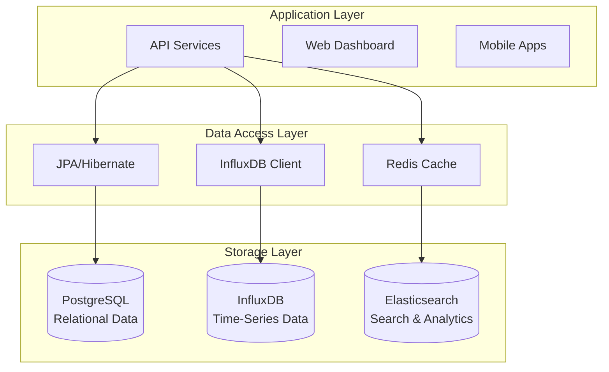
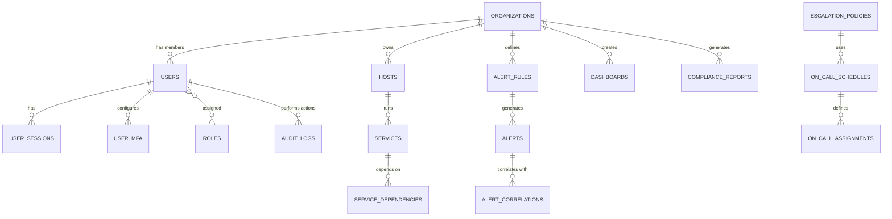

# 📊 Data Model Documentation - Infrastructure Monitoring System

## Executive Summary

This document provides comprehensive documentation of the data models, storage strategies, and retention policies for the infrastructure monitoring platform, covering both relational (PostgreSQL) and time-series (InfluxDB) databases.

## 🗄️ Database Architecture Overview

### **Multi-Database Strategy**



### **Data Distribution Strategy**

| Data Type | Database | Justification | Retention |
|-----------|----------|---------------|-----------|
| **User Management** | PostgreSQL | ACID compliance, relationships | Indefinite |
| **Configuration** | PostgreSQL | Consistency, transactions | Indefinite |
| **Alert Rules** | PostgreSQL | Complex queries, relationships | Indefinite |
| **Metrics Data** | InfluxDB | Time-series optimization | 90 days |
| **Alert History** | PostgreSQL + InfluxDB | Hybrid approach | 1 year |
| **Logs** | Elasticsearch | Full-text search | 30 days |
| **Cache** | Redis | High-speed access | 24 hours |

## 📈 Time-Series Data Model (InfluxDB)

### **Measurement Schema Design**

#### **System Metrics Measurement**
```sql
-- Measurement: system_metrics
-- Tags: host_id, metric_type, environment
-- Fields: value, threshold_warning, threshold_critical
-- Time: timestamp

CREATE MEASUREMENT system_metrics (
    time TIMESTAMP,
    host_id TAG,
    metric_type TAG,  -- 'cpu', 'memory', 'disk', 'network'
    environment TAG,  -- 'production', 'staging', 'development'
    datacenter TAG,
    value FIELD,
    threshold_warning FIELD,
    threshold_critical FIELD,
    unit TAG         -- '%', 'bytes', 'packets/sec'
);
```

#### **Application Metrics Measurement**
```sql
-- Measurement: application_metrics
-- Tags: service_id, metric_name, environment
-- Fields: value, count, rate

CREATE MEASUREMENT application_metrics (
    time TIMESTAMP,
    service_id TAG,
    application_name TAG,
    metric_name TAG,    -- 'response_time', 'error_rate', 'throughput'
    environment TAG,
    endpoint TAG,
    method TAG,         -- 'GET', 'POST', etc.
    status_code TAG,
    value FIELD,
    count FIELD,
    rate FIELD
);
```

#### **Alert Events Measurement**
```sql
-- Measurement: alert_events
-- Tags: alert_id, severity, status
-- Fields: duration, escalation_level

CREATE MEASUREMENT alert_events (
    time TIMESTAMP,
    alert_id TAG,
    rule_id TAG,
    severity TAG,       -- 'low', 'medium', 'high', 'critical'
    status TAG,         -- 'firing', 'resolved', 'acknowledged'
    host_id TAG,
    service_id TAG,
    duration FIELD,     -- seconds
    escalation_level FIELD,
    acknowledged FIELD  -- boolean as integer
);
```

### **Data Retention Policies**

```sql
-- High-resolution data (10s intervals) - 7 days
CREATE RETENTION POLICY "high_resolution" ON "monitoring" 
DURATION 7d REPLICATION 1 DEFAULT;

-- Medium-resolution data (1m intervals) - 30 days  
CREATE RETENTION POLICY "medium_resolution" ON "monitoring" 
DURATION 30d REPLICATION 1;

-- Low-resolution data (5m intervals) - 90 days
CREATE RETENTION POLICY "low_resolution" ON "monitoring" 
DURATION 90d REPLICATION 1;

-- Archive data (1h intervals) - 1 year
CREATE RETENTION POLICY "archive" ON "monitoring" 
DURATION 365d REPLICATION 1;
```

### **Continuous Queries for Downsampling**

```sql
-- Downsample to 1-minute averages
CREATE CONTINUOUS QUERY "downsample_1m" ON "monitoring"
BEGIN
  SELECT mean("value") AS "value"
  INTO "medium_resolution"."system_metrics_1m"
  FROM "system_metrics"
  GROUP BY time(1m), *
END;

-- Downsample to 5-minute averages
CREATE CONTINUOUS QUERY "downsample_5m" ON "monitoring"
BEGIN
  SELECT mean("value") AS "value"
  INTO "low_resolution"."system_metrics_5m"
  FROM "medium_resolution"."system_metrics_1m"
  GROUP BY time(5m), *
END;

-- Downsample to 1-hour averages
CREATE CONTINUOUS QUERY "downsample_1h" ON "monitoring"
BEGIN
  SELECT mean("value") AS "value"
  INTO "archive"."system_metrics_1h"
  FROM "low_resolution"."system_metrics_5m"
  GROUP BY time(1h), *
END;
```

## 🔗 Relational Data Model (PostgreSQL)

### **Entity Relationship Diagram**



### **Core Entity Definitions**

#### **User Management Domain**

**Users Entity**
- **Purpose**: Central user identity and profile management
- **Key Relationships**: Organizations (many-to-many), Sessions (one-to-many)
- **Security Features**: Password hashing, MFA support, session tracking
- **Audit Trail**: Login tracking, profile changes

**Roles Entity**
- **Purpose**: Role-based access control (RBAC)
- **Permissions Model**: JSON-based granular permissions
- **Inheritance**: Hierarchical role structure support
- **Flexibility**: Dynamic permission assignment

#### **Infrastructure Domain**

**Organizations Entity**
- **Purpose**: Multi-tenant data isolation
- **Subscription Management**: Plan tracking and billing integration
- **Settings**: Organization-specific configurations
- **Compliance**: Audit trail and data governance

**Hosts Entity**
- **Purpose**: Physical and virtual server inventory
- **Metadata**: Flexible JSON storage for custom attributes
- **Status Tracking**: Real-time health status
- **Agent Management**: Version tracking and configuration

**Services Entity**
- **Purpose**: Application and service catalog
- **Dependencies**: Service dependency mapping
- **Health Checks**: Configurable health check endpoints
- **Discovery**: Automatic service discovery support

#### **Alerting Domain**

**Alert Rules Entity**
- **Purpose**: Alert condition definitions
- **Query Language**: InfluxDB query support
- **Conditions**: Complex threshold and anomaly conditions
- **Templating**: Parameterized alert templates

**Alerts Entity**
- **Purpose**: Alert instance lifecycle management
- **Correlation**: Automatic alert grouping
- **Escalation**: Multi-level escalation support
- **Acknowledgment**: Manual and automatic acknowledgment

### **Data Consistency Strategies**

#### **ACID Transactions**
```sql
-- Example: Creating alert with audit trail
BEGIN;
  INSERT INTO alerts (rule_id, organization_id, severity, summary) 
  VALUES ($1, $2, $3, $4);
  
  INSERT INTO audit_logs (organization_id, user_id, action, resource_type, resource_id)
  VALUES ($2, $5, 'alert_created', 'alert', lastval());
COMMIT;
```

#### **Eventual Consistency**
- **Cross-database operations**: Saga pattern implementation
- **Event sourcing**: Domain events for state changes
- **Compensation**: Rollback strategies for failed operations

## 🔍 Search and Analytics (Elasticsearch)

### **Index Design**

#### **Log Events Index**
```json
{
  "mappings": {
    "properties": {
      "timestamp": { "type": "date" },
      "host_id": { "type": "keyword" },
      "service_id": { "type": "keyword" },
      "level": { "type": "keyword" },
      "message": { 
        "type": "text",
        "analyzer": "standard",
        "fields": {
          "keyword": { "type": "keyword" }
        }
      },
      "tags": { "type": "keyword" },
      "metadata": { "type": "object" }
    }
  }
}
```

#### **Alert Search Index**
```json
{
  "mappings": {
    "properties": {
      "alert_id": { "type": "keyword" },
      "organization_id": { "type": "keyword" },
      "severity": { "type": "keyword" },
      "status": { "type": "keyword" },
      "summary": { 
        "type": "text",
        "analyzer": "standard"
      },
      "description": { 
        "type": "text",
        "analyzer": "standard"
      },
      "labels": { "type": "object" },
      "created_at": { "type": "date" },
      "resolved_at": { "type": "date" }
    }
  }
}
```

## 💾 Caching Strategy (Redis)

### **Cache Patterns**

#### **Read-Through Cache**
```python
# User profile caching
def get_user_profile(user_id):
    cache_key = f"user:profile:{user_id}"
    cached_data = redis.get(cache_key)
    
    if cached_data:
        return json.loads(cached_data)
    
    # Fetch from database
    user_data = database.get_user(user_id)
    
    # Cache for 1 hour
    redis.setex(cache_key, 3600, json.dumps(user_data))
    return user_data
```

#### **Write-Behind Cache**
```python
# Metrics aggregation caching
def update_metrics_cache(host_id, metrics):
    cache_key = f"metrics:latest:{host_id}"
    
    # Update cache immediately
    redis.hset(cache_key, mapping=metrics)
    redis.expire(cache_key, 300)  # 5 minutes
    
    # Queue for database write
    queue.enqueue(write_metrics_to_db, host_id, metrics)
```

### **Cache Invalidation Strategies**

#### **Time-Based Expiration**
- **User sessions**: 24 hours
- **Dashboard data**: 5 minutes
- **Metrics aggregations**: 1 minute
- **Configuration**: 1 hour

#### **Event-Based Invalidation**
- **User profile changes**: Immediate invalidation
- **Alert rule updates**: Clear related caches
- **Host status changes**: Update dependent caches

## 📊 Data Migration Strategies

### **Schema Versioning**

```sql
-- Migration tracking table
CREATE TABLE schema_migrations (
    version VARCHAR(50) PRIMARY KEY,
    description TEXT,
    applied_at TIMESTAMP WITH TIME ZONE DEFAULT NOW(),
    rollback_sql TEXT
);

-- Example migration: Add tags to hosts
-- Migration: 20240101_001_add_host_tags.sql
ALTER TABLE hosts ADD COLUMN tags JSONB DEFAULT '{}';
CREATE INDEX idx_hosts_tags ON hosts USING GIN(tags);

INSERT INTO schema_migrations (version, description, rollback_sql)
VALUES ('20240101_001', 'Add tags column to hosts table', 
        'ALTER TABLE hosts DROP COLUMN tags; DROP INDEX idx_hosts_tags;');
```

### **Data Archival Process**

```sql
-- Archive old alerts (older than 1 year)
CREATE TABLE alerts_archive (LIKE alerts INCLUDING ALL);

-- Move old data
WITH archived_alerts AS (
    DELETE FROM alerts 
    WHERE created_at < NOW() - INTERVAL '1 year'
    RETURNING *
)
INSERT INTO alerts_archive SELECT * FROM archived_alerts;
```

## 🔒 Data Security and Compliance

### **Encryption at Rest**
- **PostgreSQL**: Transparent Data Encryption (TDE)
- **InfluxDB**: File system encryption
- **Elasticsearch**: Index-level encryption
- **Redis**: RDB and AOF encryption

### **Data Masking**
```sql
-- PII data masking for non-production environments
CREATE OR REPLACE FUNCTION mask_email(email TEXT)
RETURNS TEXT AS $$
BEGIN
    RETURN CASE 
        WHEN email IS NULL THEN NULL
        ELSE CONCAT(LEFT(email, 2), '***@***.com')
    END;
END;
$$ LANGUAGE plpgsql;
```

### **Audit Trail**
- **All data modifications**: Automatic audit logging
- **Access patterns**: Query logging and analysis
- **Compliance reporting**: Automated evidence collection
- **Data lineage**: Track data flow and transformations

## 📈 Performance Optimization

### **Partitioning Strategy**

```sql
-- Partition alerts table by month
CREATE TABLE alerts_y2024m01 PARTITION OF alerts
FOR VALUES FROM ('2024-01-01') TO ('2024-02-01');

CREATE TABLE alerts_y2024m02 PARTITION OF alerts
FOR VALUES FROM ('2024-02-01') TO ('2024-03-01');
```

### **Query Optimization**

```sql
-- Optimized alert query with proper indexing
EXPLAIN (ANALYZE, BUFFERS) 
SELECT a.id, a.summary, a.severity, a.created_at
FROM alerts a
JOIN alert_rules ar ON a.rule_id = ar.id
WHERE a.organization_id = $1
  AND a.status = 'firing'
  AND a.created_at >= NOW() - INTERVAL '24 hours'
ORDER BY a.created_at DESC
LIMIT 50;
```

---

*This data model documentation provides a comprehensive foundation for implementing a scalable, secure, and performant data layer that supports all monitoring platform requirements while maintaining data integrity and compliance.*
