# 🏗️ System Architecture Design - Infrastructure Monitoring Platform

## Executive Summary

This document presents the complete system architecture for our enterprise-grade infrastructure monitoring platform, including microservices design, data flow diagrams, alert processing pipelines, and real-time communication architecture.

## 🎯 Architecture Principles

### **Design Principles**
- **Scalability**: Horizontal scaling for all components
- **Resilience**: Fault tolerance and graceful degradation
- **Observability**: Built-in monitoring and tracing
- **Security**: Zero-trust architecture with encryption
- **Performance**: Sub-second response times
- **Modularity**: Loosely coupled, independently deployable services

### **Quality Attributes**
- **Availability**: 99.9% uptime SLA
- **Throughput**: 1M+ metrics/second ingestion
- **Latency**: <100ms API response time
- **Scalability**: Linear scaling to 10K+ monitored hosts
- **Security**: Enterprise-grade security controls

## 🏛️ High-Level Architecture Overview

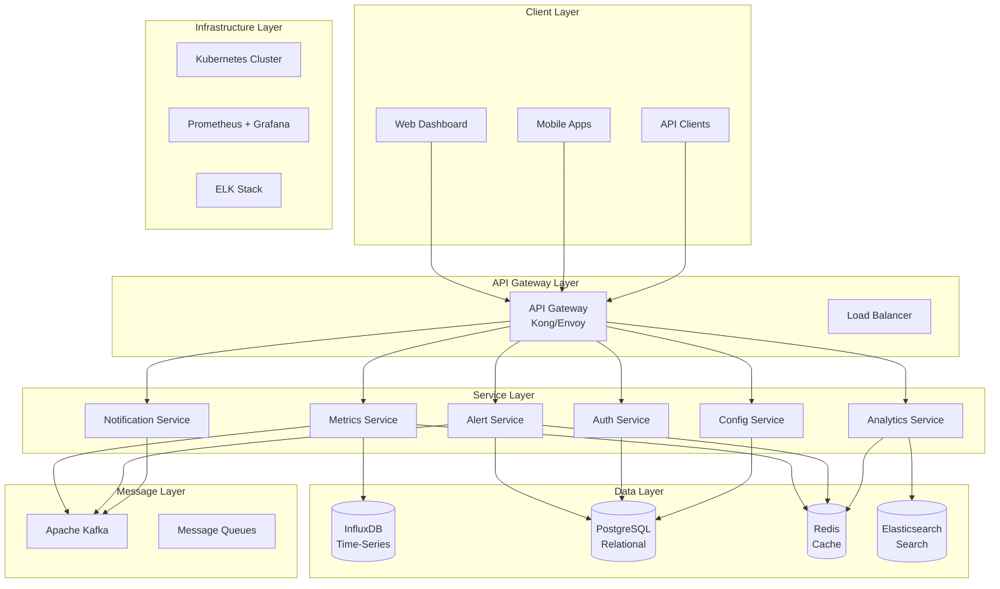

## 🔄 Microservices Architecture

### **Service Breakdown**

#### **1. Authentication Service**
**Responsibility**: User authentication, authorization, and session management

**Technologies**: Java Spring Boot, Spring Security, JWT
**Database**: PostgreSQL
**Cache**: Redis

**Key Features**:
- Multi-factor authentication (TOTP, SMS, biometric)
- Single Sign-On (SAML 2.0, OAuth 2.0)
- Role-based access control (RBAC)
- Session management with timeout
- Audit logging

**API Endpoints**:
```
POST /auth/login
POST /auth/logout
POST /auth/refresh
GET  /auth/profile
PUT  /auth/profile
POST /auth/mfa/setup
POST /auth/mfa/verify
```

#### **2. Metrics Collection Service**
**Responsibility**: High-throughput metrics ingestion and processing

**Technologies**: Java Spring Boot, Spring WebFlux, Micrometer
**Database**: InfluxDB
**Message Queue**: Apache Kafka

**Key Features**:
- Multi-protocol support (StatsD, Prometheus, OpenTelemetry)
- Data validation and enrichment
- Batch processing for efficiency
- Automatic scaling based on load
- Data deduplication

**Data Flow**:
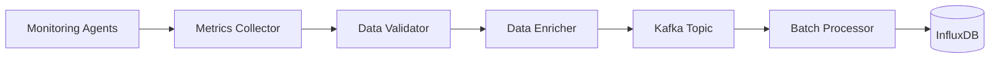

#### **3. Alert Processing Service**
**Responsibility**: Alert rule evaluation, correlation, and escalation

**Technologies**: Java Spring Boot, Drools Rules Engine
**Database**: PostgreSQL, Redis
**Message Queue**: Apache Kafka

**Key Features**:
- Real-time rule evaluation
- Alert correlation and deduplication
- Escalation policies and scheduling
- Machine learning-based anomaly detection
- Alert suppression and maintenance windows

**Alert Processing Pipeline**:
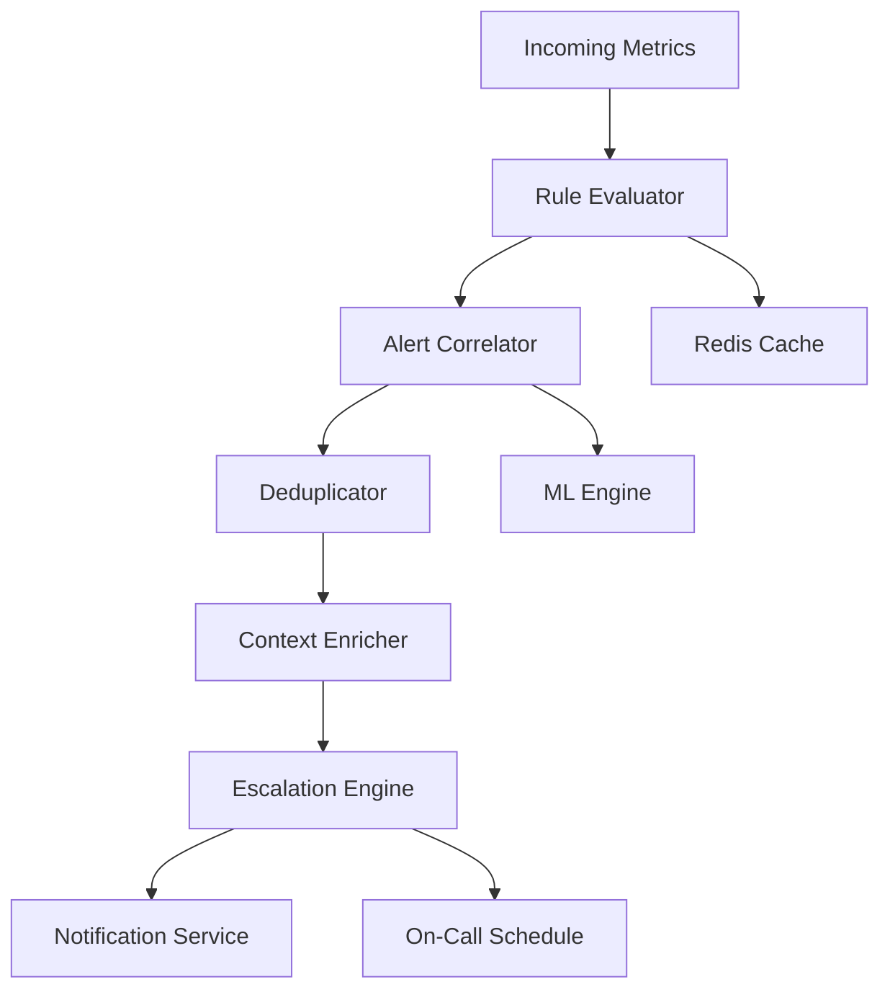

#### **4. Analytics Service**
**Responsibility**: Historical data analysis and reporting

**Technologies**: Python FastAPI, Pandas, Scikit-learn
**Database**: Elasticsearch, InfluxDB
**Cache**: Redis

**Key Features**:
- Time-series analysis and forecasting
- Anomaly detection using machine learning
- Custom report generation
- Data aggregation and downsampling
- Trend analysis and insights

#### **5. Notification Service**
**Responsibility**: Multi-channel alert delivery

**Technologies**: Node.js, Express
**Database**: PostgreSQL
**Message Queue**: Apache Kafka

**Key Features**:
- Multi-channel delivery (email, SMS, Slack, PagerDuty)
- Template management and personalization
- Delivery tracking and retry logic
- Rate limiting and throttling
- Mobile push notifications

#### **6. Configuration Service**
**Responsibility**: Centralized configuration management

**Technologies**: Java Spring Boot, Spring Cloud Config
**Database**: PostgreSQL
**Cache**: Redis

**Key Features**:
- Dynamic configuration updates
- Environment-specific configurations
- Configuration versioning and rollback
- Validation and schema enforcement
- Audit trail for changes

## 📊 Data Flow Architecture

### **Metrics Ingestion Flow**

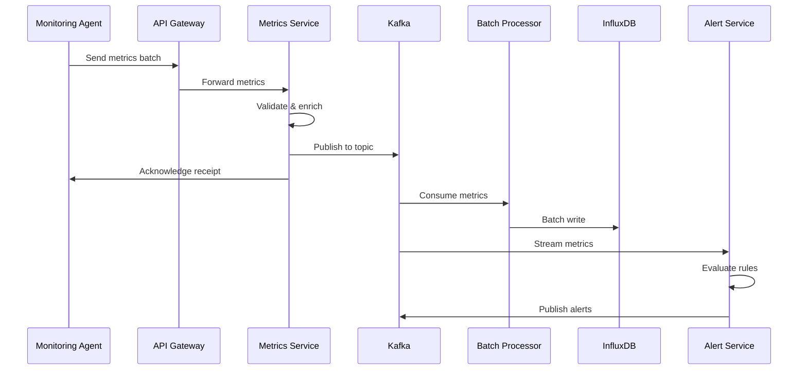

### **Real-Time Dashboard Updates**

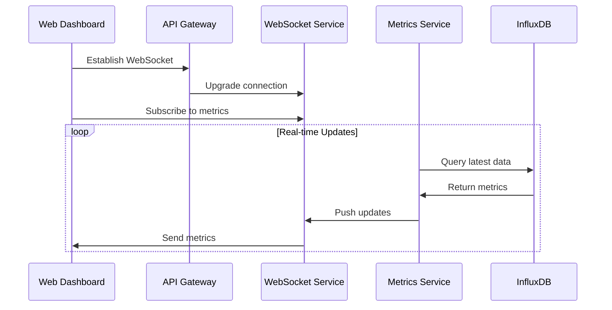

## 🚨 Alert Processing Pipeline

### **Alert Correlation Engine**

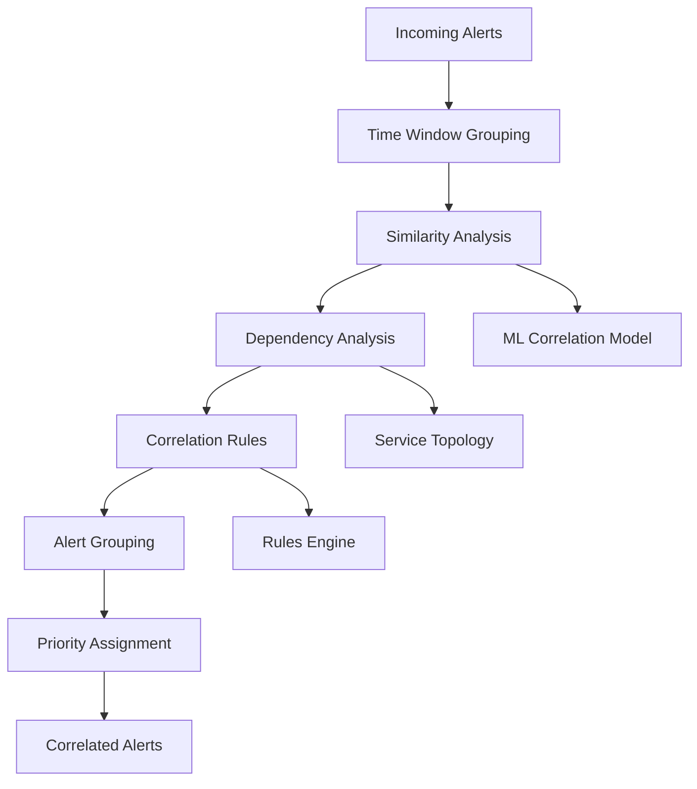

### **Escalation Workflow**

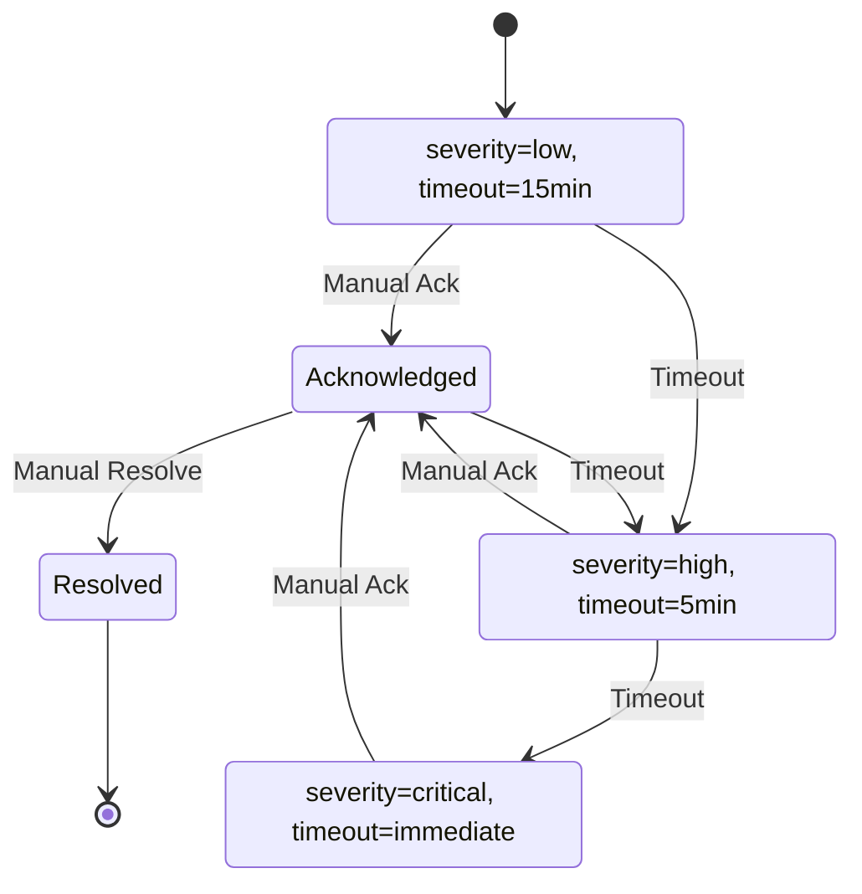

## 🔄 Real-Time Communication Architecture

### **WebSocket Architecture**

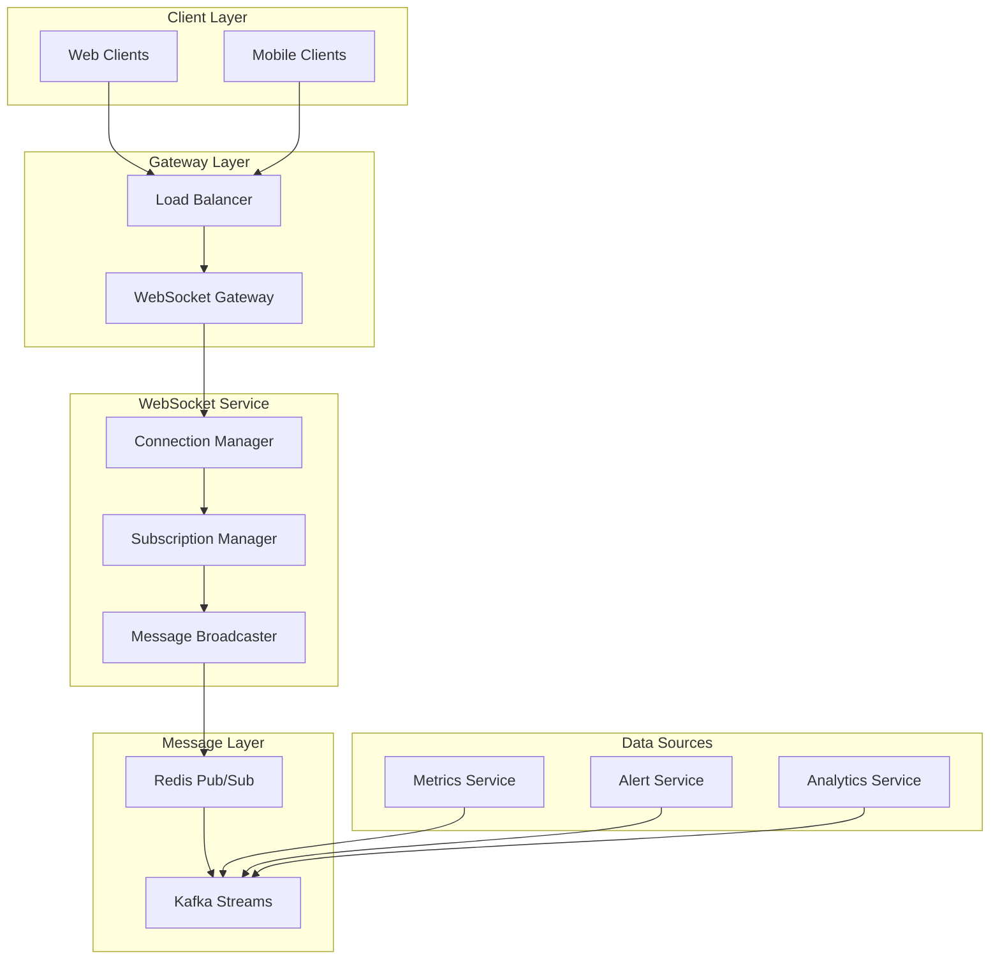

### **Push Notification Architecture**

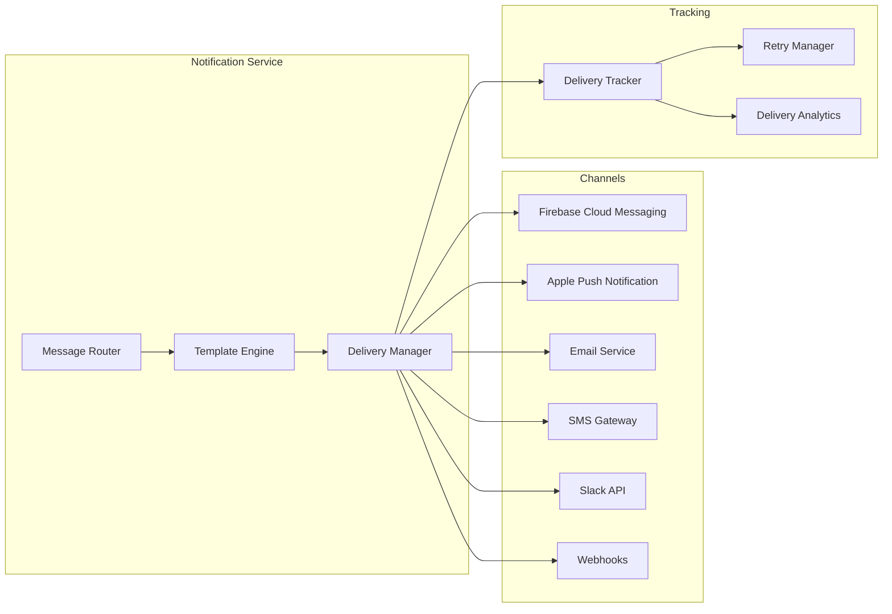

## 🛡️ Security Architecture

### **Zero-Trust Security Model**

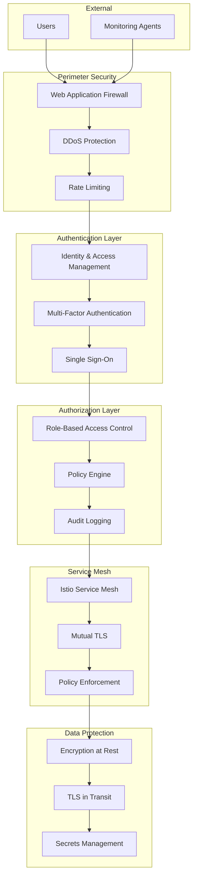

## 📈 Scalability Architecture

### **Horizontal Scaling Strategy**

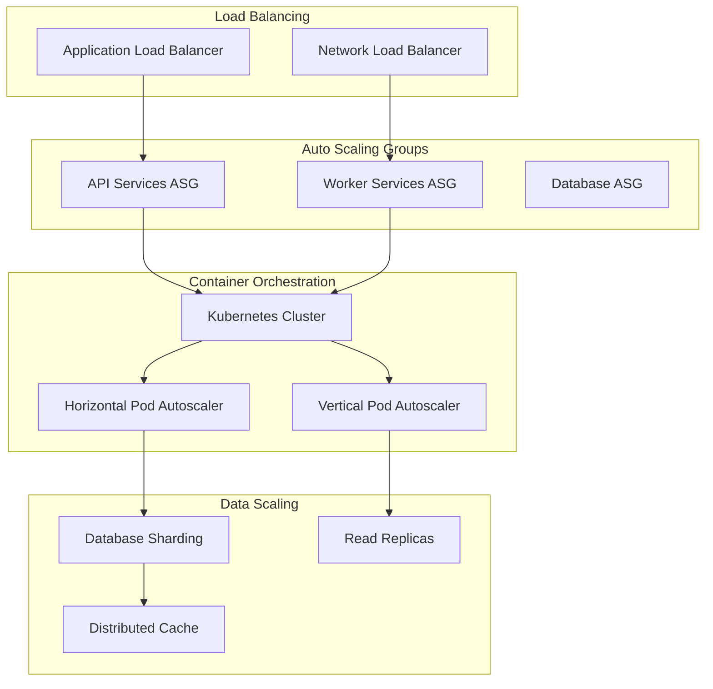

## 🔍 Observability Architecture

### **Built-in Monitoring Stack**

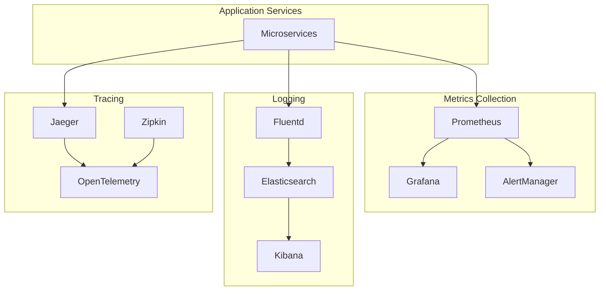

## 🚀 Deployment Architecture

### **Multi-Environment Strategy**

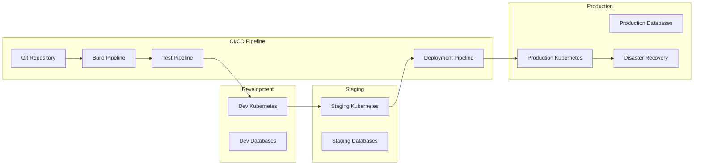

## 📊 Performance Characteristics

### **Throughput Targets**
- **Metrics Ingestion**: 1,000,000+ metrics/second
- **Alert Processing**: 10,000+ alerts/second
- **Dashboard Queries**: 1,000+ concurrent queries
- **API Requests**: 50,000+ requests/second

### **Latency Targets**
- **API Response**: <100ms (95th percentile)
- **Dashboard Load**: <2 seconds
- **Alert Delivery**: <30 seconds
- **Mobile App Startup**: <3 seconds

### **Availability Targets**
- **System Uptime**: 99.9% (8.76 hours downtime/year)
- **Data Durability**: 99.999%
- **Recovery Time**: <5 minutes RTO
- **Recovery Point**: <1 minute RPO

---

*This system architecture provides a comprehensive blueprint for building a scalable, resilient, and secure infrastructure monitoring platform that can handle enterprise-scale workloads while maintaining high performance and availability.*
