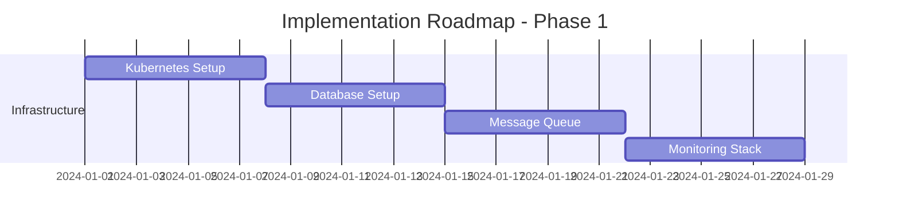

# 🛠️ Technology Stack Finalization - Infrastructure Monitoring Platform

## Executive Summary

This document finalizes the technology stack decisions for the infrastructure monitoring platform, providing specific versions, dependencies, and implementation roadmap based on comprehensive research and architectural requirements.

## 🎯 Technology Selection Criteria

### **Evaluation Matrix**
- **Performance**: Throughput, latency, scalability
- **Reliability**: Stability, community support, enterprise adoption
- **Security**: Vulnerability management, compliance features
- **Ecosystem**: Integration capabilities, tooling, documentation
- **Cost**: Licensing, operational overhead, development velocity
- **Team Expertise**: Learning curve, available skills

## 🔧 Backend Technology Stack

### **Core Framework: Java Spring Boot**

#### **Selected Version & Dependencies**
```xml
<!-- Spring Boot Parent -->
<parent>
    <groupId>org.springframework.boot</groupId>
    <artifactId>spring-boot-starter-parent</artifactId>
    <version>3.2.1</version>
    <relativePath/>
</parent>

<!-- Core Dependencies -->
<dependencies>
    <!-- Web Framework -->
    <dependency>
        <groupId>org.springframework.boot</groupId>
        <artifactId>spring-boot-starter-web</artifactId>
    </dependency>
    
    <!-- Reactive Web (for high-throughput metrics ingestion) -->
    <dependency>
        <groupId>org.springframework.boot</groupId>
        <artifactId>spring-boot-starter-webflux</artifactId>
    </dependency>
    
    <!-- Data JPA -->
    <dependency>
        <groupId>org.springframework.boot</groupId>
        <artifactId>spring-boot-starter-data-jpa</artifactId>
    </dependency>
    
    <!-- Security -->
    <dependency>
        <groupId>org.springframework.boot</groupId>
        <artifactId>spring-boot-starter-security</artifactId>
    </dependency>
    
    <!-- Validation -->
    <dependency>
        <groupId>org.springframework.boot</groupId>
        <artifactId>spring-boot-starter-validation</artifactId>
    </dependency>
    
    <!-- Actuator (monitoring) -->
    <dependency>
        <groupId>org.springframework.boot</groupId>
        <artifactId>spring-boot-starter-actuator</artifactId>
    </dependency>
    
    <!-- Redis -->
    <dependency>
        <groupId>org.springframework.boot</groupId>
        <artifactId>spring-boot-starter-data-redis</artifactId>
    </dependency>
</dependencies>
```

#### **Additional Dependencies**
```xml
<!-- Database Drivers -->
<dependency>
    <groupId>org.postgresql</groupId>
    <artifactId>postgresql</artifactId>
    <version>42.7.1</version>
</dependency>

<!-- InfluxDB Client -->
<dependency>
    <groupId>com.influxdb</groupId>
    <artifactId>influxdb-client-java</artifactId>
    <version>6.10.0</version>
</dependency>

<!-- Kafka -->
<dependency>
    <groupId>org.springframework.kafka</groupId>
    <artifactId>spring-kafka</artifactId>
    <version>3.1.0</version>
</dependency>

<!-- JWT -->
<dependency>
    <groupId>io.jsonwebtoken</groupId>
    <artifactId>jjwt-api</artifactId>
    <version>0.12.3</version>
</dependency>

<!-- Metrics -->
<dependency>
    <groupId>io.micrometer</groupId>
    <artifactId>micrometer-registry-prometheus</artifactId>
</dependency>

<!-- OpenAPI Documentation -->
<dependency>
    <groupId>org.springdoc</groupId>
    <artifactId>springdoc-openapi-starter-webmvc-ui</artifactId>
    <version>2.3.0</version>
</dependency>

<!-- Testing -->
<dependency>
    <groupId>org.springframework.boot</groupId>
    <artifactId>spring-boot-starter-test</artifactId>
    <scope>test</scope>
</dependency>

<dependency>
    <groupId>org.testcontainers</groupId>
    <artifactId>junit-jupiter</artifactId>
    <version>1.19.3</version>
    <scope>test</scope>
</dependency>
```

#### **Justification for Java Spring Boot**
- **Enterprise Adoption**: Industry standard for enterprise applications
- **Ecosystem**: Comprehensive ecosystem with extensive libraries
- **Performance**: Excellent performance with reactive programming support
- **Security**: Robust security framework with enterprise features
- **Monitoring**: Built-in observability with Micrometer and Actuator
- **Team Expertise**: Strong Java expertise in enterprise environments

## 🌐 Frontend Technology Stack

### **Web Frontend: React.js**

#### **Selected Version & Dependencies**
```json
{
  "name": "infrastructure-monitoring-frontend",
  "version": "1.0.0",
  "dependencies": {
    "react": "^18.2.0",
    "react-dom": "^18.2.0",
    "react-router-dom": "^6.20.1",
    "react-query": "^3.39.3",
    "@reduxjs/toolkit": "^2.0.1",
    "react-redux": "^9.0.4",
    "@mui/material": "^5.15.1",
    "@mui/icons-material": "^5.15.1",
    "@mui/x-charts": "^6.18.3",
    "@mui/x-data-grid": "^6.18.3",
    "recharts": "^2.8.0",
    "socket.io-client": "^4.7.4",
    "axios": "^1.6.2",
    "date-fns": "^2.30.0",
    "lodash": "^4.17.21",
    "react-hook-form": "^7.48.2",
    "yup": "^1.4.0"
  },
  "devDependencies": {
    "@types/react": "^18.2.43",
    "@types/react-dom": "^18.2.17",
    "@vitejs/plugin-react": "^4.2.1",
    "vite": "^5.0.8",
    "typescript": "^5.3.3",
    "eslint": "^8.55.0",
    "@typescript-eslint/eslint-plugin": "^6.14.0",
    "prettier": "^3.1.1",
    "jest": "^29.7.0",
    "@testing-library/react": "^13.4.0",
    "@testing-library/jest-dom": "^5.16.4"
  }
}
```

#### **Component Library: Material-UI (MUI)**
- **Design System**: Google Material Design 3.0
- **Accessibility**: WCAG 2.1 AA compliance
- **Theming**: Comprehensive theming system
- **Components**: 50+ production-ready components
- **Performance**: Tree-shaking and bundle optimization

### **Mobile: React Native**

#### **Selected Version & Dependencies**
```json
{
  "name": "infrastructure-monitoring-mobile",
  "version": "1.0.0",
  "dependencies": {
    "react": "18.2.0",
    "react-native": "0.73.2",
    "@react-navigation/native": "^6.1.9",
    "@react-navigation/stack": "^6.3.20",
    "@react-navigation/bottom-tabs": "^6.5.11",
    "@reduxjs/toolkit": "^2.0.1",
    "react-redux": "^9.0.4",
    "react-native-paper": "^5.12.3",
    "react-native-vector-icons": "^10.0.3",
    "react-native-chart-kit": "^6.12.0",
    "@react-native-async-storage/async-storage": "^1.21.0",
    "react-native-push-notification": "^8.1.1",
    "@react-native-firebase/app": "^19.0.1",
    "@react-native-firebase/messaging": "^19.0.1",
    "react-native-keychain": "^8.1.3",
    "react-native-biometrics": "^3.0.1",
    "axios": "^1.6.2",
    "socket.io-client": "^4.7.4"
  },
  "devDependencies": {
    "@babel/core": "^7.20.0",
    "@babel/preset-env": "^7.20.0",
    "@babel/runtime": "^7.20.0",
    "@react-native/eslint-config": "^0.73.1",
    "@react-native/metro-config": "^0.73.5",
    "jest": "^29.6.3",
    "react-test-renderer": "18.2.0",
    "detox": "^20.13.5"
  }
}
```

## 🗄️ Database Technology Stack

### **Primary Databases**

#### **1. PostgreSQL 16.1**
```yaml
# PostgreSQL Configuration
version: "16.1"
extensions:
  - uuid-ossp
  - pgcrypto
  - pg_stat_statements
  - pg_trgm
configuration:
  max_connections: 200
  shared_buffers: 256MB
  effective_cache_size: 1GB
  maintenance_work_mem: 64MB
  checkpoint_completion_target: 0.9
  wal_buffers: 16MB
  default_statistics_target: 100
```

#### **2. InfluxDB 2.7**
```yaml
# InfluxDB Configuration
version: "2.7"
configuration:
  storage-engine: tsm1
  max-series-per-database: 1000000
  max-values-per-tag: 100000
  retention-policies:
    - name: "high_res"
      duration: "7d"
      replication: 1
    - name: "medium_res"
      duration: "30d"
      replication: 1
    - name: "low_res"
      duration: "90d"
      replication: 1
```

#### **3. Redis 7.2**
```yaml
# Redis Configuration
version: "7.2"
configuration:
  maxmemory: 2gb
  maxmemory-policy: allkeys-lru
  save: "900 1 300 10 60 10000"
  appendonly: yes
  appendfsync: everysec
```

#### **4. Elasticsearch 8.11**
```yaml
# Elasticsearch Configuration
version: "8.11"
configuration:
  cluster.name: "monitoring-cluster"
  node.name: "monitoring-node-1"
  discovery.type: single-node
  xpack.security.enabled: true
  xpack.security.transport.ssl.enabled: true
```

## 🔄 Message Queue & Streaming

### **Apache Kafka 3.6**
```yaml
# Kafka Configuration
version: "3.6"
configuration:
  num.network.threads: 8
  num.io.threads: 8
  socket.send.buffer.bytes: 102400
  socket.receive.buffer.bytes: 102400
  socket.request.max.bytes: 104857600
  log.retention.hours: 168
  log.segment.bytes: 1073741824
  log.retention.check.interval.ms: 300000
  zookeeper.connect: "zookeeper:2181"
```

## ☁️ Infrastructure Technology Stack

### **Container Orchestration: Kubernetes 1.29**
```yaml
# Kubernetes Cluster Specification
apiVersion: v1
kind: Cluster
metadata:
  name: monitoring-cluster
spec:
  version: "1.29"
  nodes:
    - role: master
      count: 3
      instance_type: "m5.large"
    - role: worker
      count: 5
      instance_type: "m5.xlarge"
  networking:
    cni: "calico"
    service_cidr: "10.96.0.0/12"
    pod_cidr: "192.168.0.0/16"
```

### **Service Mesh: Istio 1.20**
```yaml
# Istio Configuration
apiVersion: install.istio.io/v1alpha1
kind: IstioOperator
metadata:
  name: monitoring-istio
spec:
  values:
    global:
      meshID: monitoring-mesh
      network: monitoring-network
  components:
    pilot:
      k8s:
        resources:
          requests:
            cpu: 500m
            memory: 2048Mi
```

### **Monitoring Stack: Prometheus + Grafana**
```yaml
# Prometheus Configuration
global:
  scrape_interval: 15s
  evaluation_interval: 15s

rule_files:
  - "monitoring_rules.yml"

scrape_configs:
  - job_name: 'kubernetes-pods'
    kubernetes_sd_configs:
      - role: pod
    relabel_configs:
      - source_labels: [__meta_kubernetes_pod_annotation_prometheus_io_scrape]
        action: keep
        regex: true
```

## 🔧 Development Tools & CI/CD

### **Build Tools**
```xml
<!-- Maven Configuration -->
<properties>
    <maven.compiler.source>21</maven.compiler.source>
    <maven.compiler.target>21</maven.compiler.target>
    <spring-boot.version>3.2.1</spring-boot.version>
    <testcontainers.version>1.19.3</testcontainers.version>
</properties>

<build>
    <plugins>
        <plugin>
            <groupId>org.springframework.boot</groupId>
            <artifactId>spring-boot-maven-plugin</artifactId>
        </plugin>
        <plugin>
            <groupId>org.jacoco</groupId>
            <artifactId>jacoco-maven-plugin</artifactId>
            <version>0.8.11</version>
        </plugin>
    </plugins>
</build>
```

### **CI/CD Pipeline: GitHub Actions**
```yaml
# .github/workflows/ci.yml
name: CI/CD Pipeline
on:
  push:
    branches: [main, develop]
  pull_request:
    branches: [main]

jobs:
  test:
    runs-on: ubuntu-latest
    steps:
      - uses: actions/checkout@v4
      - uses: actions/setup-java@v4
        with:
          java-version: '21'
          distribution: 'temurin'
      - name: Run tests
        run: mvn clean test
      - name: Generate coverage report
        run: mvn jacoco:report
```

## 📊 Implementation Roadmap

### **Phase 1: Foundation (Weeks 1-4)**


**Week 1: Infrastructure Setup**
- Kubernetes cluster deployment
- Istio service mesh installation
- Basic networking and security

**Week 2: Database Layer**
- PostgreSQL cluster setup
- InfluxDB deployment
- Redis cluster configuration
- Elasticsearch deployment

**Week 3: Message Infrastructure**
- Kafka cluster deployment
- Topic configuration
- Schema registry setup

**Week 4: Observability**
- Prometheus deployment
- Grafana configuration
- Alert manager setup

### **Phase 2: Core Services (Weeks 5-8)**

**Week 5: Authentication Service**
- User management API
- JWT token handling
- MFA implementation
- RBAC system

**Week 6: Metrics Collection Service**
- High-throughput ingestion
- Data validation
- Kafka integration
- InfluxDB storage

**Week 7: Alert Processing Service**
- Rule evaluation engine
- Alert correlation
- Escalation policies
- Notification routing

**Week 8: Analytics Service**
- Historical data analysis
- Anomaly detection
- Report generation
- ML model integration

### **Phase 3: Frontend Development (Weeks 9-12)**

**Week 9: Web Dashboard Foundation**
- React application setup
- Authentication integration
- Basic dashboard layout
- Real-time data connection

**Week 10: Dashboard Features**
- Metrics visualization
- Alert management
- Configuration UI
- User management

**Week 11: Mobile Application**
- React Native setup
- Core navigation
- Push notifications
- Offline capabilities

**Week 12: Advanced Features**
- Custom dashboards
- Advanced analytics
- Mobile optimization
- Performance tuning

### **Phase 4: Integration & Testing (Weeks 13-16)**

**Week 13: Integration Testing**
- End-to-end testing
- Performance testing
- Security testing
- Load testing

**Week 14: Documentation**
- API documentation
- User guides
- Deployment guides
- Troubleshooting

**Week 15: Production Preparation**
- Security hardening
- Performance optimization
- Monitoring setup
- Backup procedures

**Week 16: Deployment & Launch**
- Production deployment
- User training
- Go-live support
- Post-launch monitoring

## 🎯 Success Metrics

### **Technical Metrics**
- **Throughput**: 1M+ metrics/second
- **Latency**: <100ms API response
- **Availability**: 99.9% uptime
- **Scalability**: Linear scaling to 10K hosts

### **Quality Metrics**
- **Test Coverage**: >90%
- **Code Quality**: SonarQube score >8.0
- **Security**: Zero critical vulnerabilities
- **Performance**: <2s dashboard load time

### **Business Metrics**
- **Time to Value**: <24 hours setup
- **User Adoption**: >80% daily active users
- **Cost Efficiency**: 50% lower TCO vs competitors
- **Customer Satisfaction**: >90% NPS score

---

*This technology stack provides a solid foundation for building a scalable, enterprise-grade infrastructure monitoring platform that meets all performance, security, and reliability requirements while maintaining development velocity and operational efficiency.*
