# 📊 **SAMS Mobile - Data Model Documentation**

## **Executive Summary**

This document provides comprehensive data model documentation for SAMS Mobile, including entity relationships, data flow patterns, mobile optimization strategies, and data retention policies designed for enterprise-grade mobile infrastructure monitoring.

## **🏗️ Data Architecture Overview**

### **Multi-Database Strategy**

```mermaid
graph TB
    subgraph "Mobile App"
        SQLite[📱 SQLite Local Storage]
        Cache[⚡ In-Memory Cache]
        Keychain[🔑 Secure Keychain]
    end
    
    subgraph "Backend Services"
        PostgreSQL[(🗄️ PostgreSQL)]
        InfluxDB[(📈 InfluxDB)]
        Redis[(⚡ Redis)]
        S3[(☁️ S3 Storage)]
    end
    
    subgraph "Data Flow"
        Sync[🔄 Sync Service]
        Transform[🔧 Data Transform]
        Aggregate[📊 Aggregation]
    end
    
    SQLite --> Sync
    Cache --> Sync
    Sync --> Transform
    Transform --> PostgreSQL
    Transform --> InfluxDB
    Transform --> Redis
    
    Aggregate --> InfluxDB
    Aggregate --> Cache
    
    Keychain --> PostgreSQL
    S3 --> PostgreSQL
```


## **📱 Mobile Data Models**

### **Local SQLite Schema**
```sql
-- Mobile-optimized local storage for offline capabilities

-- User Session Data
CREATE TABLE local_user (
    id TEXT PRIMARY KEY,
    username TEXT NOT NULL,
    email TEXT,
    role TEXT,
    last_sync DATETIME DEFAULT CURRENT_TIMESTAMP,
    auth_token TEXT,
    refresh_token TEXT
);

-- Cached Server Data
CREATE TABLE local_servers (
    id TEXT PRIMARY KEY,
    name TEXT NOT NULL,
    ip TEXT NOT NULL,
    status TEXT DEFAULT 'unknown',
    last_metrics TEXT, -- JSON string
    last_checked DATETIME,
    sync_status TEXT DEFAULT 'pending',
    created_at DATETIME DEFAULT CURRENT_TIMESTAMP
);

-- Cached Alerts
CREATE TABLE local_alerts (
    id TEXT PRIMARY KEY,
    title TEXT NOT NULL,
    message TEXT,
    severity TEXT NOT NULL,
    server_id TEXT,
    status TEXT DEFAULT 'open',
    acknowledged INTEGER DEFAULT 0,
    timestamp DATETIME,
    sync_status TEXT DEFAULT 'pending',
    FOREIGN KEY (server_id) REFERENCES local_servers(id)
);

-- Offline Actions Queue
CREATE TABLE sync_queue (
    id INTEGER PRIMARY KEY AUTOINCREMENT,
    action_type TEXT NOT NULL, -- 'acknowledge', 'resolve', 'create'
    entity_type TEXT NOT NULL, -- 'alert', 'server', 'user'
    entity_id TEXT NOT NULL,
    payload TEXT, -- JSON string
    created_at DATETIME DEFAULT CURRENT_TIMESTAMP,
    retry_count INTEGER DEFAULT 0,
    last_error TEXT
);

-- Voice Interactions Cache
CREATE TABLE local_voice_interactions (
    id TEXT PRIMARY KEY,
    command_text TEXT NOT NULL,
    intent TEXT,
    confidence REAL,
    response_text TEXT,
    success INTEGER DEFAULT 1,
    created_at DATETIME DEFAULT CURRENT_TIMESTAMP
);
```

## **🗄️ PostgreSQL Data Models**

### **Core Entity Relationships**


### **Mobile-Specific Data Models**

#### **Mobile Device Management**
```typescript
interface MobileDevice {
  id: string;
  userId: string;
  deviceToken: string; // Unique device identifier
  deviceType: 'ios' | 'android' | 'web';
  deviceModel: string; // iPhone 14 Pro, Pixel 6, etc.
  osVersion: string; // iOS 16.1, Android 13, etc.
  appVersion: string; // 1.0.0
  pushToken?: string; // FCM/APNs token
  biometricEnabled: boolean;
  lastSeen: Date;
  capabilities: {
    voice: boolean;
    wearable: boolean;
    biometric: boolean;
    camera: boolean;
    gps: boolean;
  };
  settings: {
    theme: 'light' | 'dark' | 'auto';
    language: string;
    notifications: boolean;
    voiceAlerts: boolean;
    hapticFeedback: boolean;
  };
}
```

#### **Voice Interaction Model**
```typescript
interface VoiceInteraction {
  id: string;
  userId: string;
  alertId?: string;
  commandText: string; // "Acknowledge critical alert"
  intent: string; // "acknowledge_alert"
  entities: {
    alertId?: string;
    severity?: string;
    action?: string;
  };
  confidenceScore: number; // 0.0 - 1.0
  responseText: string; // "Alert acknowledged successfully"
  audioFileUrl?: string; // S3 URL for audio storage
  processingTimeMs: number;
  success: boolean;
  errorMessage?: string;
  deviceType: 'mobile' | 'wearable';
  timestamp: Date;
}
```

#### **Mobile Analytics Model**
```typescript
interface MobileAnalytics {
  id: string;
  userId?: string;
  deviceId: string;
  sessionId: string;
  eventType: string; // 'app_start', 'screen_view', 'alert_action', etc.
  eventData: {
    screenName?: string;
    actionType?: string;
    duration?: number;
    success?: boolean;
    errorCode?: string;
  };
  performance: {
    appStartTime?: number;
    apiResponseTime?: number;
    renderTime?: number;
    memoryUsage?: number;
    batteryLevel?: number;
  };
  location?: {
    country: string;
    region: string;
    city: string;
  };
  timestamp: Date;
}
```

## **📈 InfluxDB Time-Series Models**

### **Server Metrics Schema**
```typescript
// InfluxDB Measurement: server_metrics
interface ServerMetrics {
  // Tags (indexed)
  server_id: string;
  hostname: string;
  environment: 'production' | 'staging' | 'development';
  metric_type: 'cpu' | 'memory' | 'disk' | 'network';
  
  // Fields (values)
  value: number; // Metric value (percentage, bytes, etc.)
  threshold: number; // Alert threshold
  status: 'ok' | 'warning' | 'critical';
  
  // Timestamp
  time: Date;
}

// Example Line Protocol:
// server_metrics,server_id=uuid,hostname=web01,environment=prod,metric_type=cpu value=75.5,threshold=80.0,status="warning" 1640995200000000000
```

### **Mobile Performance Metrics**
```typescript
// InfluxDB Measurement: mobile_performance
interface MobilePerformanceMetrics {
  // Tags
  user_id: string;
  device_id: string;
  device_type: 'ios' | 'android';
  app_version: string;
  metric_type: 'startup' | 'api_response' | 'render' | 'battery' | 'memory';
  
  // Fields
  value: number; // Performance value
  duration_ms?: number; // Duration in milliseconds
  success: boolean; // Operation success
  error_code?: string; // Error code if failed
  
  // Timestamp
  time: Date;
}
```

### **Alert Metrics**
```typescript
// InfluxDB Measurement: alert_metrics
interface AlertMetrics {
  // Tags
  organization_id: string;
  server_id: string;
  alert_id: string;
  severity: 'critical' | 'high' | 'medium' | 'low' | 'info';
  status: 'created' | 'acknowledged' | 'resolved';
  
  // Fields
  response_time_ms: number; // Time to acknowledge/resolve
  escalation_level: number; // 0-5 escalation level
  user_response: boolean; // Human vs automated response
  
  // Timestamp
  time: Date;
}
```

## **⚡ Redis Caching Models**

### **Session Management**
```typescript
// Key: session:{session_id}
interface UserSession {
  userId: string;
  deviceId: string;
  organizationId: string;
  role: string;
  permissions: string[];
  lastActivity: Date;
  expiresAt: Date;
  deviceInfo: {
    type: string;
    model: string;
    osVersion: string;
    appVersion: string;
  };
}
// TTL: 7 days
```

### **Real-Time Data Cache**
```typescript
// Key: realtime:{server_id}
interface RealtimeServerData {
  serverId: string;
  status: 'online' | 'offline' | 'warning' | 'critical';
  metrics: {
    cpu: number;
    memory: number;
    disk: number;
    network: number;
  };
  alerts: {
    critical: number;
    high: number;
    medium: number;
    low: number;
  };
  lastUpdate: Date;
}
// TTL: 30 seconds
```

### **Mobile Dashboard Cache**
```typescript
// Key: dashboard:{user_id}:{organization_id}
interface DashboardCache {
  userId: string;
  organizationId: string;
  servers: ServerSummary[];
  alerts: AlertSummary[];
  metrics: {
    totalServers: number;
    onlineServers: number;
    criticalAlerts: number;
    avgResponseTime: number;
  };
  lastUpdate: Date;
}
// TTL: 5 minutes
```

## **🔄 Data Flow Patterns**

### **Mobile Sync Pattern**


### **Real-Time Alert Flow**

```mermaid
sequenceDiagram
    participant Server as 🖥️ Monitored Server
    participant Agent as 🤖 SAMS Agent
    participant Rules as 📋 Rules Engine
    participant Alert as 🚨 Alert Service
    participant Push as 📲 Push Service
    participant Mobile as 📱 Mobile App
    
    Server->>Agent: System Metrics
    Agent->>Rules: Evaluate Metrics
    Rules->>Alert: Create Alert
    Alert->>Push: Send Notification
    Push->>Mobile: Push Notification
    Mobile->>Alert: Acknowledge (Voice)
    Alert->>Rules: Update Status
```


## **📊 Data Retention Policies**

### **Mobile Data Retention**
```typescript
interface RetentionPolicy {
  // Local SQLite retention
  localData: {
    alerts: '7 days',
    metrics: '24 hours',
    voiceInteractions: '30 days',
    syncQueue: '7 days'
  };
  
  // Backend retention
  backend: {
    // PostgreSQL
    alerts: '6 months',
    auditLogs: '2 years',
    userSessions: '30 days',
    mobileAnalytics: '90 days',
    voiceInteractions: '1 year',
    
    // InfluxDB
    realtimeMetrics: '1 hour',
    hourlyMetrics: '7 days',
    dailyMetrics: '90 days',
    monthlyMetrics: '2 years',
    
    // Redis
    sessions: '7 days',
    realtimeCache: '30 seconds',
    dashboardCache: '5 minutes',
    apiCache: '1 hour'
  };
}
```

### **Data Archival Strategy**
```typescript
interface ArchivalStrategy {
  // Hot data (frequent access)
  hot: {
    duration: '7 days',
    storage: 'SSD',
    availability: '99.99%'
  };
  
  // Warm data (occasional access)
  warm: {
    duration: '90 days',
    storage: 'Standard',
    availability: '99.9%'
  };
  
  // Cold data (rare access)
  cold: {
    duration: '2 years',
    storage: 'Archive',
    availability: '99%'
  };
  
  // Compliance data (legal requirements)
  compliance: {
    duration: '7 years',
    storage: 'Glacier',
    encryption: 'AES-256',
    immutable: true
  };
}
```

## **🔐 Data Security Models**

### **Encryption Strategy**
```typescript
interface DataEncryption {
  // Data at rest
  atRest: {
    database: 'AES-256',
    files: 'AES-256',
    backups: 'AES-256',
    mobile: 'AES-256'
  };
  
  // Data in transit
  inTransit: {
    api: 'TLS 1.3',
    websocket: 'WSS',
    mobile: 'Certificate Pinning'
  };
  
  // Key management
  keyManagement: {
    provider: 'AWS KMS',
    rotation: '90 days',
    backup: 'Multi-region',
    access: 'Role-based'
  };
}
```

### **Data Privacy Compliance**
```typescript
interface PrivacyCompliance {
  gdpr: {
    dataMinimization: true,
    consentManagement: true,
    rightToErasure: true,
    dataPortability: true,
    privacyByDesign: true
  };
  
  ccpa: {
    dataDisclosure: true,
    optOutRights: true,
    dataAccess: true,
    dataDeletion: true
  };
  
  hipaa: {
    dataEncryption: true,
    accessControls: true,
    auditLogging: true,
    dataBackup: true
  };
}
```

## **📈 Performance Optimization**

### **Mobile Query Optimization**
```sql
-- Optimized queries for mobile performance

-- Fast server status query
CREATE INDEX CONCURRENTLY idx_servers_mobile_status 
ON servers (organization_id, status, last_seen DESC) 
WHERE status IN ('online', 'offline', 'warning', 'critical');

-- Fast alert query for mobile
CREATE INDEX CONCURRENTLY idx_alerts_mobile_active 
ON alerts (organization_id, status, severity, created_at DESC) 
WHERE status IN ('open', 'acknowledged');

-- Voice interaction lookup
CREATE INDEX CONCURRENTLY idx_voice_user_recent 
ON voice_interactions (user_id, created_at DESC) 
WHERE created_at > NOW() - INTERVAL '24 hours';
```

### **Data Aggregation for Mobile**
```sql
-- Pre-computed mobile dashboard data
CREATE MATERIALIZED VIEW mobile_dashboard_summary AS
SELECT 
    o.id as organization_id,
    COUNT(s.id) as total_servers,
    COUNT(s.id) FILTER (WHERE s.status = 'online') as online_servers,
    COUNT(a.id) FILTER (WHERE a.status = 'open' AND a.severity = 'critical') as critical_alerts,
    AVG(EXTRACT(EPOCH FROM (a.acknowledged_at - a.created_at))) as avg_response_time
FROM organizations o
LEFT JOIN servers s ON s.organization_id = o.id
LEFT JOIN alerts a ON a.organization_id = o.id
GROUP BY o.id;

-- Refresh every 5 minutes
CREATE OR REPLACE FUNCTION refresh_mobile_dashboard()
RETURNS void AS $$
BEGIN
    REFRESH MATERIALIZED VIEW CONCURRENTLY mobile_dashboard_summary;
END;
$$ LANGUAGE plpgsql;
```

---

*This comprehensive data model documentation provides the foundation for building SAMS Mobile with optimized data structures, efficient mobile synchronization, and enterprise-grade data management that ensures excellent mobile performance while maintaining data integrity and security.*
