# ☕ **SAMS Mobile - Java Spring Boot Implementation Alternative**

## **Executive Summary**

This document provides a comprehensive Java Spring Boot implementation alternative for SAMS Mobile backend services, designed for enterprise environments that require Java ecosystem integration, enhanced security, and enterprise-grade scalability.

## **🎯 Java Spring Boot Advantages**

### **Enterprise Benefits**
- **Enterprise Integration**: Seamless integration with existing Java enterprise systems
- **Security Framework**: Spring Security with OAuth2, JWT, and enterprise authentication
- **Scalability**: Proven scalability for large enterprise deployments
- **Ecosystem**: Rich ecosystem of enterprise libraries and tools
- **Performance**: JVM optimizations and mature garbage collection
- **Monitoring**: Comprehensive monitoring with Micrometer and Actuator

### **Mobile-Specific Benefits**
- **API Performance**: High-performance REST APIs optimized for mobile
- **Real-Time Support**: WebSocket support with Spring WebSocket
- **Data Processing**: Efficient data processing for mobile consumption
- **Caching**: Advanced caching strategies with Spring Cache
- **Security**: Enterprise-grade security for mobile API endpoints

## **🏗️ Spring Boot Architecture**

### **Microservices Architecture**

```mermaid
graph TB
    subgraph "Spring Boot Microservices"
        Gateway[🚪 Spring Cloud Gateway]
        Auth[🔐 Authentication Service]
        Metrics[📊 Metrics Service]
        Alerts[🚨 Alert Service]
        Voice[🎤 Voice Service]
        Notification[📲 Notification Service]
        User[👥 User Service]
        Config[⚙️ Config Service]
    end
    
    subgraph "Spring Cloud Infrastructure"
        Eureka[🔍 Service Discovery]
        ConfigServer[📋 Config Server]
        Hystrix[🔄 Circuit Breaker]
        Zipkin[📊 Distributed Tracing]
    end
    
    subgraph "Data Layer"
        PostgreSQL[(🗄️ PostgreSQL)]
        InfluxDB[(📈 InfluxDB)]
        Redis[(⚡ Redis)]
        Kafka[📨 Apache Kafka]
    end
    
    Gateway --> Auth
    Gateway --> Metrics
    Gateway --> Alerts
    Gateway --> Voice
    Gateway --> Notification
    Gateway --> User
    
    Auth --> Eureka
    Metrics --> Eureka
    Alerts --> Eureka
    Voice --> Eureka
    
    ConfigServer --> Config
    Hystrix --> Gateway
    Zipkin --> Gateway
    
    Metrics --> InfluxDB
    Auth --> PostgreSQL
    Alerts --> PostgreSQL
    Voice --> Redis
    Notification --> Kafka
```


## **📦 Technology Stack**

### **Core Spring Boot Stack**
```xml
<!-- Spring Boot Parent -->
<parent>
    <groupId>org.springframework.boot</groupId>
    <artifactId>spring-boot-starter-parent</artifactId>
    <version>3.1.5</version>
    <relativePath/>
</parent>

<!-- Core Dependencies -->
<dependencies>
    <!-- Web & REST APIs -->
    <dependency>
        <groupId>org.springframework.boot</groupId>
        <artifactId>spring-boot-starter-web</artifactId>
    </dependency>
    
    <!-- WebFlux for Reactive Programming -->
    <dependency>
        <groupId>org.springframework.boot</groupId>
        <artifactId>spring-boot-starter-webflux</artifactId>
    </dependency>
    
    <!-- Security -->
    <dependency>
        <groupId>org.springframework.boot</groupId>
        <artifactId>spring-boot-starter-security</artifactId>
    </dependency>
    
    <!-- OAuth2 Resource Server -->
    <dependency>
        <groupId>org.springframework.boot</groupId>
        <artifactId>spring-boot-starter-oauth2-resource-server</artifactId>
    </dependency>
    
    <!-- Data JPA -->
    <dependency>
        <groupId>org.springframework.boot</groupId>
        <artifactId>spring-boot-starter-data-jpa</artifactId>
    </dependency>
    
    <!-- Redis -->
    <dependency>
        <groupId>org.springframework.boot</groupId>
        <artifactId>spring-boot-starter-data-redis</artifactId>
    </dependency>
    
    <!-- WebSocket -->
    <dependency>
        <groupId>org.springframework.boot</groupId>
        <artifactId>spring-boot-starter-websocket</artifactId>
    </dependency>
    
    <!-- Actuator for Monitoring -->
    <dependency>
        <groupId>org.springframework.boot</groupId>
        <artifactId>spring-boot-starter-actuator</artifactId>
    </dependency>
    
    <!-- Validation -->
    <dependency>
        <groupId>org.springframework.boot</groupId>
        <artifactId>spring-boot-starter-validation</artifactId>
    </dependency>
</dependencies>
```

### **Spring Cloud Dependencies**
```xml
<!-- Spring Cloud Dependencies -->
<dependency>
    <groupId>org.springframework.cloud</groupId>
    <artifactId>spring-cloud-starter-gateway</artifactId>
</dependency>

<dependency>
    <groupId>org.springframework.cloud</groupId>
    <artifactId>spring-cloud-starter-netflix-eureka-client</artifactId>
</dependency>

<dependency>
    <groupId>org.springframework.cloud</groupId>
    <artifactId>spring-cloud-starter-config</artifactId>
</dependency>

<dependency>
    <groupId>org.springframework.cloud</groupId>
    <artifactId>spring-cloud-starter-circuitbreaker-hystrix</artifactId>
</dependency>

<dependency>
    <groupId>org.springframework.cloud</groupId>
    <artifactId>spring-cloud-sleuth-zipkin</artifactId>
</dependency>
```

### **Database and Messaging**
```xml
<!-- PostgreSQL Driver -->
<dependency>
    <groupId>org.postgresql</groupId>
    <artifactId>postgresql</artifactId>
</dependency>

<!-- InfluxDB Client -->
<dependency>
    <groupId>com.influxdb</groupId>
    <artifactId>influxdb-client-java</artifactId>
    <version>6.10.0</version>
</dependency>

<!-- Kafka -->
<dependency>
    <groupId>org.springframework.kafka</groupId>
    <artifactId>spring-kafka</artifactId>
</dependency>

<!-- Liquibase for Database Migrations -->
<dependency>
    <groupId>org.liquibase</groupId>
    <artifactId>liquibase-core</artifactId>
</dependency>
```

## **🔐 Security Implementation**

### **JWT Authentication Configuration**
```java
@Configuration
@EnableWebSecurity
@EnableMethodSecurity
public class SecurityConfig {
    
    @Bean
    public SecurityFilterChain filterChain(HttpSecurity http) throws Exception {
        http
            .csrf(csrf -> csrf.disable())
            .sessionManagement(session -> 
                session.sessionCreationPolicy(SessionCreationPolicy.STATELESS))
            .authorizeHttpRequests(authz -> authz
                .requestMatchers("/api/v1/auth/**").permitAll()
                .requestMatchers("/api/v1/health").permitAll()
                .requestMatchers("/actuator/**").hasRole("ADMIN")
                .requestMatchers(HttpMethod.GET, "/api/v1/servers").hasAnyRole("USER", "ADMIN")
                .requestMatchers(HttpMethod.POST, "/api/v1/servers").hasRole("ADMIN")
                .requestMatchers("/api/v1/alerts/**").hasAnyRole("USER", "ADMIN")
                .anyRequest().authenticated()
            )
            .oauth2ResourceServer(oauth2 -> oauth2
                .jwt(jwt -> jwt
                    .jwtAuthenticationConverter(jwtAuthenticationConverter())
                )
            );
        
        return http.build();
    }
    
    @Bean
    public JwtAuthenticationConverter jwtAuthenticationConverter() {
        JwtGrantedAuthoritiesConverter authoritiesConverter = 
            new JwtGrantedAuthoritiesConverter();
        authoritiesConverter.setAuthorityPrefix("ROLE_");
        authoritiesConverter.setAuthoritiesClaimName("roles");
        
        JwtAuthenticationConverter authenticationConverter = 
            new JwtAuthenticationConverter();
        authenticationConverter.setJwtGrantedAuthoritiesConverter(authoritiesConverter);
        
        return authenticationConverter;
    }
}
```

### **Mobile Device Authentication**
```java
@RestController
@RequestMapping("/api/v1/auth")
@Validated
public class MobileAuthController {
    
    @Autowired
    private MobileAuthService authService;
    
    @PostMapping("/mobile/login")
    public ResponseEntity<MobileAuthResponse> mobileLogin(
            @Valid @RequestBody MobileLoginRequest request) {
        
        MobileAuthResponse response = authService.authenticateMobile(
            request.getUsername(),
            request.getPassword(),
            request.getDeviceToken(),
            request.getDeviceInfo()
        );
        
        return ResponseEntity.ok(response);
    }
    
    @PostMapping("/mobile/biometric")
    public ResponseEntity<MobileAuthResponse> biometricLogin(
            @Valid @RequestBody BiometricLoginRequest request) {
        
        MobileAuthResponse response = authService.authenticateBiometric(
            request.getDeviceToken(),
            request.getBiometricData(),
            request.getDeviceInfo()
        );
        
        return ResponseEntity.ok(response);
    }
    
    @PostMapping("/mobile/refresh")
    public ResponseEntity<TokenRefreshResponse> refreshToken(
            @Valid @RequestBody TokenRefreshRequest request) {
        
        TokenRefreshResponse response = authService.refreshMobileToken(
            request.getRefreshToken(),
            request.getDeviceToken()
        );
        
        return ResponseEntity.ok(response);
    }
}
```

## **📊 Data Access Layer**

### **JPA Entity Models**
```java
@Entity
@Table(name = "servers")
@EntityListeners(AuditingEntityListener.class)
public class Server {
    
    @Id
    @GeneratedValue(strategy = GenerationType.UUID)
    private UUID id;
    
    @Column(nullable = false)
    private String name;
    
    @Column(name = "ip_address", nullable = false)
    private String ipAddress;
    
    @Column(nullable = false)
    private Integer port = 22;
    
    @Enumerated(EnumType.STRING)
    @Column(name = "server_type")
    private ServerType serverType = ServerType.LINUX;
    
    @Enumerated(EnumType.STRING)
    private Environment environment = Environment.PRODUCTION;
    
    @Enumerated(EnumType.STRING)
    private ServerStatus status = ServerStatus.UNKNOWN;
    
    @ManyToOne(fetch = FetchType.LAZY)
    @JoinColumn(name = "organization_id")
    private Organization organization;
    
    @OneToMany(mappedBy = "server", cascade = CascadeType.ALL)
    private List<Alert> alerts = new ArrayList<>();
    
    @CreatedDate
    @Column(name = "created_at")
    private LocalDateTime createdAt;
    
    @LastModifiedDate
    @Column(name = "updated_at")
    private LocalDateTime updatedAt;
    
    // Constructors, getters, setters
}

@Entity
@Table(name = "mobile_devices")
public class MobileDevice {
    
    @Id
    @GeneratedValue(strategy = GenerationType.UUID)
    private UUID id;
    
    @Column(name = "device_token", unique = true, nullable = false)
    private String deviceToken;
    
    @Enumerated(EnumType.STRING)
    @Column(name = "device_type")
    private DeviceType deviceType;
    
    @Column(name = "device_model")
    private String deviceModel;
    
    @Column(name = "os_version")
    private String osVersion;
    
    @Column(name = "app_version")
    private String appVersion;
    
    @Column(name = "push_token")
    private String pushToken;
    
    @Column(name = "biometric_enabled")
    private Boolean biometricEnabled = false;
    
    @ManyToOne(fetch = FetchType.LAZY)
    @JoinColumn(name = "user_id")
    private User user;
    
    @CreatedDate
    @Column(name = "created_at")
    private LocalDateTime createdAt;
    
    // Constructors, getters, setters
}
```

### **Repository Layer**
```java
@Repository
public interface ServerRepository extends JpaRepository<Server, UUID> {
    
    @Query("SELECT s FROM Server s WHERE s.organization.id = :orgId AND s.status = :status")
    List<Server> findByOrganizationAndStatus(
        @Param("orgId") UUID organizationId, 
        @Param("status") ServerStatus status
    );
    
    @Query("SELECT s FROM Server s WHERE s.organization.id = :orgId ORDER BY s.lastSeen DESC")
    Page<Server> findByOrganizationOrderByLastSeen(
        @Param("orgId") UUID organizationId, 
        Pageable pageable
    );
    
    @Modifying
    @Query("UPDATE Server s SET s.status = :status, s.lastSeen = :lastSeen WHERE s.id = :id")
    int updateServerStatus(
        @Param("id") UUID serverId, 
        @Param("status") ServerStatus status, 
        @Param("lastSeen") LocalDateTime lastSeen
    );
}

@Repository
public interface AlertRepository extends JpaRepository<Alert, UUID> {
    
    @Query("SELECT a FROM Alert a WHERE a.organization.id = :orgId AND a.status IN :statuses ORDER BY a.createdAt DESC")
    Page<Alert> findActiveAlerts(
        @Param("orgId") UUID organizationId,
        @Param("statuses") List<AlertStatus> statuses,
        Pageable pageable
    );
    
    @Query("SELECT COUNT(a) FROM Alert a WHERE a.organization.id = :orgId AND a.status = 'OPEN' AND a.severity = :severity")
    long countOpenAlertsBySeverity(
        @Param("orgId") UUID organizationId,
        @Param("severity") AlertSeverity severity
    );
}
```

## **📡 Real-Time Communication**

### **WebSocket Configuration**
```java
@Configuration
@EnableWebSocket
public class WebSocketConfig implements WebSocketConfigurer {
    
    @Autowired
    private MobileWebSocketHandler mobileWebSocketHandler;
    
    @Override
    public void registerWebSocketHandlers(WebSocketHandlerRegistry registry) {
        registry.addHandler(mobileWebSocketHandler, "/ws/mobile")
                .setAllowedOrigins("*")
                .withSockJS();
    }
}

@Component
public class MobileWebSocketHandler extends TextWebSocketHandler {
    
    private final Map<String, WebSocketSession> mobileSessions = new ConcurrentHashMap<>();
    
    @Override
    public void afterConnectionEstablished(WebSocketSession session) throws Exception {
        String deviceToken = extractDeviceToken(session);
        mobileSessions.put(deviceToken, session);
        
        // Send initial connection confirmation
        sendMessage(session, new WebSocketMessage("connection", "established"));
    }
    
    @Override
    protected void handleTextMessage(WebSocketSession session, TextMessage message) throws Exception {
        // Handle incoming messages from mobile clients
        String payload = message.getPayload();
        WebSocketMessage wsMessage = objectMapper.readValue(payload, WebSocketMessage.class);
        
        switch (wsMessage.getType()) {
            case "subscribe_alerts":
                subscribeToAlerts(session, wsMessage);
                break;
            case "acknowledge_alert":
                acknowledgeAlert(session, wsMessage);
                break;
            case "heartbeat":
                sendHeartbeat(session);
                break;
        }
    }
    
    public void broadcastAlert(Alert alert) {
        WebSocketMessage message = new WebSocketMessage("alert", alert);
        
        mobileSessions.values().parallelStream()
            .filter(WebSocketSession::isOpen)
            .forEach(session -> {
                try {
                    sendMessage(session, message);
                } catch (Exception e) {
                    log.error("Failed to send alert to mobile session", e);
                }
            });
    }
}
```

## **🎤 Voice Integration Service**

### **Voice Command Processing**
```java
@Service
@Transactional
public class VoiceCommandService {
    
    @Autowired
    private GoogleSpeechClient speechClient;
    
    @Autowired
    private AlertService alertService;
    
    @Autowired
    private VoiceInteractionRepository voiceRepository;
    
    public VoiceCommandResponse processVoiceCommand(
            String audioData, 
            UUID userId, 
            UUID deviceId) {
        
        VoiceInteraction interaction = new VoiceInteraction();
        interaction.setUserId(userId);
        interaction.setDeviceId(deviceId);
        interaction.setCreatedAt(LocalDateTime.now());
        
        try {
            // Convert speech to text
            SpeechToTextResponse speechResponse = speechClient.convertSpeechToText(audioData);
            interaction.setCommandText(speechResponse.getText());
            interaction.setConfidenceScore(speechResponse.getConfidence());
            
            // Process natural language
            VoiceIntent intent = parseVoiceIntent(speechResponse.getText());
            interaction.setIntent(intent.getIntentName());
            
            // Execute command
            VoiceCommandResult result = executeVoiceCommand(intent, userId);
            interaction.setResponseText(result.getResponseText());
            interaction.setSuccess(result.isSuccess());
            
            // Save interaction
            voiceRepository.save(interaction);
            
            return VoiceCommandResponse.builder()
                .success(result.isSuccess())
                .responseText(result.getResponseText())
                .confidence(speechResponse.getConfidence())
                .executedAction(result.getExecutedAction())
                .build();
                
        } catch (Exception e) {
            interaction.setSuccess(false);
            interaction.setErrorMessage(e.getMessage());
            voiceRepository.save(interaction);
            
            throw new VoiceProcessingException("Failed to process voice command", e);
        }
    }
    
    private VoiceCommandResult executeVoiceCommand(VoiceIntent intent, UUID userId) {
        switch (intent.getIntentName()) {
            case "acknowledge_alert":
                return acknowledgeAlertByVoice(intent, userId);
            case "get_server_status":
                return getServerStatusByVoice(intent, userId);
            case "create_alert":
                return createAlertByVoice(intent, userId);
            default:
                return VoiceCommandResult.failure("Unknown command: " + intent.getIntentName());
        }
    }
}
```

## **📲 Push Notification Service**

### **Mobile Push Notifications**
```java
@Service
public class MobilePushNotificationService {
    
    @Autowired
    private FirebaseMessaging firebaseMessaging;
    
    @Autowired
    private ApnsClient apnsClient;
    
    @Autowired
    private MobileDeviceRepository deviceRepository;
    
    public void sendAlertNotification(Alert alert, List<UUID> userIds) {
        List<MobileDevice> devices = deviceRepository.findByUserIds(userIds);
        
        devices.parallelStream().forEach(device -> {
            try {
                switch (device.getDeviceType()) {
                    case ANDROID:
                        sendAndroidNotification(alert, device);
                        break;
                    case IOS:
                        sendIOSNotification(alert, device);
                        break;
                }
            } catch (Exception e) {
                log.error("Failed to send notification to device: " + device.getId(), e);
            }
        });
    }
    
    private void sendAndroidNotification(Alert alert, MobileDevice device) {
        AndroidConfig androidConfig = AndroidConfig.builder()
            .setPriority(AndroidConfig.Priority.HIGH)
            .setNotification(AndroidNotification.builder()
                .setTitle("SAMS Alert: " + alert.getSeverity())
                .setBody(alert.getTitle())
                .setIcon("ic_alert")
                .setColor("#FF0000")
                .setSound("alert_sound")
                .build())
            .putData("alert_id", alert.getId().toString())
            .putData("severity", alert.getSeverity().toString())
            .putData("server_id", alert.getServer().getId().toString())
            .build();
        
        Message message = Message.builder()
            .setToken(device.getPushToken())
            .setAndroidConfig(androidConfig)
            .build();
        
        firebaseMessaging.send(message);
    }
    
    private void sendIOSNotification(Alert alert, MobileDevice device) {
        ApnsPayloadBuilder payloadBuilder = new ApnsPayloadBuilder();
        payloadBuilder.setAlertTitle("SAMS Alert: " + alert.getSeverity());
        payloadBuilder.setAlertBody(alert.getTitle());
        payloadBuilder.setBadgeNumber(1);
        payloadBuilder.setSound("alert_sound.wav");
        payloadBuilder.addCustomProperty("alert_id", alert.getId().toString());
        payloadBuilder.addCustomProperty("severity", alert.getSeverity().toString());
        
        SimpleApnsPushNotification pushNotification = 
            new SimpleApnsPushNotification(device.getPushToken(), "com.sams.mobile", payloadBuilder.build());
        
        apnsClient.sendNotification(pushNotification);
    }
}
```

## **📊 Performance Monitoring**

### **Actuator Configuration**
```yaml
# application.yml
management:
  endpoints:
    web:
      exposure:
        include: health,info,metrics,prometheus,httptrace
  endpoint:
    health:
      show-details: always
  metrics:
    export:
      prometheus:
        enabled: true
    distribution:
      percentiles-histogram:
        http.server.requests: true
      percentiles:
        http.server.requests: 0.5, 0.95, 0.99
      sla:
        http.server.requests: 100ms, 500ms, 1s

# Custom metrics
@Component
public class MobileMetrics {
    
    private final Counter mobileLoginCounter;
    private final Timer apiResponseTimer;
    private final Gauge activeDevicesGauge;
    
    public MobileMetrics(MeterRegistry meterRegistry) {
        this.mobileLoginCounter = Counter.builder("mobile.login.attempts")
            .description("Number of mobile login attempts")
            .tag("type", "mobile")
            .register(meterRegistry);
            
        this.apiResponseTimer = Timer.builder("mobile.api.response.time")
            .description("Mobile API response time")
            .register(meterRegistry);
            
        this.activeDevicesGauge = Gauge.builder("mobile.devices.active")
            .description("Number of active mobile devices")
            .register(meterRegistry, this, MobileMetrics::getActiveDeviceCount);
    }
}
```

## **🚀 Deployment Configuration**

### **Docker Configuration**
```dockerfile
# Dockerfile
FROM openjdk:17-jdk-slim

VOLUME /tmp

ARG JAR_FILE=target/sams-mobile-*.jar
COPY ${JAR_FILE} app.jar

EXPOSE 8080

ENTRYPOINT ["java", "-jar", "/app.jar"]
```

### **Kubernetes Deployment**
```yaml
# k8s-deployment.yml
apiVersion: apps/v1
kind: Deployment
metadata:
  name: sams-mobile-backend
spec:
  replicas: 3
  selector:
    matchLabels:
      app: sams-mobile-backend
  template:
    metadata:
      labels:
        app: sams-mobile-backend
    spec:
      containers:
      - name: sams-mobile-backend
        image: sams/mobile-backend:latest
        ports:
        - containerPort: 8080
        env:
        - name: SPRING_PROFILES_ACTIVE
          value: "production"
        - name: DATABASE_URL
          valueFrom:
            secretKeyRef:
              name: database-secret
              key: url
        resources:
          requests:
            memory: "512Mi"
            cpu: "500m"
          limits:
            memory: "1Gi"
            cpu: "1000m"
        livenessProbe:
          httpGet:
            path: /actuator/health
            port: 8080
          initialDelaySeconds: 60
          periodSeconds: 30
        readinessProbe:
          httpGet:
            path: /actuator/health/readiness
            port: 8080
          initialDelaySeconds: 30
          periodSeconds: 10
```

---

*This comprehensive Java Spring Boot implementation provides an enterprise-grade alternative for SAMS Mobile backend services, offering enhanced security, scalability, and integration capabilities for large-scale enterprise deployments while maintaining excellent mobile API performance and real-time communication features.*
