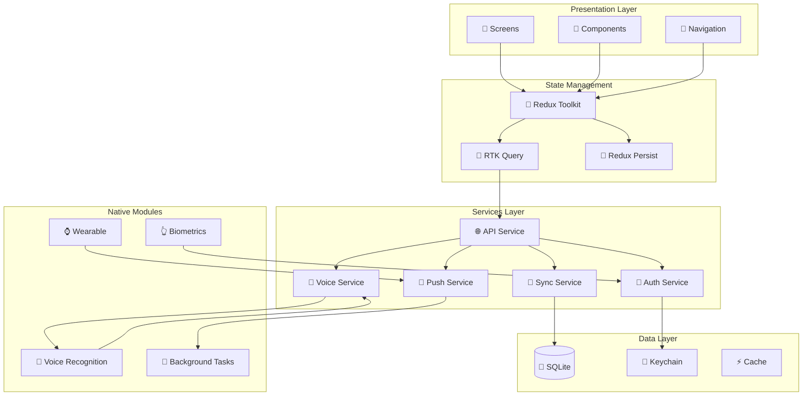
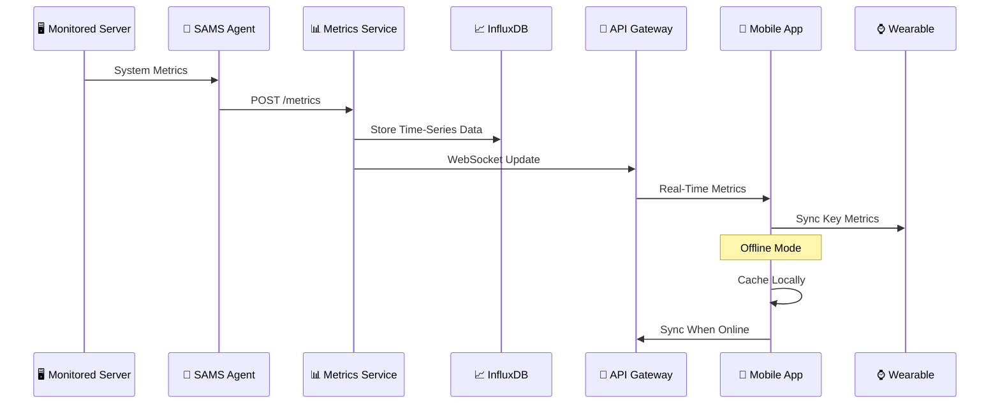
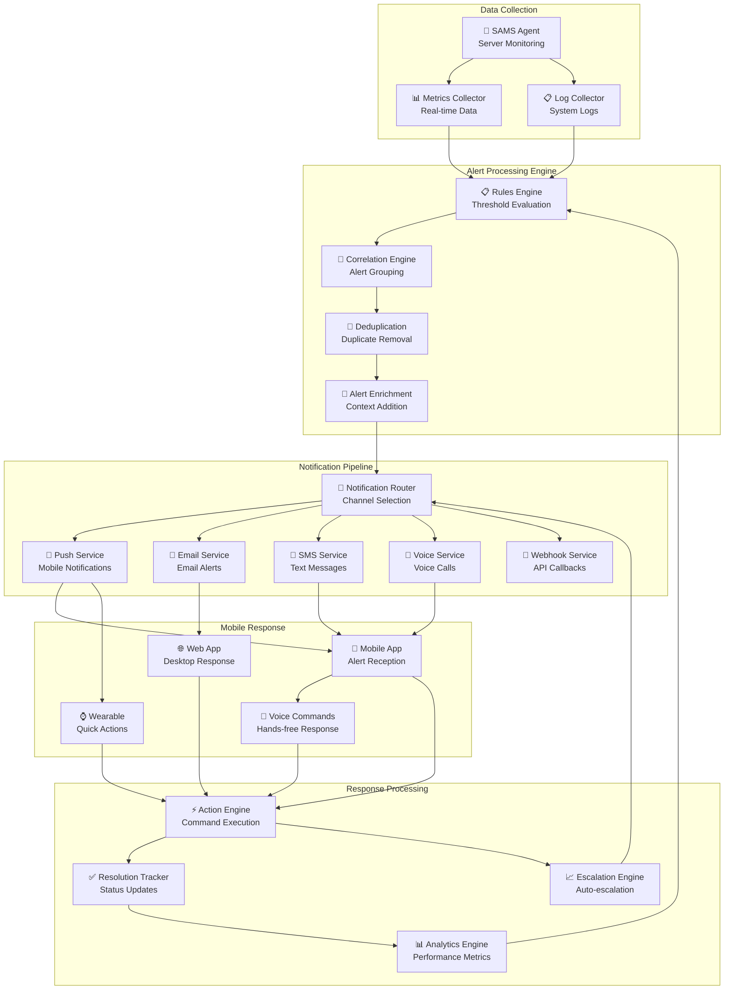
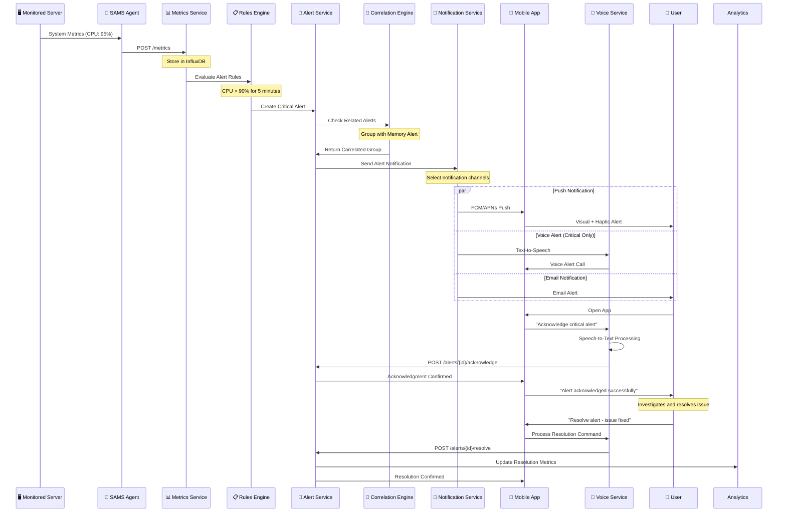
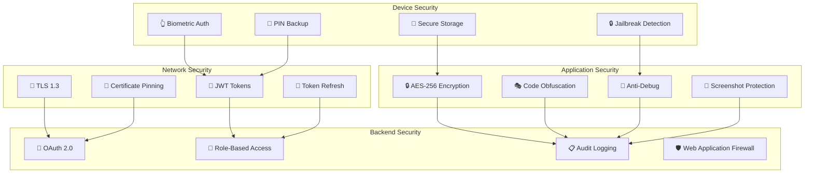
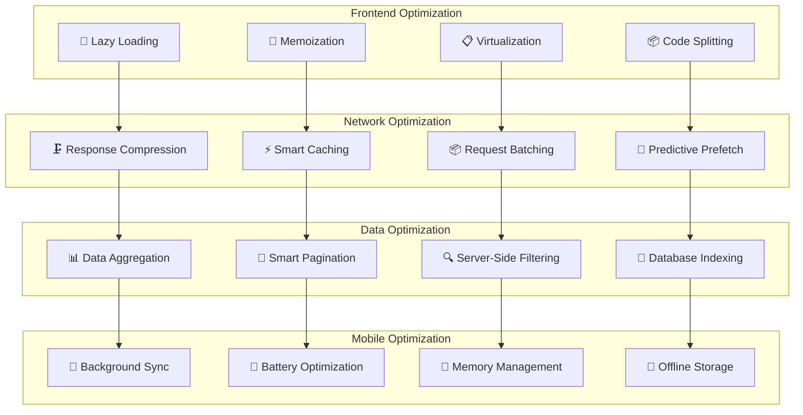
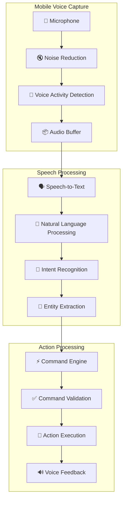
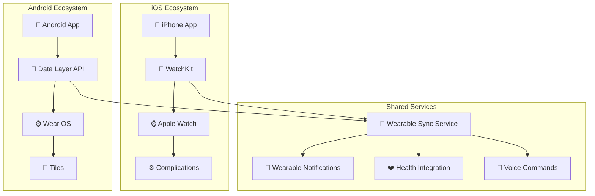
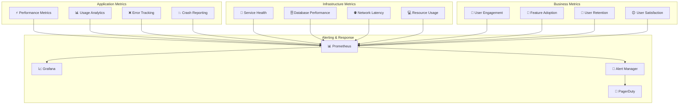

# 🏗️ **SAMS Mobile - System Architecture Design**

## **Executive Summary**

This document presents the complete system architecture for SAMS Mobile - a scalable, enterprise-grade mobile infrastructure monitoring platform. The architecture is designed for mobile-first operations with voice integration, wearable support, and offline capabilities.

## **🎯 Architecture Principles**

### **Mobile-First Design**
- **Native Performance**: Optimized for mobile devices and networks
- **Offline Capabilities**: Full functionality without internet connectivity
- **Battery Efficiency**: Minimal battery drain during monitoring
- **Cross-Platform**: Consistent experience across iOS and Android

### **Microservices Architecture**
- **Service Independence**: Loosely coupled, independently deployable services
- **Technology Diversity**: Best tool for each specific requirement
- **Scalability**: Independent scaling based on mobile usage patterns
- **Resilience**: Fault isolation and graceful degradation

### **Real-Time Communication**
- **Low Latency**: <100ms response time for critical alerts
- **Bi-Directional**: Full-duplex communication for real-time updates
- **Mobile Optimized**: Battery-efficient real-time connections
- **Offline Resilience**: Queue and sync when connectivity returns

## **🏛️ High-Level Architecture**

```mermaid
graph TB
    subgraph "Mobile Clients"
        iOS[📱 iOS App<br/>React Native]
        Android[🤖 Android App<br/>React Native]
        Watch[⌚ Wearables<br/>WatchOS/WearOS]
        PWA[🌐 PWA Fallback<br/>React.js]
    end

    subgraph "API Gateway Layer"
        Gateway[🚪 Kong API Gateway<br/>Rate Limiting & Routing]
        Auth[🔐 Auth Service<br/>JWT + OAuth2]
        Rate[⚡ Rate Limiter<br/>Redis-based]
        LB[⚖️ Load Balancer<br/>NGINX/HAProxy]
    end

    subgraph "Core Microservices"
        Metrics[📊 Metrics Service<br/>Node.js/Express]
        Alerts[🚨 Alert Service<br/>Node.js/Express]
        Voice[🎤 Voice Service<br/>Node.js/Express]
        Sync[🔄 Sync Service<br/>Node.js/Express]
        Device[📱 Device Service<br/>Node.js/Express]
        User[👥 User Service<br/>Node.js/Express]
        Notification[📲 Notification Service<br/>Node.js/Express]
    end

    subgraph "Data Layer"
        InfluxDB[(📈 InfluxDB<br/>Time-series Metrics)]
        PostgreSQL[(🗄️ PostgreSQL<br/>Relational Data)]
        Redis[(⚡ Redis<br/>Cache & Sessions)]
        S3[(☁️ S3 Storage<br/>Files & Backups)]
        Elasticsearch[(🔍 Elasticsearch<br/>Search & Logs)]
    end

    subgraph "Message Queue"
        Kafka[📨 Apache Kafka<br/>Event Streaming]
        RabbitMQ[🐰 RabbitMQ<br/>Task Queue]
    end

    subgraph "External Services"
        FCM[📲 Firebase FCM<br/>Android Push]
        APNs[🍎 Apple APNs<br/>iOS Push]
        Speech[🎤 Google Speech API<br/>Voice Processing]
        SMS[📱 Twilio SMS<br/>SMS Alerts]
        Email[📧 SendGrid<br/>Email Notifications]
    end

    subgraph "Monitoring & Observability"
        Prometheus[📊 Prometheus<br/>Metrics Collection]
        Grafana[📈 Grafana<br/>Visualization]
        Jaeger[🔍 Jaeger<br/>Distributed Tracing]
        ELK[📋 ELK Stack<br/>Logging]
    end

    iOS --> LB
    Android --> LB
    Watch --> LB
    PWA --> LB

    LB --> Gateway
    Gateway --> Auth
    Gateway --> Rate
    Gateway --> Metrics
    Gateway --> Alerts
    Gateway --> Voice
    Gateway --> Sync
    Gateway --> Device
    Gateway --> User
    Gateway --> Notification

    Metrics --> InfluxDB
    Metrics --> Kafka
    Alerts --> PostgreSQL
    Alerts --> Kafka
    Voice --> Speech
    Voice --> S3
    Sync --> Redis
    Device --> PostgreSQL
    User --> PostgreSQL
    Notification --> FCM
    Notification --> APNs
    Notification --> SMS
    Notification --> Email

    Kafka --> RabbitMQ

    Metrics --> Prometheus
    Alerts --> Prometheus
    Voice --> Prometheus
    Prometheus --> Grafana

    Gateway --> Jaeger
    Metrics --> Jaeger
    Alerts --> Jaeger

    Gateway --> ELK
    Metrics --> ELK
    Alerts --> ELK

    PostgreSQL --> Elasticsearch
    InfluxDB --> Elasticsearch
```



## **📱 Mobile Application Architecture**

### **React Native Architecture**


## **🔄 Data Flow Architecture**

### **Real-Time Metrics Flow**


### **Alert Processing Pipeline**


### **Detailed Alert Flow Sequence**


## **🔐 Security Architecture**

### **Mobile Security Layers**


## **⚡ Performance Architecture**

### **Mobile Performance Optimization**


## **🎤 Voice Integration Architecture**

### **Voice Processing Pipeline**


## **⌚ Wearable Integration Architecture**

### **Cross-Platform Wearable Support**


## **📊 Monitoring & Observability**

### **Self-Monitoring Architecture**


## **🔄 Deployment Architecture**

### **Cloud-Native Deployment**
```mermaid
graph TB
    subgraph "Development"
        Dev[👨‍💻 Developer]
        Git[📝 Git Repository]
        CI[🔄 CI Pipeline]
        Tests[🧪 Automated Tests]
    end
    
    subgraph "Staging"
        Staging[🎭 Staging Environment]
        E2E[🔍 E2E Tests]
        Performance[⚡ Performance Tests]
        Security[🔒 Security Scans]
    end
    
    subgraph "Production"
        LoadBalancer[⚖️ Load Balancer]
        Kubernetes[☸️ Kubernetes Cluster]
        Services[🔧 Microservices]
        Databases[🗄️ Databases]
    end
    
    subgraph "Mobile Distribution"
        AppStore[🍎 App Store]
        PlayStore[🤖 Google Play]
        TestFlight[✈️ TestFlight]
        Firebase[🔥 Firebase Distribution]
    end
    
    Dev --> Git
    Git --> CI
    CI --> Tests
    Tests --> Staging
    
    Staging --> E2E
    E2E --> Performance
    Performance --> Security
    Security --> LoadBalancer
    
    LoadBalancer --> Kubernetes
    Kubernetes --> Services
    Services --> Databases
    
    CI --> AppStore
    CI --> PlayStore
    Staging --> TestFlight
    Staging --> Firebase
```

---

*This comprehensive system architecture provides the foundation for building SAMS Mobile - a scalable, secure, and performant mobile infrastructure monitoring platform that meets enterprise requirements while delivering exceptional user experience.*
