# 📊 **SAMS Mobile - Data Processing Pipeline**

## **Executive Summary**

This document presents the comprehensive data processing pipeline for SAMS Mobile, featuring Apache Kafka message queue implementation, stream processing for real-time metrics, batch processing for historical data, data aggregation and downsampling logic, validation and error handling, and comprehensive pipeline monitoring.

## **🏗️ Data Pipeline Architecture**

### **Pipeline Components Overview**

```mermaid
graph TB
    subgraph "Data Sources"
        Agents[🤖 Monitoring Agents]
        APIs[🔌 External APIs]
        WebHooks[📡 Webhooks]
        Mobile[📱 Mobile Apps]
    end
    
    subgraph "Message Queue Layer"
        Kafka[📨 Apache Kafka]
        Topics[📋 Topics]
        Partitions[🔀 Partitions]
    end
    
    subgraph "Stream Processing"
        KafkaStreams[🌊 Kafka Streams]
        RealTime[⚡ Real-time Processing]
        Aggregation[📊 Aggregation]
        Enrichment[📝 Data Enrichment]
    end
    
    subgraph "Batch Processing"
        Scheduler[⏰ Batch Scheduler]
        ETL[🔄 ETL Jobs]
        Historical[📈 Historical Analysis]
        Reports[📋 Report Generation]
    end
    
    subgraph "Data Storage"
        InfluxDB[(📈 InfluxDB)]
        PostgreSQL[(🗄️ PostgreSQL)]
        Redis[(⚡ Redis Cache)]
        S3[(☁️ S3 Storage)]
    end
    
    subgraph "Monitoring & Alerting"
        Metrics[📊 Pipeline Metrics]
        Alerts[🚨 Pipeline Alerts]
        Dashboard[📈 Monitoring Dashboard]
    end
    
    Agents --> Kafka
    APIs --> Kafka
    WebHooks --> Kafka
    Mobile --> Kafka
    
    Kafka --> Topics
    Topics --> Partitions
    
    Partitions --> KafkaStreams
    KafkaStreams --> RealTime
    RealTime --> Aggregation
    Aggregation --> Enrichment
    
    Partitions --> Scheduler
    Scheduler --> ETL
    ETL --> Historical
    Historical --> Reports
    
    Enrichment --> InfluxDB
    Enrichment --> PostgreSQL
    Enrichment --> Redis
    Reports --> S3
    
    KafkaStreams --> Metrics
    ETL --> Metrics
    Metrics --> Alerts
    Metrics --> Dashboard
```


## **📨 Apache Kafka Implementation**

### **Kafka Configuration**
```yaml
# kafka-config.yml
server:
  port: 8083

spring:
  kafka:
    bootstrap-servers: ${KAFKA_BOOTSTRAP_SERVERS:localhost:9092}
    producer:
      key-serializer: org.apache.kafka.common.serialization.StringSerializer
      value-serializer: org.springframework.kafka.support.serializer.JsonSerializer
      acks: all
      retries: 3
      batch-size: 16384
      linger-ms: 5
      buffer-memory: 33554432
      compression-type: snappy
      enable-idempotence: true
    consumer:
      group-id: sams-data-pipeline
      key-deserializer: org.apache.kafka.common.serialization.StringDeserializer
      value-deserializer: org.springframework.kafka.support.serializer.JsonDeserializer
      auto-offset-reset: earliest
      enable-auto-commit: false
      max-poll-records: 500
      fetch-min-size: 1024
      fetch-max-wait: 500
    streams:
      application-id: sams-stream-processor
      default-key-serde: org.apache.kafka.common.serialization.Serdes$StringSerde
      default-value-serde: org.springframework.kafka.support.serializer.JsonSerde
      num-stream-threads: 4
      replication-factor: 3
      state-dir: /tmp/kafka-streams

sams:
  kafka:
    topics:
      metrics: sams-metrics
      alerts: sams-alerts
      events: sams-events
      commands: sams-commands
      notifications: sams-notifications
    partitions: 12
    replication-factor: 3
    retention-ms: 604800000 # 7 days
```

### **Kafka Producer Service**
```java
// services/KafkaProducerService.java
@Service
@Slf4j
public class KafkaProducerService {
    
    private final KafkaTemplate<String, Object> kafkaTemplate;
    private final SAMSKafkaProperties kafkaProperties;
    private final MeterRegistry meterRegistry;
    
    // Metrics
    private final Counter messagesProduced;
    private final Counter messagesFailed;
    private final Timer messageLatency;
    
    public KafkaProducerService(KafkaTemplate<String, Object> kafkaTemplate,
                               SAMSKafkaProperties kafkaProperties,
                               MeterRegistry meterRegistry) {
        this.kafkaTemplate = kafkaTemplate;
        this.kafkaProperties = kafkaProperties;
        this.meterRegistry = meterRegistry;
        
        // Initialize metrics
        this.messagesProduced = Counter.builder("kafka.messages.produced")
            .description("Number of messages produced to Kafka")
            .tag("service", "data-pipeline")
            .register(meterRegistry);
            
        this.messagesFailed = Counter.builder("kafka.messages.failed")
            .description("Number of failed message productions")
            .tag("service", "data-pipeline")
            .register(meterRegistry);
            
        this.messageLatency = Timer.builder("kafka.message.latency")
            .description("Message production latency")
            .tag("service", "data-pipeline")
            .register(meterRegistry);
    }
    
    public CompletableFuture<SendResult<String, Object>> sendMetrics(MetricsMessage metrics) {
        return sendMessage(kafkaProperties.getTopics().getMetrics(), 
                          metrics.getServerId(), 
                          metrics);
    }
    
    public CompletableFuture<SendResult<String, Object>> sendAlert(AlertMessage alert) {
        return sendMessage(kafkaProperties.getTopics().getAlerts(), 
                          alert.getOrganizationId(), 
                          alert);
    }
    
    public CompletableFuture<SendResult<String, Object>> sendEvent(EventMessage event) {
        return sendMessage(kafkaProperties.getTopics().getEvents(), 
                          event.getEntityId(), 
                          event);
    }
    
    public CompletableFuture<SendResult<String, Object>> sendCommand(CommandMessage command) {
        return sendMessage(kafkaProperties.getTopics().getCommands(), 
                          command.getTargetId(), 
                          command);
    }
    
    public CompletableFuture<SendResult<String, Object>> sendNotification(NotificationMessage notification) {
        return sendMessage(kafkaProperties.getTopics().getNotifications(), 
                          notification.getUserId(), 
                          notification);
    }
    
    private CompletableFuture<SendResult<String, Object>> sendMessage(String topic, 
                                                                     String key, 
                                                                     Object message) {
        Timer.Sample sample = Timer.start(meterRegistry);
        
        return kafkaTemplate.send(topic, key, message)
            .whenComplete((result, throwable) -> {
                sample.stop(messageLatency);
                
                if (throwable != null) {
                    messagesFailed.increment(Tags.of("topic", topic));
                    log.error("Failed to send message to topic {}: {}", topic, throwable.getMessage());
                } else {
                    messagesProduced.increment(Tags.of("topic", topic));
                    log.debug("Message sent successfully to topic {} with offset {}", 
                            topic, result.getRecordMetadata().offset());
                }
            });
    }
    
    @EventListener
    public void handleMetricsEvent(MetricsCollectedEvent event) {
        MetricsMessage message = MetricsMessage.builder()
            .serverId(event.getServerId())
            .organizationId(event.getOrganizationId())
            .metrics(event.getMetrics())
            .timestamp(event.getTimestamp())
            .source("agent")
            .build();
        
        sendMetrics(message);
    }
    
    @EventListener
    public void handleAlertEvent(AlertCreatedEvent event) {
        AlertMessage message = AlertMessage.builder()
            .alertId(event.getAlertId())
            .organizationId(event.getOrganizationId())
            .serverId(event.getServerId())
            .severity(event.getSeverity())
            .title(event.getTitle())
            .description(event.getDescription())
            .timestamp(event.getTimestamp())
            .metadata(event.getMetadata())
            .build();
        
        sendAlert(message);
    }
}
```

## **🌊 Stream Processing Implementation**

### **Kafka Streams Configuration**
```java
// config/KafkaStreamsConfig.java
@Configuration
@EnableKafkaStreams
@Slf4j
public class KafkaStreamsConfig {
    
    @Bean
    public KStream<String, MetricsMessage> metricsStream(StreamsBuilder streamsBuilder) {
        KStream<String, MetricsMessage> metricsStream = streamsBuilder
            .stream("sams-metrics", Consumed.with(Serdes.String(), new JsonSerde<>(MetricsMessage.class)));
        
        // Real-time metrics processing
        metricsStream
            .filter((key, value) -> value != null && value.getMetrics() != null)
            .peek((key, value) -> log.debug("Processing metrics for server: {}", value.getServerId()))
            .mapValues(this::enrichMetrics)
            .mapValues(this::validateMetrics)
            .filter((key, value) -> value.isValid())
            .to("sams-metrics-processed", Produced.with(Serdes.String(), new JsonSerde<>(MetricsMessage.class)));
        
        // Real-time aggregation
        metricsStream
            .groupByKey()
            .windowedBy(TimeWindows.of(Duration.ofMinutes(1)))
            .aggregate(
                MetricsAggregation::new,
                (key, value, aggregate) -> aggregate.add(value),
                Materialized.<String, MetricsAggregation, WindowStore<Bytes, byte[]>>as("metrics-aggregation-store")
                    .withValueSerde(new JsonSerde<>(MetricsAggregation.class))
            )
            .toStream()
            .map((windowedKey, aggregate) -> KeyValue.pair(
                windowedKey.key(),
                AggregatedMetricsMessage.builder()
                    .serverId(windowedKey.key())
                    .windowStart(windowedKey.window().start())
                    .windowEnd(windowedKey.window().end())
                    .aggregation(aggregate)
                    .build()
            ))
            .to("sams-metrics-aggregated", Produced.with(Serdes.String(), new JsonSerde<>(AggregatedMetricsMessage.class)));
        
        return metricsStream;
    }
    
    @Bean
    public KStream<String, AlertMessage> alertsStream(StreamsBuilder streamsBuilder) {
        KStream<String, AlertMessage> alertsStream = streamsBuilder
            .stream("sams-alerts", Consumed.with(Serdes.String(), new JsonSerde<>(AlertMessage.class)));
        
        // Alert enrichment and correlation
        alertsStream
            .filter((key, value) -> value != null)
            .mapValues(this::enrichAlert)
            .mapValues(this::correlateAlert)
            .filter((key, value) -> !value.isSuppressed())
            .to("sams-alerts-processed", Produced.with(Serdes.String(), new JsonSerde<>(AlertMessage.class)));
        
        // Critical alerts stream
        alertsStream
            .filter((key, value) -> "critical".equals(value.getSeverity()))
            .mapValues(this::createUrgentNotification)
            .to("sams-notifications", Produced.with(Serdes.String(), new JsonSerde<>(NotificationMessage.class)));
        
        return alertsStream;
    }
    
    @Bean
    public KTable<String, ServerStatus> serverStatusTable(StreamsBuilder streamsBuilder) {
        return streamsBuilder
            .stream("sams-metrics-processed", Consumed.with(Serdes.String(), new JsonSerde<>(MetricsMessage.class)))
            .groupByKey()
            .aggregate(
                ServerStatus::new,
                (key, value, aggregate) -> aggregate.updateFromMetrics(value),
                Materialized.<String, ServerStatus, KeyValueStore<Bytes, byte[]>>as("server-status-store")
                    .withValueSerde(new JsonSerde<>(ServerStatus.class))
            );
    }
    
    private MetricsMessage enrichMetrics(MetricsMessage metrics) {
        // Add derived metrics
        Map<String, Double> enrichedMetrics = new HashMap<>(metrics.getMetrics());
        
        // Calculate CPU load average
        if (enrichedMetrics.containsKey("cpu_usage")) {
            double cpuUsage = enrichedMetrics.get("cpu_usage");
            enrichedMetrics.put("cpu_load_category", categorizeCpuLoad(cpuUsage));
        }
        
        // Calculate memory pressure
        if (enrichedMetrics.containsKey("memory_usage")) {
            double memoryUsage = enrichedMetrics.get("memory_usage");
            enrichedMetrics.put("memory_pressure", calculateMemoryPressure(memoryUsage));
        }
        
        // Add timestamp-based features
        enrichedMetrics.put("hour_of_day", (double) LocalDateTime.now().getHour());
        enrichedMetrics.put("day_of_week", (double) LocalDateTime.now().getDayOfWeek().getValue());
        
        return metrics.toBuilder()
            .metrics(enrichedMetrics)
            .enriched(true)
            .build();
    }
    
    private MetricsMessage validateMetrics(MetricsMessage metrics) {
        boolean isValid = true;
        List<String> validationErrors = new ArrayList<>();
        
        // Validate required fields
        if (metrics.getServerId() == null || metrics.getServerId().isEmpty()) {
            isValid = false;
            validationErrors.add("Missing server ID");
        }
        
        if (metrics.getMetrics() == null || metrics.getMetrics().isEmpty()) {
            isValid = false;
            validationErrors.add("Missing metrics data");
        }
        
        // Validate metric values
        if (metrics.getMetrics() != null) {
            for (Map.Entry<String, Double> entry : metrics.getMetrics().entrySet()) {
                String metricName = entry.getKey();
                Double value = entry.getValue();
                
                if (value == null || value.isNaN() || value.isInfinite()) {
                    isValid = false;
                    validationErrors.add("Invalid value for metric: " + metricName);
                }
                
                // Validate percentage metrics
                if (metricName.endsWith("_usage") && (value < 0 || value > 100)) {
                    isValid = false;
                    validationErrors.add("Percentage metric out of range: " + metricName);
                }
            }
        }
        
        return metrics.toBuilder()
            .valid(isValid)
            .validationErrors(validationErrors)
            .build();
    }
    
    private AlertMessage enrichAlert(AlertMessage alert) {
        // Add contextual information
        Map<String, Object> enrichedMetadata = new HashMap<>(alert.getMetadata());
        
        // Add server information
        enrichedMetadata.put("server_environment", getServerEnvironment(alert.getServerId()));
        enrichedMetadata.put("server_group", getServerGroup(alert.getServerId()));
        
        // Add time-based context
        enrichedMetadata.put("business_hours", isBusinessHours());
        enrichedMetadata.put("weekend", isWeekend());
        
        return alert.toBuilder()
            .metadata(enrichedMetadata)
            .enriched(true)
            .build();
    }
    
    private AlertMessage correlateAlert(AlertMessage alert) {
        // Simple correlation logic (can be enhanced with ML)
        boolean shouldSuppress = false;
        
        // Check for maintenance windows
        if (isInMaintenanceWindow(alert.getServerId())) {
            shouldSuppress = true;
        }
        
        // Check for alert flooding
        if (hasRecentSimilarAlerts(alert)) {
            shouldSuppress = true;
        }
        
        return alert.toBuilder()
            .suppressed(shouldSuppress)
            .correlationProcessed(true)
            .build();
    }
    
    private NotificationMessage createUrgentNotification(AlertMessage alert) {
        return NotificationMessage.builder()
            .notificationId(UUID.randomUUID().toString())
            .userId(null) // Will be resolved by notification service
            .organizationId(alert.getOrganizationId())
            .type("critical_alert")
            .title("CRITICAL: " + alert.getTitle())
            .message(alert.getDescription())
            .priority("urgent")
            .channels(List.of("push", "sms", "voice"))
            .metadata(Map.of(
                "alertId", alert.getAlertId(),
                "serverId", alert.getServerId(),
                "severity", alert.getSeverity()
            ))
            .timestamp(Instant.now())
            .build();
    }
    
    // Helper methods
    private double categorizeCpuLoad(double cpuUsage) {
        if (cpuUsage < 30) return 1.0; // Low
        if (cpuUsage < 70) return 2.0; // Medium
        if (cpuUsage < 90) return 3.0; // High
        return 4.0; // Critical
    }
    
    private double calculateMemoryPressure(double memoryUsage) {
        // Simple memory pressure calculation
        return Math.max(0, (memoryUsage - 70) / 30); // 0-1 scale
    }
    
    private String getServerEnvironment(String serverId) {
        // Lookup server environment from cache or database
        return "production"; // Placeholder
    }
    
    private String getServerGroup(String serverId) {
        // Lookup server group from cache or database
        return "web-servers"; // Placeholder
    }
    
    private boolean isBusinessHours() {
        LocalTime now = LocalTime.now();
        return now.isAfter(LocalTime.of(9, 0)) && now.isBefore(LocalTime.of(17, 0));
    }
    
    private boolean isWeekend() {
        DayOfWeek dayOfWeek = LocalDate.now().getDayOfWeek();
        return dayOfWeek == DayOfWeek.SATURDAY || dayOfWeek == DayOfWeek.SUNDAY;
    }
    
    private boolean isInMaintenanceWindow(String serverId) {
        // Check maintenance window from cache or database
        return false; // Placeholder
    }
    
    private boolean hasRecentSimilarAlerts(AlertMessage alert) {
        // Check for similar alerts in the last 5 minutes
        return false; // Placeholder
    }
}
```

## **⏰ Batch Processing Implementation**

### **Batch Processing Service**
```java
// services/BatchProcessingService.java
@Service
@Slf4j
public class BatchProcessingService {
    
    private final InfluxDBClient influxDBClient;
    private final JdbcTemplate jdbcTemplate;
    private final S3Client s3Client;
    private final MeterRegistry meterRegistry;
    
    // Batch processing metrics
    private final Timer batchProcessingTime;
    private final Counter batchJobsCompleted;
    private final Counter batchJobsFailed;
    
    public BatchProcessingService(InfluxDBClient influxDBClient,
                                 JdbcTemplate jdbcTemplate,
                                 S3Client s3Client,
                                 MeterRegistry meterRegistry) {
        this.influxDBClient = influxDBClient;
        this.jdbcTemplate = jdbcTemplate;
        this.s3Client = s3Client;
        this.meterRegistry = meterRegistry;
        
        this.batchProcessingTime = Timer.builder("batch.processing.time")
            .description("Time taken for batch processing jobs")
            .register(meterRegistry);
            
        this.batchJobsCompleted = Counter.builder("batch.jobs.completed")
            .description("Number of completed batch jobs")
            .register(meterRegistry);
            
        this.batchJobsFailed = Counter.builder("batch.jobs.failed")
            .description("Number of failed batch jobs")
            .register(meterRegistry);
    }
    
    @Scheduled(fixedRate = 300000) // Every 5 minutes
    public void processMetricsAggregation() {
        Timer.Sample sample = Timer.start(meterRegistry);
        
        try {
            log.info("Starting metrics aggregation batch job");
            
            // Aggregate metrics for the last 5 minutes
            Instant endTime = Instant.now();
            Instant startTime = endTime.minus(Duration.ofMinutes(5));
            
            // Process hourly aggregations
            processHourlyAggregations(startTime, endTime);
            
            // Process daily aggregations
            processDailyAggregations(startTime, endTime);
            
            // Clean up old raw metrics
            cleanupOldMetrics();
            
            batchJobsCompleted.increment(Tags.of("job", "metrics_aggregation"));
            log.info("Completed metrics aggregation batch job");
            
        } catch (Exception e) {
            batchJobsFailed.increment(Tags.of("job", "metrics_aggregation"));
            log.error("Failed to process metrics aggregation", e);
        } finally {
            sample.stop(batchProcessingTime.withTags("job", "metrics_aggregation"));
        }
    }
    
    @Scheduled(cron = "0 0 * * * *") // Every hour
    public void generateHourlyReports() {
        Timer.Sample sample = Timer.start(meterRegistry);
        
        try {
            log.info("Starting hourly reports generation");
            
            Instant endTime = Instant.now().truncatedTo(ChronoUnit.HOURS);
            Instant startTime = endTime.minus(Duration.ofHours(1));
            
            // Generate server performance reports
            generateServerPerformanceReports(startTime, endTime);
            
            // Generate alert summary reports
            generateAlertSummaryReports(startTime, endTime);
            
            // Generate availability reports
            generateAvailabilityReports(startTime, endTime);
            
            batchJobsCompleted.increment(Tags.of("job", "hourly_reports"));
            log.info("Completed hourly reports generation");
            
        } catch (Exception e) {
            batchJobsFailed.increment(Tags.of("job", "hourly_reports"));
            log.error("Failed to generate hourly reports", e);
        } finally {
            sample.stop(batchProcessingTime.withTags("job", "hourly_reports"));
        }
    }
    
    @Scheduled(cron = "0 0 2 * * *") // Daily at 2 AM
    public void performDailyMaintenance() {
        Timer.Sample sample = Timer.start(meterRegistry);
        
        try {
            log.info("Starting daily maintenance batch job");
            
            // Archive old data
            archiveOldData();
            
            // Update server statistics
            updateServerStatistics();
            
            // Generate daily reports
            generateDailyReports();
            
            // Optimize database
            optimizeDatabase();
            
            batchJobsCompleted.increment(Tags.of("job", "daily_maintenance"));
            log.info("Completed daily maintenance batch job");
            
        } catch (Exception e) {
            batchJobsFailed.increment(Tags.of("job", "daily_maintenance"));
            log.error("Failed to perform daily maintenance", e);
        } finally {
            sample.stop(batchProcessingTime.withTags("job", "daily_maintenance"));
        }
    }
    
    private void processHourlyAggregations(Instant startTime, Instant endTime) {
        String flux = String.format("""
            from(bucket: "metrics")
              |> range(start: %s, stop: %s)
              |> filter(fn: (r) => r["_measurement"] == "server_metrics")
              |> aggregateWindow(every: 1h, fn: mean, createEmpty: false)
              |> to(bucket: "metrics_hourly")
            """, startTime, endTime);
        
        influxDBClient.getQueryApi().query(flux);
        log.debug("Processed hourly aggregations for period {} to {}", startTime, endTime);
    }
    
    private void processDailyAggregations(Instant startTime, Instant endTime) {
        String flux = String.format("""
            from(bucket: "metrics_hourly")
              |> range(start: %s, stop: %s)
              |> filter(fn: (r) => r["_measurement"] == "server_metrics")
              |> aggregateWindow(every: 1d, fn: mean, createEmpty: false)
              |> to(bucket: "metrics_daily")
            """, startTime, endTime);
        
        influxDBClient.getQueryApi().query(flux);
        log.debug("Processed daily aggregations for period {} to {}", startTime, endTime);
    }
    
    private void cleanupOldMetrics() {
        // Delete raw metrics older than 7 days
        Instant cutoffTime = Instant.now().minus(Duration.ofDays(7));
        
        String deleteFlux = String.format("""
            from(bucket: "metrics")
              |> range(start: 1970-01-01T00:00:00Z, stop: %s)
              |> filter(fn: (r) => r["_measurement"] == "server_metrics")
              |> drop()
            """, cutoffTime);
        
        influxDBClient.getQueryApi().query(deleteFlux);
        log.debug("Cleaned up metrics older than {}", cutoffTime);
    }
    
    private void generateServerPerformanceReports(Instant startTime, Instant endTime) {
        // Generate performance reports for each server
        List<String> serverIds = getActiveServerIds();
        
        for (String serverId : serverIds) {
            ServerPerformanceReport report = createServerPerformanceReport(serverId, startTime, endTime);
            saveReportToS3(report, "performance", serverId, startTime);
        }
    }
    
    private void generateAlertSummaryReports(Instant startTime, Instant endTime) {
        AlertSummaryReport report = createAlertSummaryReport(startTime, endTime);
        saveReportToS3(report, "alerts", "summary", startTime);
    }
    
    private void generateAvailabilityReports(Instant startTime, Instant endTime) {
        List<String> serverIds = getActiveServerIds();
        
        for (String serverId : serverIds) {
            AvailabilityReport report = createAvailabilityReport(serverId, startTime, endTime);
            saveReportToS3(report, "availability", serverId, startTime);
        }
    }
    
    private void saveReportToS3(Object report, String reportType, String entityId, Instant timestamp) {
        try {
            String key = String.format("reports/%s/%s/%s/%s.json", 
                reportType, 
                entityId, 
                timestamp.toString().substring(0, 10), // Date part
                timestamp.toString().replace(":", "-"));
            
            String reportJson = new ObjectMapper().writeValueAsString(report);
            
            s3Client.putObject(PutObjectRequest.builder()
                .bucket("sams-reports")
                .key(key)
                .contentType("application/json")
                .build(),
                RequestBody.fromString(reportJson));
                
            log.debug("Saved {} report to S3: {}", reportType, key);
            
        } catch (Exception e) {
            log.error("Failed to save report to S3", e);
        }
    }
}
```

---

*This comprehensive data processing pipeline provides robust message queuing with Apache Kafka, real-time stream processing with Kafka Streams, efficient batch processing for historical data, intelligent data aggregation and validation, and comprehensive monitoring for enterprise-grade data processing in SAMS Mobile.*
