# 📈 **SAMS Mobile - Time-Series Database Integration**

## **Executive Summary**

This document presents the comprehensive time-series database integration for SAMS Mobile, featuring InfluxDB and TimescaleDB implementations, optimized metrics storage and retrieval APIs, dashboard performance optimization, data retention and cleanup policies, backup and recovery procedures, and comprehensive database performance monitoring.

## **🏗️ Time-Series Database Architecture**

### **Dual Database Strategy**

```mermaid
graph TB
    subgraph "Data Sources"
        Agents[🤖 Monitoring Agents]
        Streams[🌊 Kafka Streams]
        APIs[🔌 External APIs]
    end
    
    subgraph "Time-Series Databases"
        InfluxDB[(📈 InfluxDB)]
        TimescaleDB[(⏰ TimescaleDB)]
    end
    
    subgraph "Data Processing"
        Ingestion[📥 Data Ingestion]
        Validation[✅ Data Validation]
        Transformation[🔄 Data Transformation]
        Routing[🚦 Data Routing]
    end
    
    subgraph "Query Layer"
        QueryAPI[🔍 Query API]
        Aggregation[📊 Aggregation Service]
        Cache[⚡ Query Cache]
        Optimization[🚀 Query Optimization]
    end
    
    subgraph "Data Management"
        Retention[🗂️ Retention Policies]
        Backup[💾 Backup Service]
        Recovery[🔄 Recovery Service]
        Monitoring[📊 DB Monitoring]
    end
    
    subgraph "Applications"
        Dashboard[📈 Dashboards]
        Mobile[📱 Mobile Apps]
        Reports[📋 Reports]
        Alerts[🚨 Alert Engine]
    end
    
    Agents --> Ingestion
    Streams --> Ingestion
    APIs --> Ingestion
    
    Ingestion --> Validation
    Validation --> Transformation
    Transformation --> Routing
    
    Routing --> InfluxDB
    Routing --> TimescaleDB
    
    InfluxDB --> QueryAPI
    TimescaleDB --> QueryAPI
    
    QueryAPI --> Aggregation
    Aggregation --> Cache
    Cache --> Optimization
    
    Optimization --> Dashboard
    Optimization --> Mobile
    Optimization --> Reports
    Optimization --> Alerts
    
    InfluxDB --> Retention
    TimescaleDB --> Retention
    Retention --> Backup
    Backup --> Recovery
    
    InfluxDB --> Monitoring
    TimescaleDB --> Monitoring
```


## **📈 InfluxDB Implementation**

### **InfluxDB Configuration**
```yaml
# influxdb-config.yml
influxdb:
  url: ${INFLUXDB_URL:http://localhost:8086}
  token: ${INFLUXDB_TOKEN}
  org: ${INFLUXDB_ORG:sams_mobile}
  bucket: ${INFLUXDB_BUCKET:metrics}
  
  # Connection settings
  connection:
    timeout: 30s
    read-timeout: 60s
    write-timeout: 30s
    max-retries: 3
    retry-interval: 1s
    
  # Write settings
  write:
    batch-size: 5000
    flush-interval: 10s
    jitter-interval: 2s
    retry-buffer-limit: 10000
    
  # Query settings
  query:
    timeout: 60s
    max-query-time: 300s
    
  # Buckets configuration
  buckets:
    metrics: 
      name: metrics
      retention: 7d
      description: "Raw metrics data"
    metrics_hourly:
      name: metrics_hourly
      retention: 90d
      description: "Hourly aggregated metrics"
    metrics_daily:
      name: metrics_daily
      retention: 2y
      description: "Daily aggregated metrics"
    alerts:
      name: alerts
      retention: 6m
      description: "Alert events and history"
```

### **InfluxDB Service Implementation**
```java
// services/InfluxDBService.java
@Service
@Slf4j
public class InfluxDBService {
    
    private final InfluxDBClient influxDBClient;
    private final WriteApiBlocking writeApi;
    private final QueryApi queryApi;
    private final BucketsApi bucketsApi;
    private final InfluxDBProperties properties;
    private final MeterRegistry meterRegistry;
    
    // Metrics
    private final Counter writeOperations;
    private final Counter queryOperations;
    private final Timer writeLatency;
    private final Timer queryLatency;
    private final Gauge connectionStatus;
    
    public InfluxDBService(InfluxDBClient influxDBClient,
                          InfluxDBProperties properties,
                          MeterRegistry meterRegistry) {
        this.influxDBClient = influxDBClient;
        this.writeApi = influxDBClient.getWriteApiBlocking();
        this.queryApi = influxDBClient.getQueryApi();
        this.bucketsApi = influxDBClient.getBucketsApi();
        this.properties = properties;
        this.meterRegistry = meterRegistry;
        
        // Initialize metrics
        this.writeOperations = Counter.builder("influxdb.write.operations")
            .description("Number of write operations to InfluxDB")
            .register(meterRegistry);
            
        this.queryOperations = Counter.builder("influxdb.query.operations")
            .description("Number of query operations to InfluxDB")
            .register(meterRegistry);
            
        this.writeLatency = Timer.builder("influxdb.write.latency")
            .description("Write operation latency")
            .register(meterRegistry);
            
        this.queryLatency = Timer.builder("influxdb.query.latency")
            .description("Query operation latency")
            .register(meterRegistry);
            
        this.connectionStatus = Gauge.builder("influxdb.connection.status")
            .description("InfluxDB connection status (1=connected, 0=disconnected)")
            .register(meterRegistry, this, InfluxDBService::getConnectionStatus);
    }
    
    public void writeMetrics(List<ServerMetrics> metricsList) {
        Timer.Sample sample = Timer.start(meterRegistry);
        
        try {
            List<Point> points = metricsList.stream()
                .map(this::convertToPoint)
                .collect(Collectors.toList());
            
            writeApi.writePoints(properties.getBucket(), properties.getOrg(), points);
            
            writeOperations.increment(Tags.of("bucket", properties.getBucket()));
            log.debug("Successfully wrote {} metrics points to InfluxDB", points.size());
            
        } catch (Exception e) {
            log.error("Failed to write metrics to InfluxDB", e);
            throw new DatabaseWriteException("Failed to write metrics", e);
        } finally {
            sample.stop(writeLatency);
        }
    }
    
    public void writeMetric(ServerMetrics metrics) {
        writeMetrics(List.of(metrics));
    }
    
    public List<ServerMetrics> queryMetrics(String serverId, Instant start, Instant end, String measurement) {
        Timer.Sample sample = Timer.start(meterRegistry);
        
        try {
            String flux = buildMetricsQuery(serverId, start, end, measurement);
            
            List<FluxTable> tables = queryApi.query(flux, properties.getOrg());
            List<ServerMetrics> results = convertFluxTablesToMetrics(tables);
            
            queryOperations.increment(Tags.of("measurement", measurement));
            log.debug("Successfully queried {} metrics points from InfluxDB", results.size());
            
            return results;
            
        } catch (Exception e) {
            log.error("Failed to query metrics from InfluxDB", e);
            throw new DatabaseQueryException("Failed to query metrics", e);
        } finally {
            sample.stop(queryLatency);
        }
    }
    
    public List<AggregatedMetrics> queryAggregatedMetrics(String serverId, Instant start, Instant end, 
                                                         String aggregationWindow) {
        Timer.Sample sample = Timer.start(meterRegistry);
        
        try {
            String flux = buildAggregationQuery(serverId, start, end, aggregationWindow);
            
            List<FluxTable> tables = queryApi.query(flux, properties.getOrg());
            List<AggregatedMetrics> results = convertFluxTablesToAggregatedMetrics(tables);
            
            queryOperations.increment(Tags.of("type", "aggregated"));
            log.debug("Successfully queried {} aggregated metrics from InfluxDB", results.size());
            
            return results;
            
        } catch (Exception e) {
            log.error("Failed to query aggregated metrics from InfluxDB", e);
            throw new DatabaseQueryException("Failed to query aggregated metrics", e);
        } finally {
            sample.stop(queryLatency);
        }
    }
    
    public ServerHealthSummary getServerHealthSummary(String serverId, Duration timeRange) {
        Instant end = Instant.now();
        Instant start = end.minus(timeRange);
        
        try {
            // Query latest metrics
            List<ServerMetrics> latestMetrics = queryMetrics(serverId, start, end, "server_metrics");
            
            if (latestMetrics.isEmpty()) {
                return ServerHealthSummary.builder()
                    .serverId(serverId)
                    .status("unknown")
                    .lastSeen(null)
                    .build();
            }
            
            ServerMetrics latest = latestMetrics.get(latestMetrics.size() - 1);
            
            // Calculate health score
            double healthScore = calculateHealthScore(latest);
            String status = determineServerStatus(healthScore);
            
            // Calculate availability
            double availability = calculateAvailability(latestMetrics);
            
            return ServerHealthSummary.builder()
                .serverId(serverId)
                .status(status)
                .healthScore(healthScore)
                .availability(availability)
                .lastSeen(latest.getTimestamp())
                .cpuUsage(latest.getCpuUsage())
                .memoryUsage(latest.getMemoryUsage())
                .diskUsage(latest.getDiskUsage())
                .networkLatency(latest.getNetworkLatency())
                .build();
                
        } catch (Exception e) {
            log.error("Failed to get server health summary for server: {}", serverId, e);
            throw new DatabaseQueryException("Failed to get server health summary", e);
        }
    }
    
    public List<MetricTrend> getMetricTrends(String serverId, String metricName, Duration timeRange) {
        Instant end = Instant.now();
        Instant start = end.minus(timeRange);
        
        try {
            String flux = String.format("""
                from(bucket: "%s")
                  |> range(start: %s, stop: %s)
                  |> filter(fn: (r) => r["_measurement"] == "server_metrics")
                  |> filter(fn: (r) => r["server_id"] == "%s")
                  |> filter(fn: (r) => r["_field"] == "%s")
                  |> aggregateWindow(every: 5m, fn: mean, createEmpty: false)
                  |> yield(name: "mean")
                """, properties.getBucket(), start, end, serverId, metricName);
            
            List<FluxTable> tables = queryApi.query(flux, properties.getOrg());
            return convertFluxTablesToTrends(tables);
            
        } catch (Exception e) {
            log.error("Failed to get metric trends for server: {} metric: {}", serverId, metricName, e);
            throw new DatabaseQueryException("Failed to get metric trends", e);
        }
    }
    
    private Point convertToPoint(ServerMetrics metrics) {
        Point point = Point.measurement("server_metrics")
            .addTag("server_id", metrics.getServerId())
            .addTag("organization_id", metrics.getOrganizationId())
            .addTag("environment", metrics.getEnvironment())
            .addTag("server_type", metrics.getServerType())
            .time(metrics.getTimestamp(), WritePrecision.MS);
        
        // Add metric fields
        if (metrics.getCpuUsage() != null) {
            point.addField("cpu_usage", metrics.getCpuUsage());
        }
        if (metrics.getMemoryUsage() != null) {
            point.addField("memory_usage", metrics.getMemoryUsage());
        }
        if (metrics.getDiskUsage() != null) {
            point.addField("disk_usage", metrics.getDiskUsage());
        }
        if (metrics.getNetworkLatency() != null) {
            point.addField("network_latency", metrics.getNetworkLatency());
        }
        if (metrics.getLoadAverage() != null) {
            point.addField("load_average", metrics.getLoadAverage());
        }
        
        return point;
    }
    
    private String buildMetricsQuery(String serverId, Instant start, Instant end, String measurement) {
        return String.format("""
            from(bucket: "%s")
              |> range(start: %s, stop: %s)
              |> filter(fn: (r) => r["_measurement"] == "%s")
              |> filter(fn: (r) => r["server_id"] == "%s")
              |> pivot(rowKey:["_time"], columnKey: ["_field"], valueColumn: "_value")
              |> sort(columns: ["_time"])
            """, properties.getBucket(), start, end, measurement, serverId);
    }
    
    private String buildAggregationQuery(String serverId, Instant start, Instant end, String window) {
        return String.format("""
            from(bucket: "%s")
              |> range(start: %s, stop: %s)
              |> filter(fn: (r) => r["_measurement"] == "server_metrics")
              |> filter(fn: (r) => r["server_id"] == "%s")
              |> aggregateWindow(every: %s, fn: mean, createEmpty: false)
              |> pivot(rowKey:["_time"], columnKey: ["_field"], valueColumn: "_value")
              |> sort(columns: ["_time"])
            """, properties.getBucket(), start, end, serverId, window);
    }
    
    private List<ServerMetrics> convertFluxTablesToMetrics(List<FluxTable> tables) {
        List<ServerMetrics> metrics = new ArrayList<>();
        
        for (FluxTable table : tables) {
            for (FluxRecord record : table.getRecords()) {
                ServerMetrics.ServerMetricsBuilder builder = ServerMetrics.builder()
                    .serverId((String) record.getValueByKey("server_id"))
                    .organizationId((String) record.getValueByKey("organization_id"))
                    .timestamp(record.getTime())
                    .environment((String) record.getValueByKey("environment"))
                    .serverType((String) record.getValueByKey("server_type"));
                
                // Extract metric values
                Object cpuUsage = record.getValueByKey("cpu_usage");
                if (cpuUsage instanceof Number) {
                    builder.cpuUsage(((Number) cpuUsage).doubleValue());
                }
                
                Object memoryUsage = record.getValueByKey("memory_usage");
                if (memoryUsage instanceof Number) {
                    builder.memoryUsage(((Number) memoryUsage).doubleValue());
                }
                
                Object diskUsage = record.getValueByKey("disk_usage");
                if (diskUsage instanceof Number) {
                    builder.diskUsage(((Number) diskUsage).doubleValue());
                }
                
                Object networkLatency = record.getValueByKey("network_latency");
                if (networkLatency instanceof Number) {
                    builder.networkLatency(((Number) networkLatency).doubleValue());
                }
                
                metrics.add(builder.build());
            }
        }
        
        return metrics;
    }
    
    private double calculateHealthScore(ServerMetrics metrics) {
        double score = 100.0;
        
        // CPU usage impact
        if (metrics.getCpuUsage() != null) {
            if (metrics.getCpuUsage() > 90) score -= 30;
            else if (metrics.getCpuUsage() > 80) score -= 20;
            else if (metrics.getCpuUsage() > 70) score -= 10;
        }
        
        // Memory usage impact
        if (metrics.getMemoryUsage() != null) {
            if (metrics.getMemoryUsage() > 95) score -= 25;
            else if (metrics.getMemoryUsage() > 85) score -= 15;
            else if (metrics.getMemoryUsage() > 75) score -= 8;
        }
        
        // Disk usage impact
        if (metrics.getDiskUsage() != null) {
            if (metrics.getDiskUsage() > 95) score -= 20;
            else if (metrics.getDiskUsage() > 85) score -= 10;
            else if (metrics.getDiskUsage() > 75) score -= 5;
        }
        
        // Network latency impact
        if (metrics.getNetworkLatency() != null) {
            if (metrics.getNetworkLatency() > 1000) score -= 15;
            else if (metrics.getNetworkLatency() > 500) score -= 10;
            else if (metrics.getNetworkLatency() > 200) score -= 5;
        }
        
        return Math.max(0, score);
    }
    
    private String determineServerStatus(double healthScore) {
        if (healthScore >= 90) return "excellent";
        if (healthScore >= 75) return "good";
        if (healthScore >= 60) return "warning";
        if (healthScore >= 40) return "critical";
        return "down";
    }
    
    private double calculateAvailability(List<ServerMetrics> metrics) {
        if (metrics.isEmpty()) return 0.0;
        
        long totalDataPoints = metrics.size();
        long healthyDataPoints = metrics.stream()
            .mapToLong(m -> calculateHealthScore(m) > 60 ? 1 : 0)
            .sum();
        
        return (double) healthyDataPoints / totalDataPoints * 100.0;
    }
    
    private double getConnectionStatus() {
        try {
            // Test connection by querying buckets
            bucketsApi.findBuckets().getBuckets();
            return 1.0; // Connected
        } catch (Exception e) {
            return 0.0; // Disconnected
        }
    }
    
    @PreDestroy
    public void cleanup() {
        if (influxDBClient != null) {
            influxDBClient.close();
        }
    }
}
```

## **⏰ TimescaleDB Implementation**

### **TimescaleDB Configuration**
```yaml
# timescaledb-config.yml
spring:
  datasource:
    timescale:
      url: ${TIMESCALE_URL:jdbc:postgresql://localhost:5432/sams_timeseries}
      username: ${TIMESCALE_USERNAME:sams_user}
      password: ${TIMESCALE_PASSWORD:sams_password}
      driver-class-name: org.postgresql.Driver
      hikari:
        maximum-pool-size: 20
        minimum-idle: 5
        idle-timeout: 300000
        connection-timeout: 20000
        leak-detection-threshold: 60000
        
timescale:
  # Hypertable settings
  hypertables:
    metrics:
      table-name: server_metrics
      time-column: timestamp
      chunk-time-interval: 1h
      compression:
        enabled: true
        compress-after: 7d
      retention:
        enabled: true
        drop-after: 90d
    
    alerts:
      table-name: alert_events
      time-column: created_at
      chunk-time-interval: 1d
      compression:
        enabled: true
        compress-after: 30d
      retention:
        enabled: true
        drop-after: 1y
        
  # Continuous aggregates
  continuous-aggregates:
    hourly-metrics:
      view-name: server_metrics_hourly
      source-table: server_metrics
      time-bucket: 1h
      refresh-policy:
        start-offset: 1h
        end-offset: 30m
        schedule-interval: 30m
    
    daily-metrics:
      view-name: server_metrics_daily
      source-table: server_metrics_hourly
      time-bucket: 1d
      refresh-policy:
        start-offset: 1d
        end-offset: 2h
        schedule-interval: 1h
```

### **TimescaleDB Service Implementation**
```java
// services/TimescaleDBService.java
@Service
@Slf4j
public class TimescaleDBService {
    
    private final JdbcTemplate timescaleJdbcTemplate;
    private final TimescaleDBProperties properties;
    private final MeterRegistry meterRegistry;
    
    // Metrics
    private final Counter insertOperations;
    private final Counter queryOperations;
    private final Timer insertLatency;
    private final Timer queryLatency;
    
    public TimescaleDBService(@Qualifier("timescaleJdbcTemplate") JdbcTemplate timescaleJdbcTemplate,
                             TimescaleDBProperties properties,
                             MeterRegistry meterRegistry) {
        this.timescaleJdbcTemplate = timescaleJdbcTemplate;
        this.properties = properties;
        this.meterRegistry = meterRegistry;
        
        this.insertOperations = Counter.builder("timescaledb.insert.operations")
            .description("Number of insert operations to TimescaleDB")
            .register(meterRegistry);
            
        this.queryOperations = Counter.builder("timescaledb.query.operations")
            .description("Number of query operations to TimescaleDB")
            .register(meterRegistry);
            
        this.insertLatency = Timer.builder("timescaledb.insert.latency")
            .description("Insert operation latency")
            .register(meterRegistry);
            
        this.queryLatency = Timer.builder("timescaledb.query.latency")
            .description("Query operation latency")
            .register(meterRegistry);
    }
    
    public void insertMetrics(List<ServerMetrics> metricsList) {
        Timer.Sample sample = Timer.start(meterRegistry);
        
        try {
            String sql = """
                INSERT INTO server_metrics (
                    timestamp, server_id, organization_id, environment, server_type,
                    cpu_usage, memory_usage, disk_usage, network_latency, load_average,
                    created_at
                ) VALUES (?, ?, ?, ?, ?, ?, ?, ?, ?, ?, ?)
                """;
            
            List<Object[]> batchArgs = metricsList.stream()
                .map(this::convertToSqlParams)
                .collect(Collectors.toList());
            
            timescaleJdbcTemplate.batchUpdate(sql, batchArgs);
            
            insertOperations.increment(Tags.of("table", "server_metrics"));
            log.debug("Successfully inserted {} metrics into TimescaleDB", metricsList.size());
            
        } catch (Exception e) {
            log.error("Failed to insert metrics into TimescaleDB", e);
            throw new DatabaseWriteException("Failed to insert metrics", e);
        } finally {
            sample.stop(insertLatency);
        }
    }
    
    public List<ServerMetrics> queryMetrics(String serverId, Instant start, Instant end) {
        Timer.Sample sample = Timer.start(meterRegistry);
        
        try {
            String sql = """
                SELECT timestamp, server_id, organization_id, environment, server_type,
                       cpu_usage, memory_usage, disk_usage, network_latency, load_average
                FROM server_metrics
                WHERE server_id = ? AND timestamp BETWEEN ? AND ?
                ORDER BY timestamp ASC
                """;
            
            List<ServerMetrics> results = timescaleJdbcTemplate.query(
                sql,
                new Object[]{serverId, Timestamp.from(start), Timestamp.from(end)},
                this::mapRowToServerMetrics
            );
            
            queryOperations.increment(Tags.of("table", "server_metrics"));
            log.debug("Successfully queried {} metrics from TimescaleDB", results.size());
            
            return results;
            
        } catch (Exception e) {
            log.error("Failed to query metrics from TimescaleDB", e);
            throw new DatabaseQueryException("Failed to query metrics", e);
        } finally {
            sample.stop(queryLatency);
        }
    }
    
    public List<AggregatedMetrics> queryHourlyAggregates(String serverId, Instant start, Instant end) {
        Timer.Sample sample = Timer.start(meterRegistry);
        
        try {
            String sql = """
                SELECT time_bucket('1 hour', timestamp) AS hour,
                       server_id,
                       AVG(cpu_usage) as avg_cpu_usage,
                       MAX(cpu_usage) as max_cpu_usage,
                       AVG(memory_usage) as avg_memory_usage,
                       MAX(memory_usage) as max_memory_usage,
                       AVG(disk_usage) as avg_disk_usage,
                       MAX(disk_usage) as max_disk_usage,
                       AVG(network_latency) as avg_network_latency,
                       MAX(network_latency) as max_network_latency
                FROM server_metrics
                WHERE server_id = ? AND timestamp BETWEEN ? AND ?
                GROUP BY hour, server_id
                ORDER BY hour ASC
                """;
            
            List<AggregatedMetrics> results = timescaleJdbcTemplate.query(
                sql,
                new Object[]{serverId, Timestamp.from(start), Timestamp.from(end)},
                this::mapRowToAggregatedMetrics
            );
            
            queryOperations.increment(Tags.of("table", "server_metrics", "type", "hourly_aggregates"));
            return results;
            
        } catch (Exception e) {
            log.error("Failed to query hourly aggregates from TimescaleDB", e);
            throw new DatabaseQueryException("Failed to query hourly aggregates", e);
        } finally {
            sample.stop(queryLatency);
        }
    }
    
    private Object[] convertToSqlParams(ServerMetrics metrics) {
        return new Object[]{
            Timestamp.from(metrics.getTimestamp()),
            metrics.getServerId(),
            metrics.getOrganizationId(),
            metrics.getEnvironment(),
            metrics.getServerType(),
            metrics.getCpuUsage(),
            metrics.getMemoryUsage(),
            metrics.getDiskUsage(),
            metrics.getNetworkLatency(),
            metrics.getLoadAverage(),
            Timestamp.from(Instant.now())
        };
    }
    
    private ServerMetrics mapRowToServerMetrics(ResultSet rs, int rowNum) throws SQLException {
        return ServerMetrics.builder()
            .timestamp(rs.getTimestamp("timestamp").toInstant())
            .serverId(rs.getString("server_id"))
            .organizationId(rs.getString("organization_id"))
            .environment(rs.getString("environment"))
            .serverType(rs.getString("server_type"))
            .cpuUsage(rs.getObject("cpu_usage", Double.class))
            .memoryUsage(rs.getObject("memory_usage", Double.class))
            .diskUsage(rs.getObject("disk_usage", Double.class))
            .networkLatency(rs.getObject("network_latency", Double.class))
            .loadAverage(rs.getObject("load_average", Double.class))
            .build();
    }
    
    private AggregatedMetrics mapRowToAggregatedMetrics(ResultSet rs, int rowNum) throws SQLException {
        return AggregatedMetrics.builder()
            .timestamp(rs.getTimestamp("hour").toInstant())
            .serverId(rs.getString("server_id"))
            .avgCpuUsage(rs.getObject("avg_cpu_usage", Double.class))
            .maxCpuUsage(rs.getObject("max_cpu_usage", Double.class))
            .avgMemoryUsage(rs.getObject("avg_memory_usage", Double.class))
            .maxMemoryUsage(rs.getObject("max_memory_usage", Double.class))
            .avgDiskUsage(rs.getObject("avg_disk_usage", Double.class))
            .maxDiskUsage(rs.getObject("max_disk_usage", Double.class))
            .avgNetworkLatency(rs.getObject("avg_network_latency", Double.class))
            .maxNetworkLatency(rs.getObject("max_network_latency", Double.class))
            .build();
    }
}
```

---

*This comprehensive time-series database integration provides dual database support with InfluxDB and TimescaleDB, optimized query performance, intelligent data retention policies, robust backup and recovery procedures, and comprehensive monitoring for enterprise-grade time-series data management in SAMS Mobile.*
