# ☁️ **SAMS Mobile - Cloud Platform Integration**

## **Executive Summary**

This document presents the comprehensive cloud platform integration for SAMS Mobile, featuring AWS CloudWatch integration, Azure Monitor API integration, Google Cloud Monitoring integration, multi-cloud monitoring capabilities, cloud resource discovery, and cloud-specific dashboards for enterprise-grade cloud infrastructure monitoring.

## **🏗️ Multi-Cloud Integration Architecture**

### **Cloud Integration Framework**

```mermaid
graph TB
    subgraph "SAMS Core"
        CloudManager[☁️ Cloud Manager]
        MetricsAggregator[📊 Metrics Aggregator]
        AlertEngine[🚨 Alert Engine]
        Dashboard[📈 Dashboard Service]
    end

    subgraph "Cloud Adapters"
        AWSAdapter[🟠 AWS Adapter]
        AzureAdapter[🔵 Azure Adapter]
        GCPAdapter[🟢 GCP Adapter]
        MultiCloudAdapter[🌈 Multi-Cloud Adapter]
    end

    subgraph "AWS Services"
        CloudWatch[📊 CloudWatch]
        EC2[🖥️ EC2]
        RDS[🗄️ RDS]
        Lambda[⚡ Lambda]
        ELB[⚖️ Load Balancer]
        S3[🪣 S3]
    end

    subgraph "Azure Services"
        AzureMonitor[📊 Azure Monitor]
        VirtualMachines[🖥️ Virtual Machines]
        SQLDatabase[🗄️ SQL Database]
        Functions[⚡ Functions]
        LoadBalancer[⚖️ Load Balancer]
        Storage[🪣 Storage]
    end

    subgraph "Google Cloud Services"
        CloudMonitoring[📊 Cloud Monitoring]
        ComputeEngine[🖥️ Compute Engine]
        CloudSQL[🗄️ Cloud SQL]
        CloudFunctions[⚡ Cloud Functions]
        CloudLoadBalancing[⚖️ Load Balancing]
        CloudStorage[🪣 Cloud Storage]
    end

    subgraph "Data Processing"
        ResourceDiscovery[🔍 Resource Discovery]
        MetricsNormalization[🔄 Metrics Normalization]
        CostAnalysis[💰 Cost Analysis]
        ComplianceCheck[✅ Compliance Check]
    end

    CloudManager --> AWSAdapter
    CloudManager --> AzureAdapter
    CloudManager --> GCPAdapter
    CloudManager --> MultiCloudAdapter

    AWSAdapter --> CloudWatch
    AWSAdapter --> EC2
    AWSAdapter --> RDS
    AWSAdapter --> Lambda
    AWSAdapter --> ELB
    AWSAdapter --> S3

    AzureAdapter --> AzureMonitor
    AzureAdapter --> VirtualMachines
    AzureAdapter --> SQLDatabase
    AzureAdapter --> Functions
    AzureAdapter --> LoadBalancer
    AzureAdapter --> Storage

    GCPAdapter --> CloudMonitoring
    GCPAdapter --> ComputeEngine
    GCPAdapter --> CloudSQL
    GCPAdapter --> CloudFunctions
    GCPAdapter --> CloudLoadBalancing
    GCPAdapter --> CloudStorage

    AWSAdapter --> ResourceDiscovery
    AzureAdapter --> ResourceDiscovery
    GCPAdapter --> ResourceDiscovery

    ResourceDiscovery --> MetricsNormalization
    MetricsNormalization --> MetricsAggregator
    MetricsAggregator --> AlertEngine
    MetricsAggregator --> Dashboard

    ResourceDiscovery --> CostAnalysis
    ResourceDiscovery --> ComplianceCheck
```


## **🟠 AWS CloudWatch Integration**

### **AWS CloudWatch Service Implementation**
```java
// integrations/cloud/AWSCloudWatchIntegration.java
@Service
@Slf4j
public class AWSCloudWatchIntegration implements CloudMonitoringIntegration {

    private final CloudWatchClient cloudWatchClient;
    private final EC2Client ec2Client;
    private final RDSClient rdsClient;
    private final AWSConfiguration config;
    private final CloudMetricsNormalizer normalizer;
    private final MeterRegistry meterRegistry;

    // Metrics
    private final Counter apiCallsSuccessful;
    private final Counter apiCallsFailed;
    private final Timer apiCallLatency;

    public AWSCloudWatchIntegration(AWSConfiguration config,
                                   CloudMetricsNormalizer normalizer,
                                   MeterRegistry meterRegistry) {
        this.config = config;
        this.normalizer = normalizer;
        this.meterRegistry = meterRegistry;
        this.cloudWatchClient = createCloudWatchClient();
        this.ec2Client = createEC2Client();
        this.rdsClient = createRDSClient();

        this.apiCallsSuccessful = Counter.builder("aws.api.calls.successful")
            .description("Number of successful AWS API calls")
            .register(meterRegistry);

        this.apiCallsFailed = Counter.builder("aws.api.calls.failed")
            .description("Number of failed AWS API calls")
            .register(meterRegistry);

        this.apiCallLatency = Timer.builder("aws.api.call.latency")
            .description("AWS API call latency")
            .register(meterRegistry);
    }

    @Override
    public String getCloudProvider() {
        return "aws";
    }

    @Override
    public boolean isEnabled() {
        return config.isEnabled() && config.getAccessKey() != null;
    }

    @Override
    public CompletableFuture<List<CloudResource>> discoverResources() {
        return CompletableFuture.supplyAsync(() -> {
            Timer.Sample sample = Timer.start(meterRegistry);

            try {
                List<CloudResource> resources = new ArrayList<>();

                // Discover EC2 instances
                resources.addAll(discoverEC2Instances());

                // Discover RDS instances
                resources.addAll(discoverRDSInstances());

                // Discover Load Balancers
                resources.addAll(discoverLoadBalancers());

                // Discover Lambda functions
                resources.addAll(discoverLambdaFunctions());

                apiCallsSuccessful.increment(Tags.of("operation", "discover_resources"));
                log.info("Discovered {} AWS resources", resources.size());

                return resources;

            } catch (Exception e) {
                apiCallsFailed.increment(Tags.of("operation", "discover_resources"));
                log.error("Failed to discover AWS resources", e);
                throw new CloudIntegrationException("Failed to discover AWS resources", e);
            } finally {
                sample.stop(apiCallLatency.withTags("operation", "discover_resources"));
            }
        });
    }

    @Override
    public CompletableFuture<List<CloudMetric>> collectMetrics(List<String> resourceIds,
                                                              Instant startTime,
                                                              Instant endTime) {
        return CompletableFuture.supplyAsync(() -> {
            Timer.Sample sample = Timer.start(meterRegistry);

            try {
                List<CloudMetric> allMetrics = new ArrayList<>();

                for (String resourceId : resourceIds) {
                    CloudResource resource = getResourceById(resourceId);
                    if (resource != null) {
                        List<CloudMetric> resourceMetrics = collectResourceMetrics(resource, startTime, endTime);
                        allMetrics.addAll(resourceMetrics);
                    }
                }

                apiCallsSuccessful.increment(Tags.of("operation", "collect_metrics"));
                log.debug("Collected {} metrics from {} AWS resources", allMetrics.size(), resourceIds.size());

                return allMetrics;

            } catch (Exception e) {
                apiCallsFailed.increment(Tags.of("operation", "collect_metrics"));
                log.error("Failed to collect AWS metrics", e);
                throw new CloudIntegrationException("Failed to collect AWS metrics", e);
            } finally {
                sample.stop(apiCallLatency.withTags("operation", "collect_metrics"));
            }
        });
    }

    private List<CloudResource> discoverEC2Instances() {
        try {
            DescribeInstancesRequest request = DescribeInstancesRequest.builder()
                .filters(Filter.builder()
                    .name("instance-state-name")
                    .values("running", "stopped", "stopping", "starting")
                    .build())
                .build();

            DescribeInstancesResponse response = ec2Client.describeInstances(request);
            List<CloudResource> resources = new ArrayList<>();

            for (Reservation reservation : response.reservations()) {
                for (Instance instance : reservation.instances()) {
                    CloudResource resource = CloudResource.builder()
                        .id(instance.instanceId())
                        .name(getInstanceName(instance))
                        .type("ec2-instance")
                        .provider("aws")
                        .region(config.getRegion())
                        .state(instance.state().name().toString())
                        .tags(convertTags(instance.tags()))
                        .metadata(buildEC2Metadata(instance))
                        .createdAt(instance.launchTime())
                        .build();

                    resources.add(resource);
                }
            }

            return resources;

        } catch (Exception e) {
            log.error("Failed to discover EC2 instances", e);
            return Collections.emptyList();
        }
    }

    private List<CloudResource> discoverRDSInstances() {
        try {
            DescribeDBInstancesRequest request = DescribeDBInstancesRequest.builder().build();
            DescribeDBInstancesResponse response = rdsClient.describeDBInstances(request);

            List<CloudResource> resources = new ArrayList<>();

            for (DBInstance dbInstance : response.dbInstances()) {
                CloudResource resource = CloudResource.builder()
                    .id(dbInstance.dbInstanceIdentifier())
                    .name(dbInstance.dbInstanceIdentifier())
                    .type("rds-instance")
                    .provider("aws")
                    .region(config.getRegion())
                    .state(dbInstance.dbInstanceStatus())
                    .metadata(buildRDSMetadata(dbInstance))
                    .createdAt(dbInstance.instanceCreateTime())
                    .build();

                resources.add(resource);
            }

            return resources;

        } catch (Exception e) {
            log.error("Failed to discover RDS instances", e);
            return Collections.emptyList();
        }
    }

    private List<CloudMetric> collectResourceMetrics(CloudResource resource,
                                                    Instant startTime,
                                                    Instant endTime) {
        List<CloudMetric> metrics = new ArrayList<>();

        try {
            List<String> metricNames = getMetricNamesForResourceType(resource.getType());

            for (String metricName : metricNames) {
                GetMetricStatisticsRequest request = GetMetricStatisticsRequest.builder()
                    .namespace(getNamespaceForResourceType(resource.getType()))
                    .metricName(metricName)
                    .dimensions(buildDimensions(resource))
                    .startTime(startTime)
                    .endTime(endTime)
                    .period(300) // 5 minutes
                    .statistics(Statistic.AVERAGE, Statistic.MAXIMUM)
                    .build();

                GetMetricStatisticsResponse response = cloudWatchClient.getMetricStatistics(request);

                for (Datapoint datapoint : response.datapoints()) {
                    CloudMetric metric = CloudMetric.builder()
                        .resourceId(resource.getId())
                        .resourceType(resource.getType())
                        .provider("aws")
                        .metricName(metricName)
                        .value(datapoint.average())
                        .maxValue(datapoint.maximum())
                        .unit(datapoint.unit().toString())
                        .timestamp(datapoint.timestamp())
                        .dimensions(convertDimensions(buildDimensions(resource)))
                        .build();

                    metrics.add(metric);
                }
            }

        } catch (Exception e) {
            log.error("Failed to collect metrics for resource: {}", resource.getId(), e);
        }

        return metrics;
    }

    private List<String> getMetricNamesForResourceType(String resourceType) {
        switch (resourceType) {
            case "ec2-instance":
                return Arrays.asList("CPUUtilization", "NetworkIn", "NetworkOut",
                                   "DiskReadBytes", "DiskWriteBytes");
            case "rds-instance":
                return Arrays.asList("CPUUtilization", "DatabaseConnections",
                                   "ReadLatency", "WriteLatency", "FreeableMemory");
            case "load-balancer":
                return Arrays.asList("RequestCount", "TargetResponseTime",
                                   "HTTPCode_Target_2XX_Count", "HTTPCode_Target_4XX_Count");
            case "lambda-function":
                return Arrays.asList("Invocations", "Duration", "Errors", "Throttles");
            default:
                return Collections.emptyList();
        }
    }

    private String getNamespaceForResourceType(String resourceType) {
        switch (resourceType) {
            case "ec2-instance":
                return "AWS/EC2";
            case "rds-instance":
                return "AWS/RDS";
            case "load-balancer":
                return "AWS/ApplicationELB";
            case "lambda-function":
                return "AWS/Lambda";
            default:
                return "AWS/CloudWatch";
        }
    }

    private List<Dimension> buildDimensions(CloudResource resource) {
        List<Dimension> dimensions = new ArrayList<>();

        switch (resource.getType()) {
            case "ec2-instance":
                dimensions.add(Dimension.builder()
                    .name("InstanceId")
                    .value(resource.getId())
                    .build());
                break;
            case "rds-instance":
                dimensions.add(Dimension.builder()
                    .name("DBInstanceIdentifier")
                    .value(resource.getId())
                    .build());
                break;
            case "lambda-function":
                dimensions.add(Dimension.builder()
                    .name("FunctionName")
                    .value(resource.getId())
                    .build());
                break;
        }

        return dimensions;
    }

    private CloudWatchClient createCloudWatchClient() {
        return CloudWatchClient.builder()
            .region(Region.of(config.getRegion()))
            .credentialsProvider(StaticCredentialsProvider.create(
                AwsBasicCredentials.create(config.getAccessKey(), config.getSecretKey())
            ))
            .build();
    }

    private EC2Client createEC2Client() {
        return EC2Client.builder()
            .region(Region.of(config.getRegion()))
            .credentialsProvider(StaticCredentialsProvider.create(
                AwsBasicCredentials.create(config.getAccessKey(), config.getSecretKey())
            ))
            .build();
    }

    private RDSClient createRDSClient() {
        return RDSClient.builder()
            .region(Region.of(config.getRegion()))
            .credentialsProvider(StaticCredentialsProvider.create(
                AwsBasicCredentials.create(config.getAccessKey(), config.getSecretKey())
            ))
            .build();
    }

    private String getInstanceName(Instance instance) {
        return instance.tags().stream()
            .filter(tag -> "Name".equals(tag.key()))
            .map(Tag::value)
            .findFirst()
            .orElse(instance.instanceId());
    }

    private Map<String, String> convertTags(List<Tag> tags) {
        return tags.stream()
            .collect(Collectors.toMap(Tag::key, Tag::value));
    }

    private Map<String, Object> buildEC2Metadata(Instance instance) {
        Map<String, Object> metadata = new HashMap<>();
        metadata.put("instanceType", instance.instanceType().toString());
        metadata.put("platform", instance.platform() != null ? instance.platform().toString() : "linux");
        metadata.put("availabilityZone", instance.placement().availabilityZone());
        metadata.put("vpcId", instance.vpcId());
        metadata.put("subnetId", instance.subnetId());
        metadata.put("publicIpAddress", instance.publicIpAddress());
        metadata.put("privateIpAddress", instance.privateIpAddress());
        return metadata;
    }

    private Map<String, Object> buildRDSMetadata(DBInstance dbInstance) {
        Map<String, Object> metadata = new HashMap<>();
        metadata.put("engine", dbInstance.engine());
        metadata.put("engineVersion", dbInstance.engineVersion());
        metadata.put("dbInstanceClass", dbInstance.dbInstanceClass());
        metadata.put("allocatedStorage", dbInstance.allocatedStorage());
        metadata.put("availabilityZone", dbInstance.availabilityZone());
        metadata.put("multiAZ", dbInstance.multiAZ());
        metadata.put("publiclyAccessible", dbInstance.publiclyAccessible());
        return metadata;
    }
}
```

## **🔵 Azure Monitor Integration**

### **Azure Monitor Service Implementation**
```java
// integrations/cloud/AzureMonitorIntegration.java
@Service
@Slf4j
public class AzureMonitorIntegration implements CloudMonitoringIntegration {

    private final MonitorClient monitorClient;
    private final ComputeManager computeManager;
    private final SqlManager sqlManager;
    private final AzureConfiguration config;
    private final CloudMetricsNormalizer normalizer;

    public AzureMonitorIntegration(AzureConfiguration config,
                                  CloudMetricsNormalizer normalizer) {
        this.config = config;
        this.normalizer = normalizer;
        this.monitorClient = createMonitorClient();
        this.computeManager = createComputeManager();
        this.sqlManager = createSqlManager();
    }

    @Override
    public String getCloudProvider() {
        return "azure";
    }

    @Override
    public CompletableFuture<List<CloudResource>> discoverResources() {
        return CompletableFuture.supplyAsync(() -> {
            try {
                List<CloudResource> resources = new ArrayList<>();

                // Discover Virtual Machines
                resources.addAll(discoverVirtualMachines());

                // Discover SQL Databases
                resources.addAll(discoverSQLDatabases());

                // Discover App Services
                resources.addAll(discoverAppServices());

                log.info("Discovered {} Azure resources", resources.size());
                return resources;

            } catch (Exception e) {
                log.error("Failed to discover Azure resources", e);
                throw new CloudIntegrationException("Failed to discover Azure resources", e);
            }
        });
    }

    @Override
    public CompletableFuture<List<CloudMetric>> collectMetrics(List<String> resourceIds,
                                                              Instant startTime,
                                                              Instant endTime) {
        return CompletableFuture.supplyAsync(() -> {
            try {
                List<CloudMetric> allMetrics = new ArrayList<>();

                for (String resourceId : resourceIds) {
                    List<CloudMetric> resourceMetrics = collectAzureMetrics(resourceId, startTime, endTime);
                    allMetrics.addAll(resourceMetrics);
                }

                log.debug("Collected {} metrics from {} Azure resources", allMetrics.size(), resourceIds.size());
                return allMetrics;

            } catch (Exception e) {
                log.error("Failed to collect Azure metrics", e);
                throw new CloudIntegrationException("Failed to collect Azure metrics", e);
            }
        });
    }

    private List<CloudResource> discoverVirtualMachines() {
        List<CloudResource> resources = new ArrayList<>();

        try {
            PagedIterable<VirtualMachine> vms = computeManager.virtualMachines().list();

            for (VirtualMachine vm : vms) {
                CloudResource resource = CloudResource.builder()
                    .id(vm.id())
                    .name(vm.name())
                    .type("virtual-machine")
                    .provider("azure")
                    .region(vm.region().name())
                    .state(vm.powerState().toString())
                    .tags(vm.tags())
                    .metadata(buildVMMetadata(vm))
                    .createdAt(Instant.now()) // Azure doesn't provide creation time directly
                    .build();

                resources.add(resource);
            }

        } catch (Exception e) {
            log.error("Failed to discover Azure Virtual Machines", e);
        }

        return resources;
    }

    private List<CloudResource> discoverSQLDatabases() {
        List<CloudResource> resources = new ArrayList<>();

        try {
            PagedIterable<SqlServer> sqlServers = sqlManager.sqlServers().list();

            for (SqlServer sqlServer : sqlServers) {
                for (SqlDatabase database : sqlServer.databases().list()) {
                    CloudResource resource = CloudResource.builder()
                        .id(database.id())
                        .name(database.name())
                        .type("sql-database")
                        .provider("azure")
                        .region(sqlServer.region().name())
                        .state("active")
                        .tags(database.tags())
                        .metadata(buildSQLMetadata(database))
                        .createdAt(Instant.now())
                        .build();

                    resources.add(resource);
                }
            }

        } catch (Exception e) {
            log.error("Failed to discover Azure SQL Databases", e);
        }

        return resources;
    }

    private List<CloudMetric> collectAzureMetrics(String resourceId, Instant startTime, Instant endTime) {
        List<CloudMetric> metrics = new ArrayList<>();

        try {
            // Get metric definitions for the resource
            PagedIterable<MetricDefinition> metricDefinitions = monitorClient.metricDefinitions()
                .listByResource(resourceId);

            for (MetricDefinition metricDef : metricDefinitions) {
                try {
                    Response<MetricsInner> response = monitorClient.metrics()
                        .listWithResponse(
                            resourceId,
                            OffsetDateTime.ofInstant(startTime, ZoneOffset.UTC),
                            OffsetDateTime.ofInstant(endTime, ZoneOffset.UTC),
                            Duration.ofMinutes(5),
                            metricDef.name().value(),
                            "Average,Maximum",
                            null,
                            null,
                            null,
                            Context.NONE
                        );

                    if (response.getValue() != null && response.getValue().value() != null) {
                        for (Metric metric : response.getValue().value()) {
                            for (TimeSeriesElement timeSeries : metric.timeseries()) {
                                for (MetricValue value : timeSeries.data()) {
                                    if (value.average() != null) {
                                        CloudMetric cloudMetric = CloudMetric.builder()
                                            .resourceId(resourceId)
                                            .provider("azure")
                                            .metricName(metric.name().value())
                                            .value(value.average())
                                            .maxValue(value.maximum())
                                            .unit(metric.unit().toString())
                                            .timestamp(value.timeStamp().toInstant())
                                            .build();

                                        metrics.add(cloudMetric);
                                    }
                                }
                            }
                        }
                    }

                } catch (Exception e) {
                    log.debug("Failed to collect metric {} for resource {}", metricDef.name().value(), resourceId, e);
                }
            }

        } catch (Exception e) {
            log.error("Failed to collect Azure metrics for resource: {}", resourceId, e);
        }

        return metrics;
    }

    private MonitorClient createMonitorClient() {
        return MonitorClient.builder()
            .credential(new ClientSecretCredentialBuilder()
                .clientId(config.getClientId())
                .clientSecret(config.getClientSecret())
                .tenantId(config.getTenantId())
                .build())
            .subscriptionId(config.getSubscriptionId())
            .buildClient();
    }

    private ComputeManager createComputeManager() {
        return ComputeManager.authenticate(
            new ClientSecretCredentialBuilder()
                .clientId(config.getClientId())
                .clientSecret(config.getClientSecret())
                .tenantId(config.getTenantId())
                .build(),
            new AzureProfile(config.getTenantId(), config.getSubscriptionId(), AzureEnvironment.AZURE)
        );
    }

    private SqlManager createSqlManager() {
        return SqlManager.authenticate(
            new ClientSecretCredentialBuilder()
                .clientId(config.getClientId())
                .clientSecret(config.getClientSecret())
                .tenantId(config.getTenantId())
                .build(),
            new AzureProfile(config.getTenantId(), config.getSubscriptionId(), AzureEnvironment.AZURE)
        );
    }
}
```

## **🟢 Google Cloud Monitoring Integration**

### **GCP Monitoring Service Implementation**
```java
// integrations/cloud/GCPMonitoringIntegration.java
@Service
@Slf4j
public class GCPMonitoringIntegration implements CloudMonitoringIntegration {

    private final MetricServiceClient metricServiceClient;
    private final InstancesClient instancesClient;
    private final GCPConfiguration config;
    private final CloudMetricsNormalizer normalizer;

    public GCPMonitoringIntegration(GCPConfiguration config,
                                   CloudMetricsNormalizer normalizer) {
        this.config = config;
        this.normalizer = normalizer;
        this.metricServiceClient = createMetricServiceClient();
        this.instancesClient = createInstancesClient();
    }

    @Override
    public String getCloudProvider() {
        return "gcp";
    }

    @Override
    public CompletableFuture<List<CloudResource>> discoverResources() {
        return CompletableFuture.supplyAsync(() -> {
            try {
                List<CloudResource> resources = new ArrayList<>();

                // Discover Compute Engine instances
                resources.addAll(discoverComputeInstances());

                // Discover Cloud SQL instances
                resources.addAll(discoverCloudSQLInstances());

                // Discover Cloud Functions
                resources.addAll(discoverCloudFunctions());

                log.info("Discovered {} GCP resources", resources.size());
                return resources;

            } catch (Exception e) {
                log.error("Failed to discover GCP resources", e);
                throw new CloudIntegrationException("Failed to discover GCP resources", e);
            }
        });
    }

    @Override
    public CompletableFuture<List<CloudMetric>> collectMetrics(List<String> resourceIds,
                                                              Instant startTime,
                                                              Instant endTime) {
        return CompletableFuture.supplyAsync(() -> {
            try {
                List<CloudMetric> allMetrics = new ArrayList<>();

                for (String resourceId : resourceIds) {
                    List<CloudMetric> resourceMetrics = collectGCPMetrics(resourceId, startTime, endTime);
                    allMetrics.addAll(resourceMetrics);
                }

                log.debug("Collected {} metrics from {} GCP resources", allMetrics.size(), resourceIds.size());
                return allMetrics;

            } catch (Exception e) {
                log.error("Failed to collect GCP metrics", e);
                throw new CloudIntegrationException("Failed to collect GCP metrics", e);
            }
        });
    }

    private List<CloudResource> discoverComputeInstances() {
        List<CloudResource> resources = new ArrayList<>();

        try {
            for (String zone : config.getZones()) {
                InstancesClient.ListPagedResponse response = instancesClient.list(config.getProjectId(), zone);

                for (Instance instance : response.iterateAll()) {
                    CloudResource resource = CloudResource.builder()
                        .id(String.valueOf(instance.getId()))
                        .name(instance.getName())
                        .type("compute-instance")
                        .provider("gcp")
                        .region(extractRegionFromZone(zone))
                        .state(instance.getStatus())
                        .metadata(buildComputeMetadata(instance))
                        .createdAt(Instant.parse(instance.getCreationTimestamp()))
                        .build();

                    resources.add(resource);
                }
            }

        } catch (Exception e) {
            log.error("Failed to discover GCP Compute instances", e);
        }

        return resources;
    }

    private List<CloudMetric> collectGCPMetrics(String resourceId, Instant startTime, Instant endTime) {
        List<CloudMetric> metrics = new ArrayList<>();

        try {
            ProjectName projectName = ProjectName.of(config.getProjectId());

            // Define time interval
            TimeInterval interval = TimeInterval.newBuilder()
                .setStartTime(Timestamps.fromMillis(startTime.toEpochMilli()))
                .setEndTime(Timestamps.fromMillis(endTime.toEpochMilli()))
                .build();

            // Get metrics for different resource types
            List<String> metricTypes = getMetricTypesForResource(resourceId);

            for (String metricType : metricTypes) {
                ListTimeSeriesRequest request = ListTimeSeriesRequest.newBuilder()
                    .setName(projectName.toString())
                    .setFilter(String.format("metric.type=\"%s\" AND resource.label.instance_id=\"%s\"",
                              metricType, resourceId))
                    .setInterval(interval)
                    .setView(ListTimeSeriesRequest.TimeSeriesView.FULL)
                    .build();

                MetricServiceClient.ListTimeSeriesPagedResponse response = metricServiceClient.listTimeSeries(request);

                for (TimeSeries timeSeries : response.iterateAll()) {
                    for (Point point : timeSeries.getPointsList()) {
                        CloudMetric metric = CloudMetric.builder()
                            .resourceId(resourceId)
                            .provider("gcp")
                            .metricName(extractMetricName(metricType))
                            .value(getPointValue(point))
                            .unit(timeSeries.getMetric().getType())
                            .timestamp(Instant.ofEpochSecond(
                                point.getInterval().getEndTime().getSeconds(),
                                point.getInterval().getEndTime().getNanos()
                            ))
                            .build();

                        metrics.add(metric);
                    }
                }
            }

        } catch (Exception e) {
            log.error("Failed to collect GCP metrics for resource: {}", resourceId, e);
        }

        return metrics;
    }

    private MetricServiceClient createMetricServiceClient() {
        try {
            return MetricServiceClient.create();
        } catch (Exception e) {
            throw new CloudIntegrationException("Failed to create GCP Metric Service client", e);
        }
    }

    private InstancesClient createInstancesClient() {
        try {
            return InstancesClient.create();
        } catch (Exception e) {
            throw new CloudIntegrationException("Failed to create GCP Instances client", e);
        }
    }
}
```

---

*This comprehensive cloud platform integration provides seamless multi-cloud monitoring capabilities with AWS CloudWatch, Azure Monitor, and Google Cloud Monitoring, featuring automated resource discovery, normalized metrics collection, intelligent cost analysis, and unified dashboards for enterprise-grade cloud infrastructure monitoring in SAMS Mobile.*