# 🤖 **SAMS Mobile - Server Monitoring Agents Development**

## **Executive Summary**

This document presents the comprehensive development of lightweight monitoring agents for SAMS Mobile, featuring cross-platform Java-based agents, system metrics collection (CPU, memory, disk, network), application-specific metrics, agent configuration and management, auto-update mechanisms, and installation scripts for different operating systems.

## **🏗️ Monitoring Agent Architecture**

### **Multi-Platform Agent Structure**

```mermaid
graph TB
    subgraph "Agent Core"
        Core[🧠 Agent Core]
        Config[⚙️ Configuration Manager]
        Scheduler[⏰ Task Scheduler]
        Communication[📡 Communication Layer]
    end
    
    subgraph "Metrics Collection"
        SystemMetrics[🖥️ System Metrics]
        AppMetrics[📱 Application Metrics]
        CustomMetrics[🔧 Custom Metrics]
        LogMetrics[📋 Log Metrics]
    end
    
    subgraph "Platform Adapters"
        LinuxAdapter[🐧 Linux Adapter]
        WindowsAdapter[🪟 Windows Adapter]
        MacOSAdapter[🍎 macOS Adapter]
        DockerAdapter[🐳 Docker Adapter]
    end
    
    subgraph "Data Processing"
        Validation[✅ Data Validation]
        Aggregation[📊 Local Aggregation]
        Compression[🗜️ Data Compression]
        Buffering[📦 Data Buffering]
    end
    
    subgraph "Communication"
        HTTPClient[🌐 HTTP Client]
        WebSocket[🔄 WebSocket Client]
        RetryLogic[🔁 Retry Logic]
        Security[🔒 Security Layer]
    end
    
    subgraph "Management"
        AutoUpdate[🔄 Auto-Update]
        HealthCheck[💓 Health Check]
        Logging[📝 Logging]
        Monitoring[📊 Self-Monitoring]
    end
    
    Core --> Config
    Core --> Scheduler
    Core --> Communication
    
    Scheduler --> SystemMetrics
    Scheduler --> AppMetrics
    Scheduler --> CustomMetrics
    Scheduler --> LogMetrics
    
    SystemMetrics --> LinuxAdapter
    SystemMetrics --> WindowsAdapter
    SystemMetrics --> MacOSAdapter
    SystemMetrics --> DockerAdapter
    
    SystemMetrics --> Validation
    AppMetrics --> Validation
    Validation --> Aggregation
    Aggregation --> Compression
    Compression --> Buffering
    
    Buffering --> HTTPClient
    Buffering --> WebSocket
    HTTPClient --> RetryLogic
    WebSocket --> RetryLogic
    RetryLogic --> Security
    
    Core --> AutoUpdate
    Core --> HealthCheck
    Core --> Logging
    Core --> Monitoring
```


## **☕ Java-Based Agent Implementation**

### **Agent Core Structure**
```
sams-monitoring-agent/
├── src/
│   ├── main/
│   │   ├── java/
│   │   │   └── com/sams/agent/
│   │   │       ├── SAMSAgent.java
│   │   │       ├── core/
│   │   │       │   ├── AgentCore.java
│   │   │       │   ├── ConfigurationManager.java
│   │   │       │   └── TaskScheduler.java
│   │   │       ├── collectors/
│   │   │       │   ├── SystemMetricsCollector.java
│   │   │       │   ├── ApplicationMetricsCollector.java
│   │   │       │   └── CustomMetricsCollector.java
│   │   │       ├── adapters/
│   │   │       │   ├── LinuxSystemAdapter.java
│   │   │       │   ├── WindowsSystemAdapter.java
│   │   │       │   ├── MacOSSystemAdapter.java
│   │   │       │   └── DockerSystemAdapter.java
│   │   │       ├── communication/
│   │   │       │   ├── SAMSApiClient.java
│   │   │       │   ├── WebSocketClient.java
│   │   │       │   └── RetryHandler.java
│   │   │       ├── management/
│   │   │       │   ├── AutoUpdateManager.java
│   │   │       │   ├── HealthCheckManager.java
│   │   │       │   └── SelfMonitoring.java
│   │   │       └── utils/
│   │   │           ├── SystemUtils.java
│   │   │           ├── SecurityUtils.java
│   │   │           └── CompressionUtils.java
│   │   └── resources/
│   │       ├── agent.properties
│   │       ├── logback.xml
│   │       └── scripts/
├── installers/
│   ├── linux/
│   ├── windows/
│   ├── macos/
│   └── docker/
├── tests/
└── docs/
```

### **Agent Core Implementation**
```java
// SAMSAgent.java
@Slf4j
public class SAMSAgent {
    
    private static final String VERSION = "1.0.0";
    private static final String AGENT_ID = generateAgentId();
    
    private AgentCore agentCore;
    private ConfigurationManager configManager;
    private volatile boolean running = false;
    private final CountDownLatch shutdownLatch = new CountDownLatch(1);
    
    public static void main(String[] args) {
        SAMSAgent agent = new SAMSAgent();
        
        // Setup shutdown hook
        Runtime.getRuntime().addShutdownHook(new Thread(() -> {
            log.info("Shutdown signal received, stopping SAMS Agent...");
            agent.stop();
        }));
        
        try {
            agent.start(args);
            agent.awaitShutdown();
        } catch (Exception e) {
            log.error("Failed to start SAMS Agent", e);
            System.exit(1);
        }
    }
    
    public void start(String[] args) throws Exception {
        log.info("Starting SAMS Monitoring Agent v{} (ID: {})", VERSION, AGENT_ID);
        
        // Initialize configuration
        configManager = new ConfigurationManager(args);
        AgentConfiguration config = configManager.loadConfiguration();
        
        // Validate configuration
        validateConfiguration(config);
        
        // Initialize agent core
        agentCore = new AgentCore(config, AGENT_ID, VERSION);
        
        // Start agent
        agentCore.start();
        running = true;
        
        log.info("SAMS Monitoring Agent started successfully");
        
        // Register with SAMS server
        registerWithServer();
    }
    
    public void stop() {
        if (!running) return;
        
        log.info("Stopping SAMS Monitoring Agent...");
        running = false;
        
        try {
            if (agentCore != null) {
                agentCore.stop();
            }
            
            log.info("SAMS Monitoring Agent stopped successfully");
        } catch (Exception e) {
            log.error("Error stopping agent", e);
        } finally {
            shutdownLatch.countDown();
        }
    }
    
    private void awaitShutdown() throws InterruptedException {
        shutdownLatch.await();
    }
    
    private void validateConfiguration(AgentConfiguration config) throws Exception {
        if (config.getServerUrl() == null || config.getServerUrl().isEmpty()) {
            throw new IllegalArgumentException("Server URL is required");
        }
        
        if (config.getAgentSecret() == null || config.getAgentSecret().isEmpty()) {
            throw new IllegalArgumentException("Agent secret is required");
        }
        
        if (config.getCollectionInterval() < 10) {
            throw new IllegalArgumentException("Collection interval must be at least 10 seconds");
        }
    }
    
    private void registerWithServer() {
        try {
            agentCore.getCommunicationManager().registerAgent();
            log.info("Successfully registered with SAMS server");
        } catch (Exception e) {
            log.warn("Failed to register with SAMS server: {}", e.getMessage());
            // Agent will continue running and retry registration
        }
    }
    
    private static String generateAgentId() {
        try {
            String hostname = InetAddress.getLocalHost().getHostName();
            String mac = NetworkInterface.getNetworkInterfaces()
                .nextElement()
                .getHardwareAddress()
                .toString();
            return hostname + "-" + mac.hashCode();
        } catch (Exception e) {
            return "agent-" + UUID.randomUUID().toString().substring(0, 8);
        }
    }
}

// core/AgentCore.java
@Slf4j
public class AgentCore {
    
    private final AgentConfiguration config;
    private final String agentId;
    private final String version;
    
    private TaskScheduler taskScheduler;
    private CommunicationManager communicationManager;
    private MetricsCollectionManager metricsManager;
    private AutoUpdateManager updateManager;
    private HealthCheckManager healthManager;
    private SelfMonitoring selfMonitoring;
    
    private final ScheduledExecutorService executorService;
    private volatile boolean running = false;
    
    public AgentCore(AgentConfiguration config, String agentId, String version) {
        this.config = config;
        this.agentId = agentId;
        this.version = version;
        this.executorService = Executors.newScheduledThreadPool(
            config.getThreadPoolSize(),
            new ThreadFactoryBuilder()
                .setNameFormat("sams-agent-%d")
                .setDaemon(true)
                .build()
        );
    }
    
    public void start() throws Exception {
        log.info("Initializing SAMS Agent Core...");
        
        // Initialize communication
        communicationManager = new CommunicationManager(config, agentId);
        communicationManager.initialize();
        
        // Initialize metrics collection
        metricsManager = new MetricsCollectionManager(config);
        metricsManager.initialize();
        
        // Initialize task scheduler
        taskScheduler = new TaskScheduler(executorService, config);
        
        // Initialize management components
        updateManager = new AutoUpdateManager(config, version);
        healthManager = new HealthCheckManager(config, agentId);
        selfMonitoring = new SelfMonitoring(config);
        
        // Start scheduled tasks
        startScheduledTasks();
        
        running = true;
        log.info("SAMS Agent Core initialized successfully");
    }
    
    public void stop() throws Exception {
        if (!running) return;
        
        log.info("Stopping SAMS Agent Core...");
        running = false;
        
        // Stop scheduled tasks
        taskScheduler.stop();
        
        // Stop components
        if (selfMonitoring != null) selfMonitoring.stop();
        if (healthManager != null) healthManager.stop();
        if (updateManager != null) updateManager.stop();
        if (metricsManager != null) metricsManager.stop();
        if (communicationManager != null) communicationManager.stop();
        
        // Shutdown executor
        executorService.shutdown();
        try {
            if (!executorService.awaitTermination(30, TimeUnit.SECONDS)) {
                executorService.shutdownNow();
            }
        } catch (InterruptedException e) {
            executorService.shutdownNow();
            Thread.currentThread().interrupt();
        }
        
        log.info("SAMS Agent Core stopped");
    }
    
    private void startScheduledTasks() {
        // Metrics collection task
        taskScheduler.scheduleAtFixedRate(
            this::collectAndSendMetrics,
            0,
            config.getCollectionInterval(),
            TimeUnit.SECONDS
        );
        
        // Health check task
        taskScheduler.scheduleAtFixedRate(
            healthManager::performHealthCheck,
            30,
            config.getHealthCheckInterval(),
            TimeUnit.SECONDS
        );
        
        // Self-monitoring task
        taskScheduler.scheduleAtFixedRate(
            selfMonitoring::collectSelfMetrics,
            60,
            300, // Every 5 minutes
            TimeUnit.SECONDS
        );
        
        // Auto-update check task
        taskScheduler.scheduleAtFixedRate(
            updateManager::checkForUpdates,
            300, // Initial delay 5 minutes
            config.getUpdateCheckInterval(),
            TimeUnit.SECONDS
        );
    }
    
    private void collectAndSendMetrics() {
        try {
            if (!running) return;
            
            // Collect metrics
            MetricsData metrics = metricsManager.collectMetrics();
            
            // Send metrics to server
            communicationManager.sendMetrics(metrics);
            
            log.debug("Successfully collected and sent metrics");
            
        } catch (Exception e) {
            log.error("Failed to collect and send metrics", e);
        }
    }
    
    // Getters for components
    public CommunicationManager getCommunicationManager() {
        return communicationManager;
    }
    
    public MetricsCollectionManager getMetricsManager() {
        return metricsManager;
    }
}
```

## **📊 System Metrics Collection**

### **System Metrics Collector**
```java
// collectors/SystemMetricsCollector.java
@Slf4j
public class SystemMetricsCollector {
    
    private final SystemAdapter systemAdapter;
    private final AgentConfiguration config;
    private final MeterRegistry meterRegistry;
    
    // Metrics
    private final Timer collectionTime;
    private final Counter collectionErrors;
    
    public SystemMetricsCollector(AgentConfiguration config) {
        this.config = config;
        this.systemAdapter = createSystemAdapter();
        this.meterRegistry = Metrics.globalRegistry;
        
        this.collectionTime = Timer.builder("agent.metrics.collection.time")
            .description("Time taken to collect system metrics")
            .register(meterRegistry);
            
        this.collectionErrors = Counter.builder("agent.metrics.collection.errors")
            .description("Number of metric collection errors")
            .register(meterRegistry);
    }
    
    public SystemMetrics collectSystemMetrics() {
        Timer.Sample sample = Timer.start(meterRegistry);
        
        try {
            SystemMetrics.SystemMetricsBuilder builder = SystemMetrics.builder()
                .timestamp(Instant.now())
                .agentId(config.getAgentId())
                .hostname(systemAdapter.getHostname());
            
            // Collect CPU metrics
            CpuMetrics cpuMetrics = collectCpuMetrics();
            builder.cpuUsage(cpuMetrics.getUsagePercentage())
                   .cpuLoadAverage(cpuMetrics.getLoadAverage())
                   .cpuCores(cpuMetrics.getCoreCount());
            
            // Collect memory metrics
            MemoryMetrics memoryMetrics = collectMemoryMetrics();
            builder.memoryUsage(memoryMetrics.getUsagePercentage())
                   .memoryTotal(memoryMetrics.getTotalBytes())
                   .memoryUsed(memoryMetrics.getUsedBytes())
                   .memoryAvailable(memoryMetrics.getAvailableBytes());
            
            // Collect disk metrics
            DiskMetrics diskMetrics = collectDiskMetrics();
            builder.diskUsage(diskMetrics.getUsagePercentage())
                   .diskTotal(diskMetrics.getTotalBytes())
                   .diskUsed(diskMetrics.getUsedBytes())
                   .diskIoRead(diskMetrics.getReadBytesPerSecond())
                   .diskIoWrite(diskMetrics.getWriteBytesPerSecond());
            
            // Collect network metrics
            NetworkMetrics networkMetrics = collectNetworkMetrics();
            builder.networkBytesIn(networkMetrics.getBytesReceived())
                   .networkBytesOut(networkMetrics.getBytesSent())
                   .networkPacketsIn(networkMetrics.getPacketsReceived())
                   .networkPacketsOut(networkMetrics.getPacketsSent())
                   .networkLatency(networkMetrics.getLatency());
            
            // Collect process metrics
            ProcessMetrics processMetrics = collectProcessMetrics();
            builder.processCount(processMetrics.getTotalProcesses())
                   .threadCount(processMetrics.getTotalThreads());
            
            log.debug("Successfully collected system metrics");
            return builder.build();
            
        } catch (Exception e) {
            collectionErrors.increment();
            log.error("Failed to collect system metrics", e);
            throw new MetricsCollectionException("Failed to collect system metrics", e);
        } finally {
            sample.stop(collectionTime);
        }
    }
    
    private CpuMetrics collectCpuMetrics() {
        try {
            OperatingSystemMXBean osBean = ManagementFactory.getOperatingSystemMXBean();
            
            double cpuUsage = 0.0;
            if (osBean instanceof com.sun.management.OperatingSystemMXBean) {
                com.sun.management.OperatingSystemMXBean sunOsBean = 
                    (com.sun.management.OperatingSystemMXBean) osBean;
                cpuUsage = sunOsBean.getProcessCpuLoad() * 100.0;
                
                // If process CPU load is not available, use system CPU load
                if (cpuUsage <= 0) {
                    cpuUsage = sunOsBean.getSystemCpuLoad() * 100.0;
                }
            }
            
            double loadAverage = osBean.getSystemLoadAverage();
            int coreCount = osBean.getAvailableProcessors();
            
            return CpuMetrics.builder()
                .usagePercentage(Math.max(0, Math.min(100, cpuUsage)))
                .loadAverage(loadAverage)
                .coreCount(coreCount)
                .build();
                
        } catch (Exception e) {
            log.warn("Failed to collect CPU metrics", e);
            return CpuMetrics.builder().build();
        }
    }
    
    private MemoryMetrics collectMemoryMetrics() {
        try {
            MemoryMXBean memoryBean = ManagementFactory.getMemoryMXBean();
            MemoryUsage heapUsage = memoryBean.getHeapMemoryUsage();
            MemoryUsage nonHeapUsage = memoryBean.getNonHeapMemoryUsage();
            
            // Get system memory information
            long totalMemory = systemAdapter.getTotalSystemMemory();
            long availableMemory = systemAdapter.getAvailableSystemMemory();
            long usedMemory = totalMemory - availableMemory;
            
            double usagePercentage = totalMemory > 0 ? 
                (double) usedMemory / totalMemory * 100.0 : 0.0;
            
            return MemoryMetrics.builder()
                .usagePercentage(usagePercentage)
                .totalBytes(totalMemory)
                .usedBytes(usedMemory)
                .availableBytes(availableMemory)
                .heapUsed(heapUsage.getUsed())
                .heapMax(heapUsage.getMax())
                .nonHeapUsed(nonHeapUsage.getUsed())
                .build();
                
        } catch (Exception e) {
            log.warn("Failed to collect memory metrics", e);
            return MemoryMetrics.builder().build();
        }
    }
    
    private DiskMetrics collectDiskMetrics() {
        try {
            File[] roots = File.listRoots();
            long totalSpace = 0;
            long usedSpace = 0;
            
            for (File root : roots) {
                totalSpace += root.getTotalSpace();
                usedSpace += (root.getTotalSpace() - root.getFreeSpace());
            }
            
            double usagePercentage = totalSpace > 0 ? 
                (double) usedSpace / totalSpace * 100.0 : 0.0;
            
            // Get I/O metrics from system adapter
            DiskIoMetrics ioMetrics = systemAdapter.getDiskIoMetrics();
            
            return DiskMetrics.builder()
                .usagePercentage(usagePercentage)
                .totalBytes(totalSpace)
                .usedBytes(usedSpace)
                .readBytesPerSecond(ioMetrics.getReadBytesPerSecond())
                .writeBytesPerSecond(ioMetrics.getWriteBytesPerSecond())
                .readOperationsPerSecond(ioMetrics.getReadOperationsPerSecond())
                .writeOperationsPerSecond(ioMetrics.getWriteOperationsPerSecond())
                .build();
                
        } catch (Exception e) {
            log.warn("Failed to collect disk metrics", e);
            return DiskMetrics.builder().build();
        }
    }
    
    private NetworkMetrics collectNetworkMetrics() {
        try {
            NetworkInterfaceMetrics interfaceMetrics = systemAdapter.getNetworkInterfaceMetrics();
            
            // Measure network latency to SAMS server
            double latency = measureNetworkLatency();
            
            return NetworkMetrics.builder()
                .bytesReceived(interfaceMetrics.getBytesReceived())
                .bytesSent(interfaceMetrics.getBytesSent())
                .packetsReceived(interfaceMetrics.getPacketsReceived())
                .packetsSent(interfaceMetrics.getPacketsSent())
                .errorsReceived(interfaceMetrics.getErrorsReceived())
                .errorsSent(interfaceMetrics.getErrorsSent())
                .latency(latency)
                .build();
                
        } catch (Exception e) {
            log.warn("Failed to collect network metrics", e);
            return NetworkMetrics.builder().build();
        }
    }
    
    private ProcessMetrics collectProcessMetrics() {
        try {
            ProcessMetrics processMetrics = systemAdapter.getProcessMetrics();
            
            // Add JVM-specific metrics
            ThreadMXBean threadBean = ManagementFactory.getThreadMXBean();
            int jvmThreadCount = threadBean.getThreadCount();
            
            return ProcessMetrics.builder()
                .totalProcesses(processMetrics.getTotalProcesses())
                .totalThreads(processMetrics.getTotalThreads())
                .jvmThreadCount(jvmThreadCount)
                .zombieProcesses(processMetrics.getZombieProcesses())
                .build();
                
        } catch (Exception e) {
            log.warn("Failed to collect process metrics", e);
            return ProcessMetrics.builder().build();
        }
    }
    
    private double measureNetworkLatency() {
        try {
            String serverHost = extractHostFromUrl(config.getServerUrl());
            long startTime = System.nanoTime();
            
            InetAddress address = InetAddress.getByName(serverHost);
            boolean reachable = address.isReachable(5000); // 5 second timeout
            
            long endTime = System.nanoTime();
            
            if (reachable) {
                return (endTime - startTime) / 1_000_000.0; // Convert to milliseconds
            } else {
                return -1.0; // Unreachable
            }
            
        } catch (Exception e) {
            log.debug("Failed to measure network latency", e);
            return -1.0;
        }
    }
    
    private SystemAdapter createSystemAdapter() {
        String osName = System.getProperty("os.name").toLowerCase();
        
        if (osName.contains("linux")) {
            return new LinuxSystemAdapter();
        } else if (osName.contains("windows")) {
            return new WindowsSystemAdapter();
        } else if (osName.contains("mac")) {
            return new MacOSSystemAdapter();
        } else {
            log.warn("Unsupported operating system: {}, using generic adapter", osName);
            return new GenericSystemAdapter();
        }
    }
    
    private String extractHostFromUrl(String url) {
        try {
            return new URL(url).getHost();
        } catch (Exception e) {
            return "localhost";
        }
    }
}
```

## **🔧 Application-Specific Metrics**

### **Application Metrics Collector**
```java
// collectors/ApplicationMetricsCollector.java
@Slf4j
public class ApplicationMetricsCollector {
    
    private final AgentConfiguration config;
    private final List<ApplicationMetricsProvider> providers;
    private final MeterRegistry meterRegistry;
    
    public ApplicationMetricsCollector(AgentConfiguration config) {
        this.config = config;
        this.providers = initializeProviders();
        this.meterRegistry = Metrics.globalRegistry;
    }
    
    public ApplicationMetrics collectApplicationMetrics() {
        ApplicationMetrics.ApplicationMetricsBuilder builder = ApplicationMetrics.builder()
            .timestamp(Instant.now())
            .agentId(config.getAgentId());
        
        Map<String, Object> allMetrics = new HashMap<>();
        
        // Collect metrics from all providers
        for (ApplicationMetricsProvider provider : providers) {
            try {
                if (provider.isAvailable()) {
                    Map<String, Object> providerMetrics = provider.collectMetrics();
                    allMetrics.putAll(providerMetrics);
                    
                    log.debug("Collected {} metrics from provider: {}", 
                            providerMetrics.size(), provider.getName());
                }
            } catch (Exception e) {
                log.warn("Failed to collect metrics from provider: {}", provider.getName(), e);
            }
        }
        
        return builder.metrics(allMetrics).build();
    }
    
    private List<ApplicationMetricsProvider> initializeProviders() {
        List<ApplicationMetricsProvider> providers = new ArrayList<>();
        
        // JVM metrics provider
        providers.add(new JvmMetricsProvider());
        
        // Web server metrics providers
        if (isPortOpen(8080)) {
            providers.add(new TomcatMetricsProvider(8080));
        }
        if (isPortOpen(9090)) {
            providers.add(new JettyMetricsProvider(9090));
        }
        
        // Database metrics providers
        providers.add(new DatabaseMetricsProvider(config));
        
        // Custom application metrics
        providers.add(new CustomApplicationMetricsProvider(config));
        
        log.info("Initialized {} application metrics providers", providers.size());
        return providers;
    }
    
    private boolean isPortOpen(int port) {
        try (Socket socket = new Socket()) {
            socket.connect(new InetSocketAddress("localhost", port), 1000);
            return true;
        } catch (Exception e) {
            return false;
        }
    }
}

// JVM Metrics Provider
public class JvmMetricsProvider implements ApplicationMetricsProvider {
    
    @Override
    public String getName() {
        return "jvm";
    }
    
    @Override
    public boolean isAvailable() {
        return true; // Always available in Java applications
    }
    
    @Override
    public Map<String, Object> collectMetrics() {
        Map<String, Object> metrics = new HashMap<>();
        
        // Memory metrics
        MemoryMXBean memoryBean = ManagementFactory.getMemoryMXBean();
        MemoryUsage heapUsage = memoryBean.getHeapMemoryUsage();
        MemoryUsage nonHeapUsage = memoryBean.getNonHeapMemoryUsage();
        
        metrics.put("jvm.memory.heap.used", heapUsage.getUsed());
        metrics.put("jvm.memory.heap.max", heapUsage.getMax());
        metrics.put("jvm.memory.heap.committed", heapUsage.getCommitted());
        metrics.put("jvm.memory.nonheap.used", nonHeapUsage.getUsed());
        metrics.put("jvm.memory.nonheap.max", nonHeapUsage.getMax());
        
        // Garbage collection metrics
        List<GarbageCollectorMXBean> gcBeans = ManagementFactory.getGarbageCollectorMXBeans();
        long totalGcTime = 0;
        long totalGcCount = 0;
        
        for (GarbageCollectorMXBean gcBean : gcBeans) {
            totalGcTime += gcBean.getCollectionTime();
            totalGcCount += gcBean.getCollectionCount();
            
            metrics.put("jvm.gc." + gcBean.getName().toLowerCase().replace(" ", "_") + ".time", 
                       gcBean.getCollectionTime());
            metrics.put("jvm.gc." + gcBean.getName().toLowerCase().replace(" ", "_") + ".count", 
                       gcBean.getCollectionCount());
        }
        
        metrics.put("jvm.gc.total.time", totalGcTime);
        metrics.put("jvm.gc.total.count", totalGcCount);
        
        // Thread metrics
        ThreadMXBean threadBean = ManagementFactory.getThreadMXBean();
        metrics.put("jvm.threads.count", threadBean.getThreadCount());
        metrics.put("jvm.threads.daemon", threadBean.getDaemonThreadCount());
        metrics.put("jvm.threads.peak", threadBean.getPeakThreadCount());
        
        // Class loading metrics
        ClassLoadingMXBean classBean = ManagementFactory.getClassLoadingMXBean();
        metrics.put("jvm.classes.loaded", classBean.getLoadedClassCount());
        metrics.put("jvm.classes.total_loaded", classBean.getTotalLoadedClassCount());
        metrics.put("jvm.classes.unloaded", classBean.getUnloadedClassCount());
        
        // Runtime metrics
        RuntimeMXBean runtimeBean = ManagementFactory.getRuntimeMXBean();
        metrics.put("jvm.uptime", runtimeBean.getUptime());
        metrics.put("jvm.start_time", runtimeBean.getStartTime());
        
        return metrics;
    }
}
```

---

*This comprehensive server monitoring agent implementation provides cross-platform Java-based agents with extensive system and application metrics collection, intelligent configuration management, auto-update capabilities, and robust installation scripts for enterprise-grade monitoring in SAMS Mobile.*
