# 🔗 **SAMS Mobile - Third-Party Integrations**

## **Executive Summary**

This document presents the comprehensive third-party integration framework for SAMS Mobile, featuring Slack/Teams webhook integration, email notification service (SendGrid/AWS SES), SMS notification service (Twilio/AWS SNS), ticketing system integration (Jira/ServiceNow), custom webhook framework, and comprehensive integration testing suite.

## **🏗️ Integration Architecture**

### **Third-Party Integration Framework**

```mermaid
graph TB
    subgraph "SAMS Core"
        AlertEngine[🚨 Alert Engine]
        NotificationService[📢 Notification Service]
        EventBus[🚌 Event Bus]
        ConfigManager[⚙️ Config Manager]
    end
    
    subgraph "Integration Layer"
        IntegrationManager[🔗 Integration Manager]
        MessageRouter[🚦 Message Router]
        RetryHandler[🔁 Retry Handler]
        RateLimiter[⚡ Rate Limiter]
    end
    
    subgraph "Communication Integrations"
        SlackIntegration[💬 Slack Integration]
        TeamsIntegration[👥 Teams Integration]
        EmailIntegration[📧 Email Integration]
        SMSIntegration[📱 SMS Integration]
    end
    
    subgraph "Ticketing Integrations"
        JiraIntegration[🎫 Jira Integration]
        ServiceNowIntegration[🛠️ ServiceNow Integration]
        CustomTicketing[🔧 Custom Ticketing]
    end
    
    subgraph "Webhook Framework"
        WebhookManager[🪝 Webhook Manager]
        WebhookValidator[✅ Webhook Validator]
        WebhookSecurity[🔒 Webhook Security]
        WebhookTemplates[📋 Webhook Templates]
    end
    
    subgraph "External Services"
        Slack[💬 Slack API]
        Teams[👥 Microsoft Teams]
        SendGrid[📧 SendGrid API]
        AWSSES[📧 AWS SES]
        Twilio[📱 Twilio API]
        AWSSNS[📱 AWS SNS]
        JiraAPI[🎫 Jira API]
        ServiceNowAPI[🛠️ ServiceNow API]
        CustomAPIs[🔧 Custom APIs]
    end
    
    AlertEngine --> EventBus
    NotificationService --> EventBus
    EventBus --> IntegrationManager
    
    IntegrationManager --> MessageRouter
    MessageRouter --> RetryHandler
    MessageRouter --> RateLimiter
    
    MessageRouter --> SlackIntegration
    MessageRouter --> TeamsIntegration
    MessageRouter --> EmailIntegration
    MessageRouter --> SMSIntegration
    MessageRouter --> JiraIntegration
    MessageRouter --> ServiceNowIntegration
    MessageRouter --> WebhookManager
    
    SlackIntegration --> Slack
    TeamsIntegration --> Teams
    EmailIntegration --> SendGrid
    EmailIntegration --> AWSSES
    SMSIntegration --> Twilio
    SMSIntegration --> AWSSNS
    JiraIntegration --> JiraAPI
    ServiceNowIntegration --> ServiceNowAPI
    WebhookManager --> CustomAPIs
    
    ConfigManager --> IntegrationManager
    WebhookManager --> WebhookValidator
    WebhookManager --> WebhookSecurity
    WebhookManager --> WebhookTemplates
```


## **💬 Slack/Teams Integration**

### **Slack Integration Implementation**
```java
// integrations/SlackIntegration.java
@Service
@Slf4j
public class SlackIntegration implements NotificationIntegration {
    
    private final SlackClient slackClient;
    private final SlackConfiguration config;
    private final MessageTemplateService templateService;
    private final MeterRegistry meterRegistry;
    
    // Metrics
    private final Counter messagesSuccessful;
    private final Counter messagesFailed;
    private final Timer messageLatency;
    
    public SlackIntegration(SlackConfiguration config,
                           MessageTemplateService templateService,
                           MeterRegistry meterRegistry) {
        this.config = config;
        this.templateService = templateService;
        this.meterRegistry = meterRegistry;
        this.slackClient = createSlackClient();
        
        this.messagesSuccessful = Counter.builder("slack.messages.successful")
            .description("Number of successful Slack messages")
            .register(meterRegistry);
            
        this.messagesFailed = Counter.builder("slack.messages.failed")
            .description("Number of failed Slack messages")
            .register(meterRegistry);
            
        this.messageLatency = Timer.builder("slack.message.latency")
            .description("Slack message sending latency")
            .register(meterRegistry);
    }
    
    @Override
    public String getName() {
        return "slack";
    }
    
    @Override
    public boolean isEnabled() {
        return config.isEnabled() && config.getWebhookUrl() != null;
    }
    
    @Override
    public CompletableFuture<NotificationResult> sendNotification(NotificationRequest request) {
        Timer.Sample sample = Timer.start(meterRegistry);
        
        return CompletableFuture.supplyAsync(() -> {
            try {
                SlackMessage message = buildSlackMessage(request);
                SlackResponse response = slackClient.sendMessage(message);
                
                if (response.isSuccessful()) {
                    messagesSuccessful.increment();
                    log.debug("Successfully sent Slack notification for alert: {}", request.getAlertId());
                    
                    return NotificationResult.builder()
                        .success(true)
                        .messageId(response.getMessageId())
                        .timestamp(Instant.now())
                        .build();
                } else {
                    messagesFailed.increment();
                    log.warn("Failed to send Slack notification: {}", response.getError());
                    
                    return NotificationResult.builder()
                        .success(false)
                        .error(response.getError())
                        .timestamp(Instant.now())
                        .build();
                }
                
            } catch (Exception e) {
                messagesFailed.increment();
                log.error("Error sending Slack notification", e);
                
                return NotificationResult.builder()
                    .success(false)
                    .error(e.getMessage())
                    .timestamp(Instant.now())
                    .build();
            } finally {
                sample.stop(messageLatency);
            }
        });
    }
    
    private SlackMessage buildSlackMessage(NotificationRequest request) {
        SlackMessage.SlackMessageBuilder builder = SlackMessage.builder()
            .channel(determineChannel(request))
            .username("SAMS Monitor")
            .iconEmoji(":warning:");
        
        // Build message based on alert severity
        switch (request.getSeverity().toLowerCase()) {
            case "critical":
                builder.text(buildCriticalMessage(request))
                       .color("danger")
                       .iconEmoji(":rotating_light:");
                break;
            case "high":
                builder.text(buildHighMessage(request))
                       .color("warning")
                       .iconEmoji(":warning:");
                break;
            case "medium":
                builder.text(buildMediumMessage(request))
                       .color("good")
                       .iconEmoji(":information_source:");
                break;
            default:
                builder.text(buildDefaultMessage(request))
                       .color("good")
                       .iconEmoji(":white_check_mark:");
        }
        
        // Add attachments with detailed information
        List<SlackAttachment> attachments = buildAttachments(request);
        builder.attachments(attachments);
        
        return builder.build();
    }
    
    private String buildCriticalMessage(NotificationRequest request) {
        return String.format(
            ":rotating_light: *CRITICAL ALERT* :rotating_light:\n" +
            "*Server:* %s\n" +
            "*Alert:* %s\n" +
            "*Time:* %s",
            request.getServerName(),
            request.getTitle(),
            formatTimestamp(request.getTimestamp())
        );
    }
    
    private List<SlackAttachment> buildAttachments(NotificationRequest request) {
        List<SlackAttachment> attachments = new ArrayList<>();
        
        // Main alert attachment
        SlackAttachment mainAttachment = SlackAttachment.builder()
            .title("Alert Details")
            .titleLink(buildAlertUrl(request.getAlertId()))
            .text(request.getDescription())
            .color(getSeverityColor(request.getSeverity()))
            .timestamp(request.getTimestamp().getEpochSecond())
            .fields(buildAlertFields(request))
            .build();
        
        attachments.add(mainAttachment);
        
        // Action buttons attachment
        if (config.isActionsEnabled()) {
            SlackAttachment actionsAttachment = SlackAttachment.builder()
                .fallback("Alert actions")
                .callbackId("alert_actions")
                .actions(buildActionButtons(request.getAlertId()))
                .build();
            
            attachments.add(actionsAttachment);
        }
        
        return attachments;
    }
    
    private List<SlackField> buildAlertFields(NotificationRequest request) {
        List<SlackField> fields = new ArrayList<>();
        
        fields.add(SlackField.builder()
            .title("Server")
            .value(request.getServerName())
            .shortField(true)
            .build());
        
        fields.add(SlackField.builder()
            .title("Severity")
            .value(request.getSeverity().toUpperCase())
            .shortField(true)
            .build());
        
        fields.add(SlackField.builder()
            .title("Environment")
            .value(request.getEnvironment())
            .shortField(true)
            .build());
        
        fields.add(SlackField.builder()
            .title("Organization")
            .value(request.getOrganizationName())
            .shortField(true)
            .build());
        
        if (request.getMetadata() != null && !request.getMetadata().isEmpty()) {
            fields.add(SlackField.builder()
                .title("Additional Info")
                .value(formatMetadata(request.getMetadata()))
                .shortField(false)
                .build());
        }
        
        return fields;
    }
    
    private List<SlackAction> buildActionButtons(String alertId) {
        List<SlackAction> actions = new ArrayList<>();
        
        actions.add(SlackAction.builder()
            .name("acknowledge")
            .text("Acknowledge")
            .type("button")
            .style("primary")
            .value(alertId)
            .build());
        
        actions.add(SlackAction.builder()
            .name("resolve")
            .text("Resolve")
            .type("button")
            .style("good")
            .value(alertId)
            .build());
        
        actions.add(SlackAction.builder()
            .name("escalate")
            .text("Escalate")
            .type("button")
            .style("danger")
            .value(alertId)
            .build());
        
        return actions;
    }
    
    private String determineChannel(NotificationRequest request) {
        // Channel routing based on severity and organization
        if ("critical".equals(request.getSeverity())) {
            return config.getCriticalChannel();
        }
        
        String orgChannel = config.getOrganizationChannels().get(request.getOrganizationId());
        if (orgChannel != null) {
            return orgChannel;
        }
        
        return config.getDefaultChannel();
    }
    
    private SlackClient createSlackClient() {
        return SlackClient.builder()
            .webhookUrl(config.getWebhookUrl())
            .timeout(Duration.ofSeconds(30))
            .retryPolicy(RetryPolicy.builder()
                .maxRetries(3)
                .backoffMultiplier(2.0)
                .initialDelay(Duration.ofSeconds(1))
                .build())
            .build();
    }
}

// Microsoft Teams Integration
@Service
@Slf4j
public class TeamsIntegration implements NotificationIntegration {
    
    private final TeamsClient teamsClient;
    private final TeamsConfiguration config;
    private final MessageTemplateService templateService;
    
    public TeamsIntegration(TeamsConfiguration config,
                           MessageTemplateService templateService) {
        this.config = config;
        this.templateService = templateService;
        this.teamsClient = createTeamsClient();
    }
    
    @Override
    public CompletableFuture<NotificationResult> sendNotification(NotificationRequest request) {
        return CompletableFuture.supplyAsync(() -> {
            try {
                TeamsMessage message = buildTeamsMessage(request);
                TeamsResponse response = teamsClient.sendMessage(message);
                
                return NotificationResult.builder()
                    .success(response.isSuccessful())
                    .messageId(response.getMessageId())
                    .error(response.getError())
                    .timestamp(Instant.now())
                    .build();
                    
            } catch (Exception e) {
                log.error("Error sending Teams notification", e);
                return NotificationResult.builder()
                    .success(false)
                    .error(e.getMessage())
                    .timestamp(Instant.now())
                    .build();
            }
        });
    }
    
    private TeamsMessage buildTeamsMessage(NotificationRequest request) {
        return TeamsMessage.builder()
            .type("MessageCard")
            .context("https://schema.org/extensions")
            .summary("SAMS Alert: " + request.getTitle())
            .themeColor(getSeverityColor(request.getSeverity()))
            .sections(buildTeamsSections(request))
            .potentialAction(buildTeamsActions(request.getAlertId()))
            .build();
    }
    
    private List<TeamsSection> buildTeamsSections(NotificationRequest request) {
        List<TeamsSection> sections = new ArrayList<>();
        
        // Main section with alert details
        TeamsSection mainSection = TeamsSection.builder()
            .activityTitle("🚨 " + request.getTitle())
            .activitySubtitle("Server: " + request.getServerName())
            .activityImage("https://sams.example.com/icons/alert.png")
            .facts(buildTeamsFacts(request))
            .text(request.getDescription())
            .build();
        
        sections.add(mainSection);
        
        return sections;
    }
    
    private List<TeamsFact> buildTeamsFacts(NotificationRequest request) {
        List<TeamsFact> facts = new ArrayList<>();
        
        facts.add(TeamsFact.builder()
            .name("Severity")
            .value(request.getSeverity().toUpperCase())
            .build());
        
        facts.add(TeamsFact.builder()
            .name("Environment")
            .value(request.getEnvironment())
            .build());
        
        facts.add(TeamsFact.builder()
            .name("Time")
            .value(formatTimestamp(request.getTimestamp()))
            .build());
        
        return facts;
    }
}
```

## **📧 Email Integration**

### **Email Service Implementation**
```java
// integrations/EmailIntegration.java
@Service
@Slf4j
public class EmailIntegration implements NotificationIntegration {
    
    private final EmailProvider emailProvider;
    private final EmailConfiguration config;
    private final EmailTemplateService templateService;
    private final MeterRegistry meterRegistry;
    
    public EmailIntegration(EmailConfiguration config,
                           EmailTemplateService templateService,
                           MeterRegistry meterRegistry) {
        this.config = config;
        this.templateService = templateService;
        this.meterRegistry = meterRegistry;
        this.emailProvider = createEmailProvider();
    }
    
    @Override
    public CompletableFuture<NotificationResult> sendNotification(NotificationRequest request) {
        return CompletableFuture.supplyAsync(() -> {
            try {
                EmailMessage emailMessage = buildEmailMessage(request);
                EmailResponse response = emailProvider.sendEmail(emailMessage);
                
                return NotificationResult.builder()
                    .success(response.isSuccessful())
                    .messageId(response.getMessageId())
                    .error(response.getError())
                    .timestamp(Instant.now())
                    .build();
                    
            } catch (Exception e) {
                log.error("Error sending email notification", e);
                return NotificationResult.builder()
                    .success(false)
                    .error(e.getMessage())
                    .timestamp(Instant.now())
                    .build();
            }
        });
    }
    
    private EmailMessage buildEmailMessage(NotificationRequest request) {
        List<String> recipients = determineRecipients(request);
        String subject = buildSubject(request);
        String htmlContent = templateService.renderEmailTemplate("alert-notification", request);
        String textContent = templateService.renderTextTemplate("alert-notification", request);
        
        return EmailMessage.builder()
            .from(config.getFromAddress())
            .fromName(config.getFromName())
            .to(recipients)
            .subject(subject)
            .htmlContent(htmlContent)
            .textContent(textContent)
            .priority(determinePriority(request.getSeverity()))
            .headers(buildCustomHeaders(request))
            .build();
    }
    
    private EmailProvider createEmailProvider() {
        switch (config.getProvider().toLowerCase()) {
            case "sendgrid":
                return new SendGridEmailProvider(config.getSendGridConfig());
            case "aws-ses":
                return new AWSEmailProvider(config.getAwsConfig());
            case "smtp":
                return new SMTPEmailProvider(config.getSmtpConfig());
            default:
                throw new IllegalArgumentException("Unsupported email provider: " + config.getProvider());
        }
    }
    
    private List<String> determineRecipients(NotificationRequest request) {
        List<String> recipients = new ArrayList<>();
        
        // Add severity-based recipients
        switch (request.getSeverity().toLowerCase()) {
            case "critical":
                recipients.addAll(config.getCriticalRecipients());
                break;
            case "high":
                recipients.addAll(config.getHighRecipients());
                break;
            default:
                recipients.addAll(config.getDefaultRecipients());
        }
        
        // Add organization-specific recipients
        List<String> orgRecipients = config.getOrganizationRecipients()
            .get(request.getOrganizationId());
        if (orgRecipients != null) {
            recipients.addAll(orgRecipients);
        }
        
        return recipients.stream().distinct().collect(Collectors.toList());
    }
}

// SendGrid Email Provider
@Component
public class SendGridEmailProvider implements EmailProvider {
    
    private final SendGrid sendGrid;
    private final SendGridConfiguration config;
    
    public SendGridEmailProvider(SendGridConfiguration config) {
        this.config = config;
        this.sendGrid = new SendGrid(config.getApiKey());
    }
    
    @Override
    public EmailResponse sendEmail(EmailMessage message) {
        try {
            Mail mail = buildSendGridMail(message);
            Request request = new Request();
            request.setMethod(Method.POST);
            request.setEndpoint("mail/send");
            request.setBody(mail.build());
            
            Response response = sendGrid.api(request);
            
            if (response.getStatusCode() >= 200 && response.getStatusCode() < 300) {
                return EmailResponse.builder()
                    .successful(true)
                    .messageId(extractMessageId(response))
                    .build();
            } else {
                return EmailResponse.builder()
                    .successful(false)
                    .error("SendGrid API error: " + response.getStatusCode())
                    .build();
            }
            
        } catch (Exception e) {
            return EmailResponse.builder()
                .successful(false)
                .error(e.getMessage())
                .build();
        }
    }
    
    private Mail buildSendGridMail(EmailMessage message) {
        Mail mail = new Mail();
        
        // Set from address
        mail.setFrom(new Email(message.getFrom(), message.getFromName()));
        
        // Set subject
        mail.setSubject(message.getSubject());
        
        // Add recipients
        Personalization personalization = new Personalization();
        for (String recipient : message.getTo()) {
            personalization.addTo(new Email(recipient));
        }
        mail.addPersonalization(personalization);
        
        // Set content
        if (message.getHtmlContent() != null) {
            mail.addContent(new Content("text/html", message.getHtmlContent()));
        }
        if (message.getTextContent() != null) {
            mail.addContent(new Content("text/plain", message.getTextContent()));
        }
        
        // Add custom headers
        if (message.getHeaders() != null) {
            for (Map.Entry<String, String> header : message.getHeaders().entrySet()) {
                mail.addCustomArg(new CustomArg(header.getKey(), header.getValue()));
            }
        }
        
        return mail;
    }
}
```

## **📱 SMS Integration**

### **SMS Service Implementation**
```java
// integrations/SMSIntegration.java
@Service
@Slf4j
public class SMSIntegration implements NotificationIntegration {
    
    private final SMSProvider smsProvider;
    private final SMSConfiguration config;
    private final MessageTemplateService templateService;
    
    public SMSIntegration(SMSConfiguration config,
                         MessageTemplateService templateService) {
        this.config = config;
        this.templateService = templateService;
        this.smsProvider = createSMSProvider();
    }
    
    @Override
    public CompletableFuture<NotificationResult> sendNotification(NotificationRequest request) {
        return CompletableFuture.supplyAsync(() -> {
            try {
                // Only send SMS for critical and high severity alerts
                if (!shouldSendSMS(request.getSeverity())) {
                    return NotificationResult.builder()
                        .success(true)
                        .skipped(true)
                        .reason("SMS not configured for severity: " + request.getSeverity())
                        .timestamp(Instant.now())
                        .build();
                }
                
                SMSMessage smsMessage = buildSMSMessage(request);
                SMSResponse response = smsProvider.sendSMS(smsMessage);
                
                return NotificationResult.builder()
                    .success(response.isSuccessful())
                    .messageId(response.getMessageId())
                    .error(response.getError())
                    .timestamp(Instant.now())
                    .build();
                    
            } catch (Exception e) {
                log.error("Error sending SMS notification", e);
                return NotificationResult.builder()
                    .success(false)
                    .error(e.getMessage())
                    .timestamp(Instant.now())
                    .build();
            }
        });
    }
    
    private SMSMessage buildSMSMessage(NotificationRequest request) {
        List<String> recipients = determineSMSRecipients(request);
        String message = templateService.renderSMSTemplate("alert-sms", request);
        
        // Truncate message if too long (SMS limit is typically 160 characters)
        if (message.length() > 160) {
            message = message.substring(0, 157) + "...";
        }
        
        return SMSMessage.builder()
            .to(recipients)
            .message(message)
            .from(config.getFromNumber())
            .build();
    }
    
    private SMSProvider createSMSProvider() {
        switch (config.getProvider().toLowerCase()) {
            case "twilio":
                return new TwilioSMSProvider(config.getTwilioConfig());
            case "aws-sns":
                return new AWSSMSProvider(config.getAwsConfig());
            default:
                throw new IllegalArgumentException("Unsupported SMS provider: " + config.getProvider());
        }
    }
    
    private boolean shouldSendSMS(String severity) {
        return config.getEnabledSeverities().contains(severity.toLowerCase());
    }
}

// Twilio SMS Provider
@Component
public class TwilioSMSProvider implements SMSProvider {
    
    private final Twilio twilio;
    private final TwilioConfiguration config;
    
    public TwilioSMSProvider(TwilioConfiguration config) {
        this.config = config;
        Twilio.init(config.getAccountSid(), config.getAuthToken());
    }
    
    @Override
    public SMSResponse sendSMS(SMSMessage message) {
        try {
            List<String> messageIds = new ArrayList<>();
            
            for (String recipient : message.getTo()) {
                Message twilioMessage = Message.creator(
                    new PhoneNumber(recipient),
                    new PhoneNumber(message.getFrom()),
                    message.getMessage()
                ).create();
                
                messageIds.add(twilioMessage.getSid());
            }
            
            return SMSResponse.builder()
                .successful(true)
                .messageId(String.join(",", messageIds))
                .build();
                
        } catch (Exception e) {
            return SMSResponse.builder()
                .successful(false)
                .error(e.getMessage())
                .build();
        }
    }
}
```

---

*This comprehensive third-party integration framework provides robust communication channels through Slack, Teams, email, and SMS, with intelligent message routing, template-based formatting, retry mechanisms, and extensive configuration options for enterprise-grade notification delivery in SAMS Mobile.*
