# 🌐 **SAMS Mobile - RESTful API Development**

## **Executive Summary**

This document presents the comprehensive RESTful API framework for SAMS Mobile, featuring complete CRUD operations for all entities, API versioning with backward compatibility, rate limiting and throttling mechanisms, comprehensive API documentation with OpenAPI/Swagger, API analytics and monitoring, and extensive API testing suite.

## **🏗️ RESTful API Architecture**

### **API Framework Structure**

```mermaid
graph TB
    subgraph "API Gateway Layer"
        Gateway[🚪 API Gateway]
        LoadBalancer[⚖️ Load Balancer]
        RateLimiter[🚦 Rate Limiter]
        Authentication[🔐 Authentication]
    end
    
    subgraph "API Versioning"
        V1API[📋 API v1]
        V2API[📋 API v2]
        VersionRouter[🔄 Version Router]
        BackwardCompat[↩️ Backward Compatibility]
    end
    
    subgraph "Core API Controllers"
        UserController[👤 User Controller]
        ServerController[🖥️ Server Controller]
        AlertController[🚨 Alert Controller]
        MetricsController[📊 Metrics Controller]
        ReportController[📋 Report Controller]
        IntegrationController[🔗 Integration Controller]
    end
    
    subgraph "API Services"
        ValidationService[✅ Validation Service]
        SerializationService[🔄 Serialization Service]
        CachingService[⚡ Caching Service]
        AuditService[📝 Audit Service]
    end
    
    subgraph "Documentation & Testing"
        OpenAPISpec[📖 OpenAPI Spec]
        SwaggerUI[🎨 Swagger UI]
        APITesting[🧪 API Testing]
        Analytics[📊 API Analytics]
    end
    
    subgraph "Data Layer"
        Database[(🗄️ Database)]
        Cache[(⚡ Redis Cache)]
        TimeSeries[(📈 Time-Series DB)]
    end
    
    Gateway --> LoadBalancer
    LoadBalancer --> RateLimiter
    RateLimiter --> Authentication
    Authentication --> VersionRouter
    
    VersionRouter --> V1API
    VersionRouter --> V2API
    V1API --> BackwardCompat
    V2API --> BackwardCompat
    
    BackwardCompat --> UserController
    BackwardCompat --> ServerController
    BackwardCompat --> AlertController
    BackwardCompat --> MetricsController
    BackwardCompat --> ReportController
    BackwardCompat --> IntegrationController
    
    UserController --> ValidationService
    ServerController --> ValidationService
    AlertController --> ValidationService
    MetricsController --> ValidationService
    
    ValidationService --> SerializationService
    SerializationService --> CachingService
    CachingService --> AuditService
    
    AuditService --> Database
    AuditService --> Cache
    AuditService --> TimeSeries
    
    OpenAPISpec --> SwaggerUI
    SwaggerUI --> APITesting
    APITesting --> Analytics
```


## **🔧 Complete CRUD Operations**

### **Base API Controller**
```java
// controllers/BaseApiController.java
@RestController
@Validated
@Slf4j
public abstract class BaseApiController<T, ID> {
    
    protected final BaseService<T, ID> service;
    protected final ModelMapper modelMapper;
    protected final ValidationService validationService;
    protected final AuditService auditService;
    
    public BaseApiController(BaseService<T, ID> service,
                           ModelMapper modelMapper,
                           ValidationService validationService,
                           AuditService auditService) {
        this.service = service;
        this.modelMapper = modelMapper;
        this.validationService = validationService;
        this.auditService = auditService;
    }
    
    @GetMapping
    @ApiOperation(value = "Get all entities", notes = "Retrieve all entities with pagination and filtering")
    @ApiResponses({
        @ApiResponse(code = 200, message = "Successfully retrieved entities"),
        @ApiResponse(code = 400, message = "Invalid request parameters"),
        @ApiResponse(code = 401, message = "Unauthorized access"),
        @ApiResponse(code = 500, message = "Internal server error")
    })
    public ResponseEntity<ApiResponse<PagedResult<T>>> getAll(
            @RequestParam(defaultValue = "0") @Min(0) int page,
            @RequestParam(defaultValue = "20") @Min(1) @Max(100) int size,
            @RequestParam(defaultValue = "id") String sortBy,
            @RequestParam(defaultValue = "asc") String sortDirection,
            @RequestParam(required = false) String filter,
            HttpServletRequest request) {
        
        try {
            // Audit the request
            auditService.logApiAccess(request, "GET_ALL", getEntityName());
            
            // Build pagination and sorting
            Sort sort = Sort.by(Sort.Direction.fromString(sortDirection), sortBy);
            Pageable pageable = PageRequest.of(page, size, sort);
            
            // Apply filters
            Specification<T> specification = buildFilterSpecification(filter);
            
            // Get data
            Page<T> entityPage = service.findAll(specification, pageable);
            
            // Build response
            PagedResult<T> pagedResult = PagedResult.<T>builder()
                .content(entityPage.getContent())
                .page(page)
                .size(size)
                .totalElements(entityPage.getTotalElements())
                .totalPages(entityPage.getTotalPages())
                .first(entityPage.isFirst())
                .last(entityPage.isLast())
                .build();
            
            ApiResponse<PagedResult<T>> response = ApiResponse.<PagedResult<T>>builder()
                .success(true)
                .data(pagedResult)
                .message("Entities retrieved successfully")
                .timestamp(Instant.now())
                .build();
            
            return ResponseEntity.ok(response);
            
        } catch (Exception e) {
            log.error("Error retrieving entities", e);
            return handleError(e, request);
        }
    }
    
    @GetMapping("/{id}")
    @ApiOperation(value = "Get entity by ID", notes = "Retrieve a specific entity by its ID")
    public ResponseEntity<ApiResponse<T>> getById(
            @PathVariable @NotNull ID id,
            HttpServletRequest request) {
        
        try {
            auditService.logApiAccess(request, "GET_BY_ID", getEntityName(), id.toString());
            
            Optional<T> entity = service.findById(id);
            
            if (entity.isPresent()) {
                ApiResponse<T> response = ApiResponse.<T>builder()
                    .success(true)
                    .data(entity.get())
                    .message("Entity retrieved successfully")
                    .timestamp(Instant.now())
                    .build();
                
                return ResponseEntity.ok(response);
            } else {
                ApiResponse<T> response = ApiResponse.<T>builder()
                    .success(false)
                    .message("Entity not found with ID: " + id)
                    .timestamp(Instant.now())
                    .build();
                
                return ResponseEntity.status(HttpStatus.NOT_FOUND).body(response);
            }
            
        } catch (Exception e) {
            log.error("Error retrieving entity by ID: {}", id, e);
            return handleError(e, request);
        }
    }
    
    @PostMapping
    @ApiOperation(value = "Create new entity", notes = "Create a new entity with the provided data")
    public ResponseEntity<ApiResponse<T>> create(
            @Valid @RequestBody CreateEntityRequest<T> createRequest,
            HttpServletRequest request) {
        
        try {
            auditService.logApiAccess(request, "CREATE", getEntityName());
            
            // Validate the request
            ValidationResult validationResult = validationService.validate(createRequest);
            if (!validationResult.isValid()) {
                ApiResponse<T> response = ApiResponse.<T>builder()
                    .success(false)
                    .message("Validation failed")
                    .errors(validationResult.getErrors())
                    .timestamp(Instant.now())
                    .build();
                
                return ResponseEntity.badRequest().body(response);
            }
            
            // Create entity
            T entity = service.create(createRequest.getData());
            
            ApiResponse<T> response = ApiResponse.<T>builder()
                .success(true)
                .data(entity)
                .message("Entity created successfully")
                .timestamp(Instant.now())
                .build();
            
            return ResponseEntity.status(HttpStatus.CREATED).body(response);
            
        } catch (Exception e) {
            log.error("Error creating entity", e);
            return handleError(e, request);
        }
    }
    
    @PutMapping("/{id}")
    @ApiOperation(value = "Update entity", notes = "Update an existing entity with the provided data")
    public ResponseEntity<ApiResponse<T>> update(
            @PathVariable @NotNull ID id,
            @Valid @RequestBody UpdateEntityRequest<T> updateRequest,
            HttpServletRequest request) {
        
        try {
            auditService.logApiAccess(request, "UPDATE", getEntityName(), id.toString());
            
            // Check if entity exists
            if (!service.existsById(id)) {
                ApiResponse<T> response = ApiResponse.<T>builder()
                    .success(false)
                    .message("Entity not found with ID: " + id)
                    .timestamp(Instant.now())
                    .build();
                
                return ResponseEntity.status(HttpStatus.NOT_FOUND).body(response);
            }
            
            // Validate the request
            ValidationResult validationResult = validationService.validate(updateRequest);
            if (!validationResult.isValid()) {
                ApiResponse<T> response = ApiResponse.<T>builder()
                    .success(false)
                    .message("Validation failed")
                    .errors(validationResult.getErrors())
                    .timestamp(Instant.now())
                    .build();
                
                return ResponseEntity.badRequest().body(response);
            }
            
            // Update entity
            T updatedEntity = service.update(id, updateRequest.getData());
            
            ApiResponse<T> response = ApiResponse.<T>builder()
                .success(true)
                .data(updatedEntity)
                .message("Entity updated successfully")
                .timestamp(Instant.now())
                .build();
            
            return ResponseEntity.ok(response);
            
        } catch (Exception e) {
            log.error("Error updating entity with ID: {}", id, e);
            return handleError(e, request);
        }
    }
    
    @DeleteMapping("/{id}")
    @ApiOperation(value = "Delete entity", notes = "Delete an entity by its ID")
    public ResponseEntity<ApiResponse<Void>> delete(
            @PathVariable @NotNull ID id,
            HttpServletRequest request) {
        
        try {
            auditService.logApiAccess(request, "DELETE", getEntityName(), id.toString());
            
            // Check if entity exists
            if (!service.existsById(id)) {
                ApiResponse<Void> response = ApiResponse.<Void>builder()
                    .success(false)
                    .message("Entity not found with ID: " + id)
                    .timestamp(Instant.now())
                    .build();
                
                return ResponseEntity.status(HttpStatus.NOT_FOUND).body(response);
            }
            
            // Delete entity
            service.deleteById(id);
            
            ApiResponse<Void> response = ApiResponse.<Void>builder()
                .success(true)
                .message("Entity deleted successfully")
                .timestamp(Instant.now())
                .build();
            
            return ResponseEntity.ok(response);
            
        } catch (Exception e) {
            log.error("Error deleting entity with ID: {}", id, e);
            return handleError(e, request);
        }
    }
    
    @PostMapping("/batch")
    @ApiOperation(value = "Batch operations", notes = "Perform batch create, update, or delete operations")
    public ResponseEntity<ApiResponse<BatchOperationResult<T>>> batchOperation(
            @Valid @RequestBody BatchOperationRequest<T> batchRequest,
            HttpServletRequest request) {
        
        try {
            auditService.logApiAccess(request, "BATCH_OPERATION", getEntityName());
            
            BatchOperationResult<T> result = service.performBatchOperation(batchRequest);
            
            ApiResponse<BatchOperationResult<T>> response = ApiResponse.<BatchOperationResult<T>>builder()
                .success(true)
                .data(result)
                .message("Batch operation completed")
                .timestamp(Instant.now())
                .build();
            
            return ResponseEntity.ok(response);
            
        } catch (Exception e) {
            log.error("Error performing batch operation", e);
            return handleError(e, request);
        }
    }
    
    // Abstract methods to be implemented by concrete controllers
    protected abstract String getEntityName();
    protected abstract Specification<T> buildFilterSpecification(String filter);
    
    // Error handling
    protected ResponseEntity<ApiResponse<T>> handleError(Exception e, HttpServletRequest request) {
        String errorId = UUID.randomUUID().toString();
        
        auditService.logApiError(request, e, errorId);
        
        ApiResponse<T> response = ApiResponse.<T>builder()
            .success(false)
            .message("An error occurred while processing the request")
            .errorId(errorId)
            .timestamp(Instant.now())
            .build();
        
        if (e instanceof ValidationException) {
            return ResponseEntity.badRequest().body(response);
        } else if (e instanceof EntityNotFoundException) {
            return ResponseEntity.status(HttpStatus.NOT_FOUND).body(response);
        } else if (e instanceof AccessDeniedException) {
            return ResponseEntity.status(HttpStatus.FORBIDDEN).body(response);
        } else {
            return ResponseEntity.status(HttpStatus.INTERNAL_SERVER_ERROR).body(response);
        }
    }
}
```

## **📋 API Versioning Implementation**

### **API Versioning Configuration**
```java
// config/ApiVersioningConfig.java
@Configuration
@EnableWebMvc
public class ApiVersioningConfig implements WebMvcConfigurer {
    
    @Override
    public void configureContentNegotiation(ContentNegotiationConfigurer configurer) {
        configurer
            .favorParameter(true)
            .parameterName("version")
            .favorPathExtension(false)
            .ignoreAcceptHeader(false)
            .useRegisteredExtensionsOnly(false)
            .defaultContentType(MediaType.APPLICATION_JSON)
            .mediaType("v1", MediaType.APPLICATION_JSON)
            .mediaType("v2", MediaType.APPLICATION_JSON);
    }
    
    @Bean
    public RequestMappingHandlerMapping requestMappingHandlerMapping() {
        RequestMappingHandlerMapping handlerMapping = new RequestMappingHandlerMapping();
        handlerMapping.setOrder(0);
        handlerMapping.setInterceptors(apiVersionInterceptor());
        return handlerMapping;
    }
    
    @Bean
    public ApiVersionInterceptor apiVersionInterceptor() {
        return new ApiVersionInterceptor();
    }
}

// Version-specific controllers
@RestController
@RequestMapping("/api/v1/servers")
@ApiVersion("1.0")
@Api(tags = "Server Management v1", description = "Server management operations version 1")
public class ServerControllerV1 extends BaseApiController<Server, String> {
    
    private final ServerService serverService;
    
    public ServerControllerV1(ServerService serverService,
                             ModelMapper modelMapper,
                             ValidationService validationService,
                             AuditService auditService) {
        super(serverService, modelMapper, validationService, auditService);
        this.serverService = serverService;
    }
    
    @Override
    protected String getEntityName() {
        return "Server";
    }
    
    @Override
    protected Specification<Server> buildFilterSpecification(String filter) {
        return ServerSpecifications.withFilter(filter);
    }
    
    // V1-specific endpoints
    @GetMapping("/{id}/basic-metrics")
    @ApiOperation(value = "Get basic server metrics", notes = "Get basic metrics for server (v1 format)")
    public ResponseEntity<ApiResponse<BasicServerMetrics>> getBasicMetrics(
            @PathVariable String id,
            HttpServletRequest request) {
        
        try {
            BasicServerMetrics metrics = serverService.getBasicMetrics(id);
            
            ApiResponse<BasicServerMetrics> response = ApiResponse.<BasicServerMetrics>builder()
                .success(true)
                .data(metrics)
                .message("Basic metrics retrieved successfully")
                .timestamp(Instant.now())
                .build();
            
            return ResponseEntity.ok(response);
            
        } catch (Exception e) {
            log.error("Error retrieving basic metrics for server: {}", id, e);
            return handleError(e, request);
        }
    }
}

@RestController
@RequestMapping("/api/v2/servers")
@ApiVersion("2.0")
@Api(tags = "Server Management v2", description = "Server management operations version 2")
public class ServerControllerV2 extends BaseApiController<Server, String> {
    
    private final ServerService serverService;
    private final EnhancedMetricsService enhancedMetricsService;
    
    public ServerControllerV2(ServerService serverService,
                             EnhancedMetricsService enhancedMetricsService,
                             ModelMapper modelMapper,
                             ValidationService validationService,
                             AuditService auditService) {
        super(serverService, modelMapper, validationService, auditService);
        this.serverService = serverService;
        this.enhancedMetricsService = enhancedMetricsService;
    }
    
    @Override
    protected String getEntityName() {
        return "Server";
    }
    
    @Override
    protected Specification<Server> buildFilterSpecification(String filter) {
        return ServerSpecifications.withEnhancedFilter(filter);
    }
    
    // V2-specific endpoints with enhanced features
    @GetMapping("/{id}/enhanced-metrics")
    @ApiOperation(value = "Get enhanced server metrics", notes = "Get enhanced metrics with ML insights (v2 format)")
    public ResponseEntity<ApiResponse<EnhancedServerMetrics>> getEnhancedMetrics(
            @PathVariable String id,
            @RequestParam(defaultValue = "1h") String timeRange,
            @RequestParam(defaultValue = "false") boolean includePredictions,
            HttpServletRequest request) {
        
        try {
            EnhancedServerMetrics metrics = enhancedMetricsService.getEnhancedMetrics(
                id, timeRange, includePredictions);
            
            ApiResponse<EnhancedServerMetrics> response = ApiResponse.<EnhancedServerMetrics>builder()
                .success(true)
                .data(metrics)
                .message("Enhanced metrics retrieved successfully")
                .timestamp(Instant.now())
                .build();
            
            return ResponseEntity.ok(response);
            
        } catch (Exception e) {
            log.error("Error retrieving enhanced metrics for server: {}", id, e);
            return handleError(e, request);
        }
    }
    
    @GetMapping("/{id}/health-score")
    @ApiOperation(value = "Get server health score", notes = "Get AI-powered server health score (v2 only)")
    public ResponseEntity<ApiResponse<ServerHealthScore>> getHealthScore(
            @PathVariable String id,
            HttpServletRequest request) {
        
        try {
            ServerHealthScore healthScore = enhancedMetricsService.calculateHealthScore(id);
            
            ApiResponse<ServerHealthScore> response = ApiResponse.<ServerHealthScore>builder()
                .success(true)
                .data(healthScore)
                .message("Health score calculated successfully")
                .timestamp(Instant.now())
                .build();
            
            return ResponseEntity.ok(response);
            
        } catch (Exception e) {
            log.error("Error calculating health score for server: {}", id, e);
            return handleError(e, request);
        }
    }
}
```

## **🚦 Rate Limiting & Throttling**

### **Rate Limiting Implementation**
```java
// config/RateLimitingConfig.java
@Configuration
@EnableRedisRepositories
public class RateLimitingConfig {
    
    @Bean
    public RateLimitingService rateLimitingService(RedisTemplate<String, String> redisTemplate) {
        return new RedisRateLimitingService(redisTemplate);
    }
    
    @Bean
    public RateLimitingInterceptor rateLimitingInterceptor(RateLimitingService rateLimitingService) {
        return new RateLimitingInterceptor(rateLimitingService);
    }
    
    @Bean
    public FilterRegistrationBean<RateLimitingFilter> rateLimitingFilter(
            RateLimitingService rateLimitingService) {
        
        FilterRegistrationBean<RateLimitingFilter> registrationBean = new FilterRegistrationBean<>();
        registrationBean.setFilter(new RateLimitingFilter(rateLimitingService));
        registrationBean.addUrlPatterns("/api/*");
        registrationBean.setOrder(1);
        
        return registrationBean;
    }
}

// services/RateLimitingService.java
@Service
@Slf4j
public class RedisRateLimitingService implements RateLimitingService {
    
    private final RedisTemplate<String, String> redisTemplate;
    private final RateLimitConfiguration config;
    
    public RedisRateLimitingService(RedisTemplate<String, String> redisTemplate,
                                   RateLimitConfiguration config) {
        this.redisTemplate = redisTemplate;
        this.config = config;
    }
    
    @Override
    public RateLimitResult checkRateLimit(String identifier, RateLimitType type) {
        RateLimitRule rule = config.getRuleForType(type);
        String key = buildRateLimitKey(identifier, type);
        
        try {
            // Use Redis sliding window algorithm
            long currentTime = System.currentTimeMillis();
            long windowStart = currentTime - rule.getWindowSizeMs();
            
            // Remove expired entries
            redisTemplate.opsForZSet().removeRangeByScore(key, 0, windowStart);
            
            // Count current requests in window
            Long currentCount = redisTemplate.opsForZSet().count(key, windowStart, currentTime);
            
            if (currentCount >= rule.getMaxRequests()) {
                // Rate limit exceeded
                Long ttl = redisTemplate.getExpire(key, TimeUnit.MILLISECONDS);
                
                return RateLimitResult.builder()
                    .allowed(false)
                    .remainingRequests(0)
                    .resetTimeMs(currentTime + (ttl != null ? ttl : rule.getWindowSizeMs()))
                    .retryAfterMs(ttl != null ? ttl : rule.getWindowSizeMs())
                    .build();
            } else {
                // Add current request
                redisTemplate.opsForZSet().add(key, UUID.randomUUID().toString(), currentTime);
                redisTemplate.expire(key, Duration.ofMillis(rule.getWindowSizeMs()));
                
                return RateLimitResult.builder()
                    .allowed(true)
                    .remainingRequests(rule.getMaxRequests() - currentCount.intValue() - 1)
                    .resetTimeMs(currentTime + rule.getWindowSizeMs())
                    .retryAfterMs(0)
                    .build();
            }
            
        } catch (Exception e) {
            log.error("Error checking rate limit for identifier: {}", identifier, e);
            // Fail open - allow request if Redis is unavailable
            return RateLimitResult.builder()
                .allowed(true)
                .remainingRequests(rule.getMaxRequests())
                .resetTimeMs(System.currentTimeMillis() + rule.getWindowSizeMs())
                .retryAfterMs(0)
                .build();
        }
    }
    
    private String buildRateLimitKey(String identifier, RateLimitType type) {
        return String.format("rate_limit:%s:%s", type.name().toLowerCase(), identifier);
    }
}

// Rate limiting filter
@Component
public class RateLimitingFilter implements Filter {
    
    private final RateLimitingService rateLimitingService;
    private final ObjectMapper objectMapper;
    
    public RateLimitingFilter(RateLimitingService rateLimitingService) {
        this.rateLimitingService = rateLimitingService;
        this.objectMapper = new ObjectMapper();
    }
    
    @Override
    public void doFilter(ServletRequest request, ServletResponse response, FilterChain chain)
            throws IOException, ServletException {
        
        HttpServletRequest httpRequest = (HttpServletRequest) request;
        HttpServletResponse httpResponse = (HttpServletResponse) response;
        
        // Determine rate limit identifier (IP, user, API key)
        String identifier = determineIdentifier(httpRequest);
        RateLimitType type = determineRateLimitType(httpRequest);
        
        // Check rate limit
        RateLimitResult result = rateLimitingService.checkRateLimit(identifier, type);
        
        // Add rate limit headers
        httpResponse.setHeader("X-RateLimit-Limit", String.valueOf(result.getMaxRequests()));
        httpResponse.setHeader("X-RateLimit-Remaining", String.valueOf(result.getRemainingRequests()));
        httpResponse.setHeader("X-RateLimit-Reset", String.valueOf(result.getResetTimeMs()));
        
        if (!result.isAllowed()) {
            // Rate limit exceeded
            httpResponse.setStatus(HttpStatus.TOO_MANY_REQUESTS.value());
            httpResponse.setContentType(MediaType.APPLICATION_JSON_VALUE);
            httpResponse.setHeader("Retry-After", String.valueOf(result.getRetryAfterMs() / 1000));
            
            ApiResponse<Void> errorResponse = ApiResponse.<Void>builder()
                .success(false)
                .message("Rate limit exceeded")
                .timestamp(Instant.now())
                .build();
            
            httpResponse.getWriter().write(objectMapper.writeValueAsString(errorResponse));
            return;
        }
        
        // Continue with the request
        chain.doFilter(request, response);
    }
    
    private String determineIdentifier(HttpServletRequest request) {
        // Try API key first
        String apiKey = request.getHeader("X-API-Key");
        if (apiKey != null) {
            return "api_key:" + apiKey;
        }
        
        // Try authenticated user
        Authentication auth = SecurityContextHolder.getContext().getAuthentication();
        if (auth != null && auth.isAuthenticated()) {
            return "user:" + auth.getName();
        }
        
        // Fall back to IP address
        return "ip:" + getClientIpAddress(request);
    }
    
    private RateLimitType determineRateLimitType(HttpServletRequest request) {
        String path = request.getRequestURI();
        
        if (path.startsWith("/api/v1/auth") || path.startsWith("/api/v2/auth")) {
            return RateLimitType.AUTHENTICATION;
        } else if (path.contains("/metrics")) {
            return RateLimitType.METRICS;
        } else if (path.contains("/alerts")) {
            return RateLimitType.ALERTS;
        } else {
            return RateLimitType.GENERAL;
        }
    }
}
```

---

*This comprehensive RESTful API framework provides complete CRUD operations for all entities, sophisticated API versioning with backward compatibility, intelligent rate limiting and throttling mechanisms, and extensive API documentation with OpenAPI/Swagger integration for enterprise-grade API development in SAMS Mobile.*
