# 📱 **SAMS Mobile - Core Mobile Features**

## **Executive Summary**

This document presents the core mobile features implementation for SAMS Mobile, featuring alert list and detail views, server status overview with real-time updates, push notification handling, offline functionality with local storage, alert acknowledgment and resolution, and basic dashboard with key metrics.

## **🏗️ Core Features Architecture**

### **Mobile Features Overview**

```mermaid
graph TB
    subgraph "Core Features"
        AlertManagement[🚨 Alert Management]
        ServerMonitoring[🖥️ Server Monitoring]
        Dashboard[📊 Dashboard]
        OfflineSupport[📱 Offline Support]
    end
    
    subgraph "Alert Features"
        AlertList[📋 Alert List]
        AlertDetails[🔍 Alert Details]
        AlertActions[⚡ Alert Actions]
        AlertFiltering[🔍 Alert Filtering]
    end
    
    subgraph "Server Features"
        ServerList[📋 Server List]
        ServerDetails[🔍 Server Details]
        ServerMetrics[📊 Server Metrics]
        RealTimeUpdates[⚡ Real-time Updates]
    end
    
    subgraph "Dashboard Features"
        OverviewCards[📊 Overview Cards]
        QuickActions[⚡ Quick Actions]
        RecentAlerts[🚨 Recent Alerts]
        SystemHealth[💚 System Health]
    end
    
    subgraph "Offline Features"
        LocalStorage[💾 Local Storage]
        DataSync[🔄 Data Sync]
        OfflineActions[📱 Offline Actions]
        ConflictResolution[🔄 Conflict Resolution]
    end
    
    AlertManagement --> AlertList
    AlertManagement --> AlertDetails
    AlertManagement --> AlertActions
    AlertManagement --> AlertFiltering
    
    ServerMonitoring --> ServerList
    ServerMonitoring --> ServerDetails
    ServerMonitoring --> ServerMetrics
    ServerMonitoring --> RealTimeUpdates
    
    Dashboard --> OverviewCards
    Dashboard --> QuickActions
    Dashboard --> RecentAlerts
    Dashboard --> SystemHealth
    
    OfflineSupport --> LocalStorage
    OfflineSupport --> DataSync
    OfflineSupport --> OfflineActions
    OfflineSupport --> ConflictResolution
```


## **🚨 Alert Management Implementation**

### **Alert List Screen**
```typescript
// src/screens/alerts/AlertsScreen.tsx
import React, { useEffect, useState, useCallback } from 'react';
import {
  View,
  FlatList,
  RefreshControl,
  StyleSheet,
  Text,
  TouchableOpacity,
} from 'react-native';
import { useSelector, useDispatch } from 'react-redux';
import { useFocusEffect } from '@react-navigation/native';
import Icon from 'react-native-vector-icons/MaterialIcons';

import { RootState, AppDispatch } from '@store/index';
import { fetchAlerts, markAlertAsRead } from '@store/slices/alertsSlice';
import AlertCard from '@components/alerts/AlertCard';
import FilterModal from '@components/alerts/FilterModal';
import SearchBar from '@components/common/SearchBar';
import LoadingSpinner from '@components/common/LoadingSpinner';
import EmptyState from '@components/common/EmptyState';
import { Alert } from '@types/alerts';
import { colors, spacing } from '@utils/constants';

interface AlertsScreenProps {
  navigation: any;
}

const AlertsScreen: React.FC<AlertsScreenProps> = ({ navigation }) => {
  const dispatch = useDispatch<AppDispatch>();
  const { alerts, isLoading, error, filters } = useSelector(
    (state: RootState) => state.alerts
  );

  const [searchQuery, setSearchQuery] = useState('');
  const [showFilters, setShowFilters] = useState(false);
  const [refreshing, setRefreshing] = useState(false);

  useFocusEffect(
    useCallback(() => {
      loadAlerts();
    }, [])
  );

  const loadAlerts = async () => {
    try {
      await dispatch(fetchAlerts()).unwrap();
    } catch (error) {
      console.error('Failed to load alerts:', error);
    }
  };

  const onRefresh = async () => {
    setRefreshing(true);
    await loadAlerts();
    setRefreshing(false);
  };

  const handleAlertPress = (alert: Alert) => {
    // Mark as read if unread
    if (!alert.isRead) {
      dispatch(markAlertAsRead(alert.id));
    }
    
    navigation.navigate('AlertDetails', { alertId: alert.id });
  };

  const filteredAlerts = alerts.filter((alert) => {
    // Apply search filter
    if (searchQuery) {
      const query = searchQuery.toLowerCase();
      if (
        !alert.title.toLowerCase().includes(query) &&
        !alert.message.toLowerCase().includes(query) &&
        !alert.serverName?.toLowerCase().includes(query)
      ) {
        return false;
      }
    }

    // Apply severity filter
    if (filters.severity.length > 0 && !filters.severity.includes(alert.severity)) {
      return false;
    }

    // Apply status filter
    if (filters.status.length > 0 && !filters.status.includes(alert.status)) {
      return false;
    }

    // Apply date range filter
    if (filters.dateRange) {
      const alertDate = new Date(alert.timestamp);
      if (alertDate < filters.dateRange.start || alertDate > filters.dateRange.end) {
        return false;
      }
    }

    return true;
  });

  const renderAlert = ({ item }: { item: Alert }) => (
    <AlertCard
      alert={item}
      onPress={() => handleAlertPress(item)}
      onAcknowledge={() => handleAcknowledgeAlert(item)}
      onResolve={() => handleResolveAlert(item)}
    />
  );

  const handleAcknowledgeAlert = async (alert: Alert) => {
    try {
      await dispatch(acknowledgeAlert(alert.id)).unwrap();
    } catch (error) {
      console.error('Failed to acknowledge alert:', error);
    }
  };

  const handleResolveAlert = async (alert: Alert) => {
    try {
      await dispatch(resolveAlert(alert.id)).unwrap();
    } catch (error) {
      console.error('Failed to resolve alert:', error);
    }
  };

  const getAlertStats = () => {
    const total = filteredAlerts.length;
    const critical = filteredAlerts.filter(a => a.severity === 'critical').length;
    const high = filteredAlerts.filter(a => a.severity === 'high').length;
    const unread = filteredAlerts.filter(a => !a.isRead).length;

    return { total, critical, high, unread };
  };

  const stats = getAlertStats();

  if (isLoading && alerts.length === 0) {
    return <LoadingSpinner />;
  }

  return (
    <View style={styles.container}>
      {/* Header with stats */}
      <View style={styles.header}>
        <View style={styles.statsContainer}>
          <View style={styles.statItem}>
            <Text style={styles.statNumber}>{stats.total}</Text>
            <Text style={styles.statLabel}>Total</Text>
          </View>
          <View style={styles.statItem}>
            <Text style={[styles.statNumber, { color: colors.error }]}>{stats.critical}</Text>
            <Text style={styles.statLabel}>Critical</Text>
          </View>
          <View style={styles.statItem}>
            <Text style={[styles.statNumber, { color: colors.warning }]}>{stats.high}</Text>
            <Text style={styles.statLabel}>High</Text>
          </View>
          <View style={styles.statItem}>
            <Text style={[styles.statNumber, { color: colors.info }]}>{stats.unread}</Text>
            <Text style={styles.statLabel}>Unread</Text>
          </View>
        </View>

        <TouchableOpacity
          style={styles.filterButton}
          onPress={() => setShowFilters(true)}
        >
          <Icon name="filter-list" size={24} color={colors.primary} />
        </TouchableOpacity>
      </View>

      {/* Search bar */}
      <SearchBar
        value={searchQuery}
        onChangeText={setSearchQuery}
        placeholder="Search alerts..."
        style={styles.searchBar}
      />

      {/* Alert list */}
      {filteredAlerts.length === 0 ? (
        <EmptyState
          icon="notifications-none"
          title="No alerts found"
          message={searchQuery ? "Try adjusting your search or filters" : "All systems are running smoothly"}
        />
      ) : (
        <FlatList
          data={filteredAlerts}
          renderItem={renderAlert}
          keyExtractor={(item) => item.id}
          refreshControl={
            <RefreshControl refreshing={refreshing} onRefresh={onRefresh} />
          }
          contentContainerStyle={styles.listContainer}
          showsVerticalScrollIndicator={false}
        />
      )}

      {/* Filter modal */}
      <FilterModal
        visible={showFilters}
        onClose={() => setShowFilters(false)}
        filters={filters}
        onApplyFilters={(newFilters) => {
          dispatch(updateFilters(newFilters));
          setShowFilters(false);
        }}
      />
    </View>
  );
};

const styles = StyleSheet.create({
  container: {
    flex: 1,
    backgroundColor: colors.background,
  },
  header: {
    flexDirection: 'row',
    justifyContent: 'space-between',
    alignItems: 'center',
    padding: spacing.md,
    backgroundColor: colors.white,
    borderBottomWidth: 1,
    borderBottomColor: colors.lightGray,
  },
  statsContainer: {
    flexDirection: 'row',
    flex: 1,
  },
  statItem: {
    alignItems: 'center',
    marginRight: spacing.lg,
  },
  statNumber: {
    fontSize: 20,
    fontWeight: 'bold',
    color: colors.text,
  },
  statLabel: {
    fontSize: 12,
    color: colors.textSecondary,
    marginTop: 2,
  },
  filterButton: {
    padding: spacing.sm,
  },
  searchBar: {
    margin: spacing.md,
  },
  listContainer: {
    padding: spacing.md,
  },
});

export default AlertsScreen;

// src/components/alerts/AlertCard.tsx
import React from 'react';
import {
  View,
  Text,
  TouchableOpacity,
  StyleSheet,
} from 'react-native';
import Icon from 'react-native-vector-icons/MaterialIcons';
import { format } from 'date-fns';

import { Alert } from '@types/alerts';
import { colors, spacing } from '@utils/constants';

interface AlertCardProps {
  alert: Alert;
  onPress: () => void;
  onAcknowledge: () => void;
  onResolve: () => void;
}

const AlertCard: React.FC<AlertCardProps> = ({
  alert,
  onPress,
  onAcknowledge,
  onResolve,
}) => {
  const getSeverityColor = (severity: string) => {
    switch (severity) {
      case 'critical':
        return colors.error;
      case 'high':
        return colors.warning;
      case 'medium':
        return colors.info;
      case 'low':
        return colors.success;
      default:
        return colors.gray;
    }
  };

  const getSeverityIcon = (severity: string) => {
    switch (severity) {
      case 'critical':
        return 'error';
      case 'high':
        return 'warning';
      case 'medium':
        return 'info';
      case 'low':
        return 'check-circle';
      default:
        return 'help';
    }
  };

  const getStatusColor = (status: string) => {
    switch (status) {
      case 'open':
        return colors.error;
      case 'acknowledged':
        return colors.warning;
      case 'resolved':
        return colors.success;
      default:
        return colors.gray;
    }
  };

  return (
    <TouchableOpacity style={styles.container} onPress={onPress}>
      <View style={styles.header}>
        <View style={styles.severityContainer}>
          <Icon
            name={getSeverityIcon(alert.severity)}
            size={20}
            color={getSeverityColor(alert.severity)}
          />
          <Text style={[styles.severity, { color: getSeverityColor(alert.severity) }]}>
            {alert.severity.toUpperCase()}
          </Text>
        </View>
        
        <View style={[styles.statusBadge, { backgroundColor: getStatusColor(alert.status) }]}>
          <Text style={styles.statusText}>{alert.status.toUpperCase()}</Text>
        </View>
      </View>

      <Text style={[styles.title, !alert.isRead && styles.unreadTitle]}>
        {alert.title}
      </Text>
      
      <Text style={styles.message} numberOfLines={2}>
        {alert.message}
      </Text>

      <View style={styles.footer}>
        <View style={styles.metaInfo}>
          {alert.serverName && (
            <Text style={styles.serverName}>
              <Icon name="computer" size={14} color={colors.textSecondary} />
              {' '}{alert.serverName}
            </Text>
          )}
          <Text style={styles.timestamp}>
            {format(new Date(alert.timestamp), 'MMM dd, HH:mm')}
          </Text>
        </View>

        {alert.status === 'open' && (
          <View style={styles.actions}>
            <TouchableOpacity
              style={[styles.actionButton, styles.acknowledgeButton]}
              onPress={onAcknowledge}
            >
              <Text style={styles.actionButtonText}>Acknowledge</Text>
            </TouchableOpacity>
            <TouchableOpacity
              style={[styles.actionButton, styles.resolveButton]}
              onPress={onResolve}
            >
              <Text style={styles.actionButtonText}>Resolve</Text>
            </TouchableOpacity>
          </View>
        )}
      </View>

      {!alert.isRead && <View style={styles.unreadIndicator} />}
    </TouchableOpacity>
  );
};

const styles = StyleSheet.create({
  container: {
    backgroundColor: colors.white,
    borderRadius: 8,
    padding: spacing.md,
    marginBottom: spacing.md,
    borderLeftWidth: 4,
    borderLeftColor: colors.primary,
    shadowColor: colors.black,
    shadowOffset: { width: 0, height: 2 },
    shadowOpacity: 0.1,
    shadowRadius: 4,
    elevation: 3,
  },
  header: {
    flexDirection: 'row',
    justifyContent: 'space-between',
    alignItems: 'center',
    marginBottom: spacing.sm,
  },
  severityContainer: {
    flexDirection: 'row',
    alignItems: 'center',
  },
  severity: {
    fontSize: 12,
    fontWeight: 'bold',
    marginLeft: spacing.xs,
  },
  statusBadge: {
    paddingHorizontal: spacing.sm,
    paddingVertical: 2,
    borderRadius: 12,
  },
  statusText: {
    fontSize: 10,
    fontWeight: 'bold',
    color: colors.white,
  },
  title: {
    fontSize: 16,
    fontWeight: '600',
    color: colors.text,
    marginBottom: spacing.xs,
  },
  unreadTitle: {
    fontWeight: 'bold',
  },
  message: {
    fontSize: 14,
    color: colors.textSecondary,
    lineHeight: 20,
    marginBottom: spacing.sm,
  },
  footer: {
    flexDirection: 'row',
    justifyContent: 'space-between',
    alignItems: 'flex-end',
  },
  metaInfo: {
    flex: 1,
  },
  serverName: {
    fontSize: 12,
    color: colors.textSecondary,
    marginBottom: 2,
  },
  timestamp: {
    fontSize: 12,
    color: colors.textSecondary,
  },
  actions: {
    flexDirection: 'row',
  },
  actionButton: {
    paddingHorizontal: spacing.sm,
    paddingVertical: spacing.xs,
    borderRadius: 4,
    marginLeft: spacing.xs,
  },
  acknowledgeButton: {
    backgroundColor: colors.warning,
  },
  resolveButton: {
    backgroundColor: colors.success,
  },
  actionButtonText: {
    fontSize: 12,
    fontWeight: '600',
    color: colors.white,
  },
  unreadIndicator: {
    position: 'absolute',
    top: spacing.sm,
    right: spacing.sm,
    width: 8,
    height: 8,
    borderRadius: 4,
    backgroundColor: colors.primary,
  },
});

export default AlertCard;
```

---

*This comprehensive core mobile features implementation provides complete alert management with list and detail views, server monitoring with real-time updates, push notification handling, offline functionality with local storage, and alert acknowledgment/resolution capabilities for enterprise-grade mobile monitoring in SAMS Mobile.*
