# 📱 **SAMS Mobile - React Native Project Setup**

## **Executive Summary**

This document presents the comprehensive React Native project setup for SAMS Mobile, featuring professional architecture with TypeScript, React Navigation for screen navigation, Redux Toolkit for state management, secure storage for authentication tokens, development tools configuration, and code signing for iOS and Android.

## **🏗️ React Native Architecture**

### **Mobile App Architecture Overview**

```mermaid
graph TB
    subgraph "React Native App"
        AppEntry[📱 App Entry Point]
        Navigation[🧭 React Navigation]
        StateManagement[🗃️ Redux Toolkit]
        Components[🧩 Components]
    end
    
    subgraph "Navigation Layer"
        AuthStack[🔐 Auth Stack]
        MainStack[📋 Main Stack]
        TabNavigator[📑 Tab Navigator]
        ModalStack[🪟 Modal Stack]
    end
    
    subgraph "State Management"
        Store[🏪 Redux Store]
        AuthSlice[👤 Auth Slice]
        AlertsSlice[🚨 Alerts Slice]
        ServersSlice[🖥️ Servers Slice]
        SettingsSlice[⚙️ Settings Slice]
    end
    
    subgraph "Services Layer"
        APIService[🌐 API Service]
        AuthService[🔐 Auth Service]
        StorageService[💾 Storage Service]
        NotificationService[📢 Notification Service]
        BackgroundService[⏰ Background Service]
    end
    
    subgraph "Storage Layer"
        SecureStorage[🔒 Secure Storage]
        AsyncStorage[📦 Async Storage]
        SQLiteDB[🗄️ SQLite DB]
        CacheStorage[⚡ Cache Storage]
    end
    
    subgraph "Native Modules"
        BiometricAuth[👆 Biometric Auth]
        PushNotifications[📲 Push Notifications]
        BackgroundTasks[⏱️ Background Tasks]
        DeviceInfo[📱 Device Info]
    end
    
    AppEntry --> Navigation
    Navigation --> StateManagement
    StateManagement --> Components
    
    Navigation --> AuthStack
    Navigation --> MainStack
    Navigation --> TabNavigator
    Navigation --> ModalStack
    
    StateManagement --> Store
    Store --> AuthSlice
    Store --> AlertsSlice
    Store --> ServersSlice
    Store --> SettingsSlice
    
    Components --> APIService
    Components --> AuthService
    Components --> StorageService
    Components --> NotificationService
    Components --> BackgroundService
    
    AuthService --> SecureStorage
    APIService --> AsyncStorage
    BackgroundService --> SQLiteDB
    NotificationService --> CacheStorage
    
    AuthService --> BiometricAuth
    NotificationService --> PushNotifications
    BackgroundService --> BackgroundTasks
    APIService --> DeviceInfo
```


## **📱 React Native Project Structure**

### **Professional Project Architecture**
```
SAMSMobile/
├── src/
│   ├── components/
│   │   ├── common/
│   │   │   ├── Button/
│   │   │   ├── Input/
│   │   │   ├── Card/
│   │   │   ├── Loading/
│   │   │   └── ErrorBoundary/
│   │   ├── alerts/
│   │   │   ├── AlertCard/
│   │   │   ├── AlertList/
│   │   │   └── AlertDetails/
│   │   └── servers/
│   │       ├── ServerCard/
│   │       ├── ServerList/
│   │       └── ServerMetrics/
│   ├── screens/
│   │   ├── auth/
│   │   │   ├── LoginScreen.tsx
│   │   │   ├── PINSetupScreen.tsx
│   │   │   └── BiometricSetupScreen.tsx
│   │   ├── dashboard/
│   │   │   ├── DashboardScreen.tsx
│   │   │   └── OverviewScreen.tsx
│   │   ├── alerts/
│   │   │   ├── AlertsScreen.tsx
│   │   │   ├── AlertDetailsScreen.tsx
│   │   │   └── AlertHistoryScreen.tsx
│   │   ├── servers/
│   │   │   ├── ServersScreen.tsx
│   │   │   ├── ServerDetailsScreen.tsx
│   │   │   └── ServerMetricsScreen.tsx
│   │   └── settings/
│   │       ├── SettingsScreen.tsx
│   │       ├── ProfileScreen.tsx
│   │       └── NotificationSettingsScreen.tsx
│   ├── navigation/
│   │   ├── AppNavigator.tsx
│   │   ├── AuthNavigator.tsx
│   │   ├── MainNavigator.tsx
│   │   └── TabNavigator.tsx
│   ├── store/
│   │   ├── index.ts
│   │   ├── slices/
│   │   │   ├── authSlice.ts
│   │   │   ├── alertsSlice.ts
│   │   │   ├── serversSlice.ts
│   │   │   └── settingsSlice.ts
│   │   └── middleware/
│   │       ├── authMiddleware.ts
│   │       └── apiMiddleware.ts
│   ├── services/
│   │   ├── api/
│   │   │   ├── apiClient.ts
│   │   │   ├── authAPI.ts
│   │   │   ├── alertsAPI.ts
│   │   │   └── serversAPI.ts
│   │   ├── auth/
│   │   │   ├── authService.ts
│   │   │   ├── biometricService.ts
│   │   │   └── pinService.ts
│   │   ├── storage/
│   │   │   ├── secureStorage.ts
│   │   │   ├── asyncStorage.ts
│   │   │   └── sqliteService.ts
│   │   ├── notifications/
│   │   │   ├── pushNotificationService.ts
│   │   │   └── localNotificationService.ts
│   │   └── background/
│   │       ├── backgroundTaskService.ts
│   │       └── syncService.ts
│   ├── utils/
│   │   ├── constants.ts
│   │   ├── helpers.ts
│   │   ├── validators.ts
│   │   └── formatters.ts
│   ├── types/
│   │   ├── api.ts
│   │   ├── auth.ts
│   │   ├── alerts.ts
│   │   └── servers.ts
│   └── hooks/
│       ├── useAuth.ts
│       ├── useAlerts.ts
│       ├── useServers.ts
│       └── useNotifications.ts
├── android/
├── ios/
├── __tests__/
├── package.json
├── tsconfig.json
├── metro.config.js
├── babel.config.js
└── react-native.config.js
```

## **⚙️ Project Configuration**

### **Package.json Configuration**
```json
{
  "name": "SAMSMobile",
  "version": "1.0.0",
  "private": true,
  "scripts": {
    "android": "react-native run-android",
    "ios": "react-native run-ios",
    "start": "react-native start",
    "test": "jest",
    "test:watch": "jest --watch",
    "test:coverage": "jest --coverage",
    "lint": "eslint . --ext .js,.jsx,.ts,.tsx",
    "lint:fix": "eslint . --ext .js,.jsx,.ts,.tsx --fix",
    "type-check": "tsc --noEmit",
    "build:android": "cd android && ./gradlew assembleRelease",
    "build:ios": "cd ios && xcodebuild -workspace SAMSMobile.xcworkspace -scheme SAMSMobile -configuration Release",
    "clean": "react-native clean-project-auto",
    "postinstall": "cd ios && pod install"
  },
  "dependencies": {
    "react": "18.2.0",
    "react-native": "0.72.6",
    "@react-navigation/native": "^6.1.9",
    "@react-navigation/stack": "^6.3.20",
    "@react-navigation/bottom-tabs": "^6.5.11",
    "@react-navigation/drawer": "^6.6.6",
    "@reduxjs/toolkit": "^1.9.7",
    "react-redux": "^8.1.3",
    "redux-persist": "^6.0.0",
    "@react-native-async-storage/async-storage": "^1.19.5",
    "react-native-keychain": "^8.1.3",
    "react-native-biometrics": "^3.0.1",
    "react-native-push-notification": "^8.1.1",
    "@react-native-firebase/app": "^18.6.1",
    "@react-native-firebase/messaging": "^18.6.1",
    "react-native-background-job": "^1.2.0",
    "react-native-sqlite-storage": "^6.0.1",
    "react-native-vector-icons": "^10.0.2",
    "react-native-gesture-handler": "^2.13.4",
    "react-native-reanimated": "^3.5.4",
    "react-native-safe-area-context": "^4.7.4",
    "react-native-screens": "^3.27.0",
    "react-native-device-info": "^10.11.0",
    "react-native-network-info": "^5.2.1",
    "react-native-permissions": "^3.10.1",
    "axios": "^1.6.0",
    "date-fns": "^2.30.0",
    "lodash": "^4.17.21",
    "react-hook-form": "^7.47.0",
    "yup": "^1.3.3"
  },
  "devDependencies": {
    "@babel/core": "^7.20.0",
    "@babel/preset-env": "^7.20.0",
    "@babel/runtime": "^7.20.0",
    "@react-native/eslint-config": "^0.72.2",
    "@react-native/metro-config": "^0.72.11",
    "@tsconfig/react-native": "^3.0.0",
    "@types/react": "^18.0.24",
    "@types/react-test-renderer": "^18.0.0",
    "@types/lodash": "^4.14.200",
    "babel-jest": "^29.2.1",
    "eslint": "^8.19.0",
    "jest": "^29.2.1",
    "metro-react-native-babel-preset": "0.76.8",
    "prettier": "^2.4.1",
    "react-test-renderer": "18.2.0",
    "typescript": "4.8.4",
    "@testing-library/react-native": "^12.4.0",
    "@testing-library/jest-native": "^5.4.3",
    "detox": "^20.13.5",
    "flipper-plugin-react-native-performance": "^0.3.0"
  },
  "jest": {
    "preset": "react-native",
    "setupFilesAfterEnv": ["@testing-library/jest-native/extend-expect"],
    "transformIgnorePatterns": [
      "node_modules/(?!(react-native|@react-native|@react-navigation)/)"
    ],
    "collectCoverageFrom": [
      "src/**/*.{ts,tsx}",
      "!src/**/*.d.ts",
      "!src/**/__tests__/**",
      "!src/**/index.ts"
    ],
    "coverageThreshold": {
      "global": {
        "branches": 80,
        "functions": 80,
        "lines": 80,
        "statements": 80
      }
    }
  }
}
```

### **TypeScript Configuration**
```json
// tsconfig.json
{
  "extends": "@tsconfig/react-native/tsconfig.json",
  "compilerOptions": {
    "allowJs": true,
    "allowSyntheticDefaultImports": true,
    "esModuleInterop": true,
    "isolatedModules": true,
    "jsx": "react-jsx",
    "lib": ["es2017"],
    "moduleResolution": "node",
    "noEmit": true,
    "strict": true,
    "target": "esnext",
    "baseUrl": "./src",
    "paths": {
      "@components/*": ["components/*"],
      "@screens/*": ["screens/*"],
      "@services/*": ["services/*"],
      "@utils/*": ["utils/*"],
      "@types/*": ["types/*"],
      "@hooks/*": ["hooks/*"],
      "@store/*": ["store/*"],
      "@navigation/*": ["navigation/*"]
    },
    "skipLibCheck": true,
    "resolveJsonModule": true
  },
  "include": [
    "src/**/*",
    "__tests__/**/*"
  ],
  "exclude": [
    "node_modules",
    "babel.config.js",
    "metro.config.js",
    "jest.config.js"
  ]
}
```

## **🧭 React Navigation Setup**

### **App Navigator Implementation**
```typescript
// src/navigation/AppNavigator.tsx
import React, { useEffect } from 'react';
import { NavigationContainer } from '@react-navigation/native';
import { createStackNavigator } from '@react-navigation/stack';
import { useSelector, useDispatch } from 'react-redux';
import SplashScreen from 'react-native-splash-screen';

import { RootState } from '@store/index';
import { checkAuthStatus } from '@store/slices/authSlice';
import AuthNavigator from './AuthNavigator';
import MainNavigator from './MainNavigator';
import LoadingScreen from '@screens/common/LoadingScreen';

export type RootStackParamList = {
  Auth: undefined;
  Main: undefined;
  Loading: undefined;
};

const Stack = createStackNavigator<RootStackParamList>();

const AppNavigator: React.FC = () => {
  const dispatch = useDispatch();
  const { isAuthenticated, isLoading, hasCompletedOnboarding } = useSelector(
    (state: RootState) => state.auth
  );

  useEffect(() => {
    const initializeApp = async () => {
      try {
        await dispatch(checkAuthStatus()).unwrap();
      } catch (error) {
        console.error('Failed to check auth status:', error);
      } finally {
        SplashScreen.hide();
      }
    };

    initializeApp();
  }, [dispatch]);

  if (isLoading) {
    return <LoadingScreen />;
  }

  return (
    <NavigationContainer>
      <Stack.Navigator
        screenOptions={{
          headerShown: false,
          gestureEnabled: false,
        }}
      >
        {isAuthenticated && hasCompletedOnboarding ? (
          <Stack.Screen name="Main" component={MainNavigator} />
        ) : (
          <Stack.Screen name="Auth" component={AuthNavigator} />
        )}
      </Stack.Navigator>
    </NavigationContainer>
  );
};

export default AppNavigator;

// src/navigation/MainNavigator.tsx
import React from 'react';
import { createBottomTabNavigator } from '@react-navigation/bottom-tabs';
import { createStackNavigator } from '@react-navigation/stack';
import Icon from 'react-native-vector-icons/MaterialIcons';

import DashboardScreen from '@screens/dashboard/DashboardScreen';
import AlertsScreen from '@screens/alerts/AlertsScreen';
import AlertDetailsScreen from '@screens/alerts/AlertDetailsScreen';
import ServersScreen from '@screens/servers/ServersScreen';
import ServerDetailsScreen from '@screens/servers/ServerDetailsScreen';
import SettingsScreen from '@screens/settings/SettingsScreen';
import { colors } from '@utils/constants';

export type MainTabParamList = {
  Dashboard: undefined;
  Alerts: undefined;
  Servers: undefined;
  Settings: undefined;
};

export type MainStackParamList = {
  MainTabs: undefined;
  AlertDetails: { alertId: string };
  ServerDetails: { serverId: string };
};

const Tab = createBottomTabNavigator<MainTabParamList>();
const Stack = createStackNavigator<MainStackParamList>();

const MainTabs: React.FC = () => {
  return (
    <Tab.Navigator
      screenOptions={({ route }) => ({
        tabBarIcon: ({ focused, color, size }) => {
          let iconName: string;

          switch (route.name) {
            case 'Dashboard':
              iconName = 'dashboard';
              break;
            case 'Alerts':
              iconName = 'warning';
              break;
            case 'Servers':
              iconName = 'computer';
              break;
            case 'Settings':
              iconName = 'settings';
              break;
            default:
              iconName = 'help';
          }

          return <Icon name={iconName} size={size} color={color} />;
        },
        tabBarActiveTintColor: colors.primary,
        tabBarInactiveTintColor: colors.gray,
        tabBarStyle: {
          backgroundColor: colors.white,
          borderTopWidth: 1,
          borderTopColor: colors.lightGray,
          paddingBottom: 5,
          paddingTop: 5,
          height: 60,
        },
        headerShown: false,
      })}
    >
      <Tab.Screen 
        name="Dashboard" 
        component={DashboardScreen}
        options={{ title: 'Dashboard' }}
      />
      <Tab.Screen 
        name="Alerts" 
        component={AlertsScreen}
        options={{ title: 'Alerts' }}
      />
      <Tab.Screen 
        name="Servers" 
        component={ServersScreen}
        options={{ title: 'Servers' }}
      />
      <Tab.Screen 
        name="Settings" 
        component={SettingsScreen}
        options={{ title: 'Settings' }}
      />
    </Tab.Navigator>
  );
};

const MainNavigator: React.FC = () => {
  return (
    <Stack.Navigator
      screenOptions={{
        headerStyle: {
          backgroundColor: colors.primary,
        },
        headerTintColor: colors.white,
        headerTitleStyle: {
          fontWeight: 'bold',
        },
      }}
    >
      <Stack.Screen 
        name="MainTabs" 
        component={MainTabs}
        options={{ headerShown: false }}
      />
      <Stack.Screen 
        name="AlertDetails" 
        component={AlertDetailsScreen}
        options={{ title: 'Alert Details' }}
      />
      <Stack.Screen 
        name="ServerDetails" 
        component={ServerDetailsScreen}
        options={{ title: 'Server Details' }}
      />
    </Stack.Navigator>
  );
};

export default MainNavigator;
```

## **🗃️ Redux Toolkit State Management**

### **Store Configuration**
```typescript
// src/store/index.ts
import { configureStore, combineReducers } from '@reduxjs/toolkit';
import { persistStore, persistReducer } from 'redux-persist';
import AsyncStorage from '@react-native-async-storage/async-storage';
import { FLUSH, REHYDRATE, PAUSE, PERSIST, PURGE, REGISTER } from 'redux-persist';

import authSlice from './slices/authSlice';
import alertsSlice from './slices/alertsSlice';
import serversSlice from './slices/serversSlice';
import settingsSlice from './slices/settingsSlice';
import { authMiddleware } from './middleware/authMiddleware';
import { apiMiddleware } from './middleware/apiMiddleware';

const persistConfig = {
  key: 'root',
  storage: AsyncStorage,
  whitelist: ['auth', 'settings'], // Only persist auth and settings
  blacklist: ['alerts', 'servers'], // Don't persist real-time data
};

const rootReducer = combineReducers({
  auth: authSlice,
  alerts: alertsSlice,
  servers: serversSlice,
  settings: settingsSlice,
});

const persistedReducer = persistReducer(persistConfig, rootReducer);

export const store = configureStore({
  reducer: persistedReducer,
  middleware: (getDefaultMiddleware) =>
    getDefaultMiddleware({
      serializableCheck: {
        ignoredActions: [FLUSH, REHYDRATE, PAUSE, PERSIST, PURGE, REGISTER],
      },
    })
    .concat(authMiddleware)
    .concat(apiMiddleware),
  devTools: __DEV__,
});

export const persistor = persistStore(store);

export type RootState = ReturnType<typeof store.getState>;
export type AppDispatch = typeof store.dispatch;

// src/store/slices/authSlice.ts
import { createSlice, createAsyncThunk, PayloadAction } from '@reduxjs/toolkit';
import { authService } from '@services/auth/authService';
import { secureStorage } from '@services/storage/secureStorage';

export interface AuthState {
  isAuthenticated: boolean;
  isLoading: boolean;
  hasCompletedOnboarding: boolean;
  user: User | null;
  tokens: {
    accessToken: string | null;
    refreshToken: string | null;
  };
  biometricEnabled: boolean;
  pinEnabled: boolean;
  error: string | null;
}

interface User {
  id: string;
  email: string;
  name: string;
  role: string;
  organizationId: string;
}

const initialState: AuthState = {
  isAuthenticated: false,
  isLoading: false,
  hasCompletedOnboarding: false,
  user: null,
  tokens: {
    accessToken: null,
    refreshToken: null,
  },
  biometricEnabled: false,
  pinEnabled: false,
  error: null,
};

// Async thunks
export const checkAuthStatus = createAsyncThunk(
  'auth/checkAuthStatus',
  async (_, { rejectWithValue }) => {
    try {
      const tokens = await secureStorage.getTokens();
      if (tokens.accessToken) {
        const user = await authService.validateToken(tokens.accessToken);
        return { user, tokens };
      }
      return null;
    } catch (error) {
      return rejectWithValue('Failed to check auth status');
    }
  }
);

export const loginWithCredentials = createAsyncThunk(
  'auth/loginWithCredentials',
  async (credentials: { email: string; password: string }, { rejectWithValue }) => {
    try {
      const response = await authService.login(credentials);
      await secureStorage.storeTokens(response.tokens);
      return response;
    } catch (error: any) {
      return rejectWithValue(error.message || 'Login failed');
    }
  }
);

export const loginWithPIN = createAsyncThunk(
  'auth/loginWithPIN',
  async (pin: string, { rejectWithValue }) => {
    try {
      const response = await authService.loginWithPIN(pin);
      await secureStorage.storeTokens(response.tokens);
      return response;
    } catch (error: any) {
      return rejectWithValue(error.message || 'PIN login failed');
    }
  }
);

export const loginWithBiometric = createAsyncThunk(
  'auth/loginWithBiometric',
  async (_, { rejectWithValue }) => {
    try {
      const response = await authService.loginWithBiometric();
      await secureStorage.storeTokens(response.tokens);
      return response;
    } catch (error: any) {
      return rejectWithValue(error.message || 'Biometric login failed');
    }
  }
);

export const logout = createAsyncThunk(
  'auth/logout',
  async (_, { rejectWithValue }) => {
    try {
      await authService.logout();
      await secureStorage.clearTokens();
    } catch (error: any) {
      return rejectWithValue(error.message || 'Logout failed');
    }
  }
);

const authSlice = createSlice({
  name: 'auth',
  initialState,
  reducers: {
    clearError: (state) => {
      state.error = null;
    },
    setOnboardingComplete: (state) => {
      state.hasCompletedOnboarding = true;
    },
    setBiometricEnabled: (state, action: PayloadAction<boolean>) => {
      state.biometricEnabled = action.payload;
    },
    setPinEnabled: (state, action: PayloadAction<boolean>) => {
      state.pinEnabled = action.payload;
    },
  },
  extraReducers: (builder) => {
    builder
      // Check auth status
      .addCase(checkAuthStatus.pending, (state) => {
        state.isLoading = true;
        state.error = null;
      })
      .addCase(checkAuthStatus.fulfilled, (state, action) => {
        state.isLoading = false;
        if (action.payload) {
          state.isAuthenticated = true;
          state.user = action.payload.user;
          state.tokens = action.payload.tokens;
        }
      })
      .addCase(checkAuthStatus.rejected, (state, action) => {
        state.isLoading = false;
        state.error = action.payload as string;
      })
      // Login with credentials
      .addCase(loginWithCredentials.pending, (state) => {
        state.isLoading = true;
        state.error = null;
      })
      .addCase(loginWithCredentials.fulfilled, (state, action) => {
        state.isLoading = false;
        state.isAuthenticated = true;
        state.user = action.payload.user;
        state.tokens = action.payload.tokens;
      })
      .addCase(loginWithCredentials.rejected, (state, action) => {
        state.isLoading = false;
        state.error = action.payload as string;
      })
      // Login with PIN
      .addCase(loginWithPIN.pending, (state) => {
        state.isLoading = true;
        state.error = null;
      })
      .addCase(loginWithPIN.fulfilled, (state, action) => {
        state.isLoading = false;
        state.isAuthenticated = true;
        state.user = action.payload.user;
        state.tokens = action.payload.tokens;
      })
      .addCase(loginWithPIN.rejected, (state, action) => {
        state.isLoading = false;
        state.error = action.payload as string;
      })
      // Login with biometric
      .addCase(loginWithBiometric.pending, (state) => {
        state.isLoading = true;
        state.error = null;
      })
      .addCase(loginWithBiometric.fulfilled, (state, action) => {
        state.isLoading = false;
        state.isAuthenticated = true;
        state.user = action.payload.user;
        state.tokens = action.payload.tokens;
      })
      .addCase(loginWithBiometric.rejected, (state, action) => {
        state.isLoading = false;
        state.error = action.payload as string;
      })
      // Logout
      .addCase(logout.fulfilled, (state) => {
        state.isAuthenticated = false;
        state.user = null;
        state.tokens = { accessToken: null, refreshToken: null };
        state.error = null;
      });
  },
});

export const { clearError, setOnboardingComplete, setBiometricEnabled, setPinEnabled } = authSlice.actions;
export default authSlice.reducer;
```

---

*This comprehensive React Native project setup provides professional architecture with TypeScript, sophisticated navigation with React Navigation, robust state management with Redux Toolkit, secure storage implementation, and complete development tools configuration for enterprise-grade mobile app development in SAMS Mobile.*
