# 🚨 **SAMS Mobile - Advanced Alert Management**

## **Executive Summary**

This document presents the advanced alert management features for SAMS Mobile, featuring alert filtering and search functionality, alert history and analytics, voice-to-text for quick responses, alert snooze and remind functionality, alert priority and severity indicators, and alert trend analysis.

## **🏗️ Advanced Alert Management Architecture**

### **Advanced Features Overview**

```mermaid
graph TB
    subgraph "Advanced Alert Features"
        AdvancedFiltering[🔍 Advanced Filtering]
        VoiceToText[🎤 Voice-to-Text]
        AlertAnalytics[📊 Alert Analytics]
        SmartNotifications[🧠 Smart Notifications]
    end
    
    subgraph "Filtering & Search"
        MultiCriteriaFilter[📋 Multi-Criteria Filter]
        SavedFilters[💾 Saved Filters]
        SmartSearch[🔍 Smart Search]
        QuickFilters[⚡ Quick Filters]
    end
    
    subgraph "Voice Features"
        VoiceCommands[🎤 Voice Commands]
        SpeechToText[📝 Speech-to-Text]
        VoiceResponses[🗣️ Voice Responses]
        VoiceNavigation[🧭 Voice Navigation]
    end
    
    subgraph "Analytics & Trends"
        TrendAnalysis[📈 Trend Analysis]
        AlertPatterns[🔄 Alert Patterns]
        PredictiveAlerts[🔮 Predictive Alerts]
        PerformanceMetrics[📊 Performance Metrics]
    end
    
    subgraph "Smart Features"
        AlertSnooze[😴 Alert Snooze]
        SmartReminders[⏰ Smart Reminders]
        PriorityScoring[🎯 Priority Scoring]
        AutoAcknowledge[🤖 Auto Acknowledge]
    end
    
    AdvancedFiltering --> MultiCriteriaFilter
    AdvancedFiltering --> SavedFilters
    AdvancedFiltering --> SmartSearch
    AdvancedFiltering --> QuickFilters
    
    VoiceToText --> VoiceCommands
    VoiceToText --> SpeechToText
    VoiceToText --> VoiceResponses
    VoiceToText --> VoiceNavigation
    
    AlertAnalytics --> TrendAnalysis
    AlertAnalytics --> AlertPatterns
    AlertAnalytics --> PredictiveAlerts
    AlertAnalytics --> PerformanceMetrics
    
    SmartNotifications --> AlertSnooze
    SmartNotifications --> SmartReminders
    SmartNotifications --> PriorityScoring
    SmartNotifications --> AutoAcknowledge
```


## **🔍 Advanced Filtering & Search**

### **Advanced Filter Implementation**
```typescript
// src/components/alerts/AdvancedFilterModal.tsx
import React, { useState, useEffect } from 'react';
import {
  View,
  Text,
  Modal,
  ScrollView,
  TouchableOpacity,
  StyleSheet,
  Switch,
} from 'react-native';
import DatePicker from 'react-native-date-picker';
import { Picker } from '@react-native-picker/picker';
import Icon from 'react-native-vector-icons/MaterialIcons';

import { AlertFilters } from '@types/alerts';
import SearchBar from '@components/common/SearchBar';
import Button from '@components/common/Button';
import { colors, spacing } from '@utils/constants';

interface AdvancedFilterModalProps {
  visible: boolean;
  onClose: () => void;
  filters: AlertFilters;
  onApplyFilters: (filters: AlertFilters) => void;
  savedFilters: SavedFilter[];
  onSaveFilter: (name: string, filters: AlertFilters) => void;
}

interface SavedFilter {
  id: string;
  name: string;
  filters: AlertFilters;
  createdAt: string;
}

const AdvancedFilterModal: React.FC<AdvancedFilterModalProps> = ({
  visible,
  onClose,
  filters,
  onApplyFilters,
  savedFilters,
  onSaveFilter,
}) => {
  const [localFilters, setLocalFilters] = useState<AlertFilters>(filters);
  const [showDatePicker, setShowDatePicker] = useState<'start' | 'end' | null>(null);
  const [saveFilterName, setSaveFilterName] = useState('');
  const [showSaveFilter, setShowSaveFilter] = useState(false);

  useEffect(() => {
    setLocalFilters(filters);
  }, [filters]);

  const handleApplyFilters = () => {
    onApplyFilters(localFilters);
    onClose();
  };

  const handleResetFilters = () => {
    const resetFilters: AlertFilters = {
      severity: [],
      status: [],
      servers: [],
      dateRange: null,
      keywords: '',
      isRead: null,
      priority: null,
      source: [],
    };
    setLocalFilters(resetFilters);
  };

  const handleLoadSavedFilter = (savedFilter: SavedFilter) => {
    setLocalFilters(savedFilter.filters);
  };

  const handleSaveCurrentFilter = () => {
    if (saveFilterName.trim()) {
      onSaveFilter(saveFilterName.trim(), localFilters);
      setSaveFilterName('');
      setShowSaveFilter(false);
    }
  };

  const updateFilter = (key: keyof AlertFilters, value: any) => {
    setLocalFilters(prev => ({
      ...prev,
      [key]: value,
    }));
  };

  const toggleArrayFilter = (key: 'severity' | 'status' | 'servers' | 'source', value: string) => {
    const currentArray = localFilters[key] as string[];
    const newArray = currentArray.includes(value)
      ? currentArray.filter(item => item !== value)
      : [...currentArray, value];
    
    updateFilter(key, newArray);
  };

  return (
    <Modal visible={visible} animationType="slide" presentationStyle="pageSheet">
      <View style={styles.container}>
        <View style={styles.header}>
          <TouchableOpacity onPress={onClose}>
            <Icon name="close" size={24} color={colors.text} />
          </TouchableOpacity>
          <Text style={styles.title}>Advanced Filters</Text>
          <TouchableOpacity onPress={() => setShowSaveFilter(true)}>
            <Icon name="bookmark" size={24} color={colors.primary} />
          </TouchableOpacity>
        </View>

        <ScrollView style={styles.content}>
          {/* Saved Filters */}
          {savedFilters.length > 0 && (
            <View style={styles.section}>
              <Text style={styles.sectionTitle}>Saved Filters</Text>
              <ScrollView horizontal showsHorizontalScrollIndicator={false}>
                {savedFilters.map((savedFilter) => (
                  <TouchableOpacity
                    key={savedFilter.id}
                    style={styles.savedFilterChip}
                    onPress={() => handleLoadSavedFilter(savedFilter)}
                  >
                    <Text style={styles.savedFilterText}>{savedFilter.name}</Text>
                  </TouchableOpacity>
                ))}
              </ScrollView>
            </View>
          )}

          {/* Quick Filters */}
          <View style={styles.section}>
            <Text style={styles.sectionTitle}>Quick Filters</Text>
            <View style={styles.quickFilters}>
              <TouchableOpacity
                style={[
                  styles.quickFilterChip,
                  localFilters.severity.includes('critical') && styles.quickFilterChipActive
                ]}
                onPress={() => toggleArrayFilter('severity', 'critical')}
              >
                <Text style={styles.quickFilterText}>Critical Only</Text>
              </TouchableOpacity>
              <TouchableOpacity
                style={[
                  styles.quickFilterChip,
                  localFilters.status.includes('open') && styles.quickFilterChipActive
                ]}
                onPress={() => toggleArrayFilter('status', 'open')}
              >
                <Text style={styles.quickFilterText}>Open Alerts</Text>
              </TouchableOpacity>
              <TouchableOpacity
                style={[
                  styles.quickFilterChip,
                  localFilters.isRead === false && styles.quickFilterChipActive
                ]}
                onPress={() => updateFilter('isRead', localFilters.isRead === false ? null : false)}
              >
                <Text style={styles.quickFilterText}>Unread</Text>
              </TouchableOpacity>
            </View>
          </View>

          {/* Severity Filter */}
          <View style={styles.section}>
            <Text style={styles.sectionTitle}>Severity</Text>
            <View style={styles.checkboxGroup}>
              {['critical', 'high', 'medium', 'low'].map((severity) => (
                <TouchableOpacity
                  key={severity}
                  style={styles.checkboxItem}
                  onPress={() => toggleArrayFilter('severity', severity)}
                >
                  <Icon
                    name={localFilters.severity.includes(severity) ? 'check-box' : 'check-box-outline-blank'}
                    size={24}
                    color={localFilters.severity.includes(severity) ? colors.primary : colors.gray}
                  />
                  <Text style={styles.checkboxLabel}>{severity.charAt(0).toUpperCase() + severity.slice(1)}</Text>
                </TouchableOpacity>
              ))}
            </View>
          </View>

          {/* Status Filter */}
          <View style={styles.section}>
            <Text style={styles.sectionTitle}>Status</Text>
            <View style={styles.checkboxGroup}>
              {['open', 'acknowledged', 'resolved'].map((status) => (
                <TouchableOpacity
                  key={status}
                  style={styles.checkboxItem}
                  onPress={() => toggleArrayFilter('status', status)}
                >
                  <Icon
                    name={localFilters.status.includes(status) ? 'check-box' : 'check-box-outline-blank'}
                    size={24}
                    color={localFilters.status.includes(status) ? colors.primary : colors.gray}
                  />
                  <Text style={styles.checkboxLabel}>{status.charAt(0).toUpperCase() + status.slice(1)}</Text>
                </TouchableOpacity>
              ))}
            </View>
          </View>

          {/* Date Range Filter */}
          <View style={styles.section}>
            <Text style={styles.sectionTitle}>Date Range</Text>
            <View style={styles.dateRangeContainer}>
              <TouchableOpacity
                style={styles.dateButton}
                onPress={() => setShowDatePicker('start')}
              >
                <Text style={styles.dateButtonText}>
                  From: {localFilters.dateRange?.start ? 
                    new Date(localFilters.dateRange.start).toLocaleDateString() : 
                    'Select date'}
                </Text>
              </TouchableOpacity>
              <TouchableOpacity
                style={styles.dateButton}
                onPress={() => setShowDatePicker('end')}
              >
                <Text style={styles.dateButtonText}>
                  To: {localFilters.dateRange?.end ? 
                    new Date(localFilters.dateRange.end).toLocaleDateString() : 
                    'Select date'}
                </Text>
              </TouchableOpacity>
            </View>
          </View>

          {/* Keywords Filter */}
          <View style={styles.section}>
            <Text style={styles.sectionTitle}>Keywords</Text>
            <SearchBar
              value={localFilters.keywords}
              onChangeText={(text) => updateFilter('keywords', text)}
              placeholder="Search in alert title, message, or server name..."
            />
          </View>

          {/* Read Status Filter */}
          <View style={styles.section}>
            <Text style={styles.sectionTitle}>Read Status</Text>
            <View style={styles.switchContainer}>
              <Text style={styles.switchLabel}>Show only unread alerts</Text>
              <Switch
                value={localFilters.isRead === false}
                onValueChange={(value) => updateFilter('isRead', value ? false : null)}
                trackColor={{ false: colors.lightGray, true: colors.primary }}
                thumbColor={colors.white}
              />
            </View>
          </View>
        </ScrollView>

        {/* Actions */}
        <View style={styles.actions}>
          <Button
            title="Reset"
            onPress={handleResetFilters}
            variant="outline"
            style={styles.actionButton}
          />
          <Button
            title="Apply Filters"
            onPress={handleApplyFilters}
            style={styles.actionButton}
          />
        </View>

        {/* Date Picker */}
        {showDatePicker && (
          <DatePicker
            modal
            open={true}
            date={
              showDatePicker === 'start' 
                ? localFilters.dateRange?.start || new Date()
                : localFilters.dateRange?.end || new Date()
            }
            mode="date"
            onConfirm={(date) => {
              const currentRange = localFilters.dateRange || { start: new Date(), end: new Date() };
              updateFilter('dateRange', {
                ...currentRange,
                [showDatePicker]: date,
              });
              setShowDatePicker(null);
            }}
            onCancel={() => setShowDatePicker(null)}
          />
        )}

        {/* Save Filter Modal */}
        <Modal visible={showSaveFilter} transparent animationType="fade">
          <View style={styles.saveFilterOverlay}>
            <View style={styles.saveFilterModal}>
              <Text style={styles.saveFilterTitle}>Save Filter</Text>
              <SearchBar
                value={saveFilterName}
                onChangeText={setSaveFilterName}
                placeholder="Enter filter name..."
                style={styles.saveFilterInput}
              />
              <View style={styles.saveFilterActions}>
                <Button
                  title="Cancel"
                  onPress={() => {
                    setShowSaveFilter(false);
                    setSaveFilterName('');
                  }}
                  variant="outline"
                  style={styles.saveFilterButton}
                />
                <Button
                  title="Save"
                  onPress={handleSaveCurrentFilter}
                  style={styles.saveFilterButton}
                  disabled={!saveFilterName.trim()}
                />
              </View>
            </View>
          </View>
        </Modal>
      </View>
    </Modal>
  );
};

const styles = StyleSheet.create({
  container: {
    flex: 1,
    backgroundColor: colors.background,
  },
  header: {
    flexDirection: 'row',
    justifyContent: 'space-between',
    alignItems: 'center',
    padding: spacing.md,
    borderBottomWidth: 1,
    borderBottomColor: colors.lightGray,
    backgroundColor: colors.white,
  },
  title: {
    fontSize: 18,
    fontWeight: 'bold',
    color: colors.text,
  },
  content: {
    flex: 1,
    padding: spacing.md,
  },
  section: {
    marginBottom: spacing.lg,
  },
  sectionTitle: {
    fontSize: 16,
    fontWeight: '600',
    color: colors.text,
    marginBottom: spacing.sm,
  },
  quickFilters: {
    flexDirection: 'row',
    flexWrap: 'wrap',
  },
  quickFilterChip: {
    paddingHorizontal: spacing.md,
    paddingVertical: spacing.sm,
    borderRadius: 20,
    backgroundColor: colors.lightGray,
    marginRight: spacing.sm,
    marginBottom: spacing.sm,
  },
  quickFilterChipActive: {
    backgroundColor: colors.primary,
  },
  quickFilterText: {
    fontSize: 14,
    color: colors.text,
  },
  savedFilterChip: {
    paddingHorizontal: spacing.md,
    paddingVertical: spacing.sm,
    borderRadius: 20,
    backgroundColor: colors.primary,
    marginRight: spacing.sm,
  },
  savedFilterText: {
    fontSize: 14,
    color: colors.white,
  },
  checkboxGroup: {
    flexDirection: 'row',
    flexWrap: 'wrap',
  },
  checkboxItem: {
    flexDirection: 'row',
    alignItems: 'center',
    marginRight: spacing.lg,
    marginBottom: spacing.sm,
  },
  checkboxLabel: {
    fontSize: 14,
    color: colors.text,
    marginLeft: spacing.xs,
  },
  dateRangeContainer: {
    flexDirection: 'row',
    justifyContent: 'space-between',
  },
  dateButton: {
    flex: 1,
    padding: spacing.md,
    backgroundColor: colors.white,
    borderRadius: 8,
    borderWidth: 1,
    borderColor: colors.lightGray,
    marginHorizontal: spacing.xs,
  },
  dateButtonText: {
    fontSize: 14,
    color: colors.text,
    textAlign: 'center',
  },
  switchContainer: {
    flexDirection: 'row',
    justifyContent: 'space-between',
    alignItems: 'center',
    padding: spacing.md,
    backgroundColor: colors.white,
    borderRadius: 8,
  },
  switchLabel: {
    fontSize: 14,
    color: colors.text,
  },
  actions: {
    flexDirection: 'row',
    padding: spacing.md,
    borderTopWidth: 1,
    borderTopColor: colors.lightGray,
    backgroundColor: colors.white,
  },
  actionButton: {
    flex: 1,
    marginHorizontal: spacing.xs,
  },
  saveFilterOverlay: {
    flex: 1,
    backgroundColor: 'rgba(0, 0, 0, 0.5)',
    justifyContent: 'center',
    alignItems: 'center',
  },
  saveFilterModal: {
    backgroundColor: colors.white,
    borderRadius: 12,
    padding: spacing.lg,
    width: '80%',
  },
  saveFilterTitle: {
    fontSize: 18,
    fontWeight: 'bold',
    color: colors.text,
    marginBottom: spacing.md,
    textAlign: 'center',
  },
  saveFilterInput: {
    marginBottom: spacing.md,
  },
  saveFilterActions: {
    flexDirection: 'row',
  },
  saveFilterButton: {
    flex: 1,
    marginHorizontal: spacing.xs,
  },
});

export default AdvancedFilterModal;
```

---

*This comprehensive advanced alert management implementation provides sophisticated filtering and search capabilities, voice-to-text functionality, alert analytics and trends, smart notifications with snooze and remind features, and intelligent priority scoring for enterprise-grade alert management in SAMS Mobile.*
