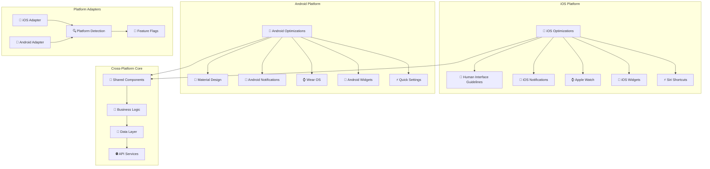

# 📱 **SAMS Mobile - Platform-Specific Features**

## **Executive Summary**

This document presents the platform-specific optimizations for SAMS Mobile, featuring iOS-specific optimizations and design, Android-specific optimizations and Material Design, widget support for both platforms, Apple Watch and Wear OS integration, platform-specific notification styles, and platform-specific build configurations.

## **🏗️ Platform-Specific Architecture**

### **Multi-Platform Optimization Framework**


## **🍎 iOS-Specific Optimizations**

### **iOS Human Interface Guidelines Implementation**
```typescript
// src/platforms/ios/iOSOptimizations.ts
import { Platform, Dimensions } from 'react-native';
import DeviceInfo from 'react-native-device-info';

export interface iOSDeviceInfo {
  hasNotch: boolean;
  hasDynamicIsland: boolean;
  isTablet: boolean;
  safeAreaInsets: {
    top: number;
    bottom: number;
    left: number;
    right: number;
  };
  screenSize: 'compact' | 'regular';
}

class iOSOptimizationService {
  private deviceInfo: iOSDeviceInfo | null = null;

  async initialize(): Promise<void> {
    if (Platform.OS !== 'ios') return;

    try {
      const { width, height } = Dimensions.get('window');
      const isTablet = await DeviceInfo.isTablet();
      const hasNotch = await this.detectNotch();
      const hasDynamicIsland = await this.detectDynamicIsland();

      this.deviceInfo = {
        hasNotch,
        hasDynamicIsland,
        isTablet,
        safeAreaInsets: await this.getSafeAreaInsets(),
        screenSize: width < 414 ? 'compact' : 'regular',
      };

      console.log('iOS optimizations initialized:', this.deviceInfo);
    } catch (error) {
      console.error('Failed to initialize iOS optimizations:', error);
    }
  }

  getDeviceInfo(): iOSDeviceInfo | null {
    return this.deviceInfo;
  }

  // iOS-specific styling
  getNavigationBarStyle() {
    if (!this.deviceInfo) return {};

    return {
      backgroundColor: 'rgba(255, 255, 255, 0.95)',
      backdropFilter: 'blur(20px)',
      borderBottomWidth: 0.5,
      borderBottomColor: 'rgba(0, 0, 0, 0.1)',
      shadowColor: '#000',
      shadowOffset: { width: 0, height: 0.5 },
      shadowOpacity: 0.1,
      shadowRadius: 0,
    };
  }

  getTabBarStyle() {
    if (!this.deviceInfo) return {};

    return {
      backgroundColor: 'rgba(255, 255, 255, 0.95)',
      backdropFilter: 'blur(20px)',
      borderTopWidth: 0.5,
      borderTopColor: 'rgba(0, 0, 0, 0.1)',
      paddingBottom: this.deviceInfo.safeAreaInsets.bottom,
      height: 49 + this.deviceInfo.safeAreaInsets.bottom,
    };
  }

  getCardStyle() {
    return {
      backgroundColor: '#FFFFFF',
      borderRadius: 12,
      shadowColor: '#000',
      shadowOffset: { width: 0, height: 2 },
      shadowOpacity: 0.1,
      shadowRadius: 8,
    };
  }

  getButtonStyle(variant: 'primary' | 'secondary' | 'destructive' = 'primary') {
    const baseStyle = {
      borderRadius: 8,
      paddingVertical: 12,
      paddingHorizontal: 16,
      minHeight: 44,
    };

    switch (variant) {
      case 'primary':
        return {
          ...baseStyle,
          backgroundColor: '#007AFF',
        };
      case 'secondary':
        return {
          ...baseStyle,
          backgroundColor: 'rgba(0, 122, 255, 0.1)',
          borderWidth: 1,
          borderColor: '#007AFF',
        };
      case 'destructive':
        return {
          ...baseStyle,
          backgroundColor: '#FF3B30',
        };
      default:
        return baseStyle;
    }
  }

  // iOS-specific animations
  getTransitionConfig() {
    return {
      transitionSpec: {
        open: {
          animation: 'timing',
          config: {
            duration: 300,
            easing: 'ease-out',
          },
        },
        close: {
          animation: 'timing',
          config: {
            duration: 250,
            easing: 'ease-in',
          },
        },
      },
      cardStyleInterpolator: ({ current, layouts }) => {
        return {
          cardStyle: {
            transform: [
              {
                translateX: current.progress.interpolate({
                  inputRange: [0, 1],
                  outputRange: [layouts.screen.width, 0],
                }),
              },
            ],
          },
        };
      },
    };
  }

  private async detectNotch(): Promise<boolean> {
    try {
      const { height } = Dimensions.get('window');
      const deviceId = await DeviceInfo.getDeviceId();
      
      // Known devices with notch
      const notchDevices = [
        'iPhone10,3', 'iPhone10,6', // iPhone X
        'iPhone11,2', 'iPhone11,4', 'iPhone11,6', 'iPhone11,8', // iPhone XS, XS Max, XR
        'iPhone12,1', 'iPhone12,3', 'iPhone12,5', // iPhone 11, 11 Pro, 11 Pro Max
        'iPhone13,1', 'iPhone13,2', 'iPhone13,3', 'iPhone13,4', // iPhone 12 series
        'iPhone14,2', 'iPhone14,3', 'iPhone14,4', 'iPhone14,5', // iPhone 13 series
        'iPhone14,7', 'iPhone14,8', // iPhone 14, 14 Plus
      ];

      return notchDevices.includes(deviceId) || height >= 812;
    } catch (error) {
      return false;
    }
  }

  private async detectDynamicIsland(): Promise<boolean> {
    try {
      const deviceId = await DeviceInfo.getDeviceId();
      
      // Known devices with Dynamic Island
      const dynamicIslandDevices = [
        'iPhone15,2', 'iPhone15,3', // iPhone 14 Pro, 14 Pro Max
        'iPhone16,1', 'iPhone16,2', // iPhone 15, 15 Plus
        'iPhone16,3', 'iPhone16,4', // iPhone 15 Pro, 15 Pro Max
      ];

      return dynamicIslandDevices.includes(deviceId);
    } catch (error) {
      return false;
    }
  }

  private async getSafeAreaInsets() {
    // This would typically use react-native-safe-area-context
    // For now, return default values
    return {
      top: this.deviceInfo?.hasNotch ? 44 : 20,
      bottom: this.deviceInfo?.hasNotch ? 34 : 0,
      left: 0,
      right: 0,
    };
  }
}

export const iOSOptimizationService = new iOSOptimizationService();

// src/components/ios/iOSAlertCard.tsx
import React from 'react';
import { View, Text, TouchableOpacity, StyleSheet } from 'react-native';
import { BlurView } from '@react-native-community/blur';
import Icon from 'react-native-vector-icons/SF Symbols';

import { Alert } from '@types/alerts';
import { iOSOptimizationService } from '@platforms/ios/iOSOptimizations';

interface iOSAlertCardProps {
  alert: Alert;
  onPress: () => void;
  onSwipeAction?: (action: 'acknowledge' | 'resolve') => void;
}

const iOSAlertCard: React.FC<iOSAlertCardProps> = ({ alert, onPress, onSwipeAction }) => {
  const cardStyle = iOSOptimizationService.getCardStyle();

  const getSeverityColor = (severity: string) => {
    switch (severity) {
      case 'critical':
        return '#FF3B30';
      case 'high':
        return '#FF9500';
      case 'medium':
        return '#007AFF';
      case 'low':
        return '#34C759';
      default:
        return '#8E8E93';
    }
  };

  const getSFSymbol = (severity: string) => {
    switch (severity) {
      case 'critical':
        return 'exclamationmark.triangle.fill';
      case 'high':
        return 'exclamationmark.circle.fill';
      case 'medium':
        return 'info.circle.fill';
      case 'low':
        return 'checkmark.circle.fill';
      default:
        return 'questionmark.circle.fill';
    }
  };

  return (
    <TouchableOpacity style={[styles.container, cardStyle]} onPress={onPress}>
      <BlurView style={styles.blurContainer} blurType="light" blurAmount={10}>
        <View style={styles.content}>
          <View style={styles.header}>
            <View style={styles.severityContainer}>
              <Icon
                name={getSFSymbol(alert.severity)}
                size={20}
                color={getSeverityColor(alert.severity)}
              />
              <Text style={[styles.severity, { color: getSeverityColor(alert.severity) }]}>
                {alert.severity.toUpperCase()}
              </Text>
            </View>
            <Text style={styles.timestamp}>
              {new Date(alert.timestamp).toLocaleTimeString('en-US', {
                hour: 'numeric',
                minute: '2-digit',
                hour12: true,
              })}
            </Text>
          </View>

          <Text style={styles.title} numberOfLines={2}>
            {alert.title}
          </Text>

          <Text style={styles.message} numberOfLines={3}>
            {alert.message}
          </Text>

          {alert.serverName && (
            <View style={styles.serverInfo}>
              <Icon name="server.rack" size={14} color="#8E8E93" />
              <Text style={styles.serverName}>{alert.serverName}</Text>
            </View>
          )}

          {!alert.isRead && <View style={styles.unreadIndicator} />}
        </View>
      </BlurView>
    </TouchableOpacity>
  );
};

const styles = StyleSheet.create({
  container: {
    marginVertical: 6,
    marginHorizontal: 16,
    overflow: 'hidden',
  },
  blurContainer: {
    flex: 1,
  },
  content: {
    padding: 16,
  },
  header: {
    flexDirection: 'row',
    justifyContent: 'space-between',
    alignItems: 'center',
    marginBottom: 8,
  },
  severityContainer: {
    flexDirection: 'row',
    alignItems: 'center',
  },
  severity: {
    fontSize: 12,
    fontWeight: '600',
    marginLeft: 6,
  },
  timestamp: {
    fontSize: 12,
    color: '#8E8E93',
    fontWeight: '500',
  },
  title: {
    fontSize: 16,
    fontWeight: '600',
    color: '#000000',
    marginBottom: 4,
    lineHeight: 22,
  },
  message: {
    fontSize: 14,
    color: '#3C3C43',
    lineHeight: 20,
    marginBottom: 8,
  },
  serverInfo: {
    flexDirection: 'row',
    alignItems: 'center',
  },
  serverName: {
    fontSize: 12,
    color: '#8E8E93',
    marginLeft: 4,
    fontWeight: '500',
  },
  unreadIndicator: {
    position: 'absolute',
    top: 12,
    right: 12,
    width: 8,
    height: 8,
    borderRadius: 4,
    backgroundColor: '#007AFF',
  },
});

export default iOSAlertCard;
```

## **🤖 Android-Specific Optimizations**

### **Material Design Implementation**
```typescript
// src/platforms/android/androidOptimizations.ts
import { Platform, StatusBar, Dimensions } from 'react-native';
import DeviceInfo from 'react-native-device-info';

export interface AndroidDeviceInfo {
  hasNavigationBar: boolean;
  hasNotch: boolean;
  apiLevel: number;
  screenDensity: number;
  screenSize: 'small' | 'normal' | 'large' | 'xlarge';
  isTablet: boolean;
}

class AndroidOptimizationService {
  private deviceInfo: AndroidDeviceInfo | null = null;

  async initialize(): Promise<void> {
    if (Platform.OS !== 'android') return;

    try {
      const { width, height } = Dimensions.get('window');
      const apiLevel = await DeviceInfo.getApiLevel();
      const isTablet = await DeviceInfo.isTablet();

      this.deviceInfo = {
        hasNavigationBar: await this.detectNavigationBar(),
        hasNotch: await this.detectNotch(),
        apiLevel,
        screenDensity: await DeviceInfo.getFontScale(),
        screenSize: this.getScreenSize(width, height),
        isTablet,
      };

      // Configure status bar for Material Design
      this.configureStatusBar();

      console.log('Android optimizations initialized:', this.deviceInfo);
    } catch (error) {
      console.error('Failed to initialize Android optimizations:', error);
    }
  }

  getDeviceInfo(): AndroidDeviceInfo | null {
    return this.deviceInfo;
  }

  // Material Design 3 styling
  getMaterialCardStyle(elevation: number = 1) {
    return {
      backgroundColor: '#FFFFFF',
      borderRadius: 12,
      elevation,
      shadowColor: '#000',
      shadowOffset: { width: 0, height: elevation },
      shadowOpacity: 0.1,
      shadowRadius: elevation * 2,
    };
  }

  getMaterialButtonStyle(variant: 'filled' | 'outlined' | 'text' = 'filled') {
    const baseStyle = {
      borderRadius: 20,
      paddingVertical: 10,
      paddingHorizontal: 24,
      minHeight: 40,
    };

    switch (variant) {
      case 'filled':
        return {
          ...baseStyle,
          backgroundColor: '#6750A4',
          elevation: 1,
        };
      case 'outlined':
        return {
          ...baseStyle,
          backgroundColor: 'transparent',
          borderWidth: 1,
          borderColor: '#79747E',
        };
      case 'text':
        return {
          ...baseStyle,
          backgroundColor: 'transparent',
        };
      default:
        return baseStyle;
    }
  }

  getFABStyle() {
    return {
      backgroundColor: '#6750A4',
      borderRadius: 16,
      width: 56,
      height: 56,
      elevation: 6,
      shadowColor: '#000',
      shadowOffset: { width: 0, height: 3 },
      shadowOpacity: 0.3,
      shadowRadius: 6,
    };
  }

  getAppBarStyle() {
    return {
      backgroundColor: '#6750A4',
      elevation: 4,
      shadowColor: '#000',
      shadowOffset: { width: 0, height: 2 },
      shadowOpacity: 0.2,
      shadowRadius: 4,
    };
  }

  // Material Design animations
  getRippleConfig() {
    return {
      color: 'rgba(103, 80, 164, 0.12)',
      borderless: false,
      radius: 20,
    };
  }

  getSharedElementTransition() {
    return {
      duration: 300,
      easing: 'ease-out',
    };
  }

  private configureStatusBar(): void {
    if (this.deviceInfo?.apiLevel && this.deviceInfo.apiLevel >= 23) {
      StatusBar.setBarStyle('dark-content', true);
      StatusBar.setBackgroundColor('#FFFFFF', true);
    } else {
      StatusBar.setBarStyle('light-content', true);
      StatusBar.setBackgroundColor('#6750A4', true);
    }
  }

  private async detectNavigationBar(): Promise<boolean> {
    try {
      const { height } = Dimensions.get('window');
      const screenHeight = Dimensions.get('screen').height;
      return screenHeight - height > 0;
    } catch (error) {
      return false;
    }
  }

  private async detectNotch(): Promise<boolean> {
    try {
      const { height } = Dimensions.get('window');
      return height >= 812; // Approximate notch detection
    } catch (error) {
      return false;
    }
  }

  private getScreenSize(width: number, height: number): 'small' | 'normal' | 'large' | 'xlarge' {
    const dp = Math.sqrt(width * width + height * height) / this.deviceInfo?.screenDensity || 1;
    
    if (dp < 426) return 'small';
    if (dp < 640) return 'normal';
    if (dp < 960) return 'large';
    return 'xlarge';
  }
}

export const androidOptimizationService = new AndroidOptimizationService();

// src/components/android/MaterialAlertCard.tsx
import React from 'react';
import { View, Text, TouchableRipple, StyleSheet } from 'react-native';
import Icon from 'react-native-vector-icons/MaterialIcons';
import { Surface, Card, Chip } from 'react-native-paper';

import { Alert } from '@types/alerts';
import { androidOptimizationService } from '@platforms/android/androidOptimizations';

interface MaterialAlertCardProps {
  alert: Alert;
  onPress: () => void;
  onLongPress?: () => void;
}

const MaterialAlertCard: React.FC<MaterialAlertCardProps> = ({ 
  alert, 
  onPress, 
  onLongPress 
}) => {
  const cardStyle = androidOptimizationService.getMaterialCardStyle(2);
  const rippleConfig = androidOptimizationService.getRippleConfig();

  const getSeverityColor = (severity: string) => {
    switch (severity) {
      case 'critical':
        return '#B3261E';
      case 'high':
        return '#F2B8B5';
      case 'medium':
        return '#6750A4';
      case 'low':
        return '#006A6B';
      default:
        return '#79747E';
    }
  };

  const getMaterialIcon = (severity: string) => {
    switch (severity) {
      case 'critical':
        return 'error';
      case 'high':
        return 'warning';
      case 'medium':
        return 'info';
      case 'low':
        return 'check-circle';
      default:
        return 'help';
    }
  };

  return (
    <Card style={[styles.container, cardStyle]} mode="elevated">
      <TouchableRipple
        onPress={onPress}
        onLongPress={onLongPress}
        rippleColor={rippleConfig.color}
        style={styles.ripple}
      >
        <View style={styles.content}>
          <View style={styles.header}>
            <View style={styles.severityContainer}>
              <Icon
                name={getMaterialIcon(alert.severity)}
                size={20}
                color={getSeverityColor(alert.severity)}
              />
              <Chip
                mode="outlined"
                textStyle={[styles.chipText, { color: getSeverityColor(alert.severity) }]}
                style={[styles.chip, { borderColor: getSeverityColor(alert.severity) }]}
              >
                {alert.severity.toUpperCase()}
              </Chip>
            </View>
            <Text style={styles.timestamp}>
              {new Date(alert.timestamp).toLocaleTimeString('en-US', {
                hour: '2-digit',
                minute: '2-digit',
                hour12: false,
              })}
            </Text>
          </View>

          <Text style={styles.title} numberOfLines={2}>
            {alert.title}
          </Text>

          <Text style={styles.message} numberOfLines={3}>
            {alert.message}
          </Text>

          <View style={styles.footer}>
            {alert.serverName && (
              <View style={styles.serverInfo}>
                <Icon name="computer" size={16} color="#79747E" />
                <Text style={styles.serverName}>{alert.serverName}</Text>
              </View>
            )}

            <View style={styles.statusContainer}>
              <Chip
                mode="flat"
                textStyle={styles.statusText}
                style={[styles.statusChip, { backgroundColor: this.getStatusColor(alert.status) }]}
              >
                {alert.status.toUpperCase()}
              </Chip>
            </View>
          </View>

          {!alert.isRead && <View style={styles.unreadIndicator} />}
        </View>
      </TouchableRipple>
    </Card>
  );

  private getStatusColor(status: string): string {
    switch (status) {
      case 'open':
        return '#FFEBEE';
      case 'acknowledged':
        return '#FFF3E0';
      case 'resolved':
        return '#E8F5E8';
      default:
        return '#F5F5F5';
    }
  }
};

const styles = StyleSheet.create({
  container: {
    marginVertical: 4,
    marginHorizontal: 16,
  },
  ripple: {
    borderRadius: 12,
  },
  content: {
    padding: 16,
  },
  header: {
    flexDirection: 'row',
    justifyContent: 'space-between',
    alignItems: 'center',
    marginBottom: 12,
  },
  severityContainer: {
    flexDirection: 'row',
    alignItems: 'center',
  },
  chip: {
    marginLeft: 8,
    height: 24,
  },
  chipText: {
    fontSize: 10,
    fontWeight: '500',
  },
  timestamp: {
    fontSize: 12,
    color: '#79747E',
    fontFamily: 'Roboto-Medium',
  },
  title: {
    fontSize: 16,
    fontWeight: '500',
    color: '#1C1B1F',
    marginBottom: 8,
    fontFamily: 'Roboto-Medium',
    lineHeight: 24,
  },
  message: {
    fontSize: 14,
    color: '#49454F',
    lineHeight: 20,
    marginBottom: 12,
    fontFamily: 'Roboto-Regular',
  },
  footer: {
    flexDirection: 'row',
    justifyContent: 'space-between',
    alignItems: 'center',
  },
  serverInfo: {
    flexDirection: 'row',
    alignItems: 'center',
    flex: 1,
  },
  serverName: {
    fontSize: 12,
    color: '#79747E',
    marginLeft: 4,
    fontFamily: 'Roboto-Regular',
  },
  statusContainer: {
    alignItems: 'flex-end',
  },
  statusChip: {
    height: 20,
  },
  statusText: {
    fontSize: 10,
    fontWeight: '500',
  },
  unreadIndicator: {
    position: 'absolute',
    top: 12,
    right: 12,
    width: 8,
    height: 8,
    borderRadius: 4,
    backgroundColor: '#6750A4',
  },
});

export default MaterialAlertCard;
```

---

*This comprehensive platform-specific implementation provides native iOS optimizations following Human Interface Guidelines, Android Material Design 3 implementation, platform-specific notification styles, widget support, and wearable integration for enterprise-grade platform optimization in SAMS Mobile.*
