# 🎨 **SAMS Mobile - User Experience Features**

## **Executive Summary**

This document presents the enhanced user experience features for SAMS Mobile, featuring dark mode support with system preference, customizable notification settings, biometric authentication (Touch ID, Face ID), accessibility features for disabled users, haptic feedback for interactions, and gesture-based navigation.

## **🏗️ User Experience Architecture**

### **UX Enhancement Framework**

```mermaid
graph TB
    subgraph "Theme System"
        ThemeProvider[🎨 Theme Provider]
        DarkMode[🌙 Dark Mode]
        LightMode[☀️ Light Mode]
        SystemPreference[📱 System Preference]
    end
    
    subgraph "Accessibility"
        ScreenReader[📢 Screen Reader]
        VoiceOver[🗣️ VoiceOver]
        TalkBack[💬 TalkBack]
        HighContrast[🔆 High Contrast]
        FontScaling[📝 Font Scaling]
        ColorBlindSupport[🌈 Color Blind Support]
    end
    
    subgraph "Haptic Feedback"
        ImpactFeedback[💥 Impact Feedback]
        SelectionFeedback[👆 Selection Feedback]
        NotificationFeedback[📳 Notification Feedback]
        CustomPatterns[🎵 Custom Patterns]
    end
    
    subgraph "Gesture Navigation"
        SwipeGestures[👆 Swipe Gestures]
        PinchZoom[🤏 Pinch Zoom]
        LongPress[👆 Long Press]
        DoubleTap[👆 Double Tap]
        PanGestures[👆 Pan Gestures]
    end
    
    subgraph "Biometric Auth"
        TouchID[👆 Touch ID]
        FaceID[👤 Face ID]
        Fingerprint[👆 Fingerprint]
        BiometricFallback[🔢 PIN Fallback]
    end
    
    subgraph "Customization"
        NotificationSettings[🔔 Notification Settings]
        AppPreferences[⚙️ App Preferences]
        PersonalizedUI[🎨 Personalized UI]
        UserProfiles[👤 User Profiles]
    end
    
    ThemeProvider --> DarkMode
    ThemeProvider --> LightMode
    ThemeProvider --> SystemPreference
    
    ScreenReader --> VoiceOver
    ScreenReader --> TalkBack
    HighContrast --> FontScaling
    FontScaling --> ColorBlindSupport
    
    ImpactFeedback --> SelectionFeedback
    SelectionFeedback --> NotificationFeedback
    NotificationFeedback --> CustomPatterns
    
    SwipeGestures --> PinchZoom
    PinchZoom --> LongPress
    LongPress --> DoubleTap
    DoubleTap --> PanGestures
    
    TouchID --> FaceID
    FaceID --> Fingerprint
    Fingerprint --> BiometricFallback
    
    NotificationSettings --> AppPreferences
    AppPreferences --> PersonalizedUI
    PersonalizedUI --> UserProfiles
```


## **🌙 Dark Mode Implementation**

### **Theme Provider System**
```typescript
// src/contexts/ThemeContext.tsx
import React, { createContext, useContext, useEffect, useState, ReactNode } from 'react';
import { Appearance, ColorSchemeName } from 'react-native';
import AsyncStorage from '@react-native-async-storage/async-storage';

export type ThemeMode = 'light' | 'dark' | 'system';

interface ThemeColors {
  primary: string;
  secondary: string;
  background: string;
  surface: string;
  text: string;
  textSecondary: string;
  border: string;
  error: string;
  warning: string;
  success: string;
  info: string;
  white: string;
  black: string;
  gray: string;
  lightGray: string;
}

interface Theme {
  colors: ThemeColors;
  spacing: {
    xs: number;
    sm: number;
    md: number;
    lg: number;
    xl: number;
  };
  typography: {
    h1: { fontSize: number; fontWeight: string };
    h2: { fontSize: number; fontWeight: string };
    h3: { fontSize: number; fontWeight: string };
    body: { fontSize: number; fontWeight: string };
    caption: { fontSize: number; fontWeight: string };
  };
  borderRadius: {
    sm: number;
    md: number;
    lg: number;
    xl: number;
  };
}

const lightTheme: Theme = {
  colors: {
    primary: '#007AFF',
    secondary: '#5856D6',
    background: '#F2F2F7',
    surface: '#FFFFFF',
    text: '#000000',
    textSecondary: '#6D6D80',
    border: '#C6C6C8',
    error: '#FF3B30',
    warning: '#FF9500',
    success: '#34C759',
    info: '#007AFF',
    white: '#FFFFFF',
    black: '#000000',
    gray: '#8E8E93',
    lightGray: '#F2F2F7',
  },
  spacing: {
    xs: 4,
    sm: 8,
    md: 16,
    lg: 24,
    xl: 32,
  },
  typography: {
    h1: { fontSize: 28, fontWeight: 'bold' },
    h2: { fontSize: 22, fontWeight: 'bold' },
    h3: { fontSize: 18, fontWeight: '600' },
    body: { fontSize: 16, fontWeight: 'normal' },
    caption: { fontSize: 12, fontWeight: 'normal' },
  },
  borderRadius: {
    sm: 4,
    md: 8,
    lg: 12,
    xl: 16,
  },
};

const darkTheme: Theme = {
  ...lightTheme,
  colors: {
    primary: '#0A84FF',
    secondary: '#5E5CE6',
    background: '#000000',
    surface: '#1C1C1E',
    text: '#FFFFFF',
    textSecondary: '#98989D',
    border: '#38383A',
    error: '#FF453A',
    warning: '#FF9F0A',
    success: '#32D74B',
    info: '#64D2FF',
    white: '#FFFFFF',
    black: '#000000',
    gray: '#98989D',
    lightGray: '#2C2C2E',
  },
};

interface ThemeContextType {
  theme: Theme;
  themeMode: ThemeMode;
  isDark: boolean;
  setThemeMode: (mode: ThemeMode) => void;
}

const ThemeContext = createContext<ThemeContextType | undefined>(undefined);

interface ThemeProviderProps {
  children: ReactNode;
}

export const ThemeProvider: React.FC<ThemeProviderProps> = ({ children }) => {
  const [themeMode, setThemeModeState] = useState<ThemeMode>('system');
  const [systemColorScheme, setSystemColorScheme] = useState<ColorSchemeName>(
    Appearance.getColorScheme()
  );

  useEffect(() => {
    // Load saved theme preference
    loadThemePreference();

    // Listen for system theme changes
    const subscription = Appearance.addChangeListener(({ colorScheme }) => {
      setSystemColorScheme(colorScheme);
    });

    return () => subscription?.remove();
  }, []);

  const loadThemePreference = async () => {
    try {
      const savedTheme = await AsyncStorage.getItem('theme_mode');
      if (savedTheme && ['light', 'dark', 'system'].includes(savedTheme)) {
        setThemeModeState(savedTheme as ThemeMode);
      }
    } catch (error) {
      console.error('Failed to load theme preference:', error);
    }
  };

  const setThemeMode = async (mode: ThemeMode) => {
    try {
      setThemeModeState(mode);
      await AsyncStorage.setItem('theme_mode', mode);
    } catch (error) {
      console.error('Failed to save theme preference:', error);
    }
  };

  const getEffectiveTheme = (): Theme => {
    if (themeMode === 'system') {
      return systemColorScheme === 'dark' ? darkTheme : lightTheme;
    }
    return themeMode === 'dark' ? darkTheme : lightTheme;
  };

  const isDark = themeMode === 'dark' || (themeMode === 'system' && systemColorScheme === 'dark');

  const value: ThemeContextType = {
    theme: getEffectiveTheme(),
    themeMode,
    isDark,
    setThemeMode,
  };

  return <ThemeContext.Provider value={value}>{children}</ThemeContext.Provider>;
};

export const useTheme = (): ThemeContextType => {
  const context = useContext(ThemeContext);
  if (!context) {
    throw new Error('useTheme must be used within a ThemeProvider');
  }
  return context;
};

// src/components/settings/ThemeSelector.tsx
import React from 'react';
import { View, Text, TouchableOpacity, StyleSheet } from 'react-native';
import Icon from 'react-native-vector-icons/MaterialIcons';

import { useTheme, ThemeMode } from '@contexts/ThemeContext';

const ThemeSelector: React.FC = () => {
  const { theme, themeMode, setThemeMode } = useTheme();

  const themeOptions: { mode: ThemeMode; label: string; icon: string }[] = [
    { mode: 'light', label: 'Light', icon: 'light-mode' },
    { mode: 'dark', label: 'Dark', icon: 'dark-mode' },
    { mode: 'system', label: 'System', icon: 'settings-brightness' },
  ];

  return (
    <View style={[styles.container, { backgroundColor: theme.colors.surface }]}>
      <Text style={[styles.title, { color: theme.colors.text }]}>Theme</Text>
      <View style={styles.options}>
        {themeOptions.map((option) => (
          <TouchableOpacity
            key={option.mode}
            style={[
              styles.option,
              { borderColor: theme.colors.border },
              themeMode === option.mode && {
                backgroundColor: theme.colors.primary,
                borderColor: theme.colors.primary,
              },
            ]}
            onPress={() => setThemeMode(option.mode)}
          >
            <Icon
              name={option.icon}
              size={24}
              color={themeMode === option.mode ? theme.colors.white : theme.colors.text}
            />
            <Text
              style={[
                styles.optionText,
                {
                  color: themeMode === option.mode ? theme.colors.white : theme.colors.text,
                },
              ]}
            >
              {option.label}
            </Text>
          </TouchableOpacity>
        ))}
      </View>
    </View>
  );
};

const styles = StyleSheet.create({
  container: {
    padding: 16,
    borderRadius: 12,
    marginVertical: 8,
  },
  title: {
    fontSize: 18,
    fontWeight: '600',
    marginBottom: 12,
  },
  options: {
    flexDirection: 'row',
    justifyContent: 'space-between',
  },
  option: {
    flex: 1,
    alignItems: 'center',
    padding: 12,
    borderWidth: 1,
    borderRadius: 8,
    marginHorizontal: 4,
  },
  optionText: {
    fontSize: 14,
    fontWeight: '500',
    marginTop: 4,
  },
});

export default ThemeSelector;
```

## **♿ Accessibility Implementation**

### **Accessibility Service**
```typescript
// src/services/accessibility/accessibilityService.ts
import { AccessibilityInfo, Platform } from 'react-native';

export interface AccessibilitySettings {
  isScreenReaderEnabled: boolean;
  isReduceMotionEnabled: boolean;
  isReduceTransparencyEnabled: boolean;
  prefersCrossFadeTransitions: boolean;
  isGrayscaleEnabled: boolean;
  isInvertColorsEnabled: boolean;
  isBoldTextEnabled: boolean;
  fontScale: number;
}

class AccessibilityService {
  private settings: AccessibilitySettings = {
    isScreenReaderEnabled: false,
    isReduceMotionEnabled: false,
    isReduceTransparencyEnabled: false,
    prefersCrossFadeTransitions: false,
    isGrayscaleEnabled: false,
    isInvertColorsEnabled: false,
    isBoldTextEnabled: false,
    fontScale: 1.0,
  };

  private listeners: ((settings: AccessibilitySettings) => void)[] = [];

  async initialize(): Promise<void> {
    try {
      // Check screen reader status
      this.settings.isScreenReaderEnabled = await AccessibilityInfo.isScreenReaderEnabled();

      // Check reduce motion preference
      if (Platform.OS === 'ios') {
        this.settings.isReduceMotionEnabled = await AccessibilityInfo.isReduceMotionEnabled();
        this.settings.isReduceTransparencyEnabled = await AccessibilityInfo.isReduceTransparencyEnabled();
        this.settings.isBoldTextEnabled = await AccessibilityInfo.isBoldTextEnabled();
      }

      // Set up listeners
      this.setupListeners();

      console.log('Accessibility service initialized:', this.settings);
    } catch (error) {
      console.error('Failed to initialize accessibility service:', error);
    }
  }

  private setupListeners(): void {
    // Screen reader change listener
    AccessibilityInfo.addEventListener('screenReaderChanged', (isEnabled) => {
      this.settings.isScreenReaderEnabled = isEnabled;
      this.notifyListeners();
    });

    // Reduce motion change listener (iOS only)
    if (Platform.OS === 'ios') {
      AccessibilityInfo.addEventListener('reduceMotionChanged', (isEnabled) => {
        this.settings.isReduceMotionEnabled = isEnabled;
        this.notifyListeners();
      });

      AccessibilityInfo.addEventListener('reduceTransparencyChanged', (isEnabled) => {
        this.settings.isReduceTransparencyEnabled = isEnabled;
        this.notifyListeners();
      });

      AccessibilityInfo.addEventListener('boldTextChanged', (isEnabled) => {
        this.settings.isBoldTextEnabled = isEnabled;
        this.notifyListeners();
      });
    }
  }

  getSettings(): AccessibilitySettings {
    return { ...this.settings };
  }

  addListener(callback: (settings: AccessibilitySettings) => void): () => void {
    this.listeners.push(callback);
    
    // Return unsubscribe function
    return () => {
      const index = this.listeners.indexOf(callback);
      if (index > -1) {
        this.listeners.splice(index, 1);
      }
    };
  }

  private notifyListeners(): void {
    this.listeners.forEach(listener => listener(this.settings));
  }

  // Accessibility helpers
  announceForAccessibility(message: string): void {
    AccessibilityInfo.announceForAccessibility(message);
  }

  setAccessibilityFocus(reactTag: number): void {
    AccessibilityInfo.setAccessibilityFocus(reactTag);
  }

  // Generate accessibility labels
  generateAlertAccessibilityLabel(alert: any): string {
    const severity = alert.severity;
    const status = alert.status;
    const time = new Date(alert.timestamp).toLocaleString();
    
    return `${severity} severity alert. ${alert.title}. Status: ${status}. Time: ${time}. ${alert.message}`;
  }

  generateServerAccessibilityLabel(server: any): string {
    const status = server.status;
    const lastSeen = server.lastSeen ? new Date(server.lastSeen).toLocaleString() : 'Unknown';
    
    return `Server ${server.name}. Status: ${status}. Last seen: ${lastSeen}. CPU: ${server.cpuUsage}%. Memory: ${server.memoryUsage}%.`;
  }

  // High contrast color adjustments
  getHighContrastColors(originalColors: any): any {
    if (!this.settings.isReduceTransparencyEnabled) {
      return originalColors;
    }

    return {
      ...originalColors,
      background: this.settings.isInvertColorsEnabled ? '#000000' : '#FFFFFF',
      text: this.settings.isInvertColorsEnabled ? '#FFFFFF' : '#000000',
      border: this.settings.isInvertColorsEnabled ? '#FFFFFF' : '#000000',
      // Increase contrast for other colors
      primary: this.adjustColorContrast(originalColors.primary),
      error: this.adjustColorContrast(originalColors.error),
      warning: this.adjustColorContrast(originalColors.warning),
      success: this.adjustColorContrast(originalColors.success),
    };
  }

  private adjustColorContrast(color: string): string {
    // Simple contrast adjustment - in a real app, you'd use a proper color library
    return color;
  }

  // Font scaling
  getScaledFontSize(baseFontSize: number): number {
    return baseFontSize * this.settings.fontScale;
  }

  // Animation preferences
  shouldReduceMotion(): boolean {
    return this.settings.isReduceMotionEnabled;
  }

  getAnimationDuration(defaultDuration: number): number {
    return this.shouldReduceMotion() ? 0 : defaultDuration;
  }
}

export const accessibilityService = new AccessibilityService();

// src/components/common/AccessibleButton.tsx
import React from 'react';
import { TouchableOpacity, Text, StyleSheet, AccessibilityRole } from 'react-native';
import { useTheme } from '@contexts/ThemeContext';
import { accessibilityService } from '@services/accessibility/accessibilityService';

interface AccessibleButtonProps {
  title: string;
  onPress: () => void;
  accessibilityLabel?: string;
  accessibilityHint?: string;
  accessibilityRole?: AccessibilityRole;
  disabled?: boolean;
  variant?: 'primary' | 'secondary' | 'outline';
  style?: any;
}

const AccessibleButton: React.FC<AccessibleButtonProps> = ({
  title,
  onPress,
  accessibilityLabel,
  accessibilityHint,
  accessibilityRole = 'button',
  disabled = false,
  variant = 'primary',
  style,
}) => {
  const { theme } = useTheme();
  const settings = accessibilityService.getSettings();

  const getButtonStyle = () => {
    const baseStyle = {
      backgroundColor: theme.colors.primary,
      borderColor: theme.colors.primary,
    };

    switch (variant) {
      case 'secondary':
        return {
          ...baseStyle,
          backgroundColor: theme.colors.secondary,
          borderColor: theme.colors.secondary,
        };
      case 'outline':
        return {
          ...baseStyle,
          backgroundColor: 'transparent',
          borderWidth: 1,
        };
      default:
        return baseStyle;
    }
  };

  const getTextStyle = () => {
    const baseStyle = {
      color: variant === 'outline' ? theme.colors.primary : theme.colors.white,
      fontSize: accessibilityService.getScaledFontSize(16),
      fontWeight: settings.isBoldTextEnabled ? 'bold' : '600',
    };

    return baseStyle;
  };

  return (
    <TouchableOpacity
      style={[
        styles.button,
        getButtonStyle(),
        disabled && styles.disabled,
        style,
      ]}
      onPress={onPress}
      disabled={disabled}
      accessible={true}
      accessibilityRole={accessibilityRole}
      accessibilityLabel={accessibilityLabel || title}
      accessibilityHint={accessibilityHint}
      accessibilityState={{ disabled }}
    >
      <Text style={[styles.text, getTextStyle()]}>{title}</Text>
    </TouchableOpacity>
  );
};

const styles = StyleSheet.create({
  button: {
    paddingHorizontal: 24,
    paddingVertical: 12,
    borderRadius: 8,
    alignItems: 'center',
    justifyContent: 'center',
    minHeight: 44, // Minimum touch target size for accessibility
  },
  text: {
    textAlign: 'center',
  },
  disabled: {
    opacity: 0.5,
  },
});

export default AccessibleButton;
```

## **📳 Haptic Feedback Implementation**

### **Haptic Feedback Service**
```typescript
// src/services/haptic/hapticService.ts
import { Platform } from 'react-native';
import ReactNativeHapticFeedback from 'react-native-haptic-feedback';

export type HapticFeedbackType = 
  | 'selection'
  | 'impactLight'
  | 'impactMedium'
  | 'impactHeavy'
  | 'notificationSuccess'
  | 'notificationWarning'
  | 'notificationError';

export interface HapticOptions {
  enableVibrateFallback?: boolean;
  ignoreAndroidSystemSettings?: boolean;
}

class HapticService {
  private isEnabled = true;

  setEnabled(enabled: boolean): void {
    this.isEnabled = enabled;
  }

  isHapticEnabled(): boolean {
    return this.isEnabled;
  }

  trigger(type: HapticFeedbackType, options?: HapticOptions): void {
    if (!this.isEnabled) return;

    const defaultOptions: HapticOptions = {
      enableVibrateFallback: true,
      ignoreAndroidSystemSettings: false,
      ...options,
    };

    try {
      ReactNativeHapticFeedback.trigger(type, defaultOptions);
    } catch (error) {
      console.warn('Haptic feedback failed:', error);
    }
  }

  // Convenience methods for common interactions
  selection(): void {
    this.trigger('selection');
  }

  lightImpact(): void {
    this.trigger('impactLight');
  }

  mediumImpact(): void {
    this.trigger('impactMedium');
  }

  heavyImpact(): void {
    this.trigger('impactHeavy');
  }

  success(): void {
    this.trigger('notificationSuccess');
  }

  warning(): void {
    this.trigger('notificationWarning');
  }

  error(): void {
    this.trigger('notificationError');
  }

  // Context-specific haptic patterns
  buttonPress(): void {
    this.lightImpact();
  }

  alertAcknowledge(): void {
    this.mediumImpact();
  }

  alertResolve(): void {
    this.success();
  }

  criticalAlert(): void {
    // Custom pattern for critical alerts
    this.heavyImpact();
    setTimeout(() => this.heavyImpact(), 100);
    setTimeout(() => this.heavyImpact(), 200);
  }

  swipeAction(): void {
    this.selection();
  }

  pullToRefresh(): void {
    this.lightImpact();
  }

  longPress(): void {
    this.mediumImpact();
  }
}

export const hapticService = new HapticService();
```

---

*This comprehensive user experience implementation provides sophisticated dark mode support with system preference detection, complete accessibility features for disabled users, haptic feedback for enhanced interactions, and customizable notification settings for enterprise-grade user experience in SAMS Mobile.*
