# 📱 **SAMS Mobile - App Store Preparation**

## **Executive Summary**

This document presents the comprehensive app store preparation for SAMS Mobile, featuring app store listing optimization, screenshots and marketing materials generation, app store review materials preparation, beta testing setup with TestFlight and Google Play Console, app store metadata and descriptions creation, and privacy policy and terms of service generation.

## **🏗️ App Store Preparation Framework**

### **Multi-Platform Store Preparation**

```mermaid
graph TB
    subgraph "iOS App Store"
        AppStoreConnect[🍎 App Store Connect]
        TestFlight[✈️ TestFlight]
        iOSReview[📋 iOS Review]
        iOSMetadata[📝 iOS Metadata]
        iOSScreenshots[📸 iOS Screenshots]
    end
    
    subgraph "Google Play Store"
        PlayConsole[🤖 Play Console]
        InternalTesting[🧪 Internal Testing]
        AndroidReview[📋 Android Review]
        AndroidMetadata[📝 Android Metadata]
        AndroidScreenshots[📸 Android Screenshots]
    end
    
    subgraph "Marketing Materials"
        AppIcon[🎨 App Icon]
        FeatureGraphic[🖼️ Feature Graphic]
        PromotionalVideo[🎥 Promotional Video]
        MarketingCopy[📝 Marketing Copy]
        Keywords[🔍 Keywords]
    end
    
    subgraph "Legal Documents"
        PrivacyPolicy[🔒 Privacy Policy]
        TermsOfService[📄 Terms of Service]
        DataSafety[🛡️ Data Safety]
        Permissions[🔐 Permissions]
    end
    
    subgraph "Beta Testing"
        BetaUsers[👥 Beta Users]
        FeedbackCollection[📝 Feedback Collection]
        CrashReporting[💥 Crash Reporting]
        PerformanceMonitoring[📊 Performance Monitoring]
    end
    
    subgraph "Review Process"
        ReviewGuidelines[📋 Review Guidelines]
        RejectionHandling[❌ Rejection Handling]
        AppealProcess[⚖️ Appeal Process]
        ComplianceCheck[✅ Compliance Check]
    end
    
    AppStoreConnect --> TestFlight
    TestFlight --> iOSReview
    iOSReview --> iOSMetadata
    iOSMetadata --> iOSScreenshots
    
    PlayConsole --> InternalTesting
    InternalTesting --> AndroidReview
    AndroidReview --> AndroidMetadata
    AndroidMetadata --> AndroidScreenshots
    
    AppIcon --> FeatureGraphic
    FeatureGraphic --> PromotionalVideo
    PromotionalVideo --> MarketingCopy
    MarketingCopy --> Keywords
    
    PrivacyPolicy --> TermsOfService
    TermsOfService --> DataSafety
    DataSafety --> Permissions
    
    BetaUsers --> FeedbackCollection
    FeedbackCollection --> CrashReporting
    CrashReporting --> PerformanceMonitoring
    
    ReviewGuidelines --> RejectionHandling
    RejectionHandling --> AppealProcess
    AppealProcess --> ComplianceCheck
```


## **📱 App Store Metadata & Descriptions**

### **iOS App Store Metadata**
```yaml
# ios_app_store_metadata.yaml
app_name: "SAMS Mobile"
subtitle: "Enterprise Server Monitoring"
promotional_text: "Monitor your infrastructure with real-time alerts and comprehensive analytics"

description: |
  SAMS Mobile is the premier enterprise-grade server and infrastructure monitoring solution designed for DevOps engineers, system administrators, and IT professionals who demand real-time visibility into their critical systems.

  🚀 KEY FEATURES:
  • Real-time server monitoring with instant alerts
  • Comprehensive dashboard with key performance metrics
  • Multi-platform support (Linux, Windows, macOS, Docker)
  • Advanced alert management with smart filtering
  • Secure biometric authentication (Touch ID, Face ID)
  • Offline functionality with intelligent sync
  • Push notifications for critical alerts
  • Voice-to-text for quick responses
  • Dark mode support with system preference
  • Enterprise-grade security and encryption

  📊 MONITORING CAPABILITIES:
  • CPU, Memory, Disk, and Network monitoring
  • Application performance metrics
  • Database monitoring and optimization
  • Cloud platform integration (AWS, Azure, GCP)
  • Custom metrics and alerting rules
  • Historical data analysis and trends

  🔔 SMART ALERTING:
  • Intelligent alert correlation and deduplication
  • Customizable notification preferences
  • Alert snooze and remind functionality
  • Priority-based alert routing
  • Integration with Slack, Teams, email, and SMS

  🛡️ ENTERPRISE SECURITY:
  • Multi-factor authentication (MFA)
  • End-to-end encryption
  • Role-based access control (RBAC)
  • Secure API key management
  • Compliance with SOC 2 and ISO 27001

  🎯 PERFECT FOR:
  • DevOps teams managing cloud infrastructure
  • System administrators monitoring on-premises servers
  • IT managers requiring executive dashboards
  • Organizations with compliance requirements
  • Teams needing 24/7 monitoring capabilities

  Download SAMS Mobile today and transform how you monitor your infrastructure!

keywords:
  - server monitoring
  - infrastructure monitoring
  - devops
  - system administration
  - alerts
  - dashboard
  - performance monitoring
  - cloud monitoring
  - enterprise monitoring
  - real-time monitoring

categories:
  primary: "Business"
  secondary: "Productivity"

age_rating: "4+"

support_url: "https://sams.example.com/support"
marketing_url: "https://sams.example.com"
privacy_policy_url: "https://sams.example.com/privacy"

# Version Information
version: "1.0.0"
build_number: "1"
whats_new: |
  🎉 Welcome to SAMS Mobile v1.0!

  This is the initial release of our enterprise-grade server monitoring solution:

  ✨ NEW FEATURES:
  • Complete server monitoring dashboard
  • Real-time alert management
  • Biometric authentication support
  • Push notifications for critical alerts
  • Offline functionality with sync
  • Dark mode support
  • Voice-to-text responses
  • Advanced filtering and search

  🔧 TECHNICAL HIGHLIGHTS:
  • Cross-platform monitoring agents
  • Cloud platform integrations
  • Enterprise security features
  • Comprehensive API documentation
  • High-performance architecture

  📱 MOBILE OPTIMIZATIONS:
  • Native iOS design following Human Interface Guidelines
  • Optimized for all iPhone and iPad models
  • Apple Watch companion app
  • Siri Shortcuts integration
  • Widget support

  Get started with SAMS Mobile and experience the future of infrastructure monitoring!

# App Review Information
review_notes: |
  SAMS Mobile is an enterprise server monitoring application that helps IT professionals monitor their infrastructure in real-time.

  KEY POINTS FOR REVIEW:
  • This is a legitimate business application for IT professionals
  • All network requests are for monitoring legitimate server infrastructure
  • Biometric authentication is used only for app security
  • Push notifications are for critical system alerts only
  • No user-generated content or social features
  • Complies with enterprise security standards

  TEST CREDENTIALS:
  • Demo server available at demo.sams.example.com
  • Test account: reviewer@sams.example.com / ReviewPass123!
  • Demo mode available without server connection

  SPECIAL FEATURES TO TEST:
  • Biometric authentication (if available on device)
  • Push notification handling
  • Offline functionality
  • Dark mode support
  • Voice-to-text features

contact_info:
  first_name: "John"
  last_name: "Smith"
  phone: "+1-555-0123"
  email: "appstore@sams.example.com"
```

### **Android Play Store Metadata**
```yaml
# android_play_store_metadata.yaml
app_name: "SAMS Mobile"
short_description: "Enterprise server monitoring with real-time alerts and comprehensive analytics"

full_description: |
  SAMS Mobile brings enterprise-grade server and infrastructure monitoring to your Android device. Designed for DevOps engineers, system administrators, and IT professionals who need real-time visibility into their critical systems.

  🚀 POWERFUL MONITORING FEATURES
  • Real-time server monitoring with instant alerts
  • Comprehensive dashboard with performance metrics
  • Multi-platform support (Linux, Windows, macOS, Docker)
  • Advanced alert management with intelligent filtering
  • Secure fingerprint and face unlock authentication
  • Offline functionality with smart synchronization
  • Push notifications for critical system alerts
  • Voice-to-text for quick alert responses
  • Material Design 3 with dynamic theming
  • Enterprise-grade security and encryption

  📊 COMPREHENSIVE MONITORING
  Monitor everything that matters:
  • CPU, Memory, Disk, and Network utilization
  • Application performance and health
  • Database monitoring and optimization
  • Cloud platform integration (AWS, Azure, Google Cloud)
  • Custom metrics and alerting rules
  • Historical data analysis and trending

  🔔 INTELLIGENT ALERTING
  • Smart alert correlation and deduplication
  • Customizable notification preferences
  • Alert snooze and remind functionality
  • Priority-based alert routing and escalation
  • Integration with Slack, Microsoft Teams, email, and SMS
  • Voice alerts for critical situations

  🛡️ ENTERPRISE SECURITY
  • Multi-factor authentication (MFA) support
  • End-to-end encryption for all data
  • Role-based access control (RBAC)
  • Secure API key management
  • Compliance with SOC 2 and ISO 27001 standards
  • IP whitelisting and access controls

  🎯 IDEAL FOR
  • DevOps teams managing cloud infrastructure
  • System administrators monitoring servers
  • IT managers requiring executive dashboards
  • Organizations with strict compliance requirements
  • Teams needing 24/7 monitoring capabilities
  • MSPs managing multiple client environments

  📱 ANDROID OPTIMIZATIONS
  • Material Design 3 with dynamic colors
  • Android 13+ themed app icons
  • Wear OS companion app
  • Quick Settings tiles
  • Android Auto integration
  • Adaptive notifications

  Transform your infrastructure monitoring experience with SAMS Mobile!

category: "BUSINESS"
content_rating: "Everyone"

tags:
  - server monitoring
  - infrastructure
  - devops
  - system admin
  - alerts
  - dashboard
  - performance
  - cloud monitoring
  - enterprise
  - real-time

# Version Information
version_name: "1.0.0"
version_code: 1
release_notes: |
  🎉 SAMS Mobile v1.0 - Initial Release

  Welcome to the future of mobile infrastructure monitoring!

  ✨ LAUNCH FEATURES:
  • Complete server monitoring dashboard
  • Real-time alert management system
  • Biometric authentication (fingerprint/face)
  • Push notifications for critical alerts
  • Offline mode with intelligent sync
  • Material Design 3 with dynamic theming
  • Voice-to-text for quick responses
  • Advanced filtering and search capabilities

  🔧 TECHNICAL FEATURES:
  • Cross-platform monitoring agents
  • Multi-cloud platform integrations
  • Enterprise-grade security features
  • Comprehensive REST API
  • High-performance architecture
  • Battery-optimized background processing

  📱 ANDROID FEATURES:
  • Material Design 3 implementation
  • Dynamic color theming (Android 12+)
  • Wear OS companion app
  • Quick Settings integration
  • Adaptive notifications
  • Android Auto support

  🚀 GET STARTED:
  • Download and install the app
  • Connect to your SAMS server
  • Configure your monitoring preferences
  • Start monitoring your infrastructure!

  Experience enterprise-grade monitoring on your Android device!

# Data Safety
data_safety:
  data_collected:
    - type: "Personal info"
      details: "Email address, name"
      purpose: "Account functionality"
      shared: false
    - type: "App activity"
      details: "App interactions, in-app search history"
      purpose: "Analytics, app functionality"
      shared: false
    - type: "Device or other IDs"
      details: "Device ID"
      purpose: "Analytics, app functionality"
      shared: false

  security_practices:
    - "Data is encrypted in transit"
    - "Data is encrypted at rest"
    - "You can request that data be deleted"
    - "Committed to follow the Play Families Policy"

# Contact Information
developer_name: "SAMS Technologies Inc."
developer_email: "support@sams.example.com"
developer_website: "https://sams.example.com"
privacy_policy_url: "https://sams.example.com/privacy"
```

## **📸 Screenshots & Marketing Materials**

### **Screenshot Generation Script**
```typescript
// scripts/generateScreenshots.ts
import { execSync } from 'child_process';
import { promises as fs } from 'fs';
import path from 'path';

interface ScreenshotConfig {
  platform: 'ios' | 'android';
  device: string;
  orientation: 'portrait' | 'landscape';
  screens: string[];
  outputDir: string;
}

const screenshotConfigs: ScreenshotConfig[] = [
  // iOS Screenshots
  {
    platform: 'ios',
    device: 'iPhone 15 Pro',
    orientation: 'portrait',
    screens: [
      'dashboard',
      'alerts-list',
      'alert-details',
      'servers-list',
      'server-details',
      'settings',
    ],
    outputDir: 'marketing/screenshots/ios/iphone',
  },
  {
    platform: 'ios',
    device: 'iPad Pro (12.9-inch)',
    orientation: 'portrait',
    screens: [
      'dashboard',
      'alerts-list',
      'servers-list',
      'settings',
    ],
    outputDir: 'marketing/screenshots/ios/ipad',
  },
  // Android Screenshots
  {
    platform: 'android',
    device: 'Pixel 8 Pro',
    orientation: 'portrait',
    screens: [
      'dashboard',
      'alerts-list',
      'alert-details',
      'servers-list',
      'server-details',
      'settings',
    ],
    outputDir: 'marketing/screenshots/android/phone',
  },
  {
    platform: 'android',
    device: 'Pixel Tablet',
    orientation: 'portrait',
    screens: [
      'dashboard',
      'alerts-list',
      'servers-list',
      'settings',
    ],
    outputDir: 'marketing/screenshots/android/tablet',
  },
];

async function generateScreenshots() {
  console.log('🚀 Starting screenshot generation...');

  for (const config of screenshotConfigs) {
    console.log(`📱 Generating ${config.platform} screenshots for ${config.device}...`);

    // Ensure output directory exists
    await fs.mkdir(config.outputDir, { recursive: true });

    for (const screen of config.screens) {
      try {
        console.log(`  📸 Capturing ${screen}...`);

        if (config.platform === 'ios') {
          await captureIOSScreenshot(config, screen);
        } else {
          await captureAndroidScreenshot(config, screen);
        }

        console.log(`  ✅ ${screen} captured successfully`);
      } catch (error) {
        console.error(`  ❌ Failed to capture ${screen}:`, error);
      }
    }
  }

  console.log('🎉 Screenshot generation completed!');
}

async function captureIOSScreenshot(config: ScreenshotConfig, screen: string) {
  const outputPath = path.join(config.outputDir, `${screen}.png`);
  
  // Use Detox or Maestro for screenshot capture
  const command = `detox test --configuration ios.sim.release --take-screenshots --screenshot-path ${outputPath} --grep "${screen}"`;
  
  execSync(command, { stdio: 'inherit' });
}

async function captureAndroidScreenshot(config: ScreenshotConfig, screen: string) {
  const outputPath = path.join(config.outputDir, `${screen}.png`);
  
  // Use Detox or Maestro for screenshot capture
  const command = `detox test --configuration android.emu.release --take-screenshots --screenshot-path ${outputPath} --grep "${screen}"`;
  
  execSync(command, { stdio: 'inherit' });
}

// Marketing copy generation
const marketingCopy = {
  taglines: [
    "Monitor Everything. Miss Nothing.",
    "Enterprise Monitoring in Your Pocket",
    "Real-Time Infrastructure Insights",
    "Your Servers, Always in Sight",
    "Professional Monitoring Made Mobile",
  ],
  
  features: [
    {
      title: "Real-Time Monitoring",
      description: "Get instant insights into your server performance with live metrics and alerts.",
      icon: "📊",
    },
    {
      title: "Smart Alerts",
      description: "Intelligent alert correlation ensures you only get notified about what matters.",
      icon: "🚨",
    },
    {
      title: "Secure Access",
      description: "Enterprise-grade security with biometric authentication and encryption.",
      icon: "🔒",
    },
    {
      title: "Offline Ready",
      description: "Continue monitoring even when offline with intelligent sync capabilities.",
      icon: "📱",
    },
    {
      title: "Multi-Platform",
      description: "Monitor Linux, Windows, macOS, and Docker containers from one app.",
      icon: "🖥️",
    },
    {
      title: "Cloud Integration",
      description: "Seamlessly integrate with AWS, Azure, and Google Cloud platforms.",
      icon: "☁️",
    },
  ],
  
  screenshots: {
    ios: [
      {
        filename: "dashboard.png",
        title: "Comprehensive Dashboard",
        description: "Get a complete overview of your infrastructure health at a glance.",
      },
      {
        filename: "alerts-list.png",
        title: "Smart Alert Management",
        description: "Manage alerts efficiently with advanced filtering and prioritization.",
      },
      {
        filename: "alert-details.png",
        title: "Detailed Alert Information",
        description: "Get complete context for every alert with rich metadata and history.",
      },
      {
        filename: "servers-list.png",
        title: "Server Overview",
        description: "Monitor all your servers with real-time status and performance metrics.",
      },
      {
        filename: "server-details.png",
        title: "Deep Server Insights",
        description: "Dive deep into individual server performance with detailed analytics.",
      },
    ],
    android: [
      {
        filename: "dashboard.png",
        title: "Material Design Dashboard",
        description: "Beautiful Material Design 3 interface with dynamic theming support.",
      },
      {
        filename: "alerts-list.png",
        title: "Intelligent Alerts",
        description: "Smart alert management with Material Design components and animations.",
      },
      {
        filename: "alert-details.png",
        title: "Rich Alert Details",
        description: "Comprehensive alert information with Material Design cards and typography.",
      },
      {
        filename: "servers-list.png",
        title: "Server Management",
        description: "Elegant server overview with floating action buttons and smooth animations.",
      },
      {
        filename: "server-details.png",
        title: "Performance Analytics",
        description: "Detailed server metrics with Material Design charts and visualizations.",
      },
    ],
  },
};

// Export marketing copy
async function generateMarketingCopy() {
  const marketingDir = 'marketing/copy';
  await fs.mkdir(marketingDir, { recursive: true });
  
  await fs.writeFile(
    path.join(marketingDir, 'marketing-copy.json'),
    JSON.stringify(marketingCopy, null, 2)
  );
  
  console.log('📝 Marketing copy generated successfully!');
}

// Run the script
if (require.main === module) {
  Promise.all([
    generateScreenshots(),
    generateMarketingCopy(),
  ]).catch(console.error);
}

export { generateScreenshots, generateMarketingCopy, marketingCopy };
```

---

*This comprehensive app store preparation provides complete metadata and descriptions for both iOS and Android platforms, automated screenshot generation, marketing materials creation, beta testing setup, and all necessary legal documents for successful app store submission and approval.*
