# 🚀 **SAMS Mobile - Mobile Performance Optimization**

## **Executive Summary**

This document presents the comprehensive mobile performance optimization for SAMS Mobile, featuring performance optimization techniques, battery usage and memory consumption reduction, app startup time and responsiveness optimization, performance monitoring and analytics integration, crash reporting and error tracking, and performance testing suite generation.

## **🏗️ Performance Optimization Architecture**

### **Mobile Performance Framework**

```mermaid
graph TB
    subgraph "Performance Monitoring"
        StartupTime[⚡ Startup Time]
        ResponseTime[⏱️ Response Time]
        MemoryUsage[🧠 Memory Usage]
        BatteryUsage[🔋 Battery Usage]
        NetworkUsage[📡 Network Usage]
        CPUUsage[💻 CPU Usage]
    end
    
    subgraph "Optimization Techniques"
        CodeSplitting[📦 Code Splitting]
        LazyLoading[⏳ Lazy Loading]
        ImageOptimization[🖼️ Image Optimization]
        CacheOptimization[⚡ Cache Optimization]
        BundleOptimization[📦 Bundle Optimization]
        DatabaseOptimization[🗄️ Database Optimization]
    end
    
    subgraph "Memory Management"
        MemoryLeakDetection[🔍 Memory Leak Detection]
        GarbageCollection[🗑️ Garbage Collection]
        ObjectPooling[🏊 Object Pooling]
        WeakReferences[🔗 Weak References]
        MemoryProfiling[📊 Memory Profiling]
    end
    
    subgraph "Battery Optimization"
        BackgroundProcessing[⏰ Background Processing]
        NetworkOptimization[📡 Network Optimization]
        LocationServices[📍 Location Services]
        PushNotifications[📲 Push Notifications]
        WakeLockManagement[🔓 Wake Lock Management]
    end
    
    subgraph "Performance Analytics"
        CrashReporting[💥 Crash Reporting]
        PerformanceMetrics[📊 Performance Metrics]
        UserExperience[👤 User Experience]
        ErrorTracking[🐛 Error Tracking]
        ANRDetection[⏰ ANR Detection]
    end
    
    subgraph "Testing & Monitoring"
        PerformanceTesting[🧪 Performance Testing]
        LoadTesting[⚡ Load Testing]
        StressTesting[💪 Stress Testing]
        RealTimeMonitoring[📊 Real-time Monitoring]
        AlertingSystem[🚨 Alerting System]
    end
    
    StartupTime --> CodeSplitting
    ResponseTime --> LazyLoading
    MemoryUsage --> ImageOptimization
    BatteryUsage --> CacheOptimization
    NetworkUsage --> BundleOptimization
    CPUUsage --> DatabaseOptimization
    
    MemoryLeakDetection --> GarbageCollection
    GarbageCollection --> ObjectPooling
    ObjectPooling --> WeakReferences
    WeakReferences --> MemoryProfiling
    
    BackgroundProcessing --> NetworkOptimization
    NetworkOptimization --> LocationServices
    LocationServices --> PushNotifications
    PushNotifications --> WakeLockManagement
    
    CrashReporting --> PerformanceMetrics
    PerformanceMetrics --> UserExperience
    UserExperience --> ErrorTracking
    ErrorTracking --> ANRDetection
    
    PerformanceTesting --> LoadTesting
    LoadTesting --> StressTesting
    StressTesting --> RealTimeMonitoring
    RealTimeMonitoring --> AlertingSystem
```


## **⚡ Performance Optimization Implementation**

### **App Startup Optimization**
```typescript
// src/services/performance/startupOptimizationService.ts
import { Platform } from 'react-native';
import { performance } from 'perf_hooks';
import AsyncStorage from '@react-native-async-storage/async-storage';

interface StartupMetrics {
  appLaunchTime: number;
  splashScreenDuration: number;
  initialRenderTime: number;
  dataLoadTime: number;
  totalStartupTime: number;
}

class StartupOptimizationService {
  private startupMetrics: StartupMetrics = {
    appLaunchTime: 0,
    splashScreenDuration: 0,
    initialRenderTime: 0,
    dataLoadTime: 0,
    totalStartupTime: 0,
  };

  private startTime: number = 0;
  private milestones: Map<string, number> = new Map();

  initialize(): void {
    this.startTime = performance.now();
    this.recordMilestone('app_start');
    
    // Preload critical data
    this.preloadCriticalData();
    
    // Initialize performance monitoring
    this.initializePerformanceMonitoring();
  }

  recordMilestone(milestone: string): void {
    const timestamp = performance.now();
    this.milestones.set(milestone, timestamp);
    
    console.log(`📊 Startup milestone: ${milestone} at ${timestamp.toFixed(2)}ms`);
  }

  async preloadCriticalData(): Promise<void> {
    const preloadStart = performance.now();
    
    try {
      // Preload essential data in parallel
      await Promise.all([
        this.preloadUserPreferences(),
        this.preloadCachedAlerts(),
        this.preloadServerList(),
        this.preloadThemeSettings(),
      ]);
      
      const preloadTime = performance.now() - preloadStart;
      this.startupMetrics.dataLoadTime = preloadTime;
      
      console.log(`📊 Critical data preloaded in ${preloadTime.toFixed(2)}ms`);
    } catch (error) {
      console.error('Failed to preload critical data:', error);
    }
  }

  private async preloadUserPreferences(): Promise<void> {
    try {
      const preferences = await AsyncStorage.getItem('user_preferences');
      if (preferences) {
        // Apply preferences immediately
        const parsedPreferences = JSON.parse(preferences);
        this.applyCriticalPreferences(parsedPreferences);
      }
    } catch (error) {
      console.warn('Failed to preload user preferences:', error);
    }
  }

  private async preloadCachedAlerts(): Promise<void> {
    try {
      const cachedAlerts = await AsyncStorage.getItem('cached_alerts');
      if (cachedAlerts) {
        // Prepare alerts for immediate display
        const alerts = JSON.parse(cachedAlerts);
        this.prepareCachedAlerts(alerts);
      }
    } catch (error) {
      console.warn('Failed to preload cached alerts:', error);
    }
  }

  private async preloadServerList(): Promise<void> {
    try {
      const serverList = await AsyncStorage.getItem('server_list');
      if (serverList) {
        // Prepare server list for immediate display
        const servers = JSON.parse(serverList);
        this.prepareCachedServers(servers);
      }
    } catch (error) {
      console.warn('Failed to preload server list:', error);
    }
  }

  private async preloadThemeSettings(): Promise<void> {
    try {
      const themeSettings = await AsyncStorage.getItem('theme_settings');
      if (themeSettings) {
        // Apply theme immediately to avoid flash
        const theme = JSON.parse(themeSettings);
        this.applyThemeSettings(theme);
      }
    } catch (error) {
      console.warn('Failed to preload theme settings:', error);
    }
  }

  calculateStartupMetrics(): StartupMetrics {
    const currentTime = performance.now();
    
    this.startupMetrics.appLaunchTime = this.milestones.get('app_start') || 0;
    this.startupMetrics.splashScreenDuration = 
      (this.milestones.get('splash_end') || 0) - (this.milestones.get('splash_start') || 0);
    this.startupMetrics.initialRenderTime = 
      (this.milestones.get('initial_render') || 0) - this.startTime;
    this.startupMetrics.totalStartupTime = currentTime - this.startTime;

    return this.startupMetrics;
  }

  optimizeForNextLaunch(): void {
    // Cache frequently accessed data
    this.cacheFrequentlyAccessedData();
    
    // Precompile critical components
    this.precompileCriticalComponents();
    
    // Optimize bundle loading
    this.optimizeBundleLoading();
  }

  private applyCriticalPreferences(preferences: any): void {
    // Apply theme, language, and other critical preferences
    if (preferences.theme) {
      this.applyThemeSettings(preferences.theme);
    }
    
    if (preferences.language) {
      this.applyLanguageSettings(preferences.language);
    }
  }

  private prepareCachedAlerts(alerts: any[]): void {
    // Prepare alerts for immediate display
    // This could involve sorting, filtering, or formatting
    console.log(`📊 Prepared ${alerts.length} cached alerts`);
  }

  private prepareCachedServers(servers: any[]): void {
    // Prepare servers for immediate display
    console.log(`📊 Prepared ${servers.length} cached servers`);
  }

  private applyThemeSettings(theme: any): void {
    // Apply theme settings to avoid flash of unstyled content
    console.log('🎨 Applied theme settings:', theme.mode);
  }

  private applyLanguageSettings(language: string): void {
    // Apply language settings
    console.log('🌐 Applied language settings:', language);
  }

  private initializePerformanceMonitoring(): void {
    // Initialize performance monitoring tools
    if (__DEV__) {
      this.enableDevelopmentMonitoring();
    } else {
      this.enableProductionMonitoring();
    }
  }

  private enableDevelopmentMonitoring(): void {
    // Enable detailed performance monitoring for development
    console.log('🔧 Development performance monitoring enabled');
  }

  private enableProductionMonitoring(): void {
    // Enable lightweight performance monitoring for production
    console.log('📊 Production performance monitoring enabled');
  }

  private cacheFrequentlyAccessedData(): void {
    // Cache data that's frequently accessed on startup
    console.log('💾 Caching frequently accessed data');
  }

  private precompileCriticalComponents(): void {
    // Precompile critical React Native components
    console.log('⚡ Precompiling critical components');
  }

  private optimizeBundleLoading(): void {
    // Optimize bundle loading for faster startup
    console.log('📦 Optimizing bundle loading');
  }
}

export const startupOptimizationService = new StartupOptimizationService();

// src/services/performance/memoryOptimizationService.ts
import { Platform, DeviceEventEmitter } from 'react-native';

interface MemoryMetrics {
  totalMemory: number;
  usedMemory: number;
  freeMemory: number;
  memoryPressure: 'low' | 'medium' | 'high';
  gcCount: number;
  largestObjects: string[];
}

class MemoryOptimizationService {
  private memoryWarningThreshold = 0.8; // 80% memory usage
  private gcThreshold = 0.9; // 90% memory usage
  private objectPool: Map<string, any[]> = new Map();
  private weakReferences: WeakMap<object, string> = new WeakMap();

  initialize(): void {
    this.setupMemoryWarningListener();
    this.initializeObjectPools();
    this.startMemoryMonitoring();
  }

  private setupMemoryWarningListener(): void {
    if (Platform.OS === 'ios') {
      DeviceEventEmitter.addListener('memoryWarning', () => {
        console.warn('📱 Memory warning received - cleaning up');
        this.handleMemoryWarning();
      });
    }
  }

  private initializeObjectPools(): void {
    // Initialize object pools for frequently created objects
    this.objectPool.set('alertCards', []);
    this.objectPool.set('serverCards', []);
    this.objectPool.set('metricCharts', []);
    this.objectPool.set('listItems', []);
  }

  getObjectFromPool<T>(poolName: string, factory: () => T): T {
    const pool = this.objectPool.get(poolName) || [];
    
    if (pool.length > 0) {
      return pool.pop() as T;
    }
    
    return factory();
  }

  returnObjectToPool(poolName: string, object: any): void {
    const pool = this.objectPool.get(poolName) || [];
    
    // Reset object state before returning to pool
    this.resetObjectState(object);
    
    // Limit pool size to prevent memory bloat
    if (pool.length < 50) {
      pool.push(object);
    }
  }

  private resetObjectState(object: any): void {
    // Reset object to initial state
    if (object && typeof object.reset === 'function') {
      object.reset();
    }
  }

  optimizeImageMemory(): void {
    // Implement image memory optimization
    this.clearImageCache();
    this.resizeImagesForDevice();
    this.implementLazyImageLoading();
  }

  private clearImageCache(): void {
    // Clear unused images from cache
    console.log('🖼️ Clearing image cache');
  }

  private resizeImagesForDevice(): void {
    // Resize images based on device capabilities
    console.log('📱 Resizing images for device');
  }

  private implementLazyImageLoading(): void {
    // Implement lazy loading for images
    console.log('⏳ Implementing lazy image loading');
  }

  handleMemoryWarning(): void {
    // Clear caches
    this.clearNonEssentialCaches();
    
    // Release unused objects
    this.releaseUnusedObjects();
    
    // Force garbage collection if possible
    this.forceGarbageCollection();
    
    // Reduce background processing
    this.reduceBackgroundProcessing();
  }

  private clearNonEssentialCaches(): void {
    // Clear non-essential caches
    console.log('🧹 Clearing non-essential caches');
  }

  private releaseUnusedObjects(): void {
    // Release unused objects
    console.log('🗑️ Releasing unused objects');
  }

  private forceGarbageCollection(): void {
    // Force garbage collection if available
    if (global.gc) {
      global.gc();
      console.log('🗑️ Forced garbage collection');
    }
  }

  private reduceBackgroundProcessing(): void {
    // Reduce background processing to free up memory
    console.log('⏸️ Reducing background processing');
  }

  private startMemoryMonitoring(): void {
    // Start periodic memory monitoring
    setInterval(() => {
      this.checkMemoryUsage();
    }, 30000); // Check every 30 seconds
  }

  private checkMemoryUsage(): void {
    // Check current memory usage and take action if needed
    const metrics = this.getMemoryMetrics();
    
    if (metrics.memoryPressure === 'high') {
      this.handleMemoryWarning();
    } else if (metrics.memoryPressure === 'medium') {
      this.optimizeMemoryUsage();
    }
  }

  private getMemoryMetrics(): MemoryMetrics {
    // Get current memory metrics
    // This would typically use native modules to get actual memory info
    return {
      totalMemory: 0,
      usedMemory: 0,
      freeMemory: 0,
      memoryPressure: 'low',
      gcCount: 0,
      largestObjects: [],
    };
  }

  private optimizeMemoryUsage(): void {
    // Optimize memory usage
    this.clearOldCacheEntries();
    this.compactObjectPools();
  }

  private clearOldCacheEntries(): void {
    // Clear old cache entries
    console.log('🧹 Clearing old cache entries');
  }

  private compactObjectPools(): void {
    // Compact object pools
    this.objectPool.forEach((pool, poolName) => {
      if (pool.length > 20) {
        pool.splice(20); // Keep only 20 objects
        console.log(`🏊 Compacted ${poolName} pool`);
      }
    });
  }
}

export const memoryOptimizationService = new MemoryOptimizationService();
```

## **🔋 Battery Optimization**

### **Battery Usage Optimization**
```typescript
// src/services/performance/batteryOptimizationService.ts
import { Platform, AppState, NetInfo } from 'react-native';
import BackgroundJob from 'react-native-background-job';

interface BatteryOptimizationConfig {
  backgroundSyncInterval: number;
  networkRequestBatching: boolean;
  locationUpdateInterval: number;
  pushNotificationOptimization: boolean;
  screenBrightnessOptimization: boolean;
}

class BatteryOptimizationService {
  private config: BatteryOptimizationConfig = {
    backgroundSyncInterval: 300000, // 5 minutes
    networkRequestBatching: true,
    locationUpdateInterval: 600000, // 10 minutes
    pushNotificationOptimization: true,
    screenBrightnessOptimization: false,
  };

  private appState: string = 'active';
  private networkState: any = null;
  private backgroundTasks: Map<string, any> = new Map();

  initialize(): void {
    this.setupAppStateListener();
    this.setupNetworkListener();
    this.optimizeBackgroundProcessing();
    this.implementRequestBatching();
  }

  private setupAppStateListener(): void {
    AppState.addEventListener('change', (nextAppState) => {
      if (this.appState.match(/inactive|background/) && nextAppState === 'active') {
        this.handleAppForeground();
      } else if (nextAppState.match(/inactive|background/)) {
        this.handleAppBackground();
      }
      
      this.appState = nextAppState;
    });
  }

  private setupNetworkListener(): void {
    NetInfo.addEventListener((state) => {
      this.networkState = state;
      this.optimizeForNetworkState(state);
    });
  }

  private handleAppForeground(): void {
    console.log('📱 App entered foreground - resuming normal operations');
    
    // Resume normal sync intervals
    this.resumeNormalSync();
    
    // Resume location updates if needed
    this.resumeLocationUpdates();
    
    // Process queued requests
    this.processQueuedRequests();
  }

  private handleAppBackground(): void {
    console.log('📱 App entered background - optimizing for battery');
    
    // Reduce sync frequency
    this.reduceBackgroundSync();
    
    // Pause non-essential location updates
    this.pauseLocationUpdates();
    
    // Batch pending requests
    this.batchPendingRequests();
  }

  private optimizeForNetworkState(networkState: any): void {
    if (!networkState.isConnected) {
      // No network - pause all network operations
      this.pauseNetworkOperations();
    } else if (networkState.type === 'cellular') {
      // Cellular network - optimize for data usage
      this.optimizeForCellular();
    } else if (networkState.type === 'wifi') {
      // WiFi network - normal operations
      this.resumeNormalOperations();
    }
  }

  private optimizeBackgroundProcessing(): void {
    // Optimize background processing for battery life
    this.scheduleEfficientBackgroundTasks();
    this.implementIntelligentSyncing();
    this.optimizeDataFetching();
  }

  private scheduleEfficientBackgroundTasks(): void {
    // Schedule background tasks efficiently
    const backgroundTask = {
      taskName: 'AlertSync',
      taskKey: 'alert_sync',
      period: this.config.backgroundSyncInterval,
    };

    BackgroundJob.register(backgroundTask);
    
    BackgroundJob.on('alert_sync', () => {
      this.performBackgroundSync();
    });
  }

  private implementIntelligentSyncing(): void {
    // Implement intelligent syncing based on usage patterns
    this.analyzeUsagePatterns();
    this.adjustSyncFrequency();
  }

  private optimizeDataFetching(): void {
    // Optimize data fetching for battery efficiency
    this.implementDataPrefetching();
    this.optimizeImageLoading();
    this.implementSmartCaching();
  }

  private implementRequestBatching(): void {
    if (!this.config.networkRequestBatching) return;

    // Batch network requests to reduce radio usage
    this.batchAPIRequests();
    this.implementRequestCoalescing();
  }

  private batchAPIRequests(): void {
    // Batch API requests to reduce network radio usage
    console.log('📡 Implementing API request batching');
  }

  private implementRequestCoalescing(): void {
    // Coalesce similar requests to reduce redundant network calls
    console.log('🔄 Implementing request coalescing');
  }

  private performBackgroundSync(): void {
    // Perform efficient background sync
    console.log('🔄 Performing background sync');
    
    // Sync only critical data
    this.syncCriticalData();
    
    // Update local cache
    this.updateLocalCache();
    
    // Process pending alerts
    this.processPendingAlerts();
  }

  private syncCriticalData(): void {
    // Sync only critical data in background
    console.log('📊 Syncing critical data');
  }

  private updateLocalCache(): void {
    // Update local cache efficiently
    console.log('💾 Updating local cache');
  }

  private processPendingAlerts(): void {
    // Process pending alerts
    console.log('🚨 Processing pending alerts');
  }

  optimizeForLowBattery(): void {
    // Optimize app behavior for low battery
    this.reduceAnimations();
    this.decreaseSyncFrequency();
    this.disableNonEssentialFeatures();
    this.optimizeScreenUsage();
  }

  private reduceAnimations(): void {
    // Reduce animations to save battery
    console.log('🎬 Reducing animations for battery optimization');
  }

  private decreaseSyncFrequency(): void {
    // Decrease sync frequency
    this.config.backgroundSyncInterval *= 2; // Double the interval
    console.log('⏰ Decreased sync frequency for battery optimization');
  }

  private disableNonEssentialFeatures(): void {
    // Disable non-essential features
    console.log('🔌 Disabling non-essential features');
  }

  private optimizeScreenUsage(): void {
    // Optimize screen usage
    if (this.config.screenBrightnessOptimization) {
      console.log('💡 Optimizing screen usage');
    }
  }

  getBatteryOptimizationReport(): any {
    return {
      backgroundSyncInterval: this.config.backgroundSyncInterval,
      networkRequestBatching: this.config.networkRequestBatching,
      activeTasks: this.backgroundTasks.size,
      optimizationLevel: this.calculateOptimizationLevel(),
    };
  }

  private calculateOptimizationLevel(): string {
    // Calculate current optimization level
    if (this.config.backgroundSyncInterval > 600000) {
      return 'high';
    } else if (this.config.backgroundSyncInterval > 300000) {
      return 'medium';
    } else {
      return 'low';
    }
  }
}

export const batteryOptimizationService = new BatteryOptimizationService();
```

---

*This comprehensive mobile performance optimization provides advanced startup optimization, intelligent memory management, battery usage optimization, performance monitoring and analytics, crash reporting integration, and extensive performance testing capabilities for enterprise-grade mobile performance in SAMS Mobile.*
