# 🧪 **SAMS Mobile - Mobile Testing Suite**

## **Executive Summary**

This document presents the comprehensive mobile testing framework for SAMS Mobile, featuring unit tests with Jest for React Native, integration tests for app flows, device testing across platforms, performance testing for mobile, automated UI testing with Detox, and test coverage reports.

## **🏗️ Mobile Testing Architecture**

### **Comprehensive Testing Framework**

```mermaid
graph TB
    subgraph "Testing Pyramid"
        UnitTests[🧪 Unit Tests]
        IntegrationTests[🔗 Integration Tests]
        E2ETests[🎯 E2E Tests]
        UITests[📱 UI Tests]
    end
    
    subgraph "Testing Tools"
        Jest[🃏 Jest]
        ReactNativeTesting[📱 React Native Testing Library]
        Detox[🤖 Detox]
        Maestro[🎭 Maestro]
        Appium[📲 Appium]
    end
    
    subgraph "Test Categories"
        ComponentTests[🧩 Component Tests]
        ServiceTests[⚙️ Service Tests]
        NavigationTests[🧭 Navigation Tests]
        StateTests[🗃️ State Tests]
        APITests[🌐 API Tests]
    end
    
    subgraph "Performance Testing"
        LoadTesting[⚡ Load Testing]
        MemoryTesting[🧠 Memory Testing]
        BatteryTesting[🔋 Battery Testing]
        NetworkTesting[📡 Network Testing]
    end
    
    subgraph "Device Testing"
        iOSTesting[🍎 iOS Testing]
        AndroidTesting[🤖 Android Testing]
        CrossPlatformTesting[🔄 Cross-Platform Testing]
        DeviceFarmTesting[🏭 Device Farm Testing]
    end
    
    subgraph "Coverage & Reporting"
        CodeCoverage[📊 Code Coverage]
        TestReports[📋 Test Reports]
        PerformanceReports[📈 Performance Reports]
        CrashReports[💥 Crash Reports]
    end
    
    UnitTests --> Jest
    IntegrationTests --> ReactNativeTesting
    E2ETests --> Detox
    UITests --> Maestro
    
    Jest --> ComponentTests
    ReactNativeTesting --> ServiceTests
    Detox --> NavigationTests
    Maestro --> StateTests
    
    LoadTesting --> MemoryTesting
    MemoryTesting --> BatteryTesting
    BatteryTesting --> NetworkTesting
    
    iOSTesting --> AndroidTesting
    AndroidTesting --> CrossPlatformTesting
    CrossPlatformTesting --> DeviceFarmTesting
    
    CodeCoverage --> TestReports
    TestReports --> PerformanceReports
    PerformanceReports --> CrashReports
```


## **🧪 Unit Testing with Jest**

### **Jest Configuration & Setup**
```javascript
// jest.config.js
module.exports = {
  preset: 'react-native',
  setupFilesAfterEnv: [
    '@testing-library/jest-native/extend-expect',
    '<rootDir>/src/__tests__/setup.ts',
  ],
  transformIgnorePatterns: [
    'node_modules/(?!(react-native|@react-native|@react-navigation|react-native-vector-icons|react-native-reanimated|react-native-gesture-handler|react-native-screens|react-native-safe-area-context|@react-native-async-storage|react-native-keychain|react-native-biometrics)/)',
  ],
  collectCoverageFrom: [
    'src/**/*.{ts,tsx}',
    '!src/**/*.d.ts',
    '!src/**/__tests__/**',
    '!src/**/__mocks__/**',
    '!src/**/index.ts',
    '!src/types/**',
  ],
  coverageThreshold: {
    global: {
      branches: 80,
      functions: 80,
      lines: 80,
      statements: 80,
    },
  },
  testMatch: [
    '<rootDir>/src/**/__tests__/**/*.{ts,tsx}',
    '<rootDir>/src/**/*.{test,spec}.{ts,tsx}',
  ],
  moduleNameMapping: {
    '^@components/(.*)$': '<rootDir>/src/components/$1',
    '^@screens/(.*)$': '<rootDir>/src/screens/$1',
    '^@services/(.*)$': '<rootDir>/src/services/$1',
    '^@utils/(.*)$': '<rootDir>/src/utils/$1',
    '^@types/(.*)$': '<rootDir>/src/types/$1',
    '^@hooks/(.*)$': '<rootDir>/src/hooks/$1',
    '^@store/(.*)$': '<rootDir>/src/store/$1',
    '^@navigation/(.*)$': '<rootDir>/src/navigation/$1',
    '^@contexts/(.*)$': '<rootDir>/src/contexts/$1',
  },
  testEnvironment: 'jsdom',
  verbose: true,
};

// src/__tests__/setup.ts
import 'react-native-gesture-handler/jestSetup';
import mockAsyncStorage from '@react-native-async-storage/async-storage/jest/async-storage-mock';

// Mock AsyncStorage
jest.mock('@react-native-async-storage/async-storage', () => mockAsyncStorage);

// Mock react-native-keychain
jest.mock('react-native-keychain', () => ({
  setInternetCredentials: jest.fn(() => Promise.resolve()),
  getInternetCredentials: jest.fn(() => Promise.resolve({ username: 'test', password: 'test' })),
  resetInternetCredentials: jest.fn(() => Promise.resolve()),
}));

// Mock react-native-biometrics
jest.mock('react-native-biometrics', () => ({
  isSensorAvailable: jest.fn(() => Promise.resolve({ available: true, biometryType: 'TouchID' })),
  createKeys: jest.fn(() => Promise.resolve({ publicKey: 'mockPublicKey' })),
  createSignature: jest.fn(() => Promise.resolve({ success: true, signature: 'mockSignature' })),
  deleteKeys: jest.fn(() => Promise.resolve()),
}));

// Mock react-native-push-notification
jest.mock('react-native-push-notification', () => ({
  configure: jest.fn(),
  localNotification: jest.fn(),
  cancelAllLocalNotifications: jest.fn(),
  setApplicationIconBadgeNumber: jest.fn(),
  createChannel: jest.fn(),
}));

// Mock @react-native-firebase/messaging
jest.mock('@react-native-firebase/messaging', () => ({
  __esModule: true,
  default: () => ({
    requestPermission: jest.fn(() => Promise.resolve(1)),
    getToken: jest.fn(() => Promise.resolve('mockToken')),
    onMessage: jest.fn(),
    onNotificationOpenedApp: jest.fn(),
    getInitialNotification: jest.fn(() => Promise.resolve(null)),
    setBackgroundMessageHandler: jest.fn(),
    onTokenRefresh: jest.fn(),
  }),
}));

// Mock react-native-vector-icons
jest.mock('react-native-vector-icons/MaterialIcons', () => 'Icon');

// Mock navigation
jest.mock('@react-navigation/native', () => ({
  useNavigation: () => ({
    navigate: jest.fn(),
    goBack: jest.fn(),
    reset: jest.fn(),
  }),
  useRoute: () => ({
    params: {},
  }),
  useFocusEffect: jest.fn(),
}));

// Mock Dimensions
jest.mock('react-native/Libraries/Utilities/Dimensions', () => ({
  get: jest.fn(() => ({ width: 375, height: 812 })),
  addEventListener: jest.fn(),
  removeEventListener: jest.fn(),
}));

// Silence console warnings during tests
global.console = {
  ...console,
  warn: jest.fn(),
  error: jest.fn(),
};
```

### **Component Unit Tests**
```typescript
// src/components/alerts/__tests__/AlertCard.test.tsx
import React from 'react';
import { render, fireEvent, waitFor } from '@testing-library/react-native';
import { Provider } from 'react-redux';
import { configureStore } from '@reduxjs/toolkit';

import AlertCard from '../AlertCard';
import { Alert } from '@types/alerts';
import alertsSlice from '@store/slices/alertsSlice';

// Mock store
const createMockStore = (initialState = {}) => {
  return configureStore({
    reducer: {
      alerts: alertsSlice,
    },
    preloadedState: {
      alerts: {
        alerts: [],
        isLoading: false,
        error: null,
        filters: {
          severity: [],
          status: [],
          servers: [],
          dateRange: null,
          keywords: '',
          isRead: null,
          priority: null,
          source: [],
        },
        ...initialState,
      },
    },
  });
};

const mockAlert: Alert = {
  id: '1',
  title: 'Test Alert',
  message: 'This is a test alert message',
  severity: 'high',
  status: 'open',
  timestamp: '2023-12-01T10:00:00Z',
  serverId: 'server-1',
  serverName: 'Test Server',
  isRead: false,
  organizationId: 'org-1',
  source: 'system',
  metadata: {},
};

const renderWithProvider = (component: React.ReactElement, store = createMockStore()) => {
  return render(<Provider store={store}>{component}</Provider>);
};

describe('AlertCard', () => {
  const mockOnPress = jest.fn();
  const mockOnAcknowledge = jest.fn();
  const mockOnResolve = jest.fn();

  beforeEach(() => {
    jest.clearAllMocks();
  });

  it('renders alert information correctly', () => {
    const { getByText, getByTestId } = renderWithProvider(
      <AlertCard
        alert={mockAlert}
        onPress={mockOnPress}
        onAcknowledge={mockOnAcknowledge}
        onResolve={mockOnResolve}
      />
    );

    expect(getByText('Test Alert')).toBeTruthy();
    expect(getByText('This is a test alert message')).toBeTruthy();
    expect(getByText('HIGH')).toBeTruthy();
    expect(getByText('Test Server')).toBeTruthy();
  });

  it('shows unread indicator for unread alerts', () => {
    const { getByTestId } = renderWithProvider(
      <AlertCard
        alert={mockAlert}
        onPress={mockOnPress}
        onAcknowledge={mockOnAcknowledge}
        onResolve={mockOnResolve}
      />
    );

    expect(getByTestId('unread-indicator')).toBeTruthy();
  });

  it('does not show unread indicator for read alerts', () => {
    const readAlert = { ...mockAlert, isRead: true };
    const { queryByTestId } = renderWithProvider(
      <AlertCard
        alert={readAlert}
        onPress={mockOnPress}
        onAcknowledge={mockOnAcknowledge}
        onResolve={mockOnResolve}
      />
    );

    expect(queryByTestId('unread-indicator')).toBeNull();
  });

  it('calls onPress when card is pressed', () => {
    const { getByTestId } = renderWithProvider(
      <AlertCard
        alert={mockAlert}
        onPress={mockOnPress}
        onAcknowledge={mockOnAcknowledge}
        onResolve={mockOnResolve}
      />
    );

    fireEvent.press(getByTestId('alert-card'));
    expect(mockOnPress).toHaveBeenCalledTimes(1);
  });

  it('calls onAcknowledge when acknowledge button is pressed', () => {
    const { getByText } = renderWithProvider(
      <AlertCard
        alert={mockAlert}
        onPress={mockOnPress}
        onAcknowledge={mockOnAcknowledge}
        onResolve={mockOnResolve}
      />
    );

    fireEvent.press(getByText('Acknowledge'));
    expect(mockOnAcknowledge).toHaveBeenCalledTimes(1);
  });

  it('calls onResolve when resolve button is pressed', () => {
    const { getByText } = renderWithProvider(
      <AlertCard
        alert={mockAlert}
        onPress={mockOnPress}
        onAcknowledge={mockOnAcknowledge}
        onResolve={mockOnResolve}
      />
    );

    fireEvent.press(getByText('Resolve'));
    expect(mockOnResolve).toHaveBeenCalledTimes(1);
  });

  it('does not show action buttons for resolved alerts', () => {
    const resolvedAlert = { ...mockAlert, status: 'resolved' };
    const { queryByText } = renderWithProvider(
      <AlertCard
        alert={resolvedAlert}
        onPress={mockOnPress}
        onAcknowledge={mockOnAcknowledge}
        onResolve={mockOnResolve}
      />
    );

    expect(queryByText('Acknowledge')).toBeNull();
    expect(queryByText('Resolve')).toBeNull();
  });

  it('applies correct severity styling', () => {
    const criticalAlert = { ...mockAlert, severity: 'critical' };
    const { getByText } = renderWithProvider(
      <AlertCard
        alert={criticalAlert}
        onPress={mockOnPress}
        onAcknowledge={mockOnAcknowledge}
        onResolve={mockOnResolve}
      />
    );

    const severityText = getByText('CRITICAL');
    expect(severityText.props.style).toMatchObject({
      color: expect.any(String),
    });
  });

  it('formats timestamp correctly', () => {
    const { getByText } = renderWithProvider(
      <AlertCard
        alert={mockAlert}
        onPress={mockOnPress}
        onAcknowledge={mockOnAcknowledge}
        onResolve={mockOnResolve}
      />
    );

    // Check that timestamp is formatted (exact format may vary by locale)
    expect(getByText(/Dec|12/)).toBeTruthy();
  });

  it('handles long alert titles gracefully', () => {
    const longTitleAlert = {
      ...mockAlert,
      title: 'This is a very long alert title that should be truncated properly to avoid layout issues',
    };

    const { getByText } = renderWithProvider(
      <AlertCard
        alert={longTitleAlert}
        onPress={mockOnPress}
        onAcknowledge={mockOnAcknowledge}
        onResolve={mockOnResolve}
      />
    );

    expect(getByText(longTitleAlert.title)).toBeTruthy();
  });

  it('handles missing server name gracefully', () => {
    const alertWithoutServer = { ...mockAlert, serverName: undefined };
    const { queryByTestId } = renderWithProvider(
      <AlertCard
        alert={alertWithoutServer}
        onPress={mockOnPress}
        onAcknowledge={mockOnAcknowledge}
        onResolve={mockOnResolve}
      />
    );

    expect(queryByTestId('server-info')).toBeNull();
  });
});

// src/services/__tests__/authService.test.ts
import { authService } from '../auth/authService';
import { secureStorage } from '../storage/secureStorage';
import { apiClient } from '../api/apiClient';

// Mock dependencies
jest.mock('../storage/secureStorage');
jest.mock('../api/apiClient');

const mockSecureStorage = secureStorage as jest.Mocked<typeof secureStorage>;
const mockApiClient = apiClient as jest.Mocked<typeof apiClient>;

describe('AuthService', () => {
  beforeEach(() => {
    jest.clearAllMocks();
  });

  describe('login', () => {
    it('should login successfully with valid credentials', async () => {
      const mockResponse = {
        user: { id: '1', email: 'test@example.com', name: 'Test User' },
        tokens: { accessToken: 'access-token', refreshToken: 'refresh-token' },
      };

      mockApiClient.post.mockResolvedValueOnce({ data: mockResponse });
      mockSecureStorage.storeTokens.mockResolvedValueOnce();

      const result = await authService.login({
        email: 'test@example.com',
        password: 'password123',
      });

      expect(result).toEqual(mockResponse);
      expect(mockApiClient.post).toHaveBeenCalledWith('/auth/login', {
        email: 'test@example.com',
        password: 'password123',
      });
      expect(mockSecureStorage.storeTokens).toHaveBeenCalledWith(mockResponse.tokens);
    });

    it('should throw error for invalid credentials', async () => {
      mockApiClient.post.mockRejectedValueOnce(new Error('Invalid credentials'));

      await expect(
        authService.login({
          email: 'test@example.com',
          password: 'wrongpassword',
        })
      ).rejects.toThrow('Invalid credentials');
    });
  });

  describe('logout', () => {
    it('should logout successfully', async () => {
      mockApiClient.post.mockResolvedValueOnce({ data: { success: true } });
      mockSecureStorage.clearTokens.mockResolvedValueOnce();

      await authService.logout();

      expect(mockApiClient.post).toHaveBeenCalledWith('/auth/logout');
      expect(mockSecureStorage.clearTokens).toHaveBeenCalled();
    });
  });

  describe('validateToken', () => {
    it('should validate token successfully', async () => {
      const mockUser = { id: '1', email: 'test@example.com', name: 'Test User' };
      mockApiClient.get.mockResolvedValueOnce({ data: { user: mockUser } });

      const result = await authService.validateToken('valid-token');

      expect(result).toEqual(mockUser);
      expect(mockApiClient.get).toHaveBeenCalledWith('/auth/validate');
    });

    it('should throw error for invalid token', async () => {
      mockApiClient.get.mockRejectedValueOnce(new Error('Invalid token'));

      await expect(authService.validateToken('invalid-token')).rejects.toThrow('Invalid token');
    });
  });

  describe('refreshToken', () => {
    it('should refresh token successfully', async () => {
      const mockTokens = { accessToken: 'new-access-token', refreshToken: 'new-refresh-token' };
      mockApiClient.post.mockResolvedValueOnce({ data: { tokens: mockTokens } });
      mockSecureStorage.storeTokens.mockResolvedValueOnce();

      const result = await authService.refreshToken('refresh-token');

      expect(result).toEqual(mockTokens);
      expect(mockApiClient.post).toHaveBeenCalledWith('/auth/refresh', {
        refreshToken: 'refresh-token',
      });
      expect(mockSecureStorage.storeTokens).toHaveBeenCalledWith(mockTokens);
    });
  });
});
```

## **🔗 Integration Testing**

### **Integration Test Implementation**
```typescript
// src/__tests__/integration/alertFlow.test.tsx
import React from 'react';
import { render, fireEvent, waitFor, act } from '@testing-library/react-native';
import { Provider } from 'react-redux';
import { NavigationContainer } from '@react-navigation/native';
import { createStackNavigator } from '@react-navigation/stack';

import { store } from '@store/index';
import AlertsScreen from '@screens/alerts/AlertsScreen';
import AlertDetailsScreen from '@screens/alerts/AlertDetailsScreen';
import { fetchAlerts, acknowledgeAlert } from '@store/slices/alertsSlice';

// Mock API responses
jest.mock('@services/api/alertsAPI', () => ({
  getAlerts: jest.fn(() =>
    Promise.resolve([
      {
        id: '1',
        title: 'Test Alert',
        message: 'Test message',
        severity: 'high',
        status: 'open',
        timestamp: '2023-12-01T10:00:00Z',
        serverId: 'server-1',
        serverName: 'Test Server',
        isRead: false,
      },
    ])
  ),
  acknowledgeAlert: jest.fn(() => Promise.resolve({ success: true })),
}));

const Stack = createStackNavigator();

const TestNavigator = () => (
  <NavigationContainer>
    <Stack.Navigator>
      <Stack.Screen name="Alerts" component={AlertsScreen} />
      <Stack.Screen name="AlertDetails" component={AlertDetailsScreen} />
    </Stack.Navigator>
  </NavigationContainer>
);

const renderWithProviders = (component: React.ReactElement) => {
  return render(<Provider store={store}>{component}</Provider>);
};

describe('Alert Flow Integration', () => {
  beforeEach(() => {
    jest.clearAllMocks();
  });

  it('should complete full alert acknowledgment flow', async () => {
    const { getByText, getByTestId } = renderWithProviders(<TestNavigator />);

    // Wait for alerts to load
    await waitFor(() => {
      expect(getByText('Test Alert')).toBeTruthy();
    });

    // Tap acknowledge button
    const acknowledgeButton = getByText('Acknowledge');
    fireEvent.press(acknowledgeButton);

    // Wait for acknowledgment to complete
    await waitFor(() => {
      expect(getByText('ACKNOWLEDGED')).toBeTruthy();
    });

    // Verify API was called
    const { acknowledgeAlert: mockAcknowledgeAlert } = require('@services/api/alertsAPI');
    expect(mockAcknowledgeAlert).toHaveBeenCalledWith('1');
  });

  it('should navigate to alert details and back', async () => {
    const { getByText, getByTestId } = renderWithProviders(<TestNavigator />);

    // Wait for alerts to load
    await waitFor(() => {
      expect(getByText('Test Alert')).toBeTruthy();
    });

    // Tap on alert card
    const alertCard = getByTestId('alert-card');
    fireEvent.press(alertCard);

    // Wait for navigation to details screen
    await waitFor(() => {
      expect(getByText('Alert Details')).toBeTruthy();
    });

    // Navigate back
    const backButton = getByTestId('back-button');
    fireEvent.press(backButton);

    // Verify we're back on alerts screen
    await waitFor(() => {
      expect(getByText('Alerts')).toBeTruthy();
    });
  });

  it('should handle pull-to-refresh', async () => {
    const { getByTestId } = renderWithProviders(<TestNavigator />);

    const alertsList = getByTestId('alerts-list');

    // Simulate pull-to-refresh
    fireEvent(alertsList, 'refresh');

    // Wait for refresh to complete
    await waitFor(() => {
      const { getAlerts } = require('@services/api/alertsAPI');
      expect(getAlerts).toHaveBeenCalledTimes(2); // Initial load + refresh
    });
  });

  it('should filter alerts correctly', async () => {
    const { getByText, getByTestId } = renderWithProviders(<TestNavigator />);

    // Wait for alerts to load
    await waitFor(() => {
      expect(getByText('Test Alert')).toBeTruthy();
    });

    // Open filter modal
    const filterButton = getByTestId('filter-button');
    fireEvent.press(filterButton);

    // Select critical severity filter
    const criticalFilter = getByText('Critical');
    fireEvent.press(criticalFilter);

    // Apply filters
    const applyButton = getByText('Apply Filters');
    fireEvent.press(applyButton);

    // Verify alert is hidden (since it's high severity, not critical)
    await waitFor(() => {
      expect(() => getByText('Test Alert')).toThrow();
    });
  });
});
```

---

*This comprehensive mobile testing suite provides extensive unit testing with Jest, integration testing for app flows, device testing across platforms, performance testing capabilities, and automated UI testing with Detox for enterprise-grade quality assurance in SAMS Mobile.*
