# 🧪 **SAMS Mobile - Backend Testing Suite**

## **Executive Summary**

This document presents the comprehensive backend testing framework for SAMS Mobile, featuring unit tests for all microservices with 80%+ coverage, integration tests for service communication, contract testing for API interactions, database testing with test containers, performance testing with load simulation, and security testing for vulnerabilities.

## **🏗️ Backend Testing Architecture**

### **Comprehensive Testing Framework**

```mermaid
graph TB
    subgraph "Testing Pyramid"
        UnitTests[🧪 Unit Tests]
        IntegrationTests[🔗 Integration Tests]
        ContractTests[📋 Contract Tests]
        E2ETests[🎯 E2E Tests]
    end
    
    subgraph "Testing Tools"
        JUnit5[☕ JUnit 5]
        Mockito[🎭 Mockito]
        TestContainers[🐳 TestContainers]
        WireMock[🔌 WireMock]
        RestAssured[🌐 REST Assured]
        Pact[🤝 Pact]
    end
    
    subgraph "Database Testing"
        H2Database[💾 H2 In-Memory]
        PostgreSQLContainer[🐘 PostgreSQL Container]
        RedisContainer[🔴 Redis Container]
        InfluxDBContainer[📊 InfluxDB Container]
        DatabaseMigrations[🔄 Database Migrations]
        DataFixtures[📋 Data Fixtures]
    end
    
    subgraph "Performance Testing"
        JMeter[⚡ JMeter]
        Gatling[🏹 Gatling]
        LoadTesting[📈 Load Testing]
        StressTesting[💪 Stress Testing]
        EnduranceTesting[⏰ Endurance Testing]
        SpikeeTesting[📊 Spike Testing]
    end
    
    subgraph "Security Testing"
        OWASPZap[🛡️ OWASP ZAP]
        SonarQube[🔍 SonarQube]
        Snyk[🔒 Snyk]
        VulnerabilityScanning[🔍 Vulnerability Scanning]
        PenetrationTesting[🎯 Penetration Testing]
        SecurityAudit[📋 Security Audit]
    end
    
    subgraph "Test Reporting"
        JacocoReports[📊 Jacoco Reports]
        SurefireReports[📋 Surefire Reports]
        AllureReports[🎨 Allure Reports]
        SonarReports[📈 SonarQube Reports]
        PerformanceReports[⚡ Performance Reports]
        SecurityReports[🛡️ Security Reports]
    end
    
    UnitTests --> JUnit5
    IntegrationTests --> TestContainers
    ContractTests --> Pact
    E2ETests --> RestAssured
    
    JUnit5 --> Mockito
    TestContainers --> WireMock
    Pact --> RestAssured
    
    H2Database --> PostgreSQLContainer
    PostgreSQLContainer --> RedisContainer
    RedisContainer --> InfluxDBContainer
    InfluxDBContainer --> DatabaseMigrations
    DatabaseMigrations --> DataFixtures
    
    JMeter --> Gatling
    Gatling --> LoadTesting
    LoadTesting --> StressTesting
    StressTesting --> EnduranceTesting
    EnduranceTesting --> SpikeeTesting
    
    OWASPZap --> SonarQube
    SonarQube --> Snyk
    Snyk --> VulnerabilityScanning
    VulnerabilityScanning --> PenetrationTesting
    PenetrationTesting --> SecurityAudit
    
    JacocoReports --> SurefireReports
    SurefireReports --> AllureReports
    AllureReports --> SonarReports
    SonarReports --> PerformanceReports
    PerformanceReports --> SecurityReports
```


## **🧪 Unit Testing Implementation**

### **JUnit 5 Test Configuration**
```java
// src/test/java/com/sams/config/TestConfiguration.java
@TestConfiguration
@EnableJpaRepositories(basePackages = "com.sams.repository")
@EntityScan(basePackages = "com.sams.entity")
@ComponentScan(basePackages = "com.sams")
public class TestConfiguration {
    
    @Bean
    @Primary
    public Clock testClock() {
        return Clock.fixed(Instant.parse("2023-12-01T10:00:00Z"), ZoneOffset.UTC);
    }
    
    @Bean
    @Primary
    public PasswordEncoder testPasswordEncoder() {
        return new BCryptPasswordEncoder(4); // Faster for tests
    }
    
    @Bean
    @Primary
    @ConfigurationProperties("test.datasource")
    public DataSource testDataSource() {
        return DataSourceBuilder.create()
            .driverClassName("org.h2.Driver")
            .url("jdbc:h2:mem:testdb;DB_CLOSE_DELAY=-1;DB_CLOSE_ON_EXIT=FALSE")
            .username("sa")
            .password("")
            .build();
    }
    
    @Bean
    public TestRestTemplate testRestTemplate() {
        return new TestRestTemplate();
    }
    
    @Bean
    public MockWebServer mockWebServer() throws IOException {
        MockWebServer server = new MockWebServer();
        server.start();
        return server;
    }
}

// src/test/java/com/sams/service/UserServiceTest.java
@ExtendWith(MockitoExtension.class)
@DisplayName("User Service Tests")
class UserServiceTest {
    
    @Mock
    private UserRepository userRepository;
    
    @Mock
    private PasswordEncoder passwordEncoder;
    
    @Mock
    private JwtTokenProvider jwtTokenProvider;
    
    @Mock
    private EmailService emailService;
    
    @InjectMocks
    private UserService userService;
    
    @Captor
    private ArgumentCaptor<User> userCaptor;
    
    private User testUser;
    private CreateUserRequest createUserRequest;
    
    @BeforeEach
    void setUp() {
        testUser = User.builder()
            .id("user-1")
            .email("test@example.com")
            .name("Test User")
            .role(UserRole.USER)
            .organizationId("org-1")
            .enabled(true)
            .createdAt(Instant.now())
            .build();
            
        createUserRequest = CreateUserRequest.builder()
            .email("test@example.com")
            .name("Test User")
            .password("password123")
            .role(UserRole.USER)
            .organizationId("org-1")
            .build();
    }
    
    @Nested
    @DisplayName("Create User Tests")
    class CreateUserTests {
        
        @Test
        @DisplayName("Should create user successfully")
        void shouldCreateUserSuccessfully() {
            // Given
            when(userRepository.existsByEmail(createUserRequest.getEmail())).thenReturn(false);
            when(passwordEncoder.encode(createUserRequest.getPassword())).thenReturn("encoded-password");
            when(userRepository.save(any(User.class))).thenReturn(testUser);
            
            // When
            User result = userService.createUser(createUserRequest);
            
            // Then
            assertThat(result).isNotNull();
            assertThat(result.getEmail()).isEqualTo(createUserRequest.getEmail());
            assertThat(result.getName()).isEqualTo(createUserRequest.getName());
            
            verify(userRepository).save(userCaptor.capture());
            User savedUser = userCaptor.getValue();
            assertThat(savedUser.getEmail()).isEqualTo(createUserRequest.getEmail());
            assertThat(savedUser.getPasswordHash()).isEqualTo("encoded-password");
        }
        
        @Test
        @DisplayName("Should throw exception when email already exists")
        void shouldThrowExceptionWhenEmailAlreadyExists() {
            // Given
            when(userRepository.existsByEmail(createUserRequest.getEmail())).thenReturn(true);
            
            // When & Then
            assertThatThrownBy(() -> userService.createUser(createUserRequest))
                .isInstanceOf(UserAlreadyExistsException.class)
                .hasMessage("User with email test@example.com already exists");
            
            verify(userRepository, never()).save(any(User.class));
        }
        
        @Test
        @DisplayName("Should send welcome email after user creation")
        void shouldSendWelcomeEmailAfterUserCreation() {
            // Given
            when(userRepository.existsByEmail(createUserRequest.getEmail())).thenReturn(false);
            when(passwordEncoder.encode(createUserRequest.getPassword())).thenReturn("encoded-password");
            when(userRepository.save(any(User.class))).thenReturn(testUser);
            
            // When
            userService.createUser(createUserRequest);
            
            // Then
            verify(emailService).sendWelcomeEmail(testUser);
        }
    }
    
    @Nested
    @DisplayName("Authentication Tests")
    class AuthenticationTests {
        
        @Test
        @DisplayName("Should authenticate user with valid credentials")
        void shouldAuthenticateUserWithValidCredentials() {
            // Given
            String email = "test@example.com";
            String password = "password123";
            String encodedPassword = "encoded-password";
            
            when(userRepository.findByEmail(email)).thenReturn(Optional.of(testUser));
            when(passwordEncoder.matches(password, encodedPassword)).thenReturn(true);
            when(jwtTokenProvider.generateToken(testUser)).thenReturn("jwt-token");
            
            testUser.setPasswordHash(encodedPassword);
            
            // When
            AuthenticationResult result = userService.authenticate(email, password);
            
            // Then
            assertThat(result).isNotNull();
            assertThat(result.isSuccess()).isTrue();
            assertThat(result.getToken()).isEqualTo("jwt-token");
            assertThat(result.getUser()).isEqualTo(testUser);
        }
        
        @Test
        @DisplayName("Should fail authentication with invalid password")
        void shouldFailAuthenticationWithInvalidPassword() {
            // Given
            String email = "test@example.com";
            String password = "wrong-password";
            String encodedPassword = "encoded-password";
            
            when(userRepository.findByEmail(email)).thenReturn(Optional.of(testUser));
            when(passwordEncoder.matches(password, encodedPassword)).thenReturn(false);
            
            testUser.setPasswordHash(encodedPassword);
            
            // When
            AuthenticationResult result = userService.authenticate(email, password);
            
            // Then
            assertThat(result).isNotNull();
            assertThat(result.isSuccess()).isFalse();
            assertThat(result.getToken()).isNull();
            assertThat(result.getErrorMessage()).isEqualTo("Invalid credentials");
        }
        
        @Test
        @DisplayName("Should fail authentication for non-existent user")
        void shouldFailAuthenticationForNonExistentUser() {
            // Given
            String email = "nonexistent@example.com";
            String password = "password123";
            
            when(userRepository.findByEmail(email)).thenReturn(Optional.empty());
            
            // When
            AuthenticationResult result = userService.authenticate(email, password);
            
            // Then
            assertThat(result).isNotNull();
            assertThat(result.isSuccess()).isFalse();
            assertThat(result.getToken()).isNull();
            assertThat(result.getErrorMessage()).isEqualTo("User not found");
        }
    }
    
    @Nested
    @DisplayName("User Management Tests")
    class UserManagementTests {
        
        @Test
        @DisplayName("Should update user profile successfully")
        void shouldUpdateUserProfileSuccessfully() {
            // Given
            String userId = "user-1";
            UpdateUserRequest updateRequest = UpdateUserRequest.builder()
                .name("Updated Name")
                .email("updated@example.com")
                .build();
            
            when(userRepository.findById(userId)).thenReturn(Optional.of(testUser));
            when(userRepository.existsByEmailAndIdNot(updateRequest.getEmail(), userId)).thenReturn(false);
            when(userRepository.save(any(User.class))).thenReturn(testUser);
            
            // When
            User result = userService.updateUser(userId, updateRequest);
            
            // Then
            assertThat(result).isNotNull();
            verify(userRepository).save(userCaptor.capture());
            User updatedUser = userCaptor.getValue();
            assertThat(updatedUser.getName()).isEqualTo(updateRequest.getName());
            assertThat(updatedUser.getEmail()).isEqualTo(updateRequest.getEmail());
        }
        
        @Test
        @DisplayName("Should throw exception when updating to existing email")
        void shouldThrowExceptionWhenUpdatingToExistingEmail() {
            // Given
            String userId = "user-1";
            UpdateUserRequest updateRequest = UpdateUserRequest.builder()
                .email("existing@example.com")
                .build();
            
            when(userRepository.findById(userId)).thenReturn(Optional.of(testUser));
            when(userRepository.existsByEmailAndIdNot(updateRequest.getEmail(), userId)).thenReturn(true);
            
            // When & Then
            assertThatThrownBy(() -> userService.updateUser(userId, updateRequest))
                .isInstanceOf(EmailAlreadyExistsException.class)
                .hasMessage("Email existing@example.com is already in use");
        }
        
        @Test
        @DisplayName("Should delete user successfully")
        void shouldDeleteUserSuccessfully() {
            // Given
            String userId = "user-1";
            when(userRepository.findById(userId)).thenReturn(Optional.of(testUser));
            
            // When
            userService.deleteUser(userId);
            
            // Then
            verify(userRepository).delete(testUser);
        }
        
        @Test
        @DisplayName("Should throw exception when deleting non-existent user")
        void shouldThrowExceptionWhenDeletingNonExistentUser() {
            // Given
            String userId = "non-existent";
            when(userRepository.findById(userId)).thenReturn(Optional.empty());
            
            // When & Then
            assertThatThrownBy(() -> userService.deleteUser(userId))
                .isInstanceOf(UserNotFoundException.class)
                .hasMessage("User not found with id: non-existent");
        }
    }
    
    @Nested
    @DisplayName("Password Management Tests")
    class PasswordManagementTests {
        
        @Test
        @DisplayName("Should change password successfully")
        void shouldChangePasswordSuccessfully() {
            // Given
            String userId = "user-1";
            String currentPassword = "current-password";
            String newPassword = "new-password";
            String encodedCurrentPassword = "encoded-current";
            String encodedNewPassword = "encoded-new";
            
            testUser.setPasswordHash(encodedCurrentPassword);
            
            when(userRepository.findById(userId)).thenReturn(Optional.of(testUser));
            when(passwordEncoder.matches(currentPassword, encodedCurrentPassword)).thenReturn(true);
            when(passwordEncoder.encode(newPassword)).thenReturn(encodedNewPassword);
            when(userRepository.save(any(User.class))).thenReturn(testUser);
            
            // When
            userService.changePassword(userId, currentPassword, newPassword);
            
            // Then
            verify(userRepository).save(userCaptor.capture());
            User updatedUser = userCaptor.getValue();
            assertThat(updatedUser.getPasswordHash()).isEqualTo(encodedNewPassword);
        }
        
        @Test
        @DisplayName("Should throw exception for incorrect current password")
        void shouldThrowExceptionForIncorrectCurrentPassword() {
            // Given
            String userId = "user-1";
            String currentPassword = "wrong-password";
            String newPassword = "new-password";
            String encodedCurrentPassword = "encoded-current";
            
            testUser.setPasswordHash(encodedCurrentPassword);
            
            when(userRepository.findById(userId)).thenReturn(Optional.of(testUser));
            when(passwordEncoder.matches(currentPassword, encodedCurrentPassword)).thenReturn(false);
            
            // When & Then
            assertThatThrownBy(() -> userService.changePassword(userId, currentPassword, newPassword))
                .isInstanceOf(InvalidPasswordException.class)
                .hasMessage("Current password is incorrect");
        }
    }
    
    @Test
    @DisplayName("Should handle concurrent user creation gracefully")
    void shouldHandleConcurrentUserCreationGracefully() {
        // Given
        when(userRepository.existsByEmail(createUserRequest.getEmail()))
            .thenReturn(false)
            .thenReturn(true); // Simulate race condition
        when(passwordEncoder.encode(createUserRequest.getPassword())).thenReturn("encoded-password");
        when(userRepository.save(any(User.class))).thenThrow(new DataIntegrityViolationException("Duplicate email"));
        
        // When & Then
        assertThatThrownBy(() -> userService.createUser(createUserRequest))
            .isInstanceOf(UserAlreadyExistsException.class);
    }
    
    @ParameterizedTest
    @ValueSource(strings = {"", " ", "invalid-email", "@example.com", "test@"})
    @DisplayName("Should validate email format")
    void shouldValidateEmailFormat(String invalidEmail) {
        // Given
        createUserRequest.setEmail(invalidEmail);
        
        // When & Then
        assertThatThrownBy(() -> userService.createUser(createUserRequest))
            .isInstanceOf(InvalidEmailException.class);
    }
    
    @ParameterizedTest
    @ValueSource(strings = {"123", "password", "12345678"})
    @DisplayName("Should validate password strength")
    void shouldValidatePasswordStrength(String weakPassword) {
        // Given
        createUserRequest.setPassword(weakPassword);
        
        // When & Then
        assertThatThrownBy(() -> userService.createUser(createUserRequest))
            .isInstanceOf(WeakPasswordException.class);
    }
}
```

## **🔗 Integration Testing Implementation**

### **TestContainers Integration Tests**
```java
// src/test/java/com/sams/integration/UserServiceIntegrationTest.java
@SpringBootTest(webEnvironment = SpringBootTest.WebEnvironment.RANDOM_PORT)
@Testcontainers
@TestMethodOrder(OrderAnnotation.class)
@DisplayName("User Service Integration Tests")
class UserServiceIntegrationTest {
    
    @Container
    static PostgreSQLContainer<?> postgres = new PostgreSQLContainer<>("postgres:15-alpine")
        .withDatabaseName("sams_test")
        .withUsername("test")
        .withPassword("test")
        .withReuse(true);
    
    @Container
    static RedisContainer redis = new RedisContainer("redis:7-alpine")
        .withReuse(true);
    
    @Autowired
    private TestRestTemplate restTemplate;
    
    @Autowired
    private UserRepository userRepository;
    
    @Autowired
    private TestEntityManager testEntityManager;
    
    @LocalServerPort
    private int port;
    
    private String baseUrl;
    
    @DynamicPropertySource
    static void configureProperties(DynamicPropertyRegistry registry) {
        registry.add("spring.datasource.url", postgres::getJdbcUrl);
        registry.add("spring.datasource.username", postgres::getUsername);
        registry.add("spring.datasource.password", postgres::getPassword);
        registry.add("spring.redis.host", redis::getHost);
        registry.add("spring.redis.port", redis::getFirstMappedPort);
    }
    
    @BeforeEach
    void setUp() {
        baseUrl = "http://localhost:" + port + "/api/v1";
    }
    
    @Test
    @Order(1)
    @DisplayName("Should create user via REST API")
    void shouldCreateUserViaRestAPI() {
        // Given
        CreateUserRequest request = CreateUserRequest.builder()
            .email("integration@example.com")
            .name("Integration Test User")
            .password("SecurePassword123!")
            .role(UserRole.USER)
            .organizationId("org-1")
            .build();
        
        HttpHeaders headers = new HttpHeaders();
        headers.setContentType(MediaType.APPLICATION_JSON);
        HttpEntity<CreateUserRequest> entity = new HttpEntity<>(request, headers);
        
        // When
        ResponseEntity<UserResponse> response = restTemplate.postForEntity(
            baseUrl + "/users", entity, UserResponse.class);
        
        // Then
        assertThat(response.getStatusCode()).isEqualTo(HttpStatus.CREATED);
        assertThat(response.getBody()).isNotNull();
        assertThat(response.getBody().getEmail()).isEqualTo(request.getEmail());
        assertThat(response.getBody().getName()).isEqualTo(request.getName());
        
        // Verify in database
        Optional<User> savedUser = userRepository.findByEmail(request.getEmail());
        assertThat(savedUser).isPresent();
        assertThat(savedUser.get().getName()).isEqualTo(request.getName());
    }
    
    @Test
    @Order(2)
    @DisplayName("Should authenticate user and return JWT token")
    void shouldAuthenticateUserAndReturnJwtToken() {
        // Given
        AuthenticationRequest request = AuthenticationRequest.builder()
            .email("integration@example.com")
            .password("SecurePassword123!")
            .build();
        
        HttpHeaders headers = new HttpHeaders();
        headers.setContentType(MediaType.APPLICATION_JSON);
        HttpEntity<AuthenticationRequest> entity = new HttpEntity<>(request, headers);
        
        // When
        ResponseEntity<AuthenticationResponse> response = restTemplate.postForEntity(
            baseUrl + "/auth/login", entity, AuthenticationResponse.class);
        
        // Then
        assertThat(response.getStatusCode()).isEqualTo(HttpStatus.OK);
        assertThat(response.getBody()).isNotNull();
        assertThat(response.getBody().getToken()).isNotBlank();
        assertThat(response.getBody().getUser().getEmail()).isEqualTo(request.getEmail());
    }
    
    @Test
    @Order(3)
    @DisplayName("Should handle database transaction rollback")
    @Transactional
    @Rollback
    void shouldHandleDatabaseTransactionRollback() {
        // Given
        CreateUserRequest request = CreateUserRequest.builder()
            .email("rollback@example.com")
            .name("Rollback Test User")
            .password("SecurePassword123!")
            .role(UserRole.USER)
            .organizationId("org-1")
            .build();
        
        // When
        User user = User.builder()
            .email(request.getEmail())
            .name(request.getName())
            .passwordHash("encoded-password")
            .role(request.getRole())
            .organizationId(request.getOrganizationId())
            .enabled(true)
            .createdAt(Instant.now())
            .build();
        
        testEntityManager.persistAndFlush(user);
        
        // Verify user exists in current transaction
        Optional<User> foundUser = userRepository.findByEmail(request.getEmail());
        assertThat(foundUser).isPresent();
        
        // Transaction will be rolled back after test
    }
    
    @Test
    @Order(4)
    @DisplayName("Should verify transaction was rolled back")
    void shouldVerifyTransactionWasRolledBack() {
        // Verify user from previous test was rolled back
        Optional<User> foundUser = userRepository.findByEmail("rollback@example.com");
        assertThat(foundUser).isEmpty();
    }
    
    @Test
    @DisplayName("Should handle concurrent user operations")
    void shouldHandleConcurrentUserOperations() throws InterruptedException {
        // Given
        int numberOfThreads = 10;
        CountDownLatch latch = new CountDownLatch(numberOfThreads);
        List<CompletableFuture<ResponseEntity<UserResponse>>> futures = new ArrayList<>();
        
        // When
        for (int i = 0; i < numberOfThreads; i++) {
            final int index = i;
            CompletableFuture<ResponseEntity<UserResponse>> future = CompletableFuture.supplyAsync(() -> {
                try {
                    CreateUserRequest request = CreateUserRequest.builder()
                        .email("concurrent" + index + "@example.com")
                        .name("Concurrent User " + index)
                        .password("SecurePassword123!")
                        .role(UserRole.USER)
                        .organizationId("org-1")
                        .build();
                    
                    HttpHeaders headers = new HttpHeaders();
                    headers.setContentType(MediaType.APPLICATION_JSON);
                    HttpEntity<CreateUserRequest> entity = new HttpEntity<>(request, headers);
                    
                    return restTemplate.postForEntity(baseUrl + "/users", entity, UserResponse.class);
                } finally {
                    latch.countDown();
                }
            });
            futures.add(future);
        }
        
        // Wait for all requests to complete
        latch.await(30, TimeUnit.SECONDS);
        
        // Then
        List<ResponseEntity<UserResponse>> responses = futures.stream()
            .map(CompletableFuture::join)
            .collect(Collectors.toList());
        
        long successfulCreations = responses.stream()
            .filter(response -> response.getStatusCode() == HttpStatus.CREATED)
            .count();
        
        assertThat(successfulCreations).isEqualTo(numberOfThreads);
        
        // Verify all users were created in database
        List<User> createdUsers = userRepository.findByEmailStartingWith("concurrent");
        assertThat(createdUsers).hasSize(numberOfThreads);
    }
}
```

---

*This comprehensive backend testing suite provides extensive unit testing with JUnit 5 and Mockito, integration testing with TestContainers, contract testing capabilities, database testing with test containers, and comprehensive test coverage reporting for enterprise-grade quality assurance in SAMS Mobile.*
