# 🎨 **SAMS Mobile - Frontend Testing Automation**

## **Executive Summary**

This document presents the comprehensive frontend testing automation framework for SAMS Mobile, featuring component testing with React Testing Library, end-to-end testing with Cypress, visual regression testing, accessibility testing automation, cross-browser testing suite, and performance testing for frontend applications.

## **🏗️ Frontend Testing Architecture**

### **Automated Testing Framework**

```mermaid
graph TB
    subgraph "Testing Pyramid"
        ComponentTests[🧩 Component Tests]
        IntegrationTests[🔗 Integration Tests]
        E2ETests[🎯 E2E Tests]
        VisualTests[👁️ Visual Tests]
    end

    subgraph "Testing Tools"
        ReactTestingLibrary[⚛️ React Testing Library]
        Jest[🃏 Jest]
        Cypress[🌲 Cypress]
        Playwright[🎭 Playwright]
        Storybook[📚 Storybook]
        Chromatic[🎨 Chromatic]
    end

    subgraph "Visual Testing"
        VisualRegression[📸 Visual Regression]
        ScreenshotTesting[📷 Screenshot Testing]
        PixelComparison[🔍 Pixel Comparison]
        ResponsiveDesign[📱 Responsive Design]
        CrossBrowser[🌐 Cross Browser]
        ThemeTesting[🎨 Theme Testing]
    end

    subgraph "Accessibility Testing"
        AxeCore[♿ Axe Core]
        WCAG[📋 WCAG Compliance]
        ScreenReader[🗣️ Screen Reader]
        KeyboardNavigation[⌨️ Keyboard Navigation]
        ColorContrast[🌈 Color Contrast]
        FocusManagement[🎯 Focus Management]
    end

    subgraph "Performance Testing"
        Lighthouse[💡 Lighthouse]
        WebVitals[📊 Web Vitals]
        BundleAnalysis[📦 Bundle Analysis]
        LoadTime[⏱️ Load Time]
        RenderPerformance[🖼️ Render Performance]
        MemoryUsage[🧠 Memory Usage]
    end

    subgraph "Cross-Browser Testing"
        Chrome[🟢 Chrome]
        Firefox[🦊 Firefox]
        Safari[🧭 Safari]
        Edge[🔷 Edge]
        BrowserStack[☁️ BrowserStack]
        SauceLabs[🥫 Sauce Labs]
    end

    ComponentTests --> ReactTestingLibrary
    IntegrationTests --> Jest
    E2ETests --> Cypress
    VisualTests --> Playwright

    ReactTestingLibrary --> Storybook
    Jest --> Chromatic
    Cypress --> AxeCore
    Playwright --> Lighthouse

    VisualRegression --> ScreenshotTesting
    ScreenshotTesting --> PixelComparison
    PixelComparison --> ResponsiveDesign
    ResponsiveDesign --> CrossBrowser
    CrossBrowser --> ThemeTesting

    AxeCore --> WCAG
    WCAG --> ScreenReader
    ScreenReader --> KeyboardNavigation
    KeyboardNavigation --> ColorContrast
    ColorContrast --> FocusManagement

    Lighthouse --> WebVitals
    WebVitals --> BundleAnalysis
    BundleAnalysis --> LoadTime
    LoadTime --> RenderPerformance
    RenderPerformance --> MemoryUsage

    Chrome --> Firefox
    Firefox --> Safari
    Safari --> Edge
    Edge --> BrowserStack
    BrowserStack --> SauceLabs
```


## **🧩 Component Testing Implementation**

### **React Testing Library Setup**
```javascript
// src/setupTests.js
import '@testing-library/jest-dom';
import { configure } from '@testing-library/react';
import { server } from './mocks/server';
import 'jest-canvas-mock';

// Configure React Testing Library
configure({
  testIdAttribute: 'data-testid',
  asyncUtilTimeout: 5000,
});

// Mock IntersectionObserver
global.IntersectionObserver = jest.fn(() => ({
  observe: jest.fn(),
  disconnect: jest.fn(),
  unobserve: jest.fn(),
}));

// Mock ResizeObserver
global.ResizeObserver = jest.fn(() => ({
  observe: jest.fn(),
  disconnect: jest.fn(),
  unobserve: jest.fn(),
}));

// Mock matchMedia
Object.defineProperty(window, 'matchMedia', {
  writable: true,
  value: jest.fn().mockImplementation(query => ({
    matches: false,
    media: query,
    onchange: null,
    addListener: jest.fn(),
    removeListener: jest.fn(),
    addEventListener: jest.fn(),
    removeEventListener: jest.fn(),
    dispatchEvent: jest.fn(),
  })),
});

// Setup MSW
beforeAll(() => server.listen());
afterEach(() => server.resetHandlers());
afterAll(() => server.close());

// Mock console methods for cleaner test output
const originalError = console.error;
beforeAll(() => {
  console.error = (...args) => {
    if (
      typeof args[0] === 'string' &&
      args[0].includes('Warning: ReactDOM.render is no longer supported')
    ) {
      return;
    }
    originalError.call(console, ...args);
  };
});

afterAll(() => {
  console.error = originalError;
});

// src/components/__tests__/AlertCard.test.tsx
import React from 'react';
import { render, screen, fireEvent, waitFor } from '@testing-library/react';
import userEvent from '@testing-library/user-event';
import { Provider } from 'react-redux';
import { BrowserRouter } from 'react-router-dom';
import { ThemeProvider } from '@mui/material/styles';
import { configureStore } from '@reduxjs/toolkit';

import AlertCard from '../AlertCard';
import { Alert, AlertSeverity, AlertStatus } from '../../types/alert';
import { lightTheme } from '../../theme';
import alertsSlice from '../../store/slices/alertsSlice';

// Test utilities
const createMockStore = (initialState = {}) => {
  return configureStore({
    reducer: {
      alerts: alertsSlice,
    },
    preloadedState: {
      alerts: {
        alerts: [],
        loading: false,
        error: null,
        filters: {},
        ...initialState,
      },
    },
  });
};

const renderWithProviders = (
  component: React.ReactElement,
  { store = createMockStore(), ...renderOptions } = {}
) => {
  const Wrapper = ({ children }: { children: React.ReactNode }) => (
    <Provider store={store}>
      <BrowserRouter>
        <ThemeProvider theme={lightTheme}>
          {children}
        </ThemeProvider>
      </BrowserRouter>
    </Provider>
  );

  return {
    store,
    ...render(component, { wrapper: Wrapper, ...renderOptions }),
  };
};

const mockAlert: Alert = {
  id: 'alert-1',
  title: 'High CPU Usage',
  message: 'CPU usage has exceeded 90% for the last 5 minutes',
  severity: AlertSeverity.HIGH,
  status: AlertStatus.OPEN,
  timestamp: '2023-12-01T10:00:00Z',
  serverId: 'server-1',
  serverName: 'Web Server 01',
  tags: ['cpu', 'performance'],
  metadata: {
    cpuUsage: 95,
    threshold: 90,
  },
};

describe('AlertCard Component', () => {
  const mockOnClick = jest.fn();
  const mockOnAcknowledge = jest.fn();
  const mockOnResolve = jest.fn();

  beforeEach(() => {
    jest.clearAllMocks();
  });

  describe('Rendering', () => {
    it('renders alert information correctly', () => {
      renderWithProviders(
        <AlertCard
          alert={mockAlert}
          onClick={mockOnClick}
          onAcknowledge={mockOnAcknowledge}
          onResolve={mockOnResolve}
        />
      );

      expect(screen.getByText('High CPU Usage')).toBeInTheDocument();
      expect(screen.getByText(/CPU usage has exceeded 90%/)).toBeInTheDocument();
      expect(screen.getByText('HIGH')).toBeInTheDocument();
      expect(screen.getByText('Web Server 01')).toBeInTheDocument();
    });

    it('displays severity with correct styling', () => {
      renderWithProviders(
        <AlertCard
          alert={mockAlert}
          onClick={mockOnClick}
          onAcknowledge={mockOnAcknowledge}
          onResolve={mockOnResolve}
        />
      );

      const severityBadge = screen.getByText('HIGH');
      expect(severityBadge).toHaveClass('severity-high');
    });

    it('shows formatted timestamp', () => {
      renderWithProviders(
        <AlertCard
          alert={mockAlert}
          onClick={mockOnClick}
          onAcknowledge={mockOnAcknowledge}
          onResolve={mockOnResolve}
        />
      );

      expect(screen.getByText(/Dec 1, 2023/)).toBeInTheDocument();
    });

    it('displays tags when present', () => {
      renderWithProviders(
        <AlertCard
          alert={mockAlert}
          onClick={mockOnClick}
          onAcknowledge={mockOnAcknowledge}
          onResolve={mockOnResolve}
        />
      );

      expect(screen.getByText('cpu')).toBeInTheDocument();
      expect(screen.getByText('performance')).toBeInTheDocument();
    });
  });

  describe('Interactions', () => {
    it('calls onClick when card is clicked', async () => {
      const user = userEvent.setup();

      renderWithProviders(
        <AlertCard
          alert={mockAlert}
          onClick={mockOnClick}
          onAcknowledge={mockOnAcknowledge}
          onResolve={mockOnResolve}
        />
      );

      const card = screen.getByTestId('alert-card');
      await user.click(card);

      expect(mockOnClick).toHaveBeenCalledWith(mockAlert);
    });

    it('calls onAcknowledge when acknowledge button is clicked', async () => {
      const user = userEvent.setup();

      renderWithProviders(
        <AlertCard
          alert={mockAlert}
          onClick={mockOnClick}
          onAcknowledge={mockOnAcknowledge}
          onResolve={mockOnResolve}
        />
      );

      const acknowledgeButton = screen.getByRole('button', { name: /acknowledge/i });
      await user.click(acknowledgeButton);

      expect(mockOnAcknowledge).toHaveBeenCalledWith(mockAlert.id);
    });

    it('calls onResolve when resolve button is clicked', async () => {
      const user = userEvent.setup();

      renderWithProviders(
        <AlertCard
          alert={mockAlert}
          onClick={mockOnClick}
          onAcknowledge={mockOnAcknowledge}
          onResolve={mockOnResolve}
        />
      );

      const resolveButton = screen.getByRole('button', { name: /resolve/i });
      await user.click(resolveButton);

      expect(mockOnResolve).toHaveBeenCalledWith(mockAlert.id);
    });

    it('prevents event propagation when action buttons are clicked', async () => {
      const user = userEvent.setup();

      renderWithProviders(
        <AlertCard
          alert={mockAlert}
          onClick={mockOnClick}
          onAcknowledge={mockOnAcknowledge}
          onResolve={mockOnResolve}
        />
      );

      const acknowledgeButton = screen.getByRole('button', { name: /acknowledge/i });
      await user.click(acknowledgeButton);

      expect(mockOnClick).not.toHaveBeenCalled();
      expect(mockOnAcknowledge).toHaveBeenCalledWith(mockAlert.id);
    });
  });

  describe('Status-based rendering', () => {
    it('hides action buttons for resolved alerts', () => {
      const resolvedAlert = { ...mockAlert, status: AlertStatus.RESOLVED };

      renderWithProviders(
        <AlertCard
          alert={resolvedAlert}
          onClick={mockOnClick}
          onAcknowledge={mockOnAcknowledge}
          onResolve={mockOnResolve}
        />
      );

      expect(screen.queryByRole('button', { name: /acknowledge/i })).not.toBeInTheDocument();
      expect(screen.queryByRole('button', { name: /resolve/i })).not.toBeInTheDocument();
    });

    it('shows only resolve button for acknowledged alerts', () => {
      const acknowledgedAlert = { ...mockAlert, status: AlertStatus.ACKNOWLEDGED };

      renderWithProviders(
        <AlertCard
          alert={acknowledgedAlert}
          onClick={mockOnClick}
          onAcknowledge={mockOnAcknowledge}
          onResolve={mockOnResolve}
        />
      );

      expect(screen.queryByRole('button', { name: /acknowledge/i })).not.toBeInTheDocument();
      expect(screen.getByRole('button', { name: /resolve/i })).toBeInTheDocument();
    });
  });

  describe('Accessibility', () => {
    it('has proper ARIA labels', () => {
      renderWithProviders(
        <AlertCard
          alert={mockAlert}
          onClick={mockOnClick}
          onAcknowledge={mockOnAcknowledge}
          onResolve={mockOnResolve}
        />
      );

      const card = screen.getByTestId('alert-card');
      expect(card).toHaveAttribute('role', 'article');
      expect(card).toHaveAttribute('aria-label', expect.stringContaining('High CPU Usage'));
    });

    it('supports keyboard navigation', async () => {
      const user = userEvent.setup();

      renderWithProviders(
        <AlertCard
          alert={mockAlert}
          onClick={mockOnClick}
          onAcknowledge={mockOnAcknowledge}
          onResolve={mockOnResolve}
        />
      );

      const card = screen.getByTestId('alert-card');
      card.focus();

      await user.keyboard('{Enter}');
      expect(mockOnClick).toHaveBeenCalledWith(mockAlert);
    });

    it('has proper focus management', async () => {
      const user = userEvent.setup();

      renderWithProviders(
        <AlertCard
          alert={mockAlert}
          onClick={mockOnClick}
          onAcknowledge={mockOnAcknowledge}
          onResolve={mockOnResolve}
        />
      );

      await user.tab();
      expect(screen.getByTestId('alert-card')).toHaveFocus();

      await user.tab();
      expect(screen.getByRole('button', { name: /acknowledge/i })).toHaveFocus();

      await user.tab();
      expect(screen.getByRole('button', { name: /resolve/i })).toHaveFocus();
    });
  });

  describe('Error handling', () => {
    it('handles missing server name gracefully', () => {
      const alertWithoutServer = { ...mockAlert, serverName: undefined };

      renderWithProviders(
        <AlertCard
          alert={alertWithoutServer}
          onClick={mockOnClick}
          onAcknowledge={mockOnAcknowledge}
          onResolve={mockOnResolve}
        />
      );

      expect(screen.getByText('Unknown Server')).toBeInTheDocument();
    });

    it('handles invalid timestamp gracefully', () => {
      const alertWithInvalidTimestamp = { ...mockAlert, timestamp: 'invalid-date' };

      renderWithProviders(
        <AlertCard
          alert={alertWithInvalidTimestamp}
          onClick={mockOnClick}
          onAcknowledge={mockOnAcknowledge}
          onResolve={mockOnResolve}
        />
      );

      expect(screen.getByText('Invalid Date')).toBeInTheDocument();
    });

    it('handles long alert messages', () => {
      const longMessage = 'A'.repeat(500);
      const alertWithLongMessage = { ...mockAlert, message: longMessage };

      renderWithProviders(
        <AlertCard
          alert={alertWithLongMessage}
          onClick={mockOnClick}
          onAcknowledge={mockOnAcknowledge}
          onResolve={mockOnResolve}
        />
      );

      const messageElement = screen.getByText(longMessage);
      expect(messageElement).toHaveClass('message-truncated');
    });
  });

  describe('Performance', () => {
    it('memoizes expensive calculations', () => {
      const { rerender } = renderWithProviders(
        <AlertCard
          alert={mockAlert}
          onClick={mockOnClick}
          onAcknowledge={mockOnAcknowledge}
          onResolve={mockOnResolve}
        />
      );

      // Re-render with same props
      rerender(
        <AlertCard
          alert={mockAlert}
          onClick={mockOnClick}
          onAcknowledge={mockOnAcknowledge}
          onResolve={mockOnResolve}
        />
      );

      // Component should not re-render unnecessarily
      expect(screen.getByTestId('alert-card')).toBeInTheDocument();
    });
  });
});

## **🌲 End-to-End Testing with Cypress**

### **Cypress Configuration and Setup**
```javascript
// cypress.config.js
import { defineConfig } from 'cypress';

export default defineConfig({
  e2e: {
    baseUrl: 'http://localhost:3000',
    viewportWidth: 1280,
    viewportHeight: 720,
    video: true,
    screenshotOnRunFailure: true,
    defaultCommandTimeout: 10000,
    requestTimeout: 10000,
    responseTimeout: 10000,
    pageLoadTimeout: 30000,
    retries: {
      runMode: 2,
      openMode: 0,
    },
    env: {
      apiUrl: 'http://localhost:8080/api/v1',
      testUser: {
        email: 'test@example.com',
        password: 'TestPassword123!',
      },
    },
    setupNodeEvents(on, config) {
      // Implement node event listeners
      on('task', {
        log(message) {
          console.log(message);
          return null;
        },
        clearDatabase() {
          // Clear test database
          return null;
        },
        seedDatabase() {
          // Seed test database
          return null;
        },
      });

      // Code coverage
      require('@cypress/code-coverage/task')(on, config);

      return config;
    },
  },
  component: {
    devServer: {
      framework: 'react',
      bundler: 'vite',
    },
    specPattern: 'src/**/*.cy.{js,jsx,ts,tsx}',
  },
});

// cypress/support/commands.js
Cypress.Commands.add('login', (email, password) => {
  cy.session([email, password], () => {
    cy.visit('/login');
    cy.get('[data-testid="email-input"]').type(email);
    cy.get('[data-testid="password-input"]').type(password);
    cy.get('[data-testid="login-button"]').click();
    cy.url().should('include', '/dashboard');
    cy.get('[data-testid="user-menu"]').should('be.visible');
  });
});

Cypress.Commands.add('createAlert', (alertData) => {
  cy.request({
    method: 'POST',
    url: `${Cypress.env('apiUrl')}/alerts`,
    body: alertData,
    headers: {
      Authorization: `Bearer ${window.localStorage.getItem('authToken')}`,
    },
  });
});

Cypress.Commands.add('clearAlerts', () => {
  cy.request({
    method: 'DELETE',
    url: `${Cypress.env('apiUrl')}/alerts/test-data`,
    headers: {
      Authorization: `Bearer ${window.localStorage.getItem('authToken')}`,
    },
  });
});

Cypress.Commands.add('waitForApiResponse', (alias) => {
  cy.wait(alias).then((interception) => {
    expect(interception.response.statusCode).to.be.oneOf([200, 201, 204]);
  });
});

// cypress/e2e/alert-management.cy.js
describe('Alert Management', () => {
  beforeEach(() => {
    cy.task('clearDatabase');
    cy.task('seedDatabase');
    cy.login(Cypress.env('testUser.email'), Cypress.env('testUser.password'));
  });

  describe('Alert List', () => {
    it('displays alerts correctly', () => {
      cy.visit('/alerts');

      // Wait for alerts to load
      cy.intercept('GET', '/api/v1/alerts*').as('getAlerts');
      cy.waitForApiResponse('@getAlerts');

      // Verify alert list is displayed
      cy.get('[data-testid="alert-list"]').should('be.visible');
      cy.get('[data-testid="alert-card"]').should('have.length.at.least', 1);

      // Verify alert information
      cy.get('[data-testid="alert-card"]').first().within(() => {
        cy.get('[data-testid="alert-title"]').should('be.visible');
        cy.get('[data-testid="alert-severity"]').should('be.visible');
        cy.get('[data-testid="alert-timestamp"]').should('be.visible');
      });
    });

    it('filters alerts by severity', () => {
      cy.visit('/alerts');
      cy.waitForApiResponse('@getAlerts');

      // Open filter menu
      cy.get('[data-testid="filter-button"]').click();
      cy.get('[data-testid="filter-menu"]').should('be.visible');

      // Select critical severity filter
      cy.get('[data-testid="severity-filter-critical"]').click();
      cy.get('[data-testid="apply-filters-button"]').click();

      // Verify only critical alerts are shown
      cy.get('[data-testid="alert-card"]').each(($card) => {
        cy.wrap($card).find('[data-testid="alert-severity"]').should('contain', 'CRITICAL');
      });
    });

    it('searches alerts by keyword', () => {
      cy.visit('/alerts');
      cy.waitForApiResponse('@getAlerts');

      // Search for specific alert
      cy.get('[data-testid="search-input"]').type('CPU usage');
      cy.get('[data-testid="search-button"]').click();

      // Verify search results
      cy.get('[data-testid="alert-card"]').should('have.length.at.least', 1);
      cy.get('[data-testid="alert-title"]').should('contain', 'CPU');
    });
  });

  describe('Alert Actions', () => {
    it('acknowledges an alert', () => {
      cy.visit('/alerts');
      cy.waitForApiResponse('@getAlerts');

      // Intercept acknowledge request
      cy.intercept('POST', '/api/v1/alerts/*/acknowledge').as('acknowledgeAlert');

      // Acknowledge first alert
      cy.get('[data-testid="alert-card"]').first().within(() => {
        cy.get('[data-testid="acknowledge-button"]').click();
      });

      // Verify API call
      cy.waitForApiResponse('@acknowledgeAlert');

      // Verify alert status changed
      cy.get('[data-testid="alert-card"]').first().within(() => {
        cy.get('[data-testid="alert-status"]').should('contain', 'ACKNOWLEDGED');
      });
    });

    it('resolves an alert', () => {
      cy.visit('/alerts');
      cy.waitForApiResponse('@getAlerts');

      // Intercept resolve request
      cy.intercept('POST', '/api/v1/alerts/*/resolve').as('resolveAlert');

      // Resolve first alert
      cy.get('[data-testid="alert-card"]').first().within(() => {
        cy.get('[data-testid="resolve-button"]').click();
      });

      // Confirm resolution in modal
      cy.get('[data-testid="confirm-resolve-modal"]').should('be.visible');
      cy.get('[data-testid="confirm-resolve-button"]').click();

      // Verify API call
      cy.waitForApiResponse('@resolveAlert');

      // Verify alert is removed from list or status changed
      cy.get('[data-testid="alert-card"]').first().within(() => {
        cy.get('[data-testid="alert-status"]').should('contain', 'RESOLVED');
      });
    });
  });

  describe('Alert Details', () => {
    it('navigates to alert details', () => {
      cy.visit('/alerts');
      cy.waitForApiResponse('@getAlerts');

      // Click on first alert
      cy.get('[data-testid="alert-card"]').first().click();

      // Verify navigation to details page
      cy.url().should('include', '/alerts/');
      cy.get('[data-testid="alert-details"]').should('be.visible');

      // Verify alert details are displayed
      cy.get('[data-testid="alert-title"]').should('be.visible');
      cy.get('[data-testid="alert-description"]').should('be.visible');
      cy.get('[data-testid="alert-metadata"]').should('be.visible');
    });

    it('displays alert timeline', () => {
      cy.visit('/alerts');
      cy.waitForApiResponse('@getAlerts');

      cy.get('[data-testid="alert-card"]').first().click();

      // Verify timeline is displayed
      cy.get('[data-testid="alert-timeline"]').should('be.visible');
      cy.get('[data-testid="timeline-event"]').should('have.length.at.least', 1);

      // Verify timeline events
      cy.get('[data-testid="timeline-event"]').first().within(() => {
        cy.get('[data-testid="event-timestamp"]').should('be.visible');
        cy.get('[data-testid="event-description"]').should('be.visible');
      });
    });
  });

  describe('Real-time Updates', () => {
    it('receives real-time alert updates', () => {
      cy.visit('/alerts');
      cy.waitForApiResponse('@getAlerts');

      // Create new alert via API
      cy.createAlert({
        title: 'New Real-time Alert',
        message: 'This alert was created in real-time',
        severity: 'HIGH',
        serverId: 'server-1',
      });

      // Verify new alert appears in list
      cy.get('[data-testid="alert-card"]').should('contain', 'New Real-time Alert');

      // Verify notification is shown
      cy.get('[data-testid="notification"]').should('be.visible');
      cy.get('[data-testid="notification"]').should('contain', 'New alert received');
    });
  });

  describe('Responsive Design', () => {
    it('works on mobile viewport', () => {
      cy.viewport('iphone-x');
      cy.visit('/alerts');
      cy.waitForApiResponse('@getAlerts');

      // Verify mobile layout
      cy.get('[data-testid="mobile-header"]').should('be.visible');
      cy.get('[data-testid="alert-list"]').should('be.visible');

      // Verify mobile navigation
      cy.get('[data-testid="mobile-menu-button"]').click();
      cy.get('[data-testid="mobile-menu"]').should('be.visible');
    });

    it('works on tablet viewport', () => {
      cy.viewport('ipad-2');
      cy.visit('/alerts');
      cy.waitForApiResponse('@getAlerts');

      // Verify tablet layout
      cy.get('[data-testid="tablet-sidebar"]').should('be.visible');
      cy.get('[data-testid="alert-list"]').should('be.visible');
    });
  });

  describe('Error Handling', () => {
    it('handles API errors gracefully', () => {
      // Intercept API call with error
      cy.intercept('GET', '/api/v1/alerts*', { statusCode: 500 }).as('getAlertsError');

      cy.visit('/alerts');
      cy.wait('@getAlertsError');

      // Verify error message is displayed
      cy.get('[data-testid="error-message"]').should('be.visible');
      cy.get('[data-testid="error-message"]').should('contain', 'Failed to load alerts');

      // Verify retry button is available
      cy.get('[data-testid="retry-button"]').should('be.visible');
    });

    it('handles network errors', () => {
      // Simulate network failure
      cy.intercept('GET', '/api/v1/alerts*', { forceNetworkError: true }).as('networkError');

      cy.visit('/alerts');
      cy.wait('@networkError');

      // Verify offline message
      cy.get('[data-testid="offline-message"]').should('be.visible');
    });
  });
});

## **👁️ Visual Regression Testing**

### **Chromatic Visual Testing Setup**
```javascript
// .storybook/main.js
module.exports = {
  stories: ['../src/**/*.stories.@(js|jsx|ts|tsx)'],
  addons: [
    '@storybook/addon-essentials',
    '@storybook/addon-a11y',
    '@storybook/addon-viewport',
    '@chromatic-com/storybook',
  ],
  framework: {
    name: '@storybook/react-vite',
    options: {},
  },
  features: {
    buildStoriesJson: true,
  },
  typescript: {
    reactDocgen: 'react-docgen-typescript',
  },
};

// src/components/AlertCard/AlertCard.stories.tsx
import type { Meta, StoryObj } from '@storybook/react';
import { within, userEvent, expect } from '@storybook/test';
import AlertCard from './AlertCard';
import { AlertSeverity, AlertStatus } from '../../types/alert';

const meta: Meta<typeof AlertCard> = {
  title: 'Components/AlertCard',
  component: AlertCard,
  parameters: {
    layout: 'padded',
    chromatic: {
      viewports: [320, 768, 1200],
      delay: 300,
    },
  },
  argTypes: {
    alert: {
      control: 'object',
    },
    onClick: { action: 'clicked' },
    onAcknowledge: { action: 'acknowledged' },
    onResolve: { action: 'resolved' },
  },
};

export default meta;
type Story = StoryObj<typeof AlertCard>;

const baseAlert = {
  id: 'alert-1',
  title: 'High CPU Usage',
  message: 'CPU usage has exceeded 90% for the last 5 minutes on Web Server 01',
  timestamp: '2023-12-01T10:00:00Z',
  serverId: 'server-1',
  serverName: 'Web Server 01',
  tags: ['cpu', 'performance'],
  metadata: {
    cpuUsage: 95,
    threshold: 90,
  },
};

export const CriticalAlert: Story = {
  args: {
    alert: {
      ...baseAlert,
      severity: AlertSeverity.CRITICAL,
      status: AlertStatus.OPEN,
    },
  },
};

export const HighAlert: Story = {
  args: {
    alert: {
      ...baseAlert,
      severity: AlertSeverity.HIGH,
      status: AlertStatus.OPEN,
    },
  },
};

export const MediumAlert: Story = {
  args: {
    alert: {
      ...baseAlert,
      severity: AlertSeverity.MEDIUM,
      status: AlertStatus.OPEN,
    },
  },
};

export const LowAlert: Story = {
  args: {
    alert: {
      ...baseAlert,
      severity: AlertSeverity.LOW,
      status: AlertStatus.OPEN,
    },
  },
};

export const AcknowledgedAlert: Story = {
  args: {
    alert: {
      ...baseAlert,
      severity: AlertSeverity.HIGH,
      status: AlertStatus.ACKNOWLEDGED,
    },
  },
};

export const ResolvedAlert: Story = {
  args: {
    alert: {
      ...baseAlert,
      severity: AlertSeverity.HIGH,
      status: AlertStatus.RESOLVED,
    },
  },
};

export const LongMessageAlert: Story = {
  args: {
    alert: {
      ...baseAlert,
      title: 'Very Long Alert Title That Should Be Truncated Properly',
      message: 'This is a very long alert message that contains a lot of details about the issue. It should be handled gracefully by the component and truncated if necessary to maintain proper layout and readability.',
      severity: AlertSeverity.HIGH,
      status: AlertStatus.OPEN,
    },
  },
};

export const NoServerAlert: Story = {
  args: {
    alert: {
      ...baseAlert,
      serverName: undefined,
      severity: AlertSeverity.MEDIUM,
      status: AlertStatus.OPEN,
    },
  },
};

export const InteractiveTest: Story = {
  args: {
    alert: {
      ...baseAlert,
      severity: AlertSeverity.HIGH,
      status: AlertStatus.OPEN,
    },
  },
  play: async ({ canvasElement }) => {
    const canvas = within(canvasElement);

    // Test card click
    const card = canvas.getByTestId('alert-card');
    await userEvent.click(card);

    // Test acknowledge button
    const acknowledgeButton = canvas.getByRole('button', { name: /acknowledge/i });
    await userEvent.click(acknowledgeButton);

    // Test resolve button
    const resolveButton = canvas.getByRole('button', { name: /resolve/i });
    await userEvent.click(resolveButton);
  },
};

// Dark theme variants
export const CriticalAlertDark: Story = {
  args: {
    alert: {
      ...baseAlert,
      severity: AlertSeverity.CRITICAL,
      status: AlertStatus.OPEN,
    },
  },
  parameters: {
    backgrounds: { default: 'dark' },
    chromatic: { modes: { dark: { theme: 'dark' } } },
  },
};

// Mobile viewport variants
export const CriticalAlertMobile: Story = {
  args: {
    alert: {
      ...baseAlert,
      severity: AlertSeverity.CRITICAL,
      status: AlertStatus.OPEN,
    },
  },
  parameters: {
    viewport: { defaultViewport: 'mobile1' },
    chromatic: { viewports: [320] },
  },
};

// playwright.config.js for visual testing
import { defineConfig, devices } from '@playwright/test';

export default defineConfig({
  testDir: './tests/visual',
  fullyParallel: true,
  forbidOnly: !!process.env.CI,
  retries: process.env.CI ? 2 : 0,
  workers: process.env.CI ? 1 : undefined,
  reporter: [
    ['html'],
    ['json', { outputFile: 'test-results/visual-results.json' }],
  ],
  use: {
    baseURL: 'http://localhost:3000',
    trace: 'on-first-retry',
    screenshot: 'only-on-failure',
  },
  projects: [
    {
      name: 'chromium',
      use: { ...devices['Desktop Chrome'] },
    },
    {
      name: 'firefox',
      use: { ...devices['Desktop Firefox'] },
    },
    {
      name: 'webkit',
      use: { ...devices['Desktop Safari'] },
    },
    {
      name: 'Mobile Chrome',
      use: { ...devices['Pixel 5'] },
    },
    {
      name: 'Mobile Safari',
      use: { ...devices['iPhone 12'] },
    },
  ],
  webServer: {
    command: 'npm run dev',
    port: 3000,
    reuseExistingServer: !process.env.CI,
  },
});

// tests/visual/alert-card.spec.js
import { test, expect } from '@playwright/test';

test.describe('AlertCard Visual Tests', () => {
  test.beforeEach(async ({ page }) => {
    await page.goto('/storybook');
  });

  test('critical alert appearance', async ({ page }) => {
    await page.goto('/storybook/?path=/story/components-alertcard--critical-alert');
    await page.waitForLoadState('networkidle');

    const alertCard = page.locator('[data-testid="alert-card"]');
    await expect(alertCard).toBeVisible();

    // Take screenshot for visual comparison
    await expect(alertCard).toHaveScreenshot('critical-alert.png');
  });

  test('alert card hover state', async ({ page }) => {
    await page.goto('/storybook/?path=/story/components-alertcard--high-alert');
    await page.waitForLoadState('networkidle');

    const alertCard = page.locator('[data-testid="alert-card"]');
    await alertCard.hover();

    await expect(alertCard).toHaveScreenshot('alert-card-hover.png');
  });

  test('alert card focus state', async ({ page }) => {
    await page.goto('/storybook/?path=/story/components-alertcard--high-alert');
    await page.waitForLoadState('networkidle');

    const alertCard = page.locator('[data-testid="alert-card"]');
    await alertCard.focus();

    await expect(alertCard).toHaveScreenshot('alert-card-focus.png');
  });

  test('responsive design - mobile', async ({ page }) => {
    await page.setViewportSize({ width: 375, height: 667 });
    await page.goto('/storybook/?path=/story/components-alertcard--critical-alert-mobile');
    await page.waitForLoadState('networkidle');

    const alertCard = page.locator('[data-testid="alert-card"]');
    await expect(alertCard).toHaveScreenshot('alert-card-mobile.png');
  });

  test('dark theme appearance', async ({ page }) => {
    await page.goto('/storybook/?path=/story/components-alertcard--critical-alert-dark');
    await page.waitForLoadState('networkidle');

    const alertCard = page.locator('[data-testid="alert-card"]');
    await expect(alertCard).toHaveScreenshot('alert-card-dark.png');
  });

  test('long content handling', async ({ page }) => {
    await page.goto('/storybook/?path=/story/components-alertcard--long-message-alert');
    await page.waitForLoadState('networkidle');

    const alertCard = page.locator('[data-testid="alert-card"]');
    await expect(alertCard).toHaveScreenshot('alert-card-long-content.png');
  });

  test('animation states', async ({ page }) => {
    await page.goto('/storybook/?path=/story/components-alertcard--interactive-test');
    await page.waitForLoadState('networkidle');

    const acknowledgeButton = page.locator('[data-testid="acknowledge-button"]');

    // Capture before click
    await expect(acknowledgeButton).toHaveScreenshot('button-before-click.png');

    // Capture during click animation
    await acknowledgeButton.click();
    await page.waitForTimeout(100); // Wait for animation
    await expect(acknowledgeButton).toHaveScreenshot('button-during-click.png');
  });
});

## **♿ Accessibility Testing Automation**

### **Axe-Core Integration**
```javascript
// cypress/support/accessibility.js
import 'cypress-axe';

Cypress.Commands.add('checkA11y', (context, options) => {
  cy.injectAxe();
  cy.checkA11y(context, {
    rules: {
      'color-contrast': { enabled: true },
      'focus-order-semantics': { enabled: true },
      'keyboard-navigation': { enabled: true },
      'aria-labels': { enabled: true },
    },
    ...options,
  });
});

Cypress.Commands.add('checkA11yAndReport', (context, options) => {
  cy.checkA11y(context, options, (violations) => {
    if (violations.length > 0) {
      cy.task('log', `Accessibility violations found: ${violations.length}`);
      violations.forEach((violation) => {
        cy.task('log', `${violation.id}: ${violation.description}`);
        violation.nodes.forEach((node) => {
          cy.task('log', `  - ${node.target}`);
        });
      });
    }
  });
});

// cypress/e2e/accessibility.cy.js
describe('Accessibility Tests', () => {
  beforeEach(() => {
    cy.login(Cypress.env('testUser.email'), Cypress.env('testUser.password'));
    cy.injectAxe();
  });

  it('dashboard page meets accessibility standards', () => {
    cy.visit('/dashboard');
    cy.checkA11yAndReport();
  });

  it('alerts page meets accessibility standards', () => {
    cy.visit('/alerts');
    cy.checkA11yAndReport();
  });

  it('alert details page meets accessibility standards', () => {
    cy.visit('/alerts');
    cy.get('[data-testid="alert-card"]').first().click();
    cy.checkA11yAndReport();
  });

  it('supports keyboard navigation', () => {
    cy.visit('/alerts');

    // Test tab navigation
    cy.get('body').tab();
    cy.focused().should('have.attr', 'data-testid', 'skip-link');

    cy.tab();
    cy.focused().should('have.attr', 'data-testid', 'main-navigation');

    cy.tab();
    cy.focused().should('have.attr', 'data-testid', 'search-input');

    // Test arrow key navigation in lists
    cy.get('[data-testid="alert-list"]').focus();
    cy.get('[data-testid="alert-list"]').type('{downarrow}');
    cy.focused().should('have.attr', 'data-testid', 'alert-card');
  });

  it('provides proper ARIA labels and roles', () => {
    cy.visit('/alerts');

    // Check main landmarks
    cy.get('[role="main"]').should('exist');
    cy.get('[role="navigation"]').should('exist');
    cy.get('[role="banner"]').should('exist');

    // Check alert cards have proper roles
    cy.get('[data-testid="alert-card"]').should('have.attr', 'role', 'article');
    cy.get('[data-testid="alert-card"]').should('have.attr', 'aria-label');

    // Check buttons have proper labels
    cy.get('[data-testid="acknowledge-button"]').should('have.attr', 'aria-label');
    cy.get('[data-testid="resolve-button"]').should('have.attr', 'aria-label');
  });

  it('supports screen reader announcements', () => {
    cy.visit('/alerts');

    // Test live region announcements
    cy.get('[data-testid="acknowledge-button"]').first().click();
    cy.get('[aria-live="polite"]').should('contain', 'Alert acknowledged');

    // Test status updates
    cy.get('[data-testid="resolve-button"]').first().click();
    cy.get('[data-testid="confirm-resolve-button"]').click();
    cy.get('[aria-live="polite"]').should('contain', 'Alert resolved');
  });

  it('has sufficient color contrast', () => {
    cy.visit('/alerts');

    // Check color contrast for different severity levels
    cy.checkA11y('[data-testid="alert-card"]', {
      rules: {
        'color-contrast': { enabled: true },
      },
    });

    // Check button contrast
    cy.checkA11y('[data-testid="acknowledge-button"]', {
      rules: {
        'color-contrast': { enabled: true },
      },
    });
  });

  it('works with high contrast mode', () => {
    // Simulate high contrast mode
    cy.visit('/alerts', {
      onBeforeLoad: (win) => {
        win.matchMedia = cy.stub().returns({
          matches: true,
          media: '(prefers-contrast: high)',
        });
      },
    });

    cy.checkA11yAndReport();
  });

  it('supports reduced motion preferences', () => {
    cy.visit('/alerts', {
      onBeforeLoad: (win) => {
        win.matchMedia = cy.stub().returns({
          matches: true,
          media: '(prefers-reduced-motion: reduce)',
        });
      },
    });

    // Verify animations are disabled
    cy.get('[data-testid="alert-card"]').should('have.css', 'animation-duration', '0s');
  });
});

// jest-axe integration for unit tests
// src/utils/testUtils.tsx
import { render, RenderOptions } from '@testing-library/react';
import { axe, toHaveNoViolations } from 'jest-axe';
import { ReactElement } from 'react';
import { Provider } from 'react-redux';
import { BrowserRouter } from 'react-router-dom';
import { ThemeProvider } from '@mui/material/styles';

import { store } from '../store';
import { lightTheme } from '../theme';

expect.extend(toHaveNoViolations);

interface CustomRenderOptions extends Omit<RenderOptions, 'wrapper'> {
  initialState?: any;
}

const AllTheProviders = ({ children }: { children: React.ReactNode }) => {
  return (
    <Provider store={store}>
      <BrowserRouter>
        <ThemeProvider theme={lightTheme}>
          {children}
        </ThemeProvider>
      </BrowserRouter>
    </Provider>
  );
};

const customRender = (ui: ReactElement, options?: CustomRenderOptions) =>
  render(ui, { wrapper: AllTheProviders, ...options });

export const renderWithA11y = async (ui: ReactElement, options?: CustomRenderOptions) => {
  const { container, ...result } = customRender(ui, options);
  const a11yResults = await axe(container);
  expect(a11yResults).toHaveNoViolations();
  return { container, ...result };
};

export * from '@testing-library/react';
export { customRender as render, axe };

// src/components/__tests__/AlertCard.a11y.test.tsx
import React from 'react';
import { renderWithA11y, axe } from '../../utils/testUtils';
import AlertCard from '../AlertCard';
import { AlertSeverity, AlertStatus } from '../../types/alert';

const mockAlert = {
  id: 'alert-1',
  title: 'High CPU Usage',
  message: 'CPU usage has exceeded 90%',
  severity: AlertSeverity.HIGH,
  status: AlertStatus.OPEN,
  timestamp: '2023-12-01T10:00:00Z',
  serverId: 'server-1',
  serverName: 'Web Server 01',
};

describe('AlertCard Accessibility', () => {
  it('should not have accessibility violations', async () => {
    await renderWithA11y(
      <AlertCard
        alert={mockAlert}
        onClick={jest.fn()}
        onAcknowledge={jest.fn()}
        onResolve={jest.fn()}
      />
    );
  });

  it('should have proper ARIA attributes', async () => {
    const { getByTestId } = await renderWithA11y(
      <AlertCard
        alert={mockAlert}
        onClick={jest.fn()}
        onAcknowledge={jest.fn()}
        onResolve={jest.fn()}
      />
    );

    const card = getByTestId('alert-card');
    expect(card).toHaveAttribute('role', 'article');
    expect(card).toHaveAttribute('aria-label');
    expect(card).toHaveAttribute('tabindex', '0');
  });

  it('should support keyboard navigation', async () => {
    const mockOnClick = jest.fn();
    const { getByTestId } = await renderWithA11y(
      <AlertCard
        alert={mockAlert}
        onClick={mockOnClick}
        onAcknowledge={jest.fn()}
        onResolve={jest.fn()}
      />
    );

    const card = getByTestId('alert-card');
    card.focus();

    // Simulate Enter key press
    card.dispatchEvent(new KeyboardEvent('keydown', { key: 'Enter' }));
    expect(mockOnClick).toHaveBeenCalled();
  });

  it('should have sufficient color contrast', async () => {
    const { container } = await renderWithA11y(
      <AlertCard
        alert={mockAlert}
        onClick={jest.fn()}
        onAcknowledge={jest.fn()}
        onResolve={jest.fn()}
      />
    );

    const results = await axe(container, {
      rules: {
        'color-contrast': { enabled: true },
      },
    });

    expect(results).toHaveNoViolations();
  });
});
```

## **🚀 Performance Testing Implementation**

### **Lighthouse CI Configuration**
```javascript
// lighthouserc.js
module.exports = {
  ci: {
    collect: {
      url: [
        'http://localhost:3000/',
        'http://localhost:3000/dashboard',
        'http://localhost:3000/alerts',
        'http://localhost:3000/servers',
      ],
      startServerCommand: 'npm run build && npm run preview',
      numberOfRuns: 3,
    },
    assert: {
      assertions: {
        'categories:performance': ['error', { minScore: 0.9 }],
        'categories:accessibility': ['error', { minScore: 0.9 }],
        'categories:best-practices': ['error', { minScore: 0.9 }],
        'categories:seo': ['error', { minScore: 0.9 }],
        'first-contentful-paint': ['error', { maxNumericValue: 2000 }],
        'largest-contentful-paint': ['error', { maxNumericValue: 2500 }],
        'cumulative-layout-shift': ['error', { maxNumericValue: 0.1 }],
        'total-blocking-time': ['error', { maxNumericValue: 300 }],
      },
    },
    upload: {
      target: 'lhci',
      serverBaseUrl: 'https://lhci.example.com',
      token: process.env.LHCI_TOKEN,
    },
  },
};

// cypress/e2e/performance.cy.js
describe('Performance Tests', () => {
  it('measures page load performance', () => {
    cy.visit('/dashboard', {
      onBeforeLoad: (win) => {
        win.performance.mark('start');
      },
      onLoad: (win) => {
        win.performance.mark('end');
        win.performance.measure('pageLoad', 'start', 'end');
      },
    });

    cy.window().then((win) => {
      const measure = win.performance.getEntriesByName('pageLoad')[0];
      expect(measure.duration).to.be.lessThan(3000); // 3 seconds
    });
  });

  it('measures bundle size', () => {
    cy.request('/assets/index.js').then((response) => {
      const bundleSize = response.headers['content-length'];
      expect(parseInt(bundleSize)).to.be.lessThan(500000); // 500KB
    });
  });

  it('checks for memory leaks', () => {
    cy.visit('/alerts');

    // Perform actions that might cause memory leaks
    for (let i = 0; i < 10; i++) {
      cy.get('[data-testid="refresh-button"]').click();
      cy.wait(1000);
    }

    cy.window().then((win) => {
      // Check memory usage (simplified)
      if (win.performance.memory) {
        const memoryUsage = win.performance.memory.usedJSHeapSize;
        expect(memoryUsage).to.be.lessThan(50000000); // 50MB
      }
    });
  });
});
```

---

*This comprehensive frontend testing automation provides extensive component testing with React Testing Library, end-to-end testing with Cypress, visual regression testing with Chromatic and Playwright, accessibility testing automation with axe-core, cross-browser testing capabilities, and performance testing with Lighthouse for enterprise-grade frontend quality assurance in SAMS Mobile.*