# 📱 **SAMS Mobile - Mobile Testing Automation**

## **Executive Summary**

This document presents the comprehensive mobile testing automation framework for SAMS Mobile, featuring unit and integration tests for React Native, automated UI testing with Detox, device testing across platforms, performance testing for mobile apps, crash testing and error simulation, and battery and memory usage testing.

## **🏗️ Mobile Testing Architecture**

### **Mobile Testing Framework**

```mermaid
graph TB
    subgraph "Testing Pyramid"
        UnitTests[🧪 Unit Tests]
        IntegrationTests[🔗 Integration Tests]
        E2ETests[🎯 E2E Tests]
        DeviceTests[📱 Device Tests]
    end
    
    subgraph "Testing Tools"
        Jest[🃏 Jest]
        ReactNativeTestingLibrary[⚛️ RN Testing Library]
        Detox[🤖 Detox]
        Maestro[🎭 Maestro]
        Appium[📲 Appium]
        Firebase[🔥 Firebase Test Lab]
    end
    
    subgraph "Performance Testing"
        MemoryProfiling[🧠 Memory Profiling]
        BatteryTesting[🔋 Battery Testing]
        NetworkTesting[📡 Network Testing]
        RenderPerformance[🖼️ Render Performance]
        StartupTesting[⚡ Startup Testing]
        CPUProfiling[💻 CPU Profiling]
    end
    
    subgraph "Device Testing"
        iOSDevices[🍎 iOS Devices]
        AndroidDevices[🤖 Android Devices]
        PhysicalDevices[📱 Physical Devices]
        Simulators[🖥️ Simulators]
        CloudTesting[☁️ Cloud Testing]
        DeviceFarm[🏭 Device Farm]
    end
    
    subgraph "Crash Testing"
        CrashSimulation[💥 Crash Simulation]
        ErrorBoundaries[🛡️ Error Boundaries]
        NetworkFailures[📡 Network Failures]
        MemoryPressure[🧠 Memory Pressure]
        LowBattery[🔋 Low Battery]
        BackgroundKills[⏹️ Background Kills]
    end
    
    subgraph "Automation Tools"
        GitHubActions[🔄 GitHub Actions]
        Bitrise[🔧 Bitrise]
        CircleCI[⭕ CircleCI]
        AzureDevOps[🔷 Azure DevOps]
        Fastlane[🚀 Fastlane]
        CodeMagic[🎩 CodeMagic]
    end
    
    UnitTests --> Jest
    IntegrationTests --> ReactNativeTestingLibrary
    E2ETests --> Detox
    DeviceTests --> Maestro
    
    Jest --> Appium
    ReactNativeTestingLibrary --> Firebase
    Detox --> MemoryProfiling
    Maestro --> BatteryTesting
    
    MemoryProfiling --> NetworkTesting
    BatteryTesting --> RenderPerformance
    NetworkTesting --> StartupTesting
    RenderPerformance --> CPUProfiling
    
    iOSDevices --> AndroidDevices
    AndroidDevices --> PhysicalDevices
    PhysicalDevices --> Simulators
    Simulators --> CloudTesting
    CloudTesting --> DeviceFarm
    
    CrashSimulation --> ErrorBoundaries
    ErrorBoundaries --> NetworkFailures
    NetworkFailures --> MemoryPressure
    MemoryPressure --> LowBattery
    LowBattery --> BackgroundKills
    
    GitHubActions --> Bitrise
    Bitrise --> CircleCI
    CircleCI --> AzureDevOps
    AzureDevOps --> Fastlane
    Fastlane --> CodeMagic
```


## **🧪 React Native Unit Testing**

### **Jest Configuration for React Native**
```javascript
// jest.config.js
module.exports = {
  preset: 'react-native',
  setupFilesAfterEnv: [
    '@testing-library/jest-native/extend-expect',
    '<rootDir>/src/__tests__/setup.ts',
  ],
  transformIgnorePatterns: [
    'node_modules/(?!(react-native|@react-native|@react-navigation|react-native-vector-icons|react-native-reanimated|react-native-gesture-handler|react-native-screens|react-native-safe-area-context|@react-native-async-storage|react-native-keychain|react-native-biometrics|@react-native-firebase)/)',
  ],
  collectCoverageFrom: [
    'src/**/*.{ts,tsx}',
    '!src/**/*.d.ts',
    '!src/**/__tests__/**',
    '!src/**/__mocks__/**',
    '!src/**/index.ts',
    '!src/types/**',
  ],
  coverageThreshold: {
    global: {
      branches: 85,
      functions: 85,
      lines: 85,
      statements: 85,
    },
  },
  testMatch: [
    '<rootDir>/src/**/__tests__/**/*.{ts,tsx}',
    '<rootDir>/src/**/*.{test,spec}.{ts,tsx}',
  ],
  moduleNameMapping: {
    '^@components/(.*)$': '<rootDir>/src/components/$1',
    '^@screens/(.*)$': '<rootDir>/src/screens/$1',
    '^@services/(.*)$': '<rootDir>/src/services/$1',
    '^@utils/(.*)$': '<rootDir>/src/utils/$1',
    '^@types/(.*)$': '<rootDir>/src/types/$1',
    '^@hooks/(.*)$': '<rootDir>/src/hooks/$1',
    '^@store/(.*)$': '<rootDir>/src/store/$1',
    '^@navigation/(.*)$': '<rootDir>/src/navigation/$1',
    '^@contexts/(.*)$': '<rootDir>/src/contexts/$1',
  },
  testEnvironment: 'jsdom',
  verbose: true,
  maxWorkers: 4,
  testTimeout: 10000,
};

// src/__tests__/setup.ts
import 'react-native-gesture-handler/jestSetup';
import mockAsyncStorage from '@react-native-async-storage/async-storage/jest/async-storage-mock';
import mockRNCNetInfo from '@react-native-community/netinfo/jest/netinfo-mock';

// Mock AsyncStorage
jest.mock('@react-native-async-storage/async-storage', () => mockAsyncStorage);

// Mock NetInfo
jest.mock('@react-native-community/netinfo', () => mockRNCNetInfo);

// Mock react-native-keychain
jest.mock('react-native-keychain', () => ({
  setInternetCredentials: jest.fn(() => Promise.resolve()),
  getInternetCredentials: jest.fn(() => Promise.resolve({ username: 'test', password: 'test' })),
  resetInternetCredentials: jest.fn(() => Promise.resolve()),
  getSupportedBiometryType: jest.fn(() => Promise.resolve('TouchID')),
}));

// Mock react-native-biometrics
jest.mock('react-native-biometrics', () => ({
  isSensorAvailable: jest.fn(() => Promise.resolve({ available: true, biometryType: 'TouchID' })),
  createKeys: jest.fn(() => Promise.resolve({ publicKey: 'mockPublicKey' })),
  createSignature: jest.fn(() => Promise.resolve({ success: true, signature: 'mockSignature' })),
  deleteKeys: jest.fn(() => Promise.resolve()),
}));

// Mock @react-native-firebase/messaging
jest.mock('@react-native-firebase/messaging', () => ({
  __esModule: true,
  default: () => ({
    requestPermission: jest.fn(() => Promise.resolve(1)),
    getToken: jest.fn(() => Promise.resolve('mockToken')),
    onMessage: jest.fn(),
    onNotificationOpenedApp: jest.fn(),
    getInitialNotification: jest.fn(() => Promise.resolve(null)),
    setBackgroundMessageHandler: jest.fn(),
    onTokenRefresh: jest.fn(),
  }),
}));

// Mock react-native-push-notification
jest.mock('react-native-push-notification', () => ({
  configure: jest.fn(),
  localNotification: jest.fn(),
  cancelAllLocalNotifications: jest.fn(),
  setApplicationIconBadgeNumber: jest.fn(),
  createChannel: jest.fn(),
}));

// Mock Dimensions
jest.mock('react-native/Libraries/Utilities/Dimensions', () => ({
  get: jest.fn(() => ({ width: 375, height: 812 })),
  addEventListener: jest.fn(),
  removeEventListener: jest.fn(),
}));

// Mock Animated
jest.mock('react-native/Libraries/Animated/NativeAnimatedHelper');

// Mock react-native-vector-icons
jest.mock('react-native-vector-icons/MaterialIcons', () => 'Icon');

// Mock navigation
jest.mock('@react-navigation/native', () => ({
  useNavigation: () => ({
    navigate: jest.fn(),
    goBack: jest.fn(),
    reset: jest.fn(),
    setOptions: jest.fn(),
  }),
  useRoute: () => ({
    params: {},
  }),
  useFocusEffect: jest.fn(),
  useIsFocused: () => true,
}));

// Mock react-native-reanimated
jest.mock('react-native-reanimated', () => {
  const Reanimated = require('react-native-reanimated/mock');
  Reanimated.default.call = () => {};
  return Reanimated;
});

// Mock Flipper
jest.mock('react-native-flipper', () => ({
  logger: {
    debug: jest.fn(),
    info: jest.fn(),
    warn: jest.fn(),
    error: jest.fn(),
  },
}));

// Global test utilities
global.fetch = jest.fn();
global.WebSocket = jest.fn();

// Silence console warnings during tests
const originalWarn = console.warn;
const originalError = console.error;

beforeAll(() => {
  console.warn = jest.fn();
  console.error = jest.fn();
});

afterAll(() => {
  console.warn = originalWarn;
  console.error = originalError;
});

// src/screens/__tests__/AlertsScreen.test.tsx
import React from 'react';
import { render, fireEvent, waitFor, screen } from '@testing-library/react-native';
import { Provider } from 'react-redux';
import { NavigationContainer } from '@react-navigation/native';
import { configureStore } from '@reduxjs/toolkit';

import AlertsScreen from '../AlertsScreen';
import { Alert, AlertSeverity, AlertStatus } from '../../types/alert';
import alertsSlice from '../../store/slices/alertsSlice';
import { alertsAPI } from '../../services/api/alertsAPI';

// Mock API
jest.mock('../../services/api/alertsAPI');
const mockAlertsAPI = alertsAPI as jest.Mocked<typeof alertsAPI>;

const createMockStore = (initialState = {}) => {
  return configureStore({
    reducer: {
      alerts: alertsSlice,
    },
    preloadedState: {
      alerts: {
        alerts: [],
        isLoading: false,
        error: null,
        filters: {
          severity: [],
          status: [],
          servers: [],
          dateRange: null,
          keywords: '',
          isRead: null,
        },
        ...initialState,
      },
    },
  });
};

const renderWithProviders = (component: React.ReactElement, store = createMockStore()) => {
  return render(
    <Provider store={store}>
      <NavigationContainer>
        {component}
      </NavigationContainer>
    </Provider>
  );
};

const mockAlerts: Alert[] = [
  {
    id: 'alert-1',
    title: 'High CPU Usage',
    message: 'CPU usage exceeded 90%',
    severity: AlertSeverity.HIGH,
    status: AlertStatus.OPEN,
    timestamp: '2023-12-01T10:00:00Z',
    serverId: 'server-1',
    serverName: 'Web Server 01',
    isRead: false,
    organizationId: 'org-1',
    source: 'system',
    metadata: {},
  },
  {
    id: 'alert-2',
    title: 'Memory Warning',
    message: 'Memory usage exceeded 85%',
    severity: AlertSeverity.MEDIUM,
    status: AlertStatus.ACKNOWLEDGED,
    timestamp: '2023-12-01T09:30:00Z',
    serverId: 'server-2',
    serverName: 'Database Server',
    isRead: true,
    organizationId: 'org-1',
    source: 'system',
    metadata: {},
  },
];

describe('AlertsScreen', () => {
  beforeEach(() => {
    jest.clearAllMocks();
    mockAlertsAPI.getAlerts.mockResolvedValue(mockAlerts);
  });

  describe('Rendering', () => {
    it('renders alerts list correctly', async () => {
      renderWithProviders(<AlertsScreen />);

      await waitFor(() => {
        expect(screen.getByText('High CPU Usage')).toBeTruthy();
        expect(screen.getByText('Memory Warning')).toBeTruthy();
      });
    });

    it('displays loading state', () => {
      const store = createMockStore({ isLoading: true });
      renderWithProviders(<AlertsScreen />, store);

      expect(screen.getByTestId('loading-spinner')).toBeTruthy();
    });

    it('displays error state', () => {
      const store = createMockStore({ error: 'Failed to load alerts' });
      renderWithProviders(<AlertsScreen />, store);

      expect(screen.getByText('Failed to load alerts')).toBeTruthy();
      expect(screen.getByText('Retry')).toBeTruthy();
    });

    it('displays empty state when no alerts', async () => {
      mockAlertsAPI.getAlerts.mockResolvedValue([]);
      renderWithProviders(<AlertsScreen />);

      await waitFor(() => {
        expect(screen.getByText('No alerts found')).toBeTruthy();
      });
    });
  });

  describe('Interactions', () => {
    it('navigates to alert details when alert is tapped', async () => {
      const mockNavigate = jest.fn();
      jest.mock('@react-navigation/native', () => ({
        ...jest.requireActual('@react-navigation/native'),
        useNavigation: () => ({ navigate: mockNavigate }),
      }));

      renderWithProviders(<AlertsScreen />);

      await waitFor(() => {
        expect(screen.getByText('High CPU Usage')).toBeTruthy();
      });

      fireEvent.press(screen.getByText('High CPU Usage'));
      expect(mockNavigate).toHaveBeenCalledWith('AlertDetails', { alertId: 'alert-1' });
    });

    it('acknowledges alert when acknowledge button is pressed', async () => {
      mockAlertsAPI.acknowledgeAlert.mockResolvedValue({ success: true });
      renderWithProviders(<AlertsScreen />);

      await waitFor(() => {
        expect(screen.getByText('High CPU Usage')).toBeTruthy();
      });

      const acknowledgeButton = screen.getByTestId('acknowledge-button-alert-1');
      fireEvent.press(acknowledgeButton);

      await waitFor(() => {
        expect(mockAlertsAPI.acknowledgeAlert).toHaveBeenCalledWith('alert-1');
      });
    });

    it('resolves alert when resolve button is pressed', async () => {
      mockAlertsAPI.resolveAlert.mockResolvedValue({ success: true });
      renderWithProviders(<AlertsScreen />);

      await waitFor(() => {
        expect(screen.getByText('High CPU Usage')).toBeTruthy();
      });

      const resolveButton = screen.getByTestId('resolve-button-alert-1');
      fireEvent.press(resolveButton);

      await waitFor(() => {
        expect(mockAlertsAPI.resolveAlert).toHaveBeenCalledWith('alert-1');
      });
    });

    it('refreshes alerts on pull-to-refresh', async () => {
      renderWithProviders(<AlertsScreen />);

      await waitFor(() => {
        expect(screen.getByText('High CPU Usage')).toBeTruthy();
      });

      const scrollView = screen.getByTestId('alerts-scroll-view');
      fireEvent(scrollView, 'refresh');

      await waitFor(() => {
        expect(mockAlertsAPI.getAlerts).toHaveBeenCalledTimes(2);
      });
    });
  });

  describe('Filtering', () => {
    it('filters alerts by severity', async () => {
      renderWithProviders(<AlertsScreen />);

      await waitFor(() => {
        expect(screen.getByText('High CPU Usage')).toBeTruthy();
      });

      // Open filter modal
      const filterButton = screen.getByTestId('filter-button');
      fireEvent.press(filterButton);

      // Select high severity filter
      const highSeverityFilter = screen.getByTestId('severity-filter-high');
      fireEvent.press(highSeverityFilter);

      // Apply filters
      const applyButton = screen.getByTestId('apply-filters-button');
      fireEvent.press(applyButton);

      await waitFor(() => {
        expect(screen.getByText('High CPU Usage')).toBeTruthy();
        expect(screen.queryByText('Memory Warning')).toBeNull();
      });
    });

    it('searches alerts by keyword', async () => {
      renderWithProviders(<AlertsScreen />);

      await waitFor(() => {
        expect(screen.getByText('High CPU Usage')).toBeTruthy();
      });

      const searchInput = screen.getByTestId('search-input');
      fireEvent.changeText(searchInput, 'CPU');

      await waitFor(() => {
        expect(screen.getByText('High CPU Usage')).toBeTruthy();
        expect(screen.queryByText('Memory Warning')).toBeNull();
      });
    });
  });

  describe('Real-time Updates', () => {
    it('updates alerts when new alert is received', async () => {
      renderWithProviders(<AlertsScreen />);

      await waitFor(() => {
        expect(screen.getByText('High CPU Usage')).toBeTruthy();
      });

      // Simulate WebSocket message
      const newAlert: Alert = {
        id: 'alert-3',
        title: 'Disk Space Low',
        message: 'Disk space below 10%',
        severity: AlertSeverity.CRITICAL,
        status: AlertStatus.OPEN,
        timestamp: '2023-12-01T11:00:00Z',
        serverId: 'server-3',
        serverName: 'File Server',
        isRead: false,
        organizationId: 'org-1',
        source: 'system',
        metadata: {},
      };

      // Trigger WebSocket message (this would be handled by the WebSocket service)
      // For testing, we'll dispatch the action directly
      const store = createMockStore();
      store.dispatch({ type: 'alerts/addAlert', payload: newAlert });

      await waitFor(() => {
        expect(screen.getByText('Disk Space Low')).toBeTruthy();
      });
    });
  });

  describe('Error Handling', () => {
    it('handles API errors gracefully', async () => {
      mockAlertsAPI.getAlerts.mockRejectedValue(new Error('Network error'));
      renderWithProviders(<AlertsScreen />);

      await waitFor(() => {
        expect(screen.getByText('Failed to load alerts')).toBeTruthy();
      });
    });

    it('retries failed requests', async () => {
      mockAlertsAPI.getAlerts.mockRejectedValueOnce(new Error('Network error'));
      mockAlertsAPI.getAlerts.mockResolvedValueOnce(mockAlerts);

      renderWithProviders(<AlertsScreen />);

      await waitFor(() => {
        expect(screen.getByText('Failed to load alerts')).toBeTruthy();
      });

      const retryButton = screen.getByText('Retry');
      fireEvent.press(retryButton);

      await waitFor(() => {
        expect(screen.getByText('High CPU Usage')).toBeTruthy();
      });
    });
  });

  describe('Performance', () => {
    it('renders large lists efficiently', async () => {
      const largeAlertList = Array.from({ length: 1000 }, (_, index) => ({
        ...mockAlerts[0],
        id: `alert-${index}`,
        title: `Alert ${index}`,
      }));

      mockAlertsAPI.getAlerts.mockResolvedValue(largeAlertList);
      
      const startTime = Date.now();
      renderWithProviders(<AlertsScreen />);

      await waitFor(() => {
        expect(screen.getByText('Alert 0')).toBeTruthy();
      });

      const renderTime = Date.now() - startTime;
      expect(renderTime).toBeLessThan(1000); // Should render within 1 second
    });

    it('memoizes expensive calculations', () => {
      const { rerender } = renderWithProviders(<AlertsScreen />);
      
      // Re-render with same props
      rerender(
        <Provider store={createMockStore()}>
          <NavigationContainer>
            <AlertsScreen />
          </NavigationContainer>
        </Provider>
      );

      // Component should not re-render unnecessarily
      expect(mockAlertsAPI.getAlerts).toHaveBeenCalledTimes(1);
    });
  });
});

## **🤖 Detox E2E Testing Implementation**

### **Detox Configuration**
```javascript
// .detoxrc.js
module.exports = {
  testRunner: {
    args: {
      '$0': 'jest',
      config: 'e2e/jest.config.js',
    },
    jest: {
      setupFilesAfterEnv: ['<rootDir>/e2e/setup.ts'],
    },
  },
  apps: {
    'ios.debug': {
      type: 'ios.app',
      binaryPath: 'ios/build/Build/Products/Debug-iphonesimulator/SAMSMobile.app',
      build: 'xcodebuild -workspace ios/SAMSMobile.xcworkspace -scheme SAMSMobile -configuration Debug -sdk iphonesimulator -derivedDataPath ios/build',
    },
    'ios.release': {
      type: 'ios.app',
      binaryPath: 'ios/build/Build/Products/Release-iphonesimulator/SAMSMobile.app',
      build: 'xcodebuild -workspace ios/SAMSMobile.xcworkspace -scheme SAMSMobile -configuration Release -sdk iphonesimulator -derivedDataPath ios/build',
    },
    'android.debug': {
      type: 'android.apk',
      binaryPath: 'android/app/build/outputs/apk/debug/app-debug.apk',
      build: 'cd android && ./gradlew assembleDebug assembleAndroidTest -DtestBuildType=debug',
      reversePorts: [8081],
    },
    'android.release': {
      type: 'android.apk',
      binaryPath: 'android/app/build/outputs/apk/release/app-release.apk',
      build: 'cd android && ./gradlew assembleRelease assembleAndroidTest -DtestBuildType=release',
    },
  },
  devices: {
    simulator: {
      type: 'ios.simulator',
      device: {
        type: 'iPhone 15 Pro',
      },
    },
    attached: {
      type: 'android.attached',
      device: {
        adbName: '.*',
      },
    },
    emulator: {
      type: 'android.emulator',
      device: {
        avdName: 'Pixel_7_API_33',
      },
    },
  },
  configurations: {
    'ios.sim.debug': {
      device: 'simulator',
      app: 'ios.debug',
    },
    'ios.sim.release': {
      device: 'simulator',
      app: 'ios.release',
    },
    'android.att.debug': {
      device: 'attached',
      app: 'android.debug',
    },
    'android.att.release': {
      device: 'attached',
      app: 'android.release',
    },
    'android.emu.debug': {
      device: 'emulator',
      app: 'android.debug',
    },
    'android.emu.release': {
      device: 'emulator',
      app: 'android.release',
    },
  },
};

// e2e/setup.ts
import { device, expect, element, by, waitFor } from 'detox';

beforeAll(async () => {
  await device.launchApp({
    permissions: {
      notifications: 'YES',
      camera: 'YES',
      microphone: 'YES',
      location: 'inuse',
    },
  });
});

beforeEach(async () => {
  await device.reloadReactNative();
});

afterAll(async () => {
  await device.terminateApp();
});

// Helper functions
export const login = async (email: string, password: string) => {
  await element(by.id('email-input')).typeText(email);
  await element(by.id('password-input')).typeText(password);
  await element(by.id('login-button')).tap();
  await waitFor(element(by.id('dashboard-screen'))).toBeVisible().withTimeout(10000);
};

export const logout = async () => {
  await element(by.id('user-menu-button')).tap();
  await element(by.id('logout-button')).tap();
  await waitFor(element(by.id('login-screen'))).toBeVisible().withTimeout(5000);
};

export const waitForAlert = async (alertTitle: string) => {
  await waitFor(element(by.text(alertTitle))).toBeVisible().withTimeout(10000);
};

// e2e/alerts.e2e.ts
import { device, expect, element, by, waitFor } from 'detox';
import { login, logout, waitForAlert } from './setup';

describe('Alerts E2E Tests', () => {
  beforeAll(async () => {
    await device.launchApp();
  });

  beforeEach(async () => {
    await device.reloadReactNative();
    await login('test@example.com', 'TestPassword123!');
  });

  afterEach(async () => {
    await logout();
  });

  describe('Alert List', () => {
    it('should display alerts list', async () => {
      await element(by.id('alerts-tab')).tap();
      await waitFor(element(by.id('alerts-screen'))).toBeVisible();

      // Wait for alerts to load
      await waitFor(element(by.id('alert-list'))).toBeVisible().withTimeout(10000);

      // Verify at least one alert is displayed
      await expect(element(by.id('alert-card')).atIndex(0)).toBeVisible();
    });

    it('should filter alerts by severity', async () => {
      await element(by.id('alerts-tab')).tap();
      await waitFor(element(by.id('alerts-screen'))).toBeVisible();

      // Open filter menu
      await element(by.id('filter-button')).tap();
      await waitFor(element(by.id('filter-modal'))).toBeVisible();

      // Select critical severity
      await element(by.id('severity-critical-checkbox')).tap();
      await element(by.id('apply-filters-button')).tap();

      // Verify only critical alerts are shown
      await waitFor(element(by.id('alert-card'))).toBeVisible();
      await expect(element(by.text('CRITICAL')).atIndex(0)).toBeVisible();
    });

    it('should search alerts', async () => {
      await element(by.id('alerts-tab')).tap();
      await waitFor(element(by.id('alerts-screen'))).toBeVisible();

      // Type in search box
      await element(by.id('search-input')).typeText('CPU');

      // Verify search results
      await waitFor(element(by.text('CPU'))).toBeVisible().withTimeout(5000);
    });

    it('should refresh alerts with pull-to-refresh', async () => {
      await element(by.id('alerts-tab')).tap();
      await waitFor(element(by.id('alerts-screen'))).toBeVisible();

      // Pull to refresh
      await element(by.id('alert-list')).swipe('down', 'fast', 0.8);

      // Wait for refresh to complete
      await waitFor(element(by.id('loading-indicator'))).not.toBeVisible().withTimeout(10000);
    });
  });

  describe('Alert Actions', () => {
    it('should acknowledge an alert', async () => {
      await element(by.id('alerts-tab')).tap();
      await waitFor(element(by.id('alerts-screen'))).toBeVisible();

      // Find first open alert and acknowledge it
      await element(by.id('acknowledge-button')).atIndex(0).tap();

      // Verify alert status changed
      await waitFor(element(by.text('ACKNOWLEDGED'))).toBeVisible().withTimeout(5000);
    });

    it('should resolve an alert', async () => {
      await element(by.id('alerts-tab')).tap();
      await waitFor(element(by.id('alerts-screen'))).toBeVisible();

      // Find first alert and resolve it
      await element(by.id('resolve-button')).atIndex(0).tap();

      // Confirm resolution
      await waitFor(element(by.id('confirm-resolve-modal'))).toBeVisible();
      await element(by.id('confirm-resolve-button')).tap();

      // Verify alert status changed
      await waitFor(element(by.text('RESOLVED'))).toBeVisible().withTimeout(5000);
    });

    it('should navigate to alert details', async () => {
      await element(by.id('alerts-tab')).tap();
      await waitFor(element(by.id('alerts-screen'))).toBeVisible();

      // Tap on first alert
      await element(by.id('alert-card')).atIndex(0).tap();

      // Verify navigation to details screen
      await waitFor(element(by.id('alert-details-screen'))).toBeVisible();
      await expect(element(by.id('alert-title'))).toBeVisible();
      await expect(element(by.id('alert-description'))).toBeVisible();
    });
  });

  describe('Real-time Updates', () => {
    it('should receive real-time alert updates', async () => {
      await element(by.id('alerts-tab')).tap();
      await waitFor(element(by.id('alerts-screen'))).toBeVisible();

      // Simulate background alert creation (this would be done via API or WebSocket)
      // For testing, we'll use a test helper that triggers a new alert
      await device.sendUserNotification({
        trigger: {
          type: 'push',
        },
        title: 'New Critical Alert',
        body: 'System overload detected',
        payload: {
          alertId: 'test-alert-123',
          severity: 'critical',
        },
      });

      // Verify new alert appears
      await waitForAlert('New Critical Alert');
      await expect(element(by.text('System overload detected'))).toBeVisible();
    });
  });

  describe('Offline Functionality', () => {
    it('should work in offline mode', async () => {
      await element(by.id('alerts-tab')).tap();
      await waitFor(element(by.id('alerts-screen'))).toBeVisible();

      // Disable network
      await device.setURLBlacklist(['.*']);

      // Try to refresh - should show cached data
      await element(by.id('alert-list')).swipe('down', 'fast', 0.8);

      // Verify offline indicator
      await waitFor(element(by.id('offline-indicator'))).toBeVisible();

      // Verify cached alerts are still visible
      await expect(element(by.id('alert-card')).atIndex(0)).toBeVisible();

      // Re-enable network
      await device.setURLBlacklist([]);
    });
  });

  describe('Performance', () => {
    it('should handle large alert lists smoothly', async () => {
      await element(by.id('alerts-tab')).tap();
      await waitFor(element(by.id('alerts-screen'))).toBeVisible();

      // Scroll through large list
      for (let i = 0; i < 10; i++) {
        await element(by.id('alert-list')).scroll(200, 'down');
        await device.pressBack(); // Prevent memory buildup
      }

      // Verify app is still responsive
      await element(by.id('search-input')).tap();
      await element(by.id('search-input')).typeText('test');
      await expect(element(by.id('search-input'))).toHaveText('test');
    });

    it('should start up quickly', async () => {
      const startTime = Date.now();

      await device.terminateApp();
      await device.launchApp();

      await waitFor(element(by.id('splash-screen'))).toBeVisible();
      await waitFor(element(by.id('login-screen'))).toBeVisible().withTimeout(5000);

      const startupTime = Date.now() - startTime;
      expect(startupTime).toBeLessThan(3000); // Should start within 3 seconds
    });
  });

  describe('Accessibility', () => {
    it('should support VoiceOver navigation', async () => {
      await device.enableSynchronization();

      await element(by.id('alerts-tab')).tap();
      await waitFor(element(by.id('alerts-screen'))).toBeVisible();

      // Enable accessibility
      await device.setOrientation('portrait');

      // Test accessibility labels
      await expect(element(by.id('alert-card')).atIndex(0)).toHaveAccessibilityLabel();
      await expect(element(by.id('acknowledge-button')).atIndex(0)).toHaveAccessibilityLabel();
    });
  });

  describe('Device Rotation', () => {
    it('should handle device rotation', async () => {
      await element(by.id('alerts-tab')).tap();
      await waitFor(element(by.id('alerts-screen'))).toBeVisible();

      // Rotate to landscape
      await device.setOrientation('landscape');
      await waitFor(element(by.id('alerts-screen'))).toBeVisible();

      // Verify layout adapts
      await expect(element(by.id('alert-list'))).toBeVisible();

      // Rotate back to portrait
      await device.setOrientation('portrait');
      await waitFor(element(by.id('alerts-screen'))).toBeVisible();
    });
  });

  describe('Background/Foreground', () => {
    it('should handle app backgrounding and foregrounding', async () => {
      await element(by.id('alerts-tab')).tap();
      await waitFor(element(by.id('alerts-screen'))).toBeVisible();

      // Send app to background
      await device.sendToHome();
      await device.launchApp({ newInstance: false });

      // Verify app state is preserved
      await waitFor(element(by.id('alerts-screen'))).toBeVisible();
      await expect(element(by.id('alert-list'))).toBeVisible();
    });
  });
});

## **📊 Performance Testing Implementation**

### **Memory and Battery Testing**
```javascript
// e2e/performance.e2e.ts
import { device, expect, element, by, waitFor } from 'detox';
import { login } from './setup';

describe('Performance Tests', () => {
  beforeAll(async () => {
    await device.launchApp({
      permissions: { notifications: 'YES' },
    });
  });

  beforeEach(async () => {
    await device.reloadReactNative();
    await login('test@example.com', 'TestPassword123!');
  });

  describe('Memory Usage', () => {
    it('should not have memory leaks during navigation', async () => {
      // Navigate between screens multiple times
      for (let i = 0; i < 20; i++) {
        await element(by.id('alerts-tab')).tap();
        await waitFor(element(by.id('alerts-screen'))).toBeVisible();

        await element(by.id('servers-tab')).tap();
        await waitFor(element(by.id('servers-screen'))).toBeVisible();

        await element(by.id('dashboard-tab')).tap();
        await waitFor(element(by.id('dashboard-screen'))).toBeVisible();
      }

      // App should still be responsive
      await element(by.id('alerts-tab')).tap();
      await waitFor(element(by.id('alerts-screen'))).toBeVisible();
    });

    it('should handle large data sets efficiently', async () => {
      await element(by.id('alerts-tab')).tap();
      await waitFor(element(by.id('alerts-screen'))).toBeVisible();

      // Scroll through large list multiple times
      for (let i = 0; i < 50; i++) {
        await element(by.id('alert-list')).scroll(300, 'down');
        if (i % 10 === 0) {
          await element(by.id('alert-list')).scroll(3000, 'up');
        }
      }

      // Verify app is still responsive
      await element(by.id('search-input')).tap();
      await element(by.id('search-input')).typeText('performance test');
    });
  });

  describe('Battery Usage', () => {
    it('should optimize background processing', async () => {
      // Send app to background
      await device.sendToHome();

      // Wait for background processing
      await device.sleep(30000); // 30 seconds

      // Bring app back to foreground
      await device.launchApp({ newInstance: false });

      // Verify app resumes quickly
      await waitFor(element(by.id('dashboard-screen'))).toBeVisible().withTimeout(3000);
    });

    it('should handle network requests efficiently', async () => {
      await element(by.id('alerts-tab')).tap();
      await waitFor(element(by.id('alerts-screen'))).toBeVisible();

      // Trigger multiple refreshes
      for (let i = 0; i < 10; i++) {
        await element(by.id('alert-list')).swipe('down', 'fast', 0.8);
        await waitFor(element(by.id('loading-indicator'))).not.toBeVisible().withTimeout(5000);
        await device.sleep(1000);
      }

      // App should still be responsive
      await element(by.id('filter-button')).tap();
      await waitFor(element(by.id('filter-modal'))).toBeVisible();
    });
  });

  describe('Startup Performance', () => {
    it('should start within acceptable time', async () => {
      const startTime = Date.now();

      await device.terminateApp();
      await device.launchApp();

      await waitFor(element(by.id('login-screen'))).toBeVisible();

      const startupTime = Date.now() - startTime;
      expect(startupTime).toBeLessThan(3000); // 3 seconds
    });

    it('should load initial data quickly', async () => {
      await login('test@example.com', 'TestPassword123!');

      const loadStartTime = Date.now();
      await element(by.id('alerts-tab')).tap();
      await waitFor(element(by.id('alert-list'))).toBeVisible();

      const loadTime = Date.now() - loadStartTime;
      expect(loadTime).toBeLessThan(2000); // 2 seconds
    });
  });

  describe('Crash Testing', () => {
    it('should handle network failures gracefully', async () => {
      await element(by.id('alerts-tab')).tap();
      await waitFor(element(by.id('alerts-screen'))).toBeVisible();

      // Disable network
      await device.setURLBlacklist(['.*']);

      // Try to refresh
      await element(by.id('alert-list')).swipe('down', 'fast', 0.8);

      // Verify error handling
      await waitFor(element(by.id('error-message'))).toBeVisible();
      await expect(element(by.text('Network error'))).toBeVisible();

      // Re-enable network
      await device.setURLBlacklist([]);

      // Retry should work
      await element(by.id('retry-button')).tap();
      await waitFor(element(by.id('alert-list'))).toBeVisible();
    });

    it('should recover from app crashes', async () => {
      // This would typically involve triggering a crash scenario
      // and verifying the app recovers properly on restart

      await element(by.id('alerts-tab')).tap();
      await waitFor(element(by.id('alerts-screen'))).toBeVisible();

      // Simulate memory pressure
      for (let i = 0; i < 100; i++) {
        await element(by.id('alert-card')).atIndex(0).tap();
        await element(by.id('back-button')).tap();
      }

      // App should still be functional
      await expect(element(by.id('alerts-screen'))).toBeVisible();
    });
  });
});

// Device testing configuration
// package.json scripts for device testing
{
  "scripts": {
    "test:e2e:ios": "detox test --configuration ios.sim.release",
    "test:e2e:android": "detox test --configuration android.emu.release",
    "test:e2e:ios:debug": "detox test --configuration ios.sim.debug",
    "test:e2e:android:debug": "detox test --configuration android.emu.debug",
    "test:e2e:all": "npm run test:e2e:ios && npm run test:e2e:android",
    "test:performance": "detox test --configuration ios.sim.release e2e/performance.e2e.ts",
    "test:accessibility": "detox test --configuration ios.sim.release e2e/accessibility.e2e.ts"
  }
}
```

---

*This comprehensive mobile testing automation provides extensive React Native unit testing with Jest and React Native Testing Library, complete Detox E2E testing implementation, device testing across iOS and Android platforms, performance testing for memory and battery usage, crash testing and error simulation, and automated testing pipelines for enterprise-grade mobile quality assurance in SAMS Mobile.*
