# 🧪 **SAMS Mobile - Manual Testing Strategy**

## **Executive Summary**

This document presents the comprehensive manual testing strategy for SAMS Mobile, featuring test cases for all user scenarios, exploratory testing for edge cases, user experience and usability validation, security measures and data protection testing, third-party service integration testing, and manual testing reports with improvement recommendations.

## **🏗️ Manual Testing Architecture**

### **Comprehensive Manual Testing Framework**

```mermaid
graph TB
    subgraph "Test Planning"
        TestStrategy[📋 Test Strategy]
        TestCases[📝 Test Cases]
        TestData[📊 Test Data]
        TestEnvironment[🏗️ Test Environment]
        TestSchedule[📅 Test Schedule]
        TestResources[👥 Test Resources]
    end
    
    subgraph "Functional Testing"
        UserScenarios[👤 User Scenarios]
        BusinessLogic[💼 Business Logic]
        APITesting[🌐 API Testing]
        DatabaseTesting[🗄️ Database Testing]
        IntegrationTesting[🔗 Integration Testing]
        WorkflowTesting[🔄 Workflow Testing]
    end
    
    subgraph "Non-Functional Testing"
        UsabilityTesting[👤 Usability Testing]
        PerformanceTesting[⚡ Performance Testing]
        SecurityTesting[🛡️ Security Testing]
        CompatibilityTesting[🔄 Compatibility Testing]
        AccessibilityTesting[♿ Accessibility Testing]
        LocalizationTesting[🌍 Localization Testing]
    end
    
    subgraph "Exploratory Testing"
        EdgeCases[🔍 Edge Cases]
        ErrorHandling[❌ Error Handling]
        BoundaryTesting[📏 Boundary Testing]
        NegativeTesting[⛔ Negative Testing]
        AdHocTesting[🎯 Ad-Hoc Testing]
        MonkeyTesting[🐒 Monkey Testing]
    end
    
    subgraph "Platform Testing"
        WebTesting[🌐 Web Testing]
        MobileTesting[📱 Mobile Testing]
        CrossBrowser[🔄 Cross-Browser]
        CrossPlatform[📱 Cross-Platform]
        DeviceTesting[📱 Device Testing]
        OSVersionTesting[🔄 OS Version Testing]
    end
    
    subgraph "Test Reporting"
        DefectReporting[🐛 Defect Reporting]
        TestExecution[✅ Test Execution]
        TestMetrics[📊 Test Metrics]
        TestSummary[📋 Test Summary]
        Recommendations[💡 Recommendations]
        SignOff[✅ Sign-Off]
    end
    
    TestStrategy --> UserScenarios
    TestCases --> BusinessLogic
    TestData --> APITesting
    TestEnvironment --> DatabaseTesting
    TestSchedule --> IntegrationTesting
    TestResources --> WorkflowTesting
    
    UserScenarios --> UsabilityTesting
    BusinessLogic --> PerformanceTesting
    APITesting --> SecurityTesting
    DatabaseTesting --> CompatibilityTesting
    IntegrationTesting --> AccessibilityTesting
    WorkflowTesting --> LocalizationTesting
    
    UsabilityTesting --> EdgeCases
    PerformanceTesting --> ErrorHandling
    SecurityTesting --> BoundaryTesting
    CompatibilityTesting --> NegativeTesting
    AccessibilityTesting --> AdHocTesting
    LocalizationTesting --> MonkeyTesting
    
    EdgeCases --> WebTesting
    ErrorHandling --> MobileTesting
    BoundaryTesting --> CrossBrowser
    NegativeTesting --> CrossPlatform
    AdHocTesting --> DeviceTesting
    MonkeyTesting --> OSVersionTesting
    
    WebTesting --> DefectReporting
    MobileTesting --> TestExecution
    CrossBrowser --> TestMetrics
    CrossPlatform --> TestSummary
    DeviceTesting --> Recommendations
    OSVersionTesting --> SignOff
```


## **📋 Test Case Development**

### **Comprehensive Test Case Suite**
```typescript
// src/testing/manual/TestCaseManager.ts
import { TestCase, TestResult, TestSeverity, TestCategory, TestStatus } from '../types/testing';

export class ManualTestCaseManager {
  private testCases: TestCase[] = [];
  private testResults: TestResult[] = [];

  constructor() {
    this.initializeTestCases();
  }

  private initializeTestCases(): void {
    this.testCases = [
      // Authentication Test Cases
      ...this.createAuthenticationTestCases(),
      // Alert Management Test Cases
      ...this.createAlertManagementTestCases(),
      // Server Management Test Cases
      ...this.createServerManagementTestCases(),
      // Dashboard Test Cases
      ...this.createDashboardTestCases(),
      // Mobile App Test Cases
      ...this.createMobileAppTestCases(),
      // Integration Test Cases
      ...this.createIntegrationTestCases(),
      // Security Test Cases
      ...this.createSecurityTestCases(),
      // Usability Test Cases
      ...this.createUsabilityTestCases(),
    ];
  }

  private createAuthenticationTestCases(): TestCase[] {
    return [
      {
        id: 'AUTH_TC_001',
        title: 'Valid User Login',
        category: TestCategory.AUTHENTICATION,
        severity: TestSeverity.CRITICAL,
        description: 'Verify user can login with valid credentials',
        preconditions: [
          'User account exists in the system',
          'User has valid email and password',
          'Application is accessible',
        ],
        testSteps: [
          '1. Navigate to login page',
          '2. Enter valid email address',
          '3. Enter valid password',
          '4. Click Login button',
          '5. Verify successful login',
        ],
        expectedResults: [
          'User is redirected to dashboard',
          'User session is created',
          'Navigation menu shows user name',
          'Logout option is available',
        ],
        testData: {
          email: 'test@example.com',
          password: 'ValidPassword123!',
        },
      },
      {
        id: 'AUTH_TC_002',
        title: 'Invalid Password Login Attempt',
        category: TestCategory.AUTHENTICATION,
        severity: TestSeverity.HIGH,
        description: 'Verify system handles invalid password correctly',
        preconditions: [
          'User account exists in the system',
          'User has valid email',
        ],
        testSteps: [
          '1. Navigate to login page',
          '2. Enter valid email address',
          '3. Enter invalid password',
          '4. Click Login button',
          '5. Verify error handling',
        ],
        expectedResults: [
          'Error message is displayed',
          'User remains on login page',
          'Password field is cleared',
          'Account is not locked after single attempt',
        ],
        testData: {
          email: 'test@example.com',
          password: 'InvalidPassword',
        },
      },
      {
        id: 'AUTH_TC_003',
        title: 'Biometric Authentication',
        category: TestCategory.AUTHENTICATION,
        severity: TestSeverity.HIGH,
        description: 'Verify biometric authentication works correctly',
        preconditions: [
          'Mobile device supports biometric authentication',
          'User has enrolled biometric data',
          'App has biometric permission',
        ],
        testSteps: [
          '1. Open mobile app',
          '2. Tap on biometric login option',
          '3. Present enrolled biometric (fingerprint/face)',
          '4. Verify authentication result',
        ],
        expectedResults: [
          'Biometric prompt appears',
          'Authentication succeeds with valid biometric',
          'User is logged in automatically',
          'Dashboard is displayed',
        ],
        testData: {
          biometricType: 'fingerprint',
        },
      },
      {
        id: 'AUTH_TC_004',
        title: 'Session Timeout',
        category: TestCategory.AUTHENTICATION,
        severity: TestSeverity.MEDIUM,
        description: 'Verify session timeout functionality',
        preconditions: [
          'User is logged in',
          'Session timeout is configured (30 minutes)',
        ],
        testSteps: [
          '1. Login to the application',
          '2. Remain idle for session timeout period',
          '3. Attempt to perform any action',
          '4. Verify session timeout handling',
        ],
        expectedResults: [
          'Session expires after timeout period',
          'User is redirected to login page',
          'Warning message about session expiry',
          'All unsaved data is handled appropriately',
        ],
        testData: {
          timeoutMinutes: 30,
        },
      },
    ];
  }

  private createAlertManagementTestCases(): TestCase[] {
    return [
      {
        id: 'ALERT_TC_001',
        title: 'Create New Alert',
        category: TestCategory.ALERT_MANAGEMENT,
        severity: TestSeverity.CRITICAL,
        description: 'Verify alert creation functionality',
        preconditions: [
          'User is logged in with appropriate permissions',
          'At least one server is registered',
        ],
        testSteps: [
          '1. Navigate to Alerts section',
          '2. Click "Create Alert" button',
          '3. Fill in alert details (title, message, severity)',
          '4. Select target server',
          '5. Click "Create" button',
        ],
        expectedResults: [
          'Alert is created successfully',
          'Alert appears in alerts list',
          'Notification is sent to relevant users',
          'Alert has correct timestamp and status',
        ],
        testData: {
          title: 'Test Alert',
          message: 'This is a test alert',
          severity: 'HIGH',
          serverId: 'server-001',
        },
      },
      {
        id: 'ALERT_TC_002',
        title: 'Acknowledge Alert',
        category: TestCategory.ALERT_MANAGEMENT,
        severity: TestSeverity.HIGH,
        description: 'Verify alert acknowledgment functionality',
        preconditions: [
          'User is logged in',
          'At least one open alert exists',
        ],
        testSteps: [
          '1. Navigate to Alerts list',
          '2. Select an open alert',
          '3. Click "Acknowledge" button',
          '4. Add acknowledgment comment (optional)',
          '5. Confirm acknowledgment',
        ],
        expectedResults: [
          'Alert status changes to "Acknowledged"',
          'Acknowledgment timestamp is recorded',
          'User who acknowledged is recorded',
          'Alert stops triggering notifications',
        ],
        testData: {
          alertId: 'alert-001',
          comment: 'Investigating the issue',
        },
      },
      {
        id: 'ALERT_TC_003',
        title: 'Filter Alerts by Severity',
        category: TestCategory.ALERT_MANAGEMENT,
        severity: TestSeverity.MEDIUM,
        description: 'Verify alert filtering functionality',
        preconditions: [
          'User is logged in',
          'Multiple alerts with different severities exist',
        ],
        testSteps: [
          '1. Navigate to Alerts list',
          '2. Open filter options',
          '3. Select specific severity level (e.g., CRITICAL)',
          '4. Apply filter',
          '5. Verify filtered results',
        ],
        expectedResults: [
          'Only alerts with selected severity are displayed',
          'Filter indicator shows active filter',
          'Alert count reflects filtered results',
          'Filter can be cleared to show all alerts',
        ],
        testData: {
          filterSeverity: 'CRITICAL',
        },
      },
    ];
  }

  private createUsabilityTestCases(): TestCase[] {
    return [
      {
        id: 'UX_TC_001',
        title: 'Navigation Consistency',
        category: TestCategory.USABILITY,
        severity: TestSeverity.MEDIUM,
        description: 'Verify consistent navigation across all pages',
        preconditions: [
          'User is logged in',
          'All main sections are accessible',
        ],
        testSteps: [
          '1. Navigate through all main sections',
          '2. Check navigation menu consistency',
          '3. Verify breadcrumb navigation',
          '4. Test back button functionality',
          '5. Check page loading indicators',
        ],
        expectedResults: [
          'Navigation menu is consistent across pages',
          'Breadcrumbs show correct path',
          'Back button works as expected',
          'Loading states are clear and informative',
        ],
        testData: {},
      },
      {
        id: 'UX_TC_002',
        title: 'Responsive Design',
        category: TestCategory.USABILITY,
        severity: TestSeverity.HIGH,
        description: 'Verify responsive design across different screen sizes',
        preconditions: [
          'Application is accessible',
          'Different devices/screen sizes available for testing',
        ],
        testSteps: [
          '1. Test on desktop (1920x1080)',
          '2. Test on tablet (768x1024)',
          '3. Test on mobile (375x667)',
          '4. Verify layout adaptation',
          '5. Check touch targets on mobile',
        ],
        expectedResults: [
          'Layout adapts properly to screen size',
          'All content is accessible on all devices',
          'Touch targets are appropriately sized',
          'Text remains readable at all sizes',
        ],
        testData: {
          screenSizes: ['desktop', 'tablet', 'mobile'],
        },
      },
    ];
  }

  // Additional test case creation methods...
  private createServerManagementTestCases(): TestCase[] { return []; }
  private createDashboardTestCases(): TestCase[] { return []; }
  private createMobileAppTestCases(): TestCase[] { return []; }
  private createIntegrationTestCases(): TestCase[] { return []; }
  private createSecurityTestCases(): TestCase[] { return []; }

  async executeTestCase(testCaseId: string, tester: string): Promise<TestResult> {
    const testCase = this.testCases.find(tc => tc.id === testCaseId);
    if (!testCase) {
      throw new Error(`Test case ${testCaseId} not found`);
    }

    const startTime = Date.now();
    
    // Manual test execution would be performed by tester
    // This is a placeholder for the actual execution
    const result: TestResult = {
      testCaseId,
      testCase,
      tester,
      executionDate: new Date().toISOString(),
      executionTime: Date.now() - startTime,
      status: TestStatus.NOT_EXECUTED, // Will be updated by tester
      actualResults: '',
      defects: [],
      comments: '',
      screenshots: [],
    };

    this.testResults.push(result);
    return result;
  }

  generateTestExecutionReport(): string {
    const totalTests = this.testResults.length;
    const passedTests = this.testResults.filter(r => r.status === TestStatus.PASSED).length;
    const failedTests = this.testResults.filter(r => r.status === TestStatus.FAILED).length;
    const blockedTests = this.testResults.filter(r => r.status === TestStatus.BLOCKED).length;
    const notExecutedTests = this.testResults.filter(r => r.status === TestStatus.NOT_EXECUTED).length;

    const passRate = totalTests > 0 ? (passedTests / totalTests) * 100 : 0;

    return `
# Manual Testing Execution Report

## Executive Summary
- **Total Test Cases**: ${totalTests}
- **Passed**: ${passedTests}
- **Failed**: ${failedTests}
- **Blocked**: ${blockedTests}
- **Not Executed**: ${notExecutedTests}
- **Pass Rate**: ${passRate.toFixed(2)}%

## Test Results by Category
${this.generateCategoryReport()}

## Defect Summary
${this.generateDefectSummary()}

## Recommendations
${this.generateRecommendations()}

## Test Coverage Analysis
${this.generateCoverageAnalysis()}
    `;
  }

  private generateCategoryReport(): string {
    const categories = Object.values(TestCategory);
    return categories.map(category => {
      const categoryResults = this.testResults.filter(r => r.testCase.category === category);
      const passed = categoryResults.filter(r => r.status === TestStatus.PASSED).length;
      const total = categoryResults.length;
      const passRate = total > 0 ? (passed / total) * 100 : 0;

      return `### ${category}
- **Total**: ${total}
- **Passed**: ${passed}
- **Pass Rate**: ${passRate.toFixed(2)}%`;
    }).join('\n\n');
  }

  private generateDefectSummary(): string {
    const allDefects = this.testResults.flatMap(r => r.defects || []);
    const criticalDefects = allDefects.filter(d => d.severity === 'CRITICAL').length;
    const highDefects = allDefects.filter(d => d.severity === 'HIGH').length;
    const mediumDefects = allDefects.filter(d => d.severity === 'MEDIUM').length;
    const lowDefects = allDefects.filter(d => d.severity === 'LOW').length;

    return `
- **Critical**: ${criticalDefects}
- **High**: ${highDefects}
- **Medium**: ${mediumDefects}
- **Low**: ${lowDefects}
- **Total**: ${allDefects.length}`;
  }

  private generateRecommendations(): string {
    const recommendations: string[] = [];
    
    const failedTests = this.testResults.filter(r => r.status === TestStatus.FAILED);
    if (failedTests.length > 0) {
      recommendations.push('- Address all failed test cases before production release');
    }

    const criticalDefects = this.testResults.flatMap(r => r.defects || [])
      .filter(d => d.severity === 'CRITICAL').length;
    if (criticalDefects > 0) {
      recommendations.push('- Fix all critical defects immediately');
    }

    const passRate = this.testResults.length > 0 ? 
      (this.testResults.filter(r => r.status === TestStatus.PASSED).length / this.testResults.length) * 100 : 0;
    if (passRate < 95) {
      recommendations.push('- Improve test pass rate to at least 95% before release');
    }

    if (recommendations.length === 0) {
      recommendations.push('- All manual testing criteria met, ready for release');
    }

    return recommendations.join('\n');
  }

  private generateCoverageAnalysis(): string {
    const functionalCoverage = this.calculateFunctionalCoverage();
    const usabilityCoverage = this.calculateUsabilityCoverage();
    const securityCoverage = this.calculateSecurityCoverage();

    return `
- **Functional Coverage**: ${functionalCoverage.toFixed(2)}%
- **Usability Coverage**: ${usabilityCoverage.toFixed(2)}%
- **Security Coverage**: ${securityCoverage.toFixed(2)}%
- **Overall Coverage**: ${((functionalCoverage + usabilityCoverage + securityCoverage) / 3).toFixed(2)}%`;
  }

  private calculateFunctionalCoverage(): number {
    const functionalTests = this.testResults.filter(r => 
      r.testCase.category === TestCategory.AUTHENTICATION ||
      r.testCase.category === TestCategory.ALERT_MANAGEMENT ||
      r.testCase.category === TestCategory.SERVER_MANAGEMENT
    );
    const executedTests = functionalTests.filter(r => r.status !== TestStatus.NOT_EXECUTED);
    return functionalTests.length > 0 ? (executedTests.length / functionalTests.length) * 100 : 0;
  }

  private calculateUsabilityCoverage(): number {
    const usabilityTests = this.testResults.filter(r => r.testCase.category === TestCategory.USABILITY);
    const executedTests = usabilityTests.filter(r => r.status !== TestStatus.NOT_EXECUTED);
    return usabilityTests.length > 0 ? (executedTests.length / usabilityTests.length) * 100 : 0;
  }

  private calculateSecurityCoverage(): number {
    const securityTests = this.testResults.filter(r => r.testCase.category === TestCategory.SECURITY);
    const executedTests = securityTests.filter(r => r.status !== TestStatus.NOT_EXECUTED);
    return securityTests.length > 0 ? (executedTests.length / securityTests.length) * 100 : 0;
  }
}

// Usage example
const testManager = new ManualTestCaseManager();
console.log('Manual test cases initialized:', testManager.generateTestExecutionReport());
```

---

*This comprehensive manual testing strategy provides detailed test cases for all user scenarios, exploratory testing for edge cases, user experience and usability validation, security measures and data protection testing, third-party service integration testing, and comprehensive manual testing reports with improvement recommendations for enterprise-grade quality assurance in SAMS Mobile.*
