# 🛡️ **SAMS Mobile - Security Testing & Vulnerability Assessment**

## **Executive Summary**

This document presents the comprehensive security testing and vulnerability assessment framework for SAMS Mobile, featuring automated security scanning, penetration testing protocols, authentication and authorization testing, data protection validation, API security testing, and comprehensive security reporting.

## **🏗️ Security Testing Architecture**

### **Comprehensive Security Framework**

```mermaid
graph TB
    subgraph "Security Testing Types"
        VulnerabilityScanning[🔍 Vulnerability Scanning]
        PenetrationTesting[🎯 Penetration Testing]
        AuthenticationTesting[🔐 Authentication Testing]
        AuthorizationTesting[🔑 Authorization Testing]
        DataProtectionTesting[🛡️ Data Protection Testing]
        APISecurityTesting[🌐 API Security Testing]
    end
    
    subgraph "Security Tools"
        OWASPZAP[🕷️ OWASP ZAP]
        Burp[🔧 Burp Suite]
        Nessus[🔍 Nessus]
        SonarQube[📊 SonarQube]
        Snyk[🔒 Snyk]
        Checkmarx[✅ Checkmarx]
    end
    
    subgraph "Vulnerability Categories"
        SQLInjection[💉 SQL Injection]
        XSS[🚨 Cross-Site Scripting]
        CSRF[🔄 CSRF]
        AuthenticationFlaws[🔐 Authentication Flaws]
        SessionManagement[🎫 Session Management]
        DataExposure[📊 Data Exposure]
    end
    
    subgraph "Security Compliance"
        OWASP[🛡️ OWASP Top 10]
        GDPR[🇪🇺 GDPR]
        SOC2[📋 SOC 2]
        ISO27001[🏆 ISO 27001]
        NIST[🏛️ NIST Framework]
        PCI[💳 PCI DSS]
    end
    
    subgraph "Security Metrics"
        VulnerabilityCount[📊 Vulnerability Count]
        RiskScore[⚠️ Risk Score]
        ComplianceScore[✅ Compliance Score]
        SecurityCoverage[📈 Security Coverage]
        MTTR[⏱️ Mean Time to Remediation]
        SecurityPosture[🛡️ Security Posture]
    end
    
    subgraph "Reporting & Monitoring"
        SecurityDashboard[📊 Security Dashboard]
        VulnerabilityReports[📋 Vulnerability Reports]
        ComplianceReports[📄 Compliance Reports]
        ThreatIntelligence[🧠 Threat Intelligence]
        SecurityAlerts[🚨 Security Alerts]
        AuditLogs[📝 Audit Logs]
    end
    
    VulnerabilityScanning --> OWASPZAP
    PenetrationTesting --> Burp
    AuthenticationTesting --> Nessus
    AuthorizationTesting --> SonarQube
    DataProtectionTesting --> Snyk
    APISecurityTesting --> Checkmarx
    
    SQLInjection --> OWASP
    XSS --> GDPR
    CSRF --> SOC2
    AuthenticationFlaws --> ISO27001
    SessionManagement --> NIST
    DataExposure --> PCI
    
    VulnerabilityCount --> SecurityDashboard
    RiskScore --> VulnerabilityReports
    ComplianceScore --> ComplianceReports
    SecurityCoverage --> ThreatIntelligence
    MTTR --> SecurityAlerts
    SecurityPosture --> AuditLogs
```


## **🔍 Automated Security Scanning**

### **OWASP ZAP Integration**
```typescript
// src/security/automated/OWASPZAPScanner.ts
import { ZAPClient } from 'zaproxy';
import { SecurityScanConfig, VulnerabilityReport, SecurityFinding } from '../types/security';

export class OWASPZAPScanner {
  private zapClient: ZAPClient;
  private config: SecurityScanConfig;

  constructor(config: SecurityScanConfig) {
    this.config = config;
    this.zapClient = new ZAPClient({
      proxy: config.proxyUrl || 'http://localhost:8080',
    });
  }

  async performSecurityScan(): Promise<VulnerabilityReport> {
    console.log('🔍 Starting OWASP ZAP Security Scan...');

    try {
      // Start ZAP session
      await this.zapClient.core.newSession();

      // Configure scan settings
      await this.configureScanSettings();

      // Perform spider scan
      const spiderResults = await this.performSpiderScan();

      // Perform active scan
      const activeScanResults = await this.performActiveScan();

      // Perform passive scan
      const passiveScanResults = await this.performPassiveScan();

      // Generate comprehensive report
      const report = await this.generateVulnerabilityReport({
        spider: spiderResults,
        active: activeScanResults,
        passive: passiveScanResults,
      });

      return report;
    } catch (error) {
      throw new Error(`Security scan failed: ${error.message}`);
    }
  }

  private async configureScanSettings(): Promise<void> {
    // Configure authentication
    if (this.config.authentication) {
      await this.zapClient.authentication.setAuthenticationMethod(
        this.config.contextId,
        'formBasedAuthentication',
        this.config.authentication.loginUrl
      );

      await this.zapClient.authentication.setLoggedInIndicator(
        this.config.contextId,
        this.config.authentication.loggedInIndicator
      );
    }

    // Configure session management
    await this.zapClient.sessionManagement.setSessionManagementMethod(
      this.config.contextId,
      'cookieBasedSessionManagement'
    );

    // Set scan policy
    await this.zapClient.ascan.setPolicyAttackStrength(
      this.config.scanPolicy || 'Default Policy',
      'HIGH'
    );
  }

  private async performSpiderScan(): Promise<any> {
    console.log('🕷️ Performing Spider Scan...');

    const spiderScanId = await this.zapClient.spider.scan(
      this.config.targetUrl,
      this.config.maxChildren,
      this.config.recurse,
      this.config.contextName
    );

    // Wait for spider scan to complete
    let progress = 0;
    while (progress < 100) {
      await new Promise(resolve => setTimeout(resolve, 1000));
      progress = await this.zapClient.spider.status(spiderScanId);
      console.log(`Spider scan progress: ${progress}%`);
    }

    const spiderResults = await this.zapClient.spider.results(spiderScanId);
    return {
      scanId: spiderScanId,
      urlsFound: spiderResults.length,
      results: spiderResults,
    };
  }

  private async performActiveScan(): Promise<any> {
    console.log('⚡ Performing Active Scan...');

    const activeScanId = await this.zapClient.ascan.scan(
      this.config.targetUrl,
      this.config.recurse,
      this.config.inScopeOnly,
      this.config.scanPolicy,
      this.config.method,
      this.config.postData
    );

    // Wait for active scan to complete
    let progress = 0;
    while (progress < 100) {
      await new Promise(resolve => setTimeout(resolve, 5000));
      progress = await this.zapClient.ascan.status(activeScanId);
      console.log(`Active scan progress: ${progress}%`);
    }

    const alerts = await this.zapClient.core.alerts();
    return {
      scanId: activeScanId,
      alertsFound: alerts.length,
      alerts: alerts,
    };
  }

  private async performPassiveScan(): Promise<any> {
    console.log('👁️ Performing Passive Scan...');

    // Enable all passive scan rules
    await this.zapClient.pscan.enableAllScanners();

    // Wait for passive scan to complete
    let recordsToScan = 1;
    while (recordsToScan > 0) {
      await new Promise(resolve => setTimeout(resolve, 2000));
      recordsToScan = await this.zapClient.pscan.recordsToScan();
      console.log(`Passive scan records remaining: ${recordsToScan}`);
    }

    const passiveAlerts = await this.zapClient.core.alerts();
    return {
      alertsFound: passiveAlerts.length,
      alerts: passiveAlerts,
    };
  }

  private async generateVulnerabilityReport(scanResults: any): Promise<VulnerabilityReport> {
    const allAlerts = [
      ...scanResults.active.alerts,
      ...scanResults.passive.alerts,
    ];

    const findings: SecurityFinding[] = allAlerts.map(alert => ({
      id: alert.id,
      name: alert.name,
      description: alert.description,
      severity: this.mapSeverity(alert.risk),
      confidence: alert.confidence,
      url: alert.url,
      method: alert.method,
      parameter: alert.param,
      attack: alert.attack,
      evidence: alert.evidence,
      solution: alert.solution,
      reference: alert.reference,
      cweid: alert.cweid,
      wascid: alert.wascid,
      sourceid: alert.sourceid,
    }));

    const severityCounts = this.calculateSeverityCounts(findings);
    const riskScore = this.calculateRiskScore(findings);
    const complianceScore = this.calculateComplianceScore(findings);

    return {
      scanDate: new Date().toISOString(),
      targetUrl: this.config.targetUrl,
      scanDuration: Date.now() - this.config.startTime,
      totalFindings: findings.length,
      severityCounts,
      riskScore,
      complianceScore,
      findings,
      recommendations: this.generateRecommendations(findings),
    };
  }

  private mapSeverity(zapRisk: string): string {
    const severityMap: { [key: string]: string } = {
      'High': 'CRITICAL',
      'Medium': 'HIGH',
      'Low': 'MEDIUM',
      'Informational': 'LOW',
    };
    return severityMap[zapRisk] || 'UNKNOWN';
  }

  private calculateSeverityCounts(findings: SecurityFinding[]): any {
    return findings.reduce((counts, finding) => {
      counts[finding.severity] = (counts[finding.severity] || 0) + 1;
      return counts;
    }, {});
  }

  private calculateRiskScore(findings: SecurityFinding[]): number {
    const weights = {
      CRITICAL: 10,
      HIGH: 7,
      MEDIUM: 4,
      LOW: 1,
    };

    const totalScore = findings.reduce((score, finding) => {
      return score + (weights[finding.severity] || 0);
    }, 0);

    return Math.min(100, totalScore); // Cap at 100
  }

  private calculateComplianceScore(findings: SecurityFinding[]): number {
    const criticalFindings = findings.filter(f => f.severity === 'CRITICAL').length;
    const highFindings = findings.filter(f => f.severity === 'HIGH').length;

    if (criticalFindings > 0) return 0;
    if (highFindings > 5) return 25;
    if (highFindings > 0) return 50;
    return 100;
  }

  private generateRecommendations(findings: SecurityFinding[]): string[] {
    const recommendations: string[] = [];

    const criticalFindings = findings.filter(f => f.severity === 'CRITICAL');
    if (criticalFindings.length > 0) {
      recommendations.push('🚨 CRITICAL: Address all critical vulnerabilities immediately before production deployment');
    }

    const sqlInjectionFindings = findings.filter(f => f.name.toLowerCase().includes('sql injection'));
    if (sqlInjectionFindings.length > 0) {
      recommendations.push('💉 Implement parameterized queries to prevent SQL injection attacks');
    }

    const xssFindings = findings.filter(f => f.name.toLowerCase().includes('cross site scripting'));
    if (xssFindings.length > 0) {
      recommendations.push('🚨 Implement proper input validation and output encoding to prevent XSS attacks');
    }

    const authFindings = findings.filter(f => f.name.toLowerCase().includes('authentication'));
    if (authFindings.length > 0) {
      recommendations.push('🔐 Strengthen authentication mechanisms and implement proper session management');
    }

    if (findings.length === 0) {
      recommendations.push('✅ No security vulnerabilities detected in automated scan');
    }

    return recommendations;
  }

  async generateHTMLReport(report: VulnerabilityReport): Promise<string> {
    return `
<!DOCTYPE html>
<html>
<head>
    <title>SAMS Security Vulnerability Report</title>
    <style>
        body { font-family: Arial, sans-serif; margin: 20px; }
        .header { background: #f4f4f4; padding: 20px; border-radius: 5px; }
        .summary { display: flex; justify-content: space-around; margin: 20px 0; }
        .metric { text-align: center; padding: 15px; background: #e9e9e9; border-radius: 5px; }
        .critical { color: #d32f2f; }
        .high { color: #f57c00; }
        .medium { color: #fbc02d; }
        .low { color: #388e3c; }
        .finding { border: 1px solid #ddd; margin: 10px 0; padding: 15px; border-radius: 5px; }
        .severity-critical { border-left: 5px solid #d32f2f; }
        .severity-high { border-left: 5px solid #f57c00; }
        .severity-medium { border-left: 5px solid #fbc02d; }
        .severity-low { border-left: 5px solid #388e3c; }
    </style>
</head>
<body>
    <div class="header">
        <h1>🛡️ SAMS Security Vulnerability Report</h1>
        <p><strong>Target:</strong> ${report.targetUrl}</p>
        <p><strong>Scan Date:</strong> ${new Date(report.scanDate).toLocaleString()}</p>
        <p><strong>Duration:</strong> ${Math.round(report.scanDuration / 1000)}s</p>
    </div>

    <div class="summary">
        <div class="metric">
            <h3>Total Findings</h3>
            <div style="font-size: 2em; font-weight: bold;">${report.totalFindings}</div>
        </div>
        <div class="metric">
            <h3>Risk Score</h3>
            <div style="font-size: 2em; font-weight: bold; color: ${report.riskScore > 50 ? '#d32f2f' : '#388e3c'};">${report.riskScore}</div>
        </div>
        <div class="metric">
            <h3>Compliance Score</h3>
            <div style="font-size: 2em; font-weight: bold; color: ${report.complianceScore < 50 ? '#d32f2f' : '#388e3c'};">${report.complianceScore}%</div>
        </div>
    </div>

    <h2>📊 Severity Breakdown</h2>
    <div class="summary">
        <div class="metric critical">
            <h4>Critical</h4>
            <div style="font-size: 1.5em;">${report.severityCounts.CRITICAL || 0}</div>
        </div>
        <div class="metric high">
            <h4>High</h4>
            <div style="font-size: 1.5em;">${report.severityCounts.HIGH || 0}</div>
        </div>
        <div class="metric medium">
            <h4>Medium</h4>
            <div style="font-size: 1.5em;">${report.severityCounts.MEDIUM || 0}</div>
        </div>
        <div class="metric low">
            <h4>Low</h4>
            <div style="font-size: 1.5em;">${report.severityCounts.LOW || 0}</div>
        </div>
    </div>

    <h2>🔍 Security Findings</h2>
    ${report.findings.map(finding => `
        <div class="finding severity-${finding.severity.toLowerCase()}">
            <h3>${finding.name} <span class="${finding.severity.toLowerCase()}">[${finding.severity}]</span></h3>
            <p><strong>URL:</strong> ${finding.url}</p>
            <p><strong>Description:</strong> ${finding.description}</p>
            <p><strong>Solution:</strong> ${finding.solution}</p>
            ${finding.evidence ? `<p><strong>Evidence:</strong> <code>${finding.evidence}</code></p>` : ''}
        </div>
    `).join('')}

    <h2>💡 Recommendations</h2>
    <ul>
        ${report.recommendations.map(rec => `<li>${rec}</li>`).join('')}
    </ul>
</body>
</html>
    `;
  }
}

// Usage example
const securityConfig: SecurityScanConfig = {
  targetUrl: 'https://api.sams.example.com',
  contextId: 1,
  contextName: 'SAMS API',
  maxChildren: 10,
  recurse: true,
  inScopeOnly: true,
  scanPolicy: 'Default Policy',
  authentication: {
    loginUrl: 'https://api.sams.example.com/auth/login',
    loggedInIndicator: 'dashboard',
    username: 'test@example.com',
    password: 'TestPassword123!',
  },
  startTime: Date.now(),
};

const zapScanner = new OWASPZAPScanner(securityConfig);
zapScanner.performSecurityScan().then(report => {
  console.log('Security scan completed:', report);
  return zapScanner.generateHTMLReport(report);
}).then(htmlReport => {
  console.log('HTML report generated');
  // Save report to file or send to security team
});
```

---

*This comprehensive security testing and vulnerability assessment framework provides automated security scanning with OWASP ZAP, penetration testing protocols, authentication and authorization testing, data protection validation, API security testing, and detailed security reporting for enterprise-grade security assurance in SAMS Mobile.*
