# 🚀 **SAMS Mobile - CI/CD Pipeline Implementation**

## **Executive Summary**

This document presents the comprehensive CI/CD pipeline implementation for SAMS Mobile, featuring GitHub Actions workflows for automated testing, Docker containerization for microservices, Kubernetes deployment configurations, blue-green deployment strategy, rollback mechanisms for failed deployments, and deployment monitoring with alerting.

## **🏗️ CI/CD Architecture**

### **Comprehensive CI/CD Framework**

```mermaid
graph TB
    subgraph "Source Control"
        GitHub[📁 GitHub Repository]
        Branches[🌿 Feature Branches]
        PullRequests[🔄 Pull Requests]
        MainBranch[🎯 Main Branch]
    end
    
    subgraph "CI Pipeline"
        CodeQuality[🔍 Code Quality]
        UnitTests[🧪 Unit Tests]
        IntegrationTests[🔗 Integration Tests]
        SecurityScans[🛡️ Security Scans]
        BuildArtifacts[📦 Build Artifacts]
        ContainerImages[🐳 Container Images]
    end
    
    subgraph "CD Pipeline"
        StagingDeploy[🎭 Staging Deploy]
        E2ETesting[🎯 E2E Testing]
        ProductionDeploy[🚀 Production Deploy]
        BlueGreenDeploy[🔵🟢 Blue-Green Deploy]
        HealthChecks[❤️ Health Checks]
        Rollback[↩️ Rollback]
    end
    
    subgraph "Infrastructure"
        Kubernetes[☸️ Kubernetes]
        DockerRegistry[🐳 Docker Registry]
        LoadBalancer[⚖️ Load Balancer]
        Database[🗄️ Database]
        Monitoring[📊 Monitoring]
        Logging[📝 Logging]
    end
    
    subgraph "Deployment Strategies"
        BlueGreen[🔵🟢 Blue-Green]
        CanaryDeploy[🐤 Canary]
        RollingUpdate[🔄 Rolling Update]
        FeatureFlags[🚩 Feature Flags]
    end
    
    subgraph "Monitoring & Alerting"
        Prometheus[📊 Prometheus]
        Grafana[📈 Grafana]
        AlertManager[🚨 Alert Manager]
        PagerDuty[📞 PagerDuty]
        Slack[💬 Slack]
        Email[📧 Email]
    end
    
    GitHub --> Branches
    Branches --> PullRequests
    PullRequests --> MainBranch
    
    MainBranch --> CodeQuality
    CodeQuality --> UnitTests
    UnitTests --> IntegrationTests
    IntegrationTests --> SecurityScans
    SecurityScans --> BuildArtifacts
    BuildArtifacts --> ContainerImages
    
    ContainerImages --> StagingDeploy
    StagingDeploy --> E2ETesting
    E2ETesting --> ProductionDeploy
    ProductionDeploy --> BlueGreenDeploy
    BlueGreenDeploy --> HealthChecks
    HealthChecks --> Rollback
    
    Kubernetes --> DockerRegistry
    DockerRegistry --> LoadBalancer
    LoadBalancer --> Database
    Database --> Monitoring
    Monitoring --> Logging
    
    BlueGreen --> CanaryDeploy
    CanaryDeploy --> RollingUpdate
    RollingUpdate --> FeatureFlags
    
    Prometheus --> Grafana
    Grafana --> AlertManager
    AlertManager --> PagerDuty
    PagerDuty --> Slack
    Slack --> Email
```


## **🔄 GitHub Actions Workflows**

### **Main CI/CD Workflow**
```yaml
# .github/workflows/main.yml
name: SAMS CI/CD Pipeline

on:
  push:
    branches: [main, develop]
  pull_request:
    branches: [main, develop]
  release:
    types: [published]

env:
  REGISTRY: ghcr.io
  IMAGE_NAME: ${{ github.repository }}
  NODE_VERSION: '18'
  JAVA_VERSION: '17'
  PYTHON_VERSION: '3.11'

jobs:
  code-quality:
    name: Code Quality & Security
    runs-on: ubuntu-latest
    steps:
      - name: Checkout code
        uses: actions/checkout@v4
        with:
          fetch-depth: 0

      - name: Setup Node.js
        uses: actions/setup-node@v4
        with:
          node-version: ${{ env.NODE_VERSION }}
          cache: 'npm'

      - name: Install dependencies
        run: npm ci

      - name: Run ESLint
        run: npm run lint

      - name: Run Prettier
        run: npm run format:check

      - name: Run TypeScript check
        run: npm run type-check

      - name: SonarQube Scan
        uses: sonarqube-quality-gate-action@master
        env:
          SONAR_TOKEN: ${{ secrets.SONAR_TOKEN }}

      - name: OWASP Dependency Check
        uses: dependency-check/Dependency-Check_Action@main
        with:
          project: 'SAMS'
          path: '.'
          format: 'ALL'

      - name: Upload SARIF file
        uses: github/codeql-action/upload-sarif@v3
        with:
          sarif_file: reports/dependency-check-report.sarif

  backend-tests:
    name: Backend Tests
    runs-on: ubuntu-latest
    services:
      postgres:
        image: postgres:15
        env:
          POSTGRES_PASSWORD: postgres
          POSTGRES_DB: sams_test
        options: >-
          --health-cmd pg_isready
          --health-interval 10s
          --health-timeout 5s
          --health-retries 5
        ports:
          - 5432:5432

      redis:
        image: redis:7-alpine
        options: >-
          --health-cmd "redis-cli ping"
          --health-interval 10s
          --health-timeout 5s
          --health-retries 5
        ports:
          - 6379:6379

    steps:
      - name: Checkout code
        uses: actions/checkout@v4

      - name: Setup Java
        uses: actions/setup-java@v4
        with:
          java-version: ${{ env.JAVA_VERSION }}
          distribution: 'temurin'

      - name: Cache Maven dependencies
        uses: actions/cache@v3
        with:
          path: ~/.m2
          key: ${{ runner.os }}-m2-${{ hashFiles('**/pom.xml') }}

      - name: Run unit tests
        run: ./mvnw test

      - name: Run integration tests
        run: ./mvnw verify -P integration-tests

      - name: Generate test report
        run: ./mvnw jacoco:report

      - name: Upload coverage to Codecov
        uses: codecov/codecov-action@v3
        with:
          file: ./target/site/jacoco/jacoco.xml

      - name: Publish test results
        uses: dorny/test-reporter@v1
        if: success() || failure()
        with:
          name: Backend Tests
          path: target/surefire-reports/*.xml
          reporter: java-junit

  frontend-tests:
    name: Frontend Tests
    runs-on: ubuntu-latest
    steps:
      - name: Checkout code
        uses: actions/checkout@v4

      - name: Setup Node.js
        uses: actions/setup-node@v4
        with:
          node-version: ${{ env.NODE_VERSION }}
          cache: 'npm'

      - name: Install dependencies
        run: npm ci

      - name: Run unit tests
        run: npm run test:coverage

      - name: Run E2E tests
        run: npm run test:e2e

      - name: Upload coverage to Codecov
        uses: codecov/codecov-action@v3
        with:
          file: ./coverage/lcov.info

      - name: Upload test results
        uses: actions/upload-artifact@v3
        if: always()
        with:
          name: frontend-test-results
          path: |
            coverage/
            cypress/screenshots/
            cypress/videos/

  mobile-tests:
    name: Mobile Tests
    runs-on: macos-latest
    steps:
      - name: Checkout code
        uses: actions/checkout@v4

      - name: Setup Node.js
        uses: actions/setup-node@v4
        with:
          node-version: ${{ env.NODE_VERSION }}
          cache: 'npm'

      - name: Install dependencies
        run: |
          cd sams-mobile/TestApp
          npm ci

      - name: Setup Ruby
        uses: ruby/setup-ruby@v1
        with:
          ruby-version: '3.0'
          bundler-cache: true

      - name: Install CocoaPods
        run: |
          cd sams-mobile/TestApp/ios
          pod install

      - name: Run React Native tests
        run: |
          cd sams-mobile/TestApp
          npm run test:coverage

      - name: Build iOS app
        run: |
          cd sams-mobile/TestApp
          npx react-native build-ios --mode=Release

      - name: Run Detox tests (iOS)
        run: |
          cd sams-mobile/TestApp
          npm run test:e2e:ios

      - name: Upload mobile test results
        uses: actions/upload-artifact@v3
        if: always()
        with:
          name: mobile-test-results
          path: |
            sams-mobile/TestApp/coverage/
            sams-mobile/TestApp/e2e/artifacts/

  security-scan:
    name: Security Scanning
    runs-on: ubuntu-latest
    steps:
      - name: Checkout code
        uses: actions/checkout@v4

      - name: Run Trivy vulnerability scanner
        uses: aquasecurity/trivy-action@master
        with:
          scan-type: 'fs'
          scan-ref: '.'
          format: 'sarif'
          output: 'trivy-results.sarif'

      - name: Upload Trivy scan results
        uses: github/codeql-action/upload-sarif@v3
        with:
          sarif_file: 'trivy-results.sarif'

      - name: Run Snyk security scan
        uses: snyk/actions/node@master
        env:
          SNYK_TOKEN: ${{ secrets.SNYK_TOKEN }}
        with:
          args: --severity-threshold=high

  build-images:
    name: Build Docker Images
    runs-on: ubuntu-latest
    needs: [code-quality, backend-tests, frontend-tests, security-scan]
    if: github.event_name == 'push' && github.ref == 'refs/heads/main'
    strategy:
      matrix:
        service: [user-service, alert-service, server-service, notification-service, api-gateway, frontend]
    steps:
      - name: Checkout code
        uses: actions/checkout@v4

      - name: Setup Docker Buildx
        uses: docker/setup-buildx-action@v3

      - name: Login to Container Registry
        uses: docker/login-action@v3
        with:
          registry: ${{ env.REGISTRY }}
          username: ${{ github.actor }}
          password: ${{ secrets.GITHUB_TOKEN }}

      - name: Extract metadata
        id: meta
        uses: docker/metadata-action@v5
        with:
          images: ${{ env.REGISTRY }}/${{ env.IMAGE_NAME }}/${{ matrix.service }}
          tags: |
            type=ref,event=branch
            type=ref,event=pr
            type=sha,prefix={{branch}}-
            type=raw,value=latest,enable={{is_default_branch}}

      - name: Build and push Docker image
        uses: docker/build-push-action@v5
        with:
          context: ./services/${{ matrix.service }}
          platforms: linux/amd64,linux/arm64
          push: true
          tags: ${{ steps.meta.outputs.tags }}
          labels: ${{ steps.meta.outputs.labels }}
          cache-from: type=gha
          cache-to: type=gha,mode=max

  deploy-staging:
    name: Deploy to Staging
    runs-on: ubuntu-latest
    needs: [build-images]
    if: github.event_name == 'push' && github.ref == 'refs/heads/main'
    environment:
      name: staging
      url: https://staging.sams.example.com
    steps:
      - name: Checkout code
        uses: actions/checkout@v4

      - name: Setup kubectl
        uses: azure/setup-kubectl@v3
        with:
          version: 'v1.28.0'

      - name: Configure kubectl
        run: |
          echo "${{ secrets.KUBE_CONFIG_STAGING }}" | base64 -d > kubeconfig
          export KUBECONFIG=kubeconfig

      - name: Deploy to staging
        run: |
          export KUBECONFIG=kubeconfig
          kubectl apply -f k8s/staging/
          kubectl set image deployment/user-service user-service=${{ env.REGISTRY }}/${{ env.IMAGE_NAME }}/user-service:${{ github.sha }}
          kubectl set image deployment/alert-service alert-service=${{ env.REGISTRY }}/${{ env.IMAGE_NAME }}/alert-service:${{ github.sha }}
          kubectl set image deployment/server-service server-service=${{ env.REGISTRY }}/${{ env.IMAGE_NAME }}/server-service:${{ github.sha }}
          kubectl set image deployment/notification-service notification-service=${{ env.REGISTRY }}/${{ env.IMAGE_NAME }}/notification-service:${{ github.sha }}
          kubectl set image deployment/api-gateway api-gateway=${{ env.REGISTRY }}/${{ env.IMAGE_NAME }}/api-gateway:${{ github.sha }}
          kubectl set image deployment/frontend frontend=${{ env.REGISTRY }}/${{ env.IMAGE_NAME }}/frontend:${{ github.sha }}

      - name: Wait for deployment
        run: |
          export KUBECONFIG=kubeconfig
          kubectl rollout status deployment/user-service --timeout=300s
          kubectl rollout status deployment/alert-service --timeout=300s
          kubectl rollout status deployment/server-service --timeout=300s
          kubectl rollout status deployment/notification-service --timeout=300s
          kubectl rollout status deployment/api-gateway --timeout=300s
          kubectl rollout status deployment/frontend --timeout=300s

      - name: Run smoke tests
        run: |
          npm ci
          npm run test:smoke:staging

  e2e-staging:
    name: E2E Tests on Staging
    runs-on: ubuntu-latest
    needs: [deploy-staging]
    steps:
      - name: Checkout code
        uses: actions/checkout@v4

      - name: Setup Node.js
        uses: actions/setup-node@v4
        with:
          node-version: ${{ env.NODE_VERSION }}
          cache: 'npm'

      - name: Install dependencies
        run: npm ci

      - name: Run E2E tests against staging
        run: npm run test:e2e:staging
        env:
          BASE_URL: https://staging.sams.example.com

      - name: Upload E2E test results
        uses: actions/upload-artifact@v3
        if: always()
        with:
          name: e2e-staging-results
          path: |
            cypress/screenshots/
            cypress/videos/
            test-results/

  deploy-production:
    name: Deploy to Production
    runs-on: ubuntu-latest
    needs: [e2e-staging]
    if: github.event_name == 'release'
    environment:
      name: production
      url: https://sams.example.com
    steps:
      - name: Checkout code
        uses: actions/checkout@v4

      - name: Setup kubectl
        uses: azure/setup-kubectl@v3
        with:
          version: 'v1.28.0'

      - name: Configure kubectl
        run: |
          echo "${{ secrets.KUBE_CONFIG_PRODUCTION }}" | base64 -d > kubeconfig
          export KUBECONFIG=kubeconfig

      - name: Blue-Green Deployment
        run: |
          export KUBECONFIG=kubeconfig
          ./scripts/blue-green-deploy.sh ${{ github.sha }}

      - name: Health Check
        run: |
          ./scripts/health-check.sh https://sams.example.com

      - name: Notify deployment success
        uses: 8398a7/action-slack@v3
        with:
          status: success
          text: '🚀 SAMS Production Deployment Successful!'
        env:
          SLACK_WEBHOOK_URL: ${{ secrets.SLACK_WEBHOOK }}

  rollback:
    name: Rollback on Failure
    runs-on: ubuntu-latest
    needs: [deploy-production]
    if: failure()
    environment: production
    steps:
      - name: Checkout code
        uses: actions/checkout@v4

      - name: Setup kubectl
        uses: azure/setup-kubectl@v3
        with:
          version: 'v1.28.0'

      - name: Configure kubectl
        run: |
          echo "${{ secrets.KUBE_CONFIG_PRODUCTION }}" | base64 -d > kubeconfig
          export KUBECONFIG=kubeconfig

      - name: Rollback deployment
        run: |
          export KUBECONFIG=kubeconfig
          ./scripts/rollback.sh

      - name: Notify rollback
        uses: 8398a7/action-slack@v3
        with:
          status: failure
          text: '⚠️ SAMS Production Deployment Failed - Rollback Initiated'
        env:
          SLACK_WEBHOOK_URL: ${{ secrets.SLACK_WEBHOOK }}

## **🐳 Docker Containerization**

### **Microservices Dockerfiles**
```dockerfile
# services/user-service/Dockerfile
FROM openjdk:17-jdk-slim as builder

WORKDIR /app
COPY pom.xml .
COPY src ./src

RUN ./mvnw clean package -DskipTests

FROM openjdk:17-jre-slim

RUN addgroup --system spring && adduser --system spring --ingroup spring
USER spring:spring

WORKDIR /app
COPY --from=builder /app/target/user-service-*.jar app.jar

EXPOSE 8080

HEALTHCHECK --interval=30s --timeout=3s --start-period=5s --retries=3 \
  CMD curl -f http://localhost:8080/actuator/health || exit 1

ENTRYPOINT ["java", "-jar", "/app/app.jar"]

# services/frontend/Dockerfile
FROM node:18-alpine as builder

WORKDIR /app
COPY package*.json ./
RUN npm ci --only=production

COPY . .
RUN npm run build

FROM nginx:alpine

COPY --from=builder /app/dist /usr/share/nginx/html
COPY nginx.conf /etc/nginx/nginx.conf

EXPOSE 80

HEALTHCHECK --interval=30s --timeout=3s --start-period=5s --retries=3 \
  CMD curl -f http://localhost/ || exit 1

CMD ["nginx", "-g", "daemon off;"]

# docker-compose.yml for local development
version: '3.8'

services:
  postgres:
    image: postgres:15-alpine
    environment:
      POSTGRES_DB: sams
      POSTGRES_USER: sams
      POSTGRES_PASSWORD: sams123
    volumes:
      - postgres_data:/var/lib/postgresql/data
    ports:
      - "5432:5432"
    healthcheck:
      test: ["CMD-SHELL", "pg_isready -U sams"]
      interval: 10s
      timeout: 5s
      retries: 5

  redis:
    image: redis:7-alpine
    ports:
      - "6379:6379"
    healthcheck:
      test: ["CMD", "redis-cli", "ping"]
      interval: 10s
      timeout: 5s
      retries: 5

  influxdb:
    image: influxdb:2.7-alpine
    environment:
      INFLUXDB_DB: sams
      INFLUXDB_ADMIN_USER: admin
      INFLUXDB_ADMIN_PASSWORD: admin123
    volumes:
      - influxdb_data:/var/lib/influxdb2
    ports:
      - "8086:8086"

  user-service:
    build: ./services/user-service
    environment:
      SPRING_PROFILES_ACTIVE: docker
      DATABASE_URL: jdbc:postgresql://postgres:5432/sams
      REDIS_URL: redis://redis:6379
    depends_on:
      postgres:
        condition: service_healthy
      redis:
        condition: service_healthy
    ports:
      - "8081:8080"
    healthcheck:
      test: ["CMD", "curl", "-f", "http://localhost:8080/actuator/health"]
      interval: 30s
      timeout: 10s
      retries: 3

  alert-service:
    build: ./services/alert-service
    environment:
      SPRING_PROFILES_ACTIVE: docker
      DATABASE_URL: jdbc:postgresql://postgres:5432/sams
      REDIS_URL: redis://redis:6379
      INFLUXDB_URL: http://influxdb:8086
    depends_on:
      postgres:
        condition: service_healthy
      redis:
        condition: service_healthy
    ports:
      - "8082:8080"

  server-service:
    build: ./services/server-service
    environment:
      SPRING_PROFILES_ACTIVE: docker
      DATABASE_URL: jdbc:postgresql://postgres:5432/sams
      REDIS_URL: redis://redis:6379
      INFLUXDB_URL: http://influxdb:8086
    depends_on:
      postgres:
        condition: service_healthy
      redis:
        condition: service_healthy
    ports:
      - "8083:8080"

  notification-service:
    build: ./services/notification-service
    environment:
      SPRING_PROFILES_ACTIVE: docker
      REDIS_URL: redis://redis:6379
    depends_on:
      redis:
        condition: service_healthy
    ports:
      - "8084:8080"

  api-gateway:
    build: ./services/api-gateway
    environment:
      SPRING_PROFILES_ACTIVE: docker
      USER_SERVICE_URL: http://user-service:8080
      ALERT_SERVICE_URL: http://alert-service:8080
      SERVER_SERVICE_URL: http://server-service:8080
      NOTIFICATION_SERVICE_URL: http://notification-service:8080
    depends_on:
      - user-service
      - alert-service
      - server-service
      - notification-service
    ports:
      - "8080:8080"

  frontend:
    build: ./services/frontend
    environment:
      REACT_APP_API_URL: http://localhost:8080/api/v1
    depends_on:
      - api-gateway
    ports:
      - "3000:80"

volumes:
  postgres_data:
  influxdb_data:
```

## **☸️ Kubernetes Deployment Configurations**

### **Production Kubernetes Manifests**
```yaml
# k8s/production/namespace.yaml
apiVersion: v1
kind: Namespace
metadata:
  name: sams-production
  labels:
    name: sams-production
    environment: production

---
# k8s/production/configmap.yaml
apiVersion: v1
kind: ConfigMap
metadata:
  name: sams-config
  namespace: sams-production
data:
  DATABASE_HOST: "postgres-service"
  DATABASE_PORT: "5432"
  DATABASE_NAME: "sams"
  REDIS_HOST: "redis-service"
  REDIS_PORT: "6379"
  INFLUXDB_HOST: "influxdb-service"
  INFLUXDB_PORT: "8086"
  LOG_LEVEL: "INFO"
  ENVIRONMENT: "production"

---
# k8s/production/secret.yaml
apiVersion: v1
kind: Secret
metadata:
  name: sams-secrets
  namespace: sams-production
type: Opaque
data:
  DATABASE_USERNAME: c2Ftcw==  # base64 encoded 'sams'
  DATABASE_PASSWORD: c2FtczEyMw==  # base64 encoded 'sams123'
  JWT_SECRET: c3VwZXItc2VjcmV0LWp3dC1rZXk=  # base64 encoded
  REDIS_PASSWORD: ""
  INFLUXDB_TOKEN: aW5mbHV4ZGItdG9rZW4=

---
# k8s/production/user-service.yaml
apiVersion: apps/v1
kind: Deployment
metadata:
  name: user-service
  namespace: sams-production
  labels:
    app: user-service
    version: v1
spec:
  replicas: 3
  selector:
    matchLabels:
      app: user-service
  template:
    metadata:
      labels:
        app: user-service
        version: v1
    spec:
      containers:
      - name: user-service
        image: ghcr.io/sams/user-service:latest
        ports:
        - containerPort: 8080
        env:
        - name: SPRING_PROFILES_ACTIVE
          value: "production"
        - name: DATABASE_URL
          value: "jdbc:postgresql://$(DATABASE_HOST):$(DATABASE_PORT)/$(DATABASE_NAME)"
        - name: DATABASE_USERNAME
          valueFrom:
            secretKeyRef:
              name: sams-secrets
              key: DATABASE_USERNAME
        - name: DATABASE_PASSWORD
          valueFrom:
            secretKeyRef:
              name: sams-secrets
              key: DATABASE_PASSWORD
        - name: JWT_SECRET
          valueFrom:
            secretKeyRef:
              name: sams-secrets
              key: JWT_SECRET
        envFrom:
        - configMapRef:
            name: sams-config
        resources:
          requests:
            memory: "512Mi"
            cpu: "250m"
          limits:
            memory: "1Gi"
            cpu: "500m"
        livenessProbe:
          httpGet:
            path: /actuator/health/liveness
            port: 8080
          initialDelaySeconds: 60
          periodSeconds: 30
          timeoutSeconds: 10
          failureThreshold: 3
        readinessProbe:
          httpGet:
            path: /actuator/health/readiness
            port: 8080
          initialDelaySeconds: 30
          periodSeconds: 10
          timeoutSeconds: 5
          failureThreshold: 3
        startupProbe:
          httpGet:
            path: /actuator/health
            port: 8080
          initialDelaySeconds: 30
          periodSeconds: 10
          timeoutSeconds: 5
          failureThreshold: 30

---
apiVersion: v1
kind: Service
metadata:
  name: user-service
  namespace: sams-production
  labels:
    app: user-service
spec:
  selector:
    app: user-service
  ports:
  - port: 80
    targetPort: 8080
    protocol: TCP
  type: ClusterIP

---
# k8s/production/hpa.yaml
apiVersion: autoscaling/v2
kind: HorizontalPodAutoscaler
metadata:
  name: user-service-hpa
  namespace: sams-production
spec:
  scaleTargetRef:
    apiVersion: apps/v1
    kind: Deployment
    name: user-service
  minReplicas: 3
  maxReplicas: 10
  metrics:
  - type: Resource
    resource:
      name: cpu
      target:
        type: Utilization
        averageUtilization: 70
  - type: Resource
    resource:
      name: memory
      target:
        type: Utilization
        averageUtilization: 80
  behavior:
    scaleDown:
      stabilizationWindowSeconds: 300
      policies:
      - type: Percent
        value: 10
        periodSeconds: 60
    scaleUp:
      stabilizationWindowSeconds: 60
      policies:
      - type: Percent
        value: 50
        periodSeconds: 60
```

---

*This comprehensive CI/CD pipeline implementation provides automated testing workflows, Docker containerization for all microservices, Kubernetes deployment configurations with auto-scaling, blue-green deployment strategy, rollback mechanisms, and deployment monitoring for enterprise-grade continuous integration and deployment in SAMS Mobile.*
