# 🏗️ **SAMS Mobile - Production Environment Setup**

## **Executive Summary**

This document presents the comprehensive production environment setup for SAMS Mobile, featuring cloud infrastructure deployment on AWS/Azure/GCP, load balancers and auto-scaling configuration, production databases with replication, monitoring and logging setup, backup and disaster recovery implementation, and production deployment documentation.

## **🏗️ Production Infrastructure Architecture**

### **High Availability Cloud Architecture**

```mermaid
graph TB
    subgraph "Internet"
        Users[👥 Users]
        CDN[🌐 CloudFront CDN]
        DNS[🌍 Route 53 DNS]
    end
    
    subgraph "AWS Production Environment"
        subgraph "Load Balancing"
            ALB[⚖️ Application Load Balancer]
            NLB[🔗 Network Load Balancer]
            TargetGroups[🎯 Target Groups]
        end
        
        subgraph "Availability Zone A"
            EKS_A[☸️ EKS Cluster A]
            RDS_Primary[🗄️ RDS Primary]
            ElastiCache_A[🔴 ElastiCache A]
        end
        
        subgraph "Availability Zone B"
            EKS_B[☸️ EKS Cluster B]
            RDS_Replica[🗄️ RDS Read Replica]
            ElastiCache_B[🔴 ElastiCache B]
        end
        
        subgraph "Availability Zone C"
            EKS_C[☸️ EKS Cluster C]
            RDS_Backup[🗄️ RDS Backup]
            ElastiCache_C[🔴 ElastiCache C]
        end
        
        subgraph "Storage & Backup"
            S3[📦 S3 Storage]
            EBS[💾 EBS Volumes]
            Snapshots[📸 EBS Snapshots]
            Glacier[🧊 Glacier Archive]
        end
        
        subgraph "Monitoring & Logging"
            CloudWatch[📊 CloudWatch]
            XRay[🔍 X-Ray Tracing]
            ElasticSearch[🔍 ElasticSearch]
            Kibana[📈 Kibana]
        end
        
        subgraph "Security"
            WAF[🛡️ AWS WAF]
            Shield[🛡️ AWS Shield]
            IAM[🔐 IAM Roles]
            Secrets[🔒 Secrets Manager]
        end
    end
    
    Users --> CDN
    CDN --> DNS
    DNS --> WAF
    WAF --> Shield
    Shield --> ALB
    ALB --> TargetGroups
    TargetGroups --> EKS_A
    TargetGroups --> EKS_B
    TargetGroups --> EKS_C
    
    EKS_A --> RDS_Primary
    EKS_B --> RDS_Replica
    EKS_C --> RDS_Backup
    
    RDS_Primary --> S3
    RDS_Replica --> EBS
    RDS_Backup --> Snapshots
    S3 --> Glacier
    
    EKS_A --> CloudWatch
    EKS_B --> XRay
    EKS_C --> ElasticSearch
    CloudWatch --> Kibana
    
    IAM --> Secrets
    ElastiCache_A --> ElastiCache_B
    ElastiCache_B --> ElastiCache_C
```


## **☁️ AWS Infrastructure as Code**

### **Terraform Configuration**
```hcl
# terraform/main.tf
terraform {
  required_version = ">= 1.0"
  required_providers {
    aws = {
      source  = "hashicorp/aws"
      version = "~> 5.0"
    }
    kubernetes = {
      source  = "hashicorp/kubernetes"
      version = "~> 2.20"
    }
    helm = {
      source  = "hashicorp/helm"
      version = "~> 2.10"
    }
  }
  
  backend "s3" {
    bucket         = "sams-terraform-state"
    key            = "production/terraform.tfstate"
    region         = "us-west-2"
    encrypt        = true
    dynamodb_table = "sams-terraform-locks"
  }
}

provider "aws" {
  region = var.aws_region
  
  default_tags {
    tags = {
      Environment = "production"
      Project     = "SAMS"
      ManagedBy   = "Terraform"
    }
  }
}

# Variables
variable "aws_region" {
  description = "AWS region"
  type        = string
  default     = "us-west-2"
}

variable "environment" {
  description = "Environment name"
  type        = string
  default     = "production"
}

variable "cluster_name" {
  description = "EKS cluster name"
  type        = string
  default     = "sams-production"
}

# Data sources
data "aws_availability_zones" "available" {
  state = "available"
}

data "aws_caller_identity" "current" {}

# VPC Configuration
module "vpc" {
  source = "terraform-aws-modules/vpc/aws"
  version = "~> 5.0"

  name = "${var.cluster_name}-vpc"
  cidr = "10.0.0.0/16"

  azs             = slice(data.aws_availability_zones.available.names, 0, 3)
  private_subnets = ["10.0.1.0/24", "10.0.2.0/24", "10.0.3.0/24"]
  public_subnets  = ["10.0.101.0/24", "10.0.102.0/24", "10.0.103.0/24"]
  database_subnets = ["10.0.201.0/24", "10.0.202.0/24", "10.0.203.0/24"]

  enable_nat_gateway = true
  enable_vpn_gateway = false
  enable_dns_hostnames = true
  enable_dns_support = true

  public_subnet_tags = {
    "kubernetes.io/role/elb" = "1"
  }

  private_subnet_tags = {
    "kubernetes.io/role/internal-elb" = "1"
  }

  tags = {
    "kubernetes.io/cluster/${var.cluster_name}" = "shared"
  }
}

# EKS Cluster
module "eks" {
  source = "terraform-aws-modules/eks/aws"
  version = "~> 19.0"

  cluster_name    = var.cluster_name
  cluster_version = "1.28"

  vpc_id                         = module.vpc.vpc_id
  subnet_ids                     = module.vpc.private_subnets
  cluster_endpoint_public_access = true
  cluster_endpoint_private_access = true

  cluster_addons = {
    coredns = {
      most_recent = true
    }
    kube-proxy = {
      most_recent = true
    }
    vpc-cni = {
      most_recent = true
    }
    aws-ebs-csi-driver = {
      most_recent = true
    }
  }

  eks_managed_node_groups = {
    main = {
      name = "main-node-group"
      
      instance_types = ["t3.large"]
      capacity_type  = "ON_DEMAND"
      
      min_size     = 3
      max_size     = 10
      desired_size = 6

      disk_size = 50
      disk_type = "gp3"

      labels = {
        Environment = var.environment
        NodeGroup   = "main"
      }

      taints = []

      update_config = {
        max_unavailable_percentage = 25
      }
    }

    spot = {
      name = "spot-node-group"
      
      instance_types = ["t3.medium", "t3.large", "t3.xlarge"]
      capacity_type  = "SPOT"
      
      min_size     = 0
      max_size     = 20
      desired_size = 3

      disk_size = 50
      disk_type = "gp3"

      labels = {
        Environment = var.environment
        NodeGroup   = "spot"
      }

      taints = [
        {
          key    = "spot"
          value  = "true"
          effect = "NO_SCHEDULE"
        }
      ]
    }
  }

  # Cluster access entry
  access_entries = {
    admin = {
      kubernetes_groups = []
      principal_arn     = "arn:aws:iam::${data.aws_caller_identity.current.account_id}:role/AdminRole"

      policy_associations = {
        admin = {
          policy_arn = "arn:aws:eks::aws:cluster-access-policy/AmazonEKSClusterAdminPolicy"
          access_scope = {
            type = "cluster"
          }
        }
      }
    }
  }

  tags = {
    Environment = var.environment
  }
}

# RDS Database
resource "aws_db_subnet_group" "sams" {
  name       = "${var.cluster_name}-db-subnet-group"
  subnet_ids = module.vpc.database_subnets

  tags = {
    Name = "${var.cluster_name} DB subnet group"
  }
}

resource "aws_security_group" "rds" {
  name_prefix = "${var.cluster_name}-rds-"
  vpc_id      = module.vpc.vpc_id

  ingress {
    from_port   = 5432
    to_port     = 5432
    protocol    = "tcp"
    cidr_blocks = [module.vpc.vpc_cidr_block]
  }

  egress {
    from_port   = 0
    to_port     = 0
    protocol    = "-1"
    cidr_blocks = ["0.0.0.0/0"]
  }

  tags = {
    Name = "${var.cluster_name}-rds-sg"
  }
}

resource "aws_db_instance" "sams_primary" {
  identifier = "${var.cluster_name}-primary"

  engine         = "postgres"
  engine_version = "15.4"
  instance_class = "db.r6g.large"

  allocated_storage     = 100
  max_allocated_storage = 1000
  storage_type          = "gp3"
  storage_encrypted     = true

  db_name  = "sams"
  username = "sams"
  password = random_password.db_password.result

  vpc_security_group_ids = [aws_security_group.rds.id]
  db_subnet_group_name   = aws_db_subnet_group.sams.name

  backup_retention_period = 7
  backup_window          = "03:00-04:00"
  maintenance_window     = "sun:04:00-sun:05:00"

  monitoring_interval = 60
  monitoring_role_arn = aws_iam_role.rds_monitoring.arn

  performance_insights_enabled = true
  performance_insights_retention_period = 7

  deletion_protection = true
  skip_final_snapshot = false
  final_snapshot_identifier = "${var.cluster_name}-final-snapshot-${formatdate("YYYY-MM-DD-hhmm", timestamp())}"

  tags = {
    Name = "${var.cluster_name}-primary-db"
  }
}

resource "aws_db_instance" "sams_replica" {
  identifier = "${var.cluster_name}-replica"

  replicate_source_db = aws_db_instance.sams_primary.identifier
  instance_class      = "db.r6g.large"

  auto_minor_version_upgrade = false
  publicly_accessible       = false

  monitoring_interval = 60
  monitoring_role_arn = aws_iam_role.rds_monitoring.arn

  performance_insights_enabled = true
  performance_insights_retention_period = 7

  tags = {
    Name = "${var.cluster_name}-replica-db"
  }
}

# ElastiCache Redis Cluster
resource "aws_elasticache_subnet_group" "sams" {
  name       = "${var.cluster_name}-cache-subnet"
  subnet_ids = module.vpc.private_subnets
}

resource "aws_security_group" "elasticache" {
  name_prefix = "${var.cluster_name}-elasticache-"
  vpc_id      = module.vpc.vpc_id

  ingress {
    from_port   = 6379
    to_port     = 6379
    protocol    = "tcp"
    cidr_blocks = [module.vpc.vpc_cidr_block]
  }

  tags = {
    Name = "${var.cluster_name}-elasticache-sg"
  }
}

resource "aws_elasticache_replication_group" "sams" {
  replication_group_id       = "${var.cluster_name}-redis"
  description                = "Redis cluster for SAMS"

  node_type            = "cache.r6g.large"
  port                 = 6379
  parameter_group_name = "default.redis7"

  num_cache_clusters = 3
  
  subnet_group_name  = aws_elasticache_subnet_group.sams.name
  security_group_ids = [aws_security_group.elasticache.id]

  at_rest_encryption_enabled = true
  transit_encryption_enabled = true
  auth_token                 = random_password.redis_password.result

  automatic_failover_enabled = true
  multi_az_enabled          = true

  snapshot_retention_limit = 5
  snapshot_window         = "03:00-05:00"

  tags = {
    Name = "${var.cluster_name}-redis"
  }
}

# Random passwords
resource "random_password" "db_password" {
  length  = 32
  special = true
}

resource "random_password" "redis_password" {
  length  = 32
  special = false
}

# IAM Role for RDS Monitoring
resource "aws_iam_role" "rds_monitoring" {
  name = "${var.cluster_name}-rds-monitoring-role"

  assume_role_policy = jsonencode({
    Version = "2012-10-17"
    Statement = [
      {
        Action = "sts:AssumeRole"
        Effect = "Allow"
        Principal = {
          Service = "monitoring.rds.amazonaws.com"
        }
      }
    ]
  })
}

resource "aws_iam_role_policy_attachment" "rds_monitoring" {
  role       = aws_iam_role.rds_monitoring.name
  policy_arn = "arn:aws:iam::aws:policy/service-role/AmazonRDSEnhancedMonitoringRole"
}

# Outputs
output "cluster_endpoint" {
  description = "Endpoint for EKS control plane"
  value       = module.eks.cluster_endpoint
}

output "cluster_security_group_id" {
  description = "Security group ids attached to the cluster control plane"
  value       = module.eks.cluster_security_group_id
}

output "cluster_iam_role_name" {
  description = "IAM role name associated with EKS cluster"
  value       = module.eks.cluster_iam_role_name
}

output "cluster_certificate_authority_data" {
  description = "Base64 encoded certificate data required to communicate with the cluster"
  value       = module.eks.cluster_certificate_authority_data
}

output "cluster_name" {
  description = "The name of the EKS cluster"
  value       = module.eks.cluster_name
}

output "rds_endpoint" {
  description = "RDS instance endpoint"
  value       = aws_db_instance.sams_primary.endpoint
  sensitive   = true
}

output "rds_replica_endpoint" {
  description = "RDS replica endpoint"
  value       = aws_db_instance.sams_replica.endpoint
  sensitive   = true
}

output "redis_endpoint" {
  description = "ElastiCache Redis endpoint"
  value       = aws_elasticache_replication_group.sams.primary_endpoint_address
  sensitive   = true
}

## **⚖️ Load Balancing & Auto-Scaling Configuration**

### **Application Load Balancer Setup**
```yaml
# k8s/production/ingress.yaml
apiVersion: networking.k8s.io/v1
kind: Ingress
metadata:
  name: sams-ingress
  namespace: sams-production
  annotations:
    kubernetes.io/ingress.class: alb
    alb.ingress.kubernetes.io/scheme: internet-facing
    alb.ingress.kubernetes.io/target-type: ip
    alb.ingress.kubernetes.io/ssl-redirect: '443'
    alb.ingress.kubernetes.io/certificate-arn: arn:aws:acm:us-west-2:123456789012:certificate/12345678-1234-1234-1234-123456789012
    alb.ingress.kubernetes.io/listen-ports: '[{"HTTP": 80}, {"HTTPS": 443}]'
    alb.ingress.kubernetes.io/healthcheck-path: /health
    alb.ingress.kubernetes.io/healthcheck-interval-seconds: '30'
    alb.ingress.kubernetes.io/healthcheck-timeout-seconds: '5'
    alb.ingress.kubernetes.io/healthy-threshold-count: '2'
    alb.ingress.kubernetes.io/unhealthy-threshold-count: '3'
    alb.ingress.kubernetes.io/load-balancer-attributes: |
      idle_timeout.timeout_seconds=60,
      routing.http2.enabled=true,
      access_logs.s3.enabled=true,
      access_logs.s3.bucket=sams-alb-logs,
      access_logs.s3.prefix=production
spec:
  rules:
  - host: api.sams.example.com
    http:
      paths:
      - path: /api/v1/users
        pathType: Prefix
        backend:
          service:
            name: user-service
            port:
              number: 80
      - path: /api/v1/alerts
        pathType: Prefix
        backend:
          service:
            name: alert-service
            port:
              number: 80
      - path: /api/v1/servers
        pathType: Prefix
        backend:
          service:
            name: server-service
            port:
              number: 80
      - path: /api/v1/notifications
        pathType: Prefix
        backend:
          service:
            name: notification-service
            port:
              number: 80
      - path: /
        pathType: Prefix
        backend:
          service:
            name: api-gateway
            port:
              number: 80
  - host: sams.example.com
    http:
      paths:
      - path: /
        pathType: Prefix
        backend:
          service:
            name: frontend
            port:
              number: 80

---
# k8s/production/cluster-autoscaler.yaml
apiVersion: apps/v1
kind: Deployment
metadata:
  name: cluster-autoscaler
  namespace: kube-system
  labels:
    app: cluster-autoscaler
spec:
  selector:
    matchLabels:
      app: cluster-autoscaler
  template:
    metadata:
      labels:
        app: cluster-autoscaler
    spec:
      serviceAccountName: cluster-autoscaler
      containers:
      - image: k8s.gcr.io/autoscaling/cluster-autoscaler:v1.28.0
        name: cluster-autoscaler
        resources:
          limits:
            cpu: 100m
            memory: 300Mi
          requests:
            cpu: 100m
            memory: 300Mi
        command:
        - ./cluster-autoscaler
        - --v=4
        - --stderrthreshold=info
        - --cloud-provider=aws
        - --skip-nodes-with-local-storage=false
        - --expander=least-waste
        - --node-group-auto-discovery=asg:tag=k8s.io/cluster-autoscaler/enabled,k8s.io/cluster-autoscaler/sams-production
        - --balance-similar-node-groups
        - --scale-down-enabled=true
        - --scale-down-delay-after-add=10m
        - --scale-down-unneeded-time=10m
        - --scale-down-utilization-threshold=0.5
        - --max-node-provision-time=15m
        env:
        - name: AWS_REGION
          value: us-west-2
        volumeMounts:
        - name: ssl-certs
          mountPath: /etc/ssl/certs/ca-certificates.crt
          readOnly: true
      volumes:
      - name: ssl-certs
        hostPath:
          path: /etc/ssl/certs/ca-certificates.crt

---
# k8s/production/vertical-pod-autoscaler.yaml
apiVersion: autoscaling.k8s.io/v1
kind: VerticalPodAutoscaler
metadata:
  name: user-service-vpa
  namespace: sams-production
spec:
  targetRef:
    apiVersion: apps/v1
    kind: Deployment
    name: user-service
  updatePolicy:
    updateMode: "Auto"
  resourcePolicy:
    containerPolicies:
    - containerName: user-service
      minAllowed:
        cpu: 100m
        memory: 128Mi
      maxAllowed:
        cpu: 1000m
        memory: 2Gi
      controlledResources: ["cpu", "memory"]
```

## **🗄️ Production Database Configuration**

### **PostgreSQL High Availability Setup**
```sql
-- Database initialization script
-- db/init/01-create-databases.sql

-- Create main database
CREATE DATABASE sams;

-- Create monitoring database
CREATE DATABASE sams_monitoring;

-- Create user with appropriate permissions
CREATE USER sams_app WITH PASSWORD 'secure_password_here';
GRANT ALL PRIVILEGES ON DATABASE sams TO sams_app;
GRANT ALL PRIVILEGES ON DATABASE sams_monitoring TO sams_app;

-- Enable required extensions
\c sams;
CREATE EXTENSION IF NOT EXISTS "uuid-ossp";
CREATE EXTENSION IF NOT EXISTS "pg_stat_statements";
CREATE EXTENSION IF NOT EXISTS "pg_trgm";
CREATE EXTENSION IF NOT EXISTS "btree_gin";

-- Create schemas
CREATE SCHEMA IF NOT EXISTS users;
CREATE SCHEMA IF NOT EXISTS alerts;
CREATE SCHEMA IF NOT EXISTS servers;
CREATE SCHEMA IF NOT EXISTS notifications;
CREATE SCHEMA IF NOT EXISTS audit;

-- Grant schema permissions
GRANT ALL ON SCHEMA users TO sams_app;
GRANT ALL ON SCHEMA alerts TO sams_app;
GRANT ALL ON SCHEMA servers TO sams_app;
GRANT ALL ON SCHEMA notifications TO sams_app;
GRANT ALL ON SCHEMA audit TO sams_app;

-- Create read-only user for reporting
CREATE USER sams_readonly WITH PASSWORD 'readonly_password_here';
GRANT CONNECT ON DATABASE sams TO sams_readonly;
GRANT USAGE ON SCHEMA users, alerts, servers, notifications TO sams_readonly;
GRANT SELECT ON ALL TABLES IN SCHEMA users, alerts, servers, notifications TO sams_readonly;
ALTER DEFAULT PRIVILEGES IN SCHEMA users, alerts, servers, notifications GRANT SELECT ON TABLES TO sams_readonly;
```

```yaml
# k8s/production/postgres-backup.yaml
apiVersion: batch/v1
kind: CronJob
metadata:
  name: postgres-backup
  namespace: sams-production
spec:
  schedule: "0 2 * * *"  # Daily at 2 AM
  jobTemplate:
    spec:
      template:
        spec:
          containers:
          - name: postgres-backup
            image: postgres:15-alpine
            env:
            - name: PGPASSWORD
              valueFrom:
                secretKeyRef:
                  name: postgres-credentials
                  key: password
            - name: POSTGRES_HOST
              value: "sams-primary.cluster-xyz.us-west-2.rds.amazonaws.com"
            - name: POSTGRES_USER
              value: "sams"
            - name: POSTGRES_DB
              value: "sams"
            - name: AWS_ACCESS_KEY_ID
              valueFrom:
                secretKeyRef:
                  name: aws-credentials
                  key: access-key-id
            - name: AWS_SECRET_ACCESS_KEY
              valueFrom:
                secretKeyRef:
                  name: aws-credentials
                  key: secret-access-key
            - name: S3_BUCKET
              value: "sams-database-backups"
            command:
            - /bin/sh
            - -c
            - |
              BACKUP_FILE="sams-backup-$(date +%Y%m%d-%H%M%S).sql"
              echo "Creating backup: $BACKUP_FILE"

              pg_dump -h $POSTGRES_HOST -U $POSTGRES_USER -d $POSTGRES_DB > /tmp/$BACKUP_FILE

              if [ $? -eq 0 ]; then
                echo "Backup created successfully"
                gzip /tmp/$BACKUP_FILE

                # Upload to S3
                aws s3 cp /tmp/$BACKUP_FILE.gz s3://$S3_BUCKET/daily/

                if [ $? -eq 0 ]; then
                  echo "Backup uploaded to S3 successfully"
                else
                  echo "Failed to upload backup to S3"
                  exit 1
                fi
              else
                echo "Failed to create backup"
                exit 1
              fi

              # Clean up local file
              rm -f /tmp/$BACKUP_FILE.gz

              echo "Backup process completed"
            resources:
              requests:
                memory: "256Mi"
                cpu: "100m"
              limits:
                memory: "512Mi"
                cpu: "200m"
          restartPolicy: OnFailure

---
# Weekly backup retention cleanup
apiVersion: batch/v1
kind: CronJob
metadata:
  name: postgres-backup-cleanup
  namespace: sams-production
spec:
  schedule: "0 3 * * 0"  # Weekly on Sunday at 3 AM
  jobTemplate:
    spec:
      template:
        spec:
          containers:
          - name: backup-cleanup
            image: amazon/aws-cli:latest
            env:
            - name: AWS_ACCESS_KEY_ID
              valueFrom:
                secretKeyRef:
                  name: aws-credentials
                  key: access-key-id
            - name: AWS_SECRET_ACCESS_KEY
              valueFrom:
                secretKeyRef:
                  name: aws-credentials
                  key: secret-access-key
            - name: S3_BUCKET
              value: "sams-database-backups"
            command:
            - /bin/sh
            - -c
            - |
              echo "Cleaning up old backups..."

              # Keep daily backups for 30 days
              aws s3 ls s3://$S3_BUCKET/daily/ | while read -r line; do
                createDate=$(echo $line | awk '{print $1" "$2}')
                createDate=$(date -d "$createDate" +%s)
                olderThan=$(date -d "30 days ago" +%s)

                if [[ $createDate -lt $olderThan ]]; then
                  fileName=$(echo $line | awk '{print $4}')
                  if [[ $fileName != "" ]]; then
                    aws s3 rm s3://$S3_BUCKET/daily/$fileName
                    echo "Deleted old backup: $fileName"
                  fi
                fi
              done

              echo "Backup cleanup completed"
            resources:
              requests:
                memory: "128Mi"
                cpu: "50m"
              limits:
                memory: "256Mi"
                cpu: "100m"
          restartPolicy: OnFailure
```

---

*This comprehensive production environment setup provides high-availability cloud infrastructure on AWS with Terraform, load balancers and auto-scaling configuration with Kubernetes, production databases with replication and automated backups, monitoring and logging setup, backup and disaster recovery implementation, and complete infrastructure as code for enterprise-grade production deployment in SAMS Mobile.*
